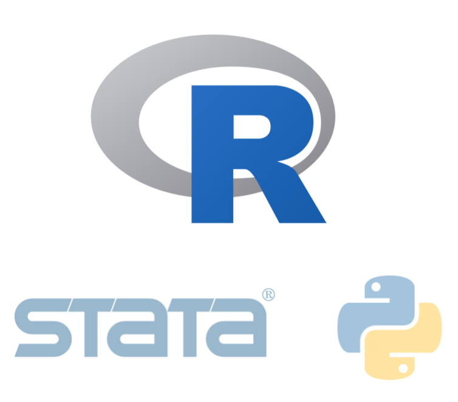
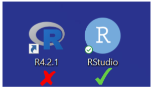
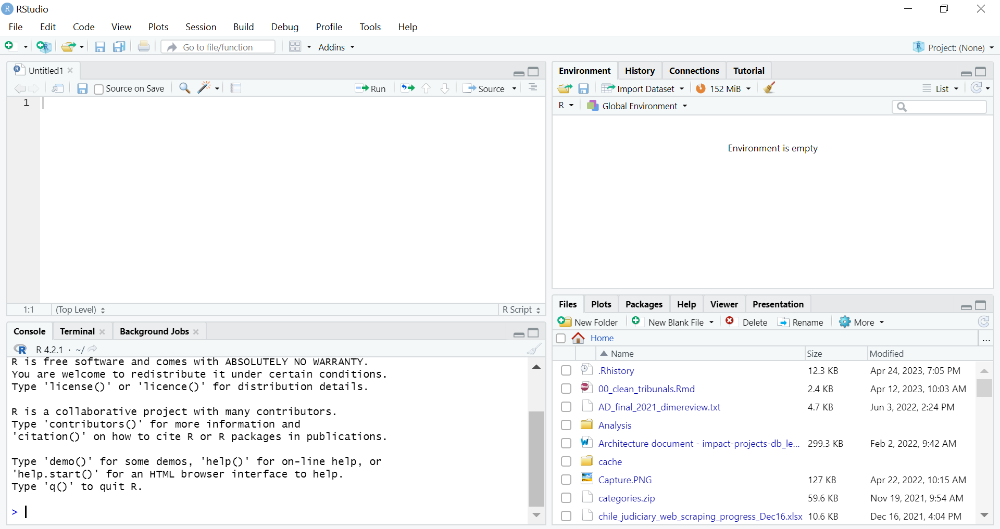
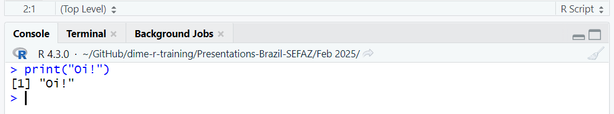
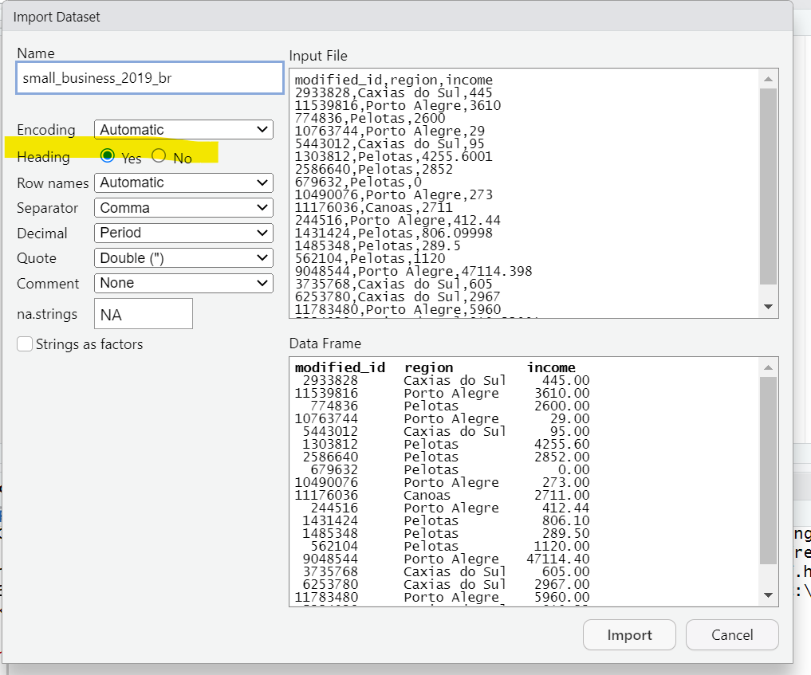

```{r setup, include = FALSE}
# Load packages
library(knitr)
library(xaringanExtra)
library(here)
here::i_am("1-introduction-to-r.Rmd")
options(htmltools.dir.version = FALSE)
opts_chunk$set(
  fig.align = "center",
  fig.height = 4,
  dpi = 300,
  cache = T
  )
xaringanExtra::use_panelset()
xaringanExtra::use_webcam()
xaringanExtra::use_clipboard()
htmltools::tagList(
  xaringanExtra::use_clipboard(
    success_text = "<i class=\"fa fa-check\" style=\"color: #90BE6D\"></i>",
    error_text = "<i class=\"fa fa-times-circle\" style=\"color: #F94144\"></i>"
  ),
  rmarkdown::html_dependency_font_awesome()
)
xaringanExtra::use_logo(
  image_url = here("img",
                   "lightbulb.png"),
  exclude_class = c("inverse", 
                    "hide_logo"),
  width = "50px"
)
```

```{css, echo = F, eval = T}
@media print {
  .has-continuation {
    display: block !important;
  }
}
```

# Tabela de Conteúdos

1. [Introdução](#intro)  
1. [Trabalho com dados e programação estatística](#data-work)  
1. [Programação estatística](#statistical-programming)  
1. [Escrevendo código em R](#writing-r-code)  
1. [Dados no R](#data-in-r)  
1. [Tipos de objetos](#object-types)  
1. [Funções no R](#functions-in-r)  
1. [Concluindo](#wrapping-up)  
1. [Apêndice](#appendix)  


---

class: inverse, center, middle
name: intro

# Introdução

<html><div style='float:left'></div><hr color='#D38C28' size=1px width=1100px></html>

---

# Introdução

## Sobre este treinamento

- Esta é uma **introdução** ao trabalho com dados e programação estatística em R

- O treinamento não exige nenhum conhecimento prévio em programação estatística

- É necessário um computador com R e RStudio instalados para completar os exercícios

- Conexão com a internet é necessária para baixar os materiais do treinamento

---

# Introdução

## Objetivos de aprendizado

Ao final do treinamento, você saberá:

- Como abordar o trabalho com dados por meio da programação estatística utilizando R e RStudio

- Como aplicar manipulação de dados e criar resultados com estatísticas descritivas e visualização de dados, desenvolvendo e executando código R reproduzível

---

class: inverse, center, middle
name: data-work

# 
Trabalho com dados e programação estatística

<html><div style='float:left'></div><hr color='#D38C28' size=1px width=1100px></html>

---

# Trabalho com dados

Para o contexto deste treinamento, chamaremos de trabalho com dados tudo aquilo que:

1. Começa com uma entrada de dados
2. Realiza algum processo com os dados
3. Produz uma saída com o resultado

```{r echo = FALSE, out.width="90%"}

```

---

# Programação estatística

- Programação consiste em produzir instruções para um computador realizar algo

- No contexto do trabalho com dados, esse "algo" é análise estatística ou operações matemáticas

- Portanto, programação estatística consiste em produzir instruções para que nossos computadores realizem análise estatística sobre os dados

```{r echo = FALSE, out.width="70%"}

```

---

# Programação estatística

- Você pode pensar na programação estatística como escrever uma receita

```{r echo = FALSE, out.width="80%"}

```

---

# Programação estatística

## Por que usar o R?

.pull-left[
- A programação estatística pode ser implementada através de diversos softwares. Outras opções são Stata e Python
- Recomendamos o uso do R por estes motivos:
  + O R é gratuito
  + O R foi desenvolvido especificamente para programação estatística
  + Existe uma grande comunidade mundial de usuários de R. Isso significa que você pode facilmente buscar ajuda ou exemplos de código na internet
]

.pull-right[
```{r echo = FALSE, out.width="70%"}

```
]

---

# Programação estatística

## Como escrever código em R?

- O restante da sessão de hoje foca nos conceitos básicos de escrita de código em R

- Usaremos o RStudio para escrever o código em R neste treinamento

---

# Programação estatística

## Como escrever código em R?

- Agora abra o RStudio em seu computador

- Por favor, certifique-se de que está abrindo o RStudio e não o R

```{r echo = FALSE, out.width="30%"}

```

---

# Programação estatística

## Como escrever código em R?

- Agora abra o RStudio em seu computador

- Por favor, certifique-se de que está abrindo o RStudio e não o R

```{r echo = FALSE, out.width="60%"}

```

---

class: inverse, center, middle

# Dúvidas?

<html><div style='float:left'></div><hr color='#D38C28' size=1px width=1100px></html>

---

class: inverse, center, middle
name: writing-r-code

# Escrevendo código em R

<html><div style='float:left'></div><hr color='#D38C28' size=1px width=1100px></html>

---

# Escrevendo código em R

## RStudio interface

```{r echo = FALSE, out.width="74%"}

```

---

# Escrevendo código em R

## Exercício 1: escrevendo código no console

1. Escreva o seguinte código no console do RStudio
  + print("Oi!")
  + Certifique-se de incluir as aspas: " "

2. Pressione Enter para rodar o código

```{r echo = FALSE, out.width="50%"}
knitr::include_graphics("img/session1/console.png")
```

---

# Escrevendo código em R

```{r echo = FALSE, out.width="70%"}

```

---

# Escrevendo código em R
## Exercício 2: escrevendo um script curto

.pull-left[
1- Escreva ou copie o seguinte texto na seção de script do RStudio:

```{r eval=FALSE}
x1 <- 100
x2 <- 50
x3 <- x1 + x2
print(x3)
```
  
2- Selecione o texto que você introduziu com o mouse

3- Pressione "Run"
]
.pull-right[
```{r echo = FALSE, out.width="90%"}
knitr::include_graphics("img/session1/script.png")
```
]
---

# Escrevendo código em R

```{r echo = FALSE, out.width="50%"}

```

---

# Escrevendo código em R

## R scripts

.pull-left[
- Escrever e executar código no console fará com que ele seja executado imediatamente
]

.pull-right[
```{r echo = FALSE, out.width="110%"}

```
]

---

# Escrevendo código em R

## R scripts

.pull-left[
- Escrever e executar código no console fará com que ele seja executado imediatamente

- Escrever código no painel de script nos permite escrever várias linhas de código e executá-las depois

  + Cada linha é executada na ordemr
  
  + A linha e os resultados aparecerão no console
  
- **Importante**: para o restante do treinamento, lembre-se de sempre introduzir seu código no script (e não no console) para que você possa manter um registro do que fez
]

.pull-right[
```{r echo = FALSE, out.width="90%"}

```
]

---

# Escrevendo código em R


## R scripts

- Em outras palavras: os scripts contêm as instruções que você dá ao seu computador ao realizar o trabalho com dados
```{r echo = FALSE, out.width="80%"}

```

---

# Escrevendo código em R

## Criando objetos no R

- Lembra do painel de ambiente que mencionamos? É lá que o R mantém o controle dos objetos

- Objetos são representações dos dados que existem atualmente na memória do R

  + Um único número pode ser um objeto
  + Uma palavra pode ser um objeto
  + Até mesmo um arquivo de dados inteiro pode ser um objeto

- Criamos objetos no R com o operador de seta (`<-`)

- No exercício 2, criamos objetos cada vez que usamos `<-`

- Depois que um objeto é criado, podemos nos referir a ele usando seu nome:

```{r echo=FALSE}
x3 <- 100 + 50
```

```{r}
print(x3 + 8)
```

---

# Escrevendo código em R

## Criando objetos no R

- Após a criação de qualquer objeto, ele aparecerá no painel de ambiente

```{r echo = FALSE, out.width="60%"}
knitr::include_graphics("img/session1/environment.png")
```

---

# Escrevendo código em R

- Agora sabemos como usar o RStudio para escrever código em R e criar scripts

- Ainda não introduzimos os dados no nosso trabalho com dados. Isso vem a seguir

---

class: inverse, center, middle
name: data-in-r

# Dados no R

<html><div style='float:left'></div><hr color='#D38C28' size=1px width=1100px></html>

---

# Dados no R

## Exercício 3: Carregando dados no R

 1.- Vá para esta página: https://osf.io/2apht e baixe o arquivo `small_business_2019_br.csv` <span style="color:red"> WE NEED TO UPDATE THIS DIRECTORY.</span>
 
```{r echo = FALSE, out.width="60%"}

```

---

# Dados no R

## Exercício 3: Carregando dados no R

 2.No RStudio, vá em `File` > `Import Dataset` > `From Text (base)` e selecione o arquivo  `small_business_2019_br.csv`

  + Se você não souber onde está o arquivo, verifique na sua pasta `Downloads`

.pull-left[
```{r echo = FALSE, out.width="70%"}

```
]

.pull-right[
```{r echo = FALSE, out.width="70%"}

```
]

---

# Dados no R

## Exercício 3: Carregando dados no R

3 - Certifique-se de selecionar `Heading` > `Yes` na próxima janela

4 - Selecione `Import`

```{r echo = FALSE, out.width="40%"}

```

---

# Dados no R

- Se você fez isso corretamente, perceberá que um visualizador dos dados agora aparece no RStudio
- Você pode clicar no `x` o lado de `small_business_2019_br` para voltar ao script 
- Para abrir o visualizador novamente, use o código: `View(small_business_2019_br)` (note o "V" maiúsculo)

```{r echo = FALSE, out.width="70%"}

```

---

# Dados no R

- Além disso, agora você verá um objeto chamado `small_business_2019_br` no seu painel de ambiente

```{r echo = FALSE, out.width="70%"}

```

---

# Dados no R

- Lembra que mencionamos os objetos antes? Para o R, `small_business_2019_br` é um objeto assim como `x1`, `x2`, ou `x3`

- A diferença é que `small_business_2019_br` não é um único número como `x1`, mas uma coleção de valores numéricos semelhantes a uma planilha do Excel. No R, esse tipo de objeto é chamado **dataframes**

- A partir de agora, vamos nos referir aos dados carregados no R como **dataframes**

```{r echo = FALSE, out.width="60%"}

```

---

# Dados no R

- Como os dataframes também são objetos, podemos nos referir a eles pelos seus nomes (exm: `small_business_2019_br`)

- Veremos um exemplo disso no próximo exercício

---

# Dados no R

## A note about this dataframe

Compreender os dados que você usa é muito importante. Para este treinamento, `small_business_2019_br` é um dataframe de exemplo com dados de receita de negócios para 2019

- `modified_id` é o identificador do negócio
- `region` é a região onde o negócio está localizado
- `income` é a receita que o negócio reportou em 2019

```{r echo = FALSE, out.width="50%"}

```

---

# Dados no R

## Exercício 4: Subconjunto de dados

1. Use o seguinte código para criar um subconjunto de `small_business_2019_br` mantendo apenas as observações na região chamada:  "Pelotas": `df_pelotas <- subset(small_business_2019_br, region == "Pelotas")`

  + Note que estamos usando o operador de seta (`<-`) para armazenar o resultado
  + Note que há **dois sinais de igual** na condição, não um
  + Também note que você precisa escrever `"Pelotas"` entre aspas e com a letra `P`, pois é assim que está nos dados
  
2. Use `View(df_pelotas)` para visualizar o dataframe novamente e ver como ele mudou (note a letra maiúscula "V")

---

# Dados no R

```{r echo = FALSE, out.width="90%"}

```

---

# Dados no R
## Armazenando resultados no R

Há uma diferença importante entre usar  `<-` e não usá-lo

-Não usar `<-` **simplesmente exibe o resultado no console**. O dataframe de entrada permanecerá inalterado e o resultado **não será armazenado**

```{r eval=FALSE}
subset(small_business_2019_br, region == "Pelotas")
```

```{r echo = FALSE, out.width="50%"}

```

---

# Dados no R

## Armazenando resultados no R

- Using `<-` informa ao R que queremos armazenar o resultado em **um novo objeto**, que é o objeto à esquerda da seta. Dessa vez, o resultado não será impresso no console, mas o novo dataframe aparecerá no painel de ambiente

```{r echo=FALSE}
small_business_2019_br <- read.csv(here("data", "small_business_2019_br.csv"))
```

```{r}
df_pelotas <- subset(small_business_2019_br, region == "Pelotas")
```

```{r echo = FALSE, out.width="60%"}

```

---

# Dados no R

- O R pode armazenar múltiplos dataframes no ambiente. Isso é análogo a ter diferentes planilhas na mesma janela do Excel.

- Lembre-se sempre de que dataframes são apenas objetos no R. O R diferencia a qual dataframe o código se refere pelo nome do dataframe.

```{r echo = FALSE, out.width="95%"}

```

---

class: inverse, center, middle
name: object-types

# Tipos de objetos no R

<html><div style='float:left'></div><hr color='#D38C28' size=1px width=1100px></html>

---

# Tipos de objetos no R

- Os objetos no seu ambiente possuem diferentes tipos, dependendo do tipo de dado que representam.

- Diferentes tipos de objetos permitem aplicar diferentes operações a eles ou aplicar a mesma operação de maneira diferente.
---

# Tipos de objetos no R

- Você pode sempre verificar o tipo de um objeto com a função `class()`

```{r, echo=FALSE}
x1 <- 100
x2 <- 50
x3 <- x1 + x2
```

```{r}
class(x1)
```

```{r}
class(df_pelotas)
```
---

# Tipos de objetos no R

Até agora, trabalhamos com duas classes de objetos:

- **Numérico:** valores numéricos únicos que podemos usar em operações matemáticas. Os objetos `x1`, `x2`, and `x3` são numéricos. Eles são semelhantes aos valores que você armazenaria em uma célula única do Excel

- **Dataframe:** uma coleção de valores organizados em linhas e colunas. `small_business_2019_br` and `df_pelotas` são dataframes. Eles são semelhantes a uma planilha do Excel.

No próximo exercício, aprenderemos sobre outro tipo de objeto.

---

# Tipos de objetos no R

## Vectors

-Vetores são uma coleção de valores com **uma única dimensão**, em vez de serem organizados em linhas e colunas como dataframes

- Você pode pensar em um vetor no R como uma única coluna em uma planilha do Excel ou em um dataframe do R

- Você pode criar vetores com a função `c()`, e os elementos do vetor são separados por vírgulas.

```{r eval=FALSE}
my_vector <- c(4, 8, 2, 5)
```

---

# Tipos de objetos no R

## Exercício 5: criar e operar vetores

1- Crie um vetor com os elementos 3, 8 e 10 e nomeie-o como `v1`:

```{r}
v1 <- c(3, 8, 10)
```

2- Crie um segundo vetor com os elementos 7, 2 e 5 e nomeie-o como `v2`

```{r}
v2 <- c(7, 2, 5)
```

3- Crie um terceiro vetor chamado `result1` om a soma de `v1` e `v2`:

```{r}
result1 <- v1 + v2
```

4- Por fim, crie um quarto vetor chamado `result2` om a soma de `v2` mais dez:

```{r}
result2 <- v2 + 10
```

5- Print `result1` and `result2` and observe the results

---

# Tipos de objetos no R

```{r echo = FALSE, out.width="65%"}

```

---

# Tipos de objetos no R

```{r echo = FALSE, out.width="75%"}

```

---

# Tipos de objetos no R

Observe duas coisas:

1.- Operar com dois vetores aplica a operação **elemento por elemento** <span style="color:red"> (CHECK TRANSLATION FROM element-wise**)</span> 

```{r echo = FALSE, out.width="75%"}

```

2.- Operar um vetor com um objeto numérico **aplicará a mesma operação a cada elemento do vetor**

```{r echo = FALSE, out.width="75%"}

```

---

class: inverse, center, middle
name: functions-in-r

# Funções no R

<html><div style='float:left'></div><hr color='#D38C28' size=1px width=1100px></html>

---

# Funções no R

- Funções são como aplicamos operações a objetos no R

- Usamos algumas funções nos exercícios anteriores. Por exemplo, `subset()` e`paste()` são funções

- Tudo o que tem um nome seguido de parênteses é uma função no R


```{r echo = FALSE, out.width="95%"}

```

---

# Funções no R

As funções têm a seguinte sintaxe:

```{r echo = FALSE, out.width="95%"}

```

- **Nome da função:** o nome que usamos para chamar uma função. Ele fica antes dos parênteses.

- **Argumentos:** entradas e especificações para a função ser aplicada.

  + Os argumentos ficam dentro dos parênteses.
  + O primeiro argumento é o objeto sobre o qual a função será aplicada.

---

# Funções no R

- O resultado de uma função pode sempre ser armazenado em um objeto utilizando o operador de seta (`<-`)

```{r echo = FALSE, out.width="95%"}

```

- Como vimos anteriormente, os resultados de uma função só serão impressos no console se você não os armazenar

---

# Funções no R

## Exercício 6: Usando a função `summary()`

1. Calcule as estatísticas descritivas das variáveis de  `small_business_2019_br` e armazene o resultado com `summary_table <- summary(small_business_2019_br)`

2. Imprima o resultado armazenado com `print(summary_table)`

---

# Funções no R

Observe que este código está tanto criando um novo objeto (com `summary_table <- summary(small_business_2019_br)`) quanto imprimindo o resultado no console (com `print(small_business_2019_br)`)

```{r echo = FALSE, out.width="75%"}

```

---

class: inverse, center, middle

# Perguntas?

<html><div style='float:left'></div><hr color='#D38C28' size=1px width=1100px></html>

---

class: inverse, center, middle
name: wrapping-up

# Finalizando 

<html><div style='float:left'></div><hr color='#D38C28' size=1px width=1100px></html>

---

# Finalizando 

## Adicione comentários no código!

- Toda linha de código que começa com o símbolo de cerquilha (`#`) será ignorada quando o R executar o código

-Isso significa que você pode adicionar qualquer comentário explicativo com `#`. Esses são chamados de **comentários no código**

- É sempre uma boa prática adicionar comentários no código para lembrar o que o código está fazendo mais tarde ou para explicar seu código para outras pessoas, caso você vá compartilhá-lo

---

# Finalizando 

- Tente adicionar comentários no código ao seu script para lembrar qual parte corresponde a cada exercício.

```{r echo = FALSE, out.width="65%"}

```

---

# Finalizando 

## Sempre salve seu trabalho!

- Clique no ícone do disquete para salvar seu trabalho.
- Selecione um local para o seu arquivo e lembre-se de onde está salvando.

```{r echo = FALSE, out.width="65%"}

```

---

# Finalizando 

## Esta sessão

Esta primeira sessão focou nos fundamentos para escrever código em R

```{r echo = FALSE, out.width="90%"}

```

---

# Finalizando 

## Próxima sessão

Na próxima sessão, aprenderemos como preparar os dados para serem exportados como resultados


```{r echo = FALSE, out.width="90%"}

```

---

class: inverse, center, middle

# Thanks! // ¡Gracias! // Obrigado!

<html><div style='float:left'></div><hr color='#D38C28' size=1px width=1100px></html>

---

class: inverse, center, middle
name: appendix

# Appendix // დანართი

<html><div style='float:left'></div><hr color='#D38C28' size=1px width=1100px></html>

---

# Appendix // დანართი

## Tipos de objetos: cadeias de caracteres

- As cadeias de caracteres são coleções de caracteres alfanuméricos, geralmente representando palavras ou textos, ou apenas caracteres em geral.

```{r}
s1 <- "Oi!"
print(s1)
```

- As cadeias de caracteres **sempre ficam entre aspas** (`" "`)

- Elas são geralmente chamadas apenas de **strings**

---

# Appendix // დანართი

## Exercise: create and operate character strings

1. Create a character string object with the words `"Georgia has great"` and name it `words1`

2. Create a second string with the words `"wine"` and name it `words2` 

  + Don't forget to use `<-` to create the string objects
  + Remember to include the quotes: `" "`

3. Use the following code to concatenate `words1` and `words2`, save the result in `words_result`, and print it:

```{r eval=FALSE}
words_result <- paste(words1, words2)
print(words_result)
```

---

# Appendix // დანართი

## Object types: character strings

```{r echo = FALSE, out.width="45%"}

```

---

# Appendix // დანართი

## Object types: character strings

```{r echo = FALSE, out.width="60%"}
knitr::include_graphics("img/session1/ex6-environment.png")
```