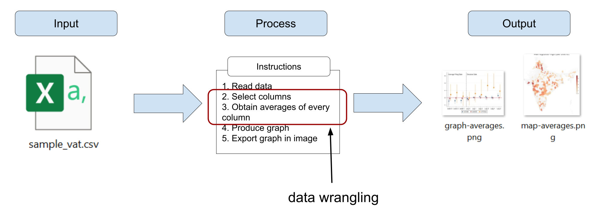
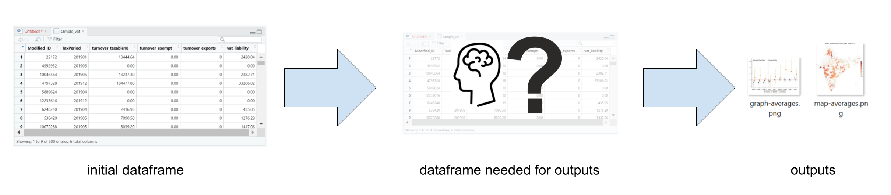
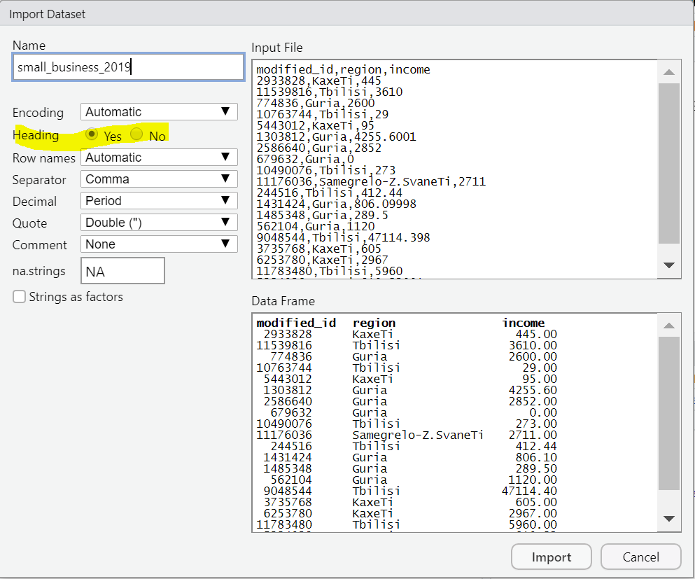
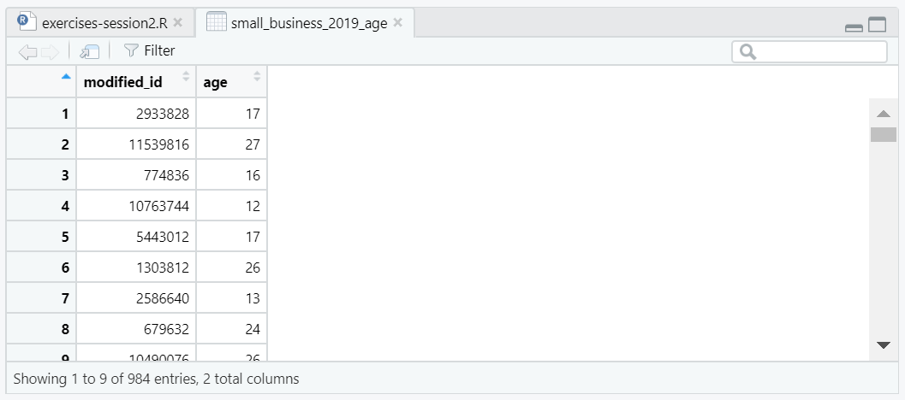
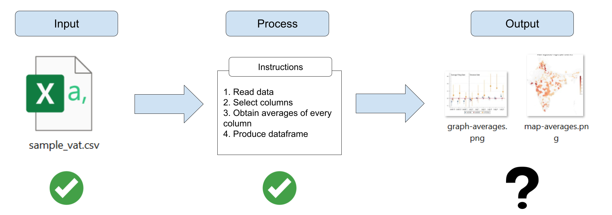
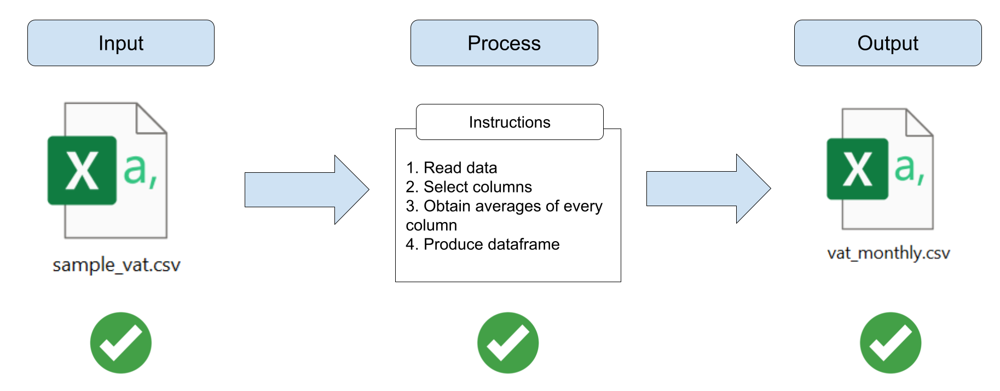
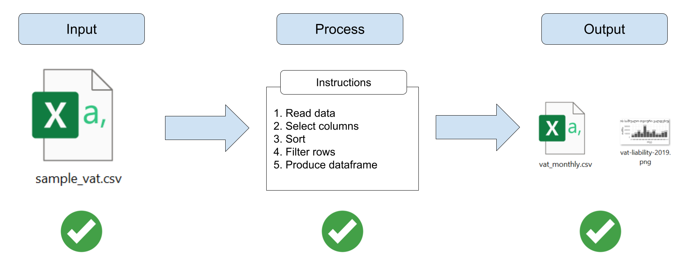
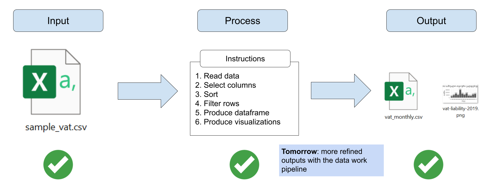

```{r setup, include = FALSE}
# Load packages
library(knitr)
library(xaringanExtra)
library(here)
library(dplyr)
here::i_am("2-data-wrangling.Rmd")
options(htmltools.dir.version = FALSE)
opts_chunk$set(
  fig.align = "center",
  fig.height = 4,
  dpi = 300,
  cache = T
  )
xaringanExtra::use_panelset()
xaringanExtra::use_webcam()
xaringanExtra::use_clipboard()
htmltools::tagList(
  xaringanExtra::use_clipboard(
    success_text = "<i class=\"fa fa-check\" style=\"color: #90BE6D\"></i>",
    error_text = "<i class=\"fa fa-times-circle\" style=\"color: #F94144\"></i>"
  ),
  rmarkdown::html_dependency_font_awesome()
)
xaringanExtra::use_logo(
  image_url = here("img",
                   "session1",
                   "lightbulb.png"),
  exclude_class = c("inverse", 
                    "hide_logo"),
  width = "50px"
)
```

```{css, echo = F, eval = T}
@media print {
  .has-continuation {
    display: block !important;
  }
}
```

# Table of contents // სარჩევი

1. [About this session](#about-this-session)
1. [R libraries](#r-libraries)
1. [Data wrangling](#data-wrangling)
1. [Filtering and sorting](#filtering-sorting)
1. [Merging dataframes](#merging)
1. [Exporting outputs](#exporting-outputs)
1. [Wrapping up](#wrapping-up)
1. [Appendinx](#appendix)

---

class: inverse, center, middle
name: about-this-session

# About this session //

<html><div style='float:left'></div><hr color='#D38C28' size=1px width=1100px></html>

---

# About this session // ამ სესიის შესახებ

```{r echo = FALSE, out.width="90%"}
knitr::include_graphics("img/session2/data-work-script.png")
```

---

# About this session // ამ სესიის შესახებ

```{r echo = FALSE, out.width="90%"}
knitr::include_graphics("img/session2/session2.png")
```

---

class: inverse, center, middle
name: r-libraries

# R libraries // R პაკეტები

<html><div style='float:left'></div><hr color='#D38C28' size=1px width=1100px></html>

---

# R libraries // R პაკეტები

- Installing R in your computer gives you access to its basic functions

- Additionally, you can also install libraries. Libraries are packages of additional R functions that allow you to do:

  + Operations that basic R functions don't do (example: work with geographic data)
  
  + Operations that basic R functions do, but easier (example: data wrangling)

---

# R libraries // R პაკეტები

In a nutshell:

```{r echo = FALSE, out.width="90%"}
knitr::include_graphics("img/session2/r-libraries.png")
```

---

# R libraries // R პაკეტები

## Installing R libraries

- Installing libraries is usually simple, but it can be challenging in institutional network connections such as the World Bank or the Georgia RS

- The next exercise will set up RStudio so that it can install R libraries without problems

---

# R libraries // R პაკეტები 

## Exercise 1: Setting up the installation of libraries

1 - In RStudio, go to `Tools` >> `Global Options...`

```{r echo = FALSE, out.width="60%"}
knitr::include_graphics("img/session2/global-options.png")
```

---

# R libraries // R პაკეტები

## Exercise 1: Setting up the installation of libraries

.pull-left[
2 - Select `Packages` in the left pane

3 - Uncheck `Use secure download method for HTTP`

4 - Click `OK`

You will not see any changes in your RStudio window after this, but now you'll be able to install libraries.
]

.pull-right[
```{r echo = FALSE, out.width="90%"}
knitr::include_graphics("img/session2/packages-options.png")
```
]

---

# R libraries // R პაკეტები

We'll use one librariy in today's session: `dplyr`

## Exercise 2: Installing libraries

1. Install the libraries by using `install.packages()`

 + `install.packages("dplyr")`
 + Note the quotes (`" "`) in the packages names
 + **Introduce this code in the console**, not the script panel

```{r echo = FALSE, out.width="50%"}
knitr::include_graphics("img/session2/dplyr-install.png")
```

---

# R libraries // R პაკეტები

## Installing libraries

```{r echo = FALSE, out.width="95%"}
knitr::include_graphics("img/session2/installing-dplyr.png")
```

---

# R libraries // R პაკეტები

Now that `dplyr` is installed, we only need to load them to start using the functions they have.

## Exercise 3: Loading libraries

.pull-left[
1. Open a new script with `File` >> `New File` >> `R Script`

1. Load `dplyr` with: `library(dplyr)`

  + Run this code from the new script you just opened
  + Notice that we don't use quotes in the library names this time
]
.pull-right[
```{r echo = FALSE, out.width="90%"}
knitr::include_graphics("img/session2/loading-dplyr.png")
```
]

---

# R libraries // R პაკეტები

- Library installation:

```{r echo = FALSE, out.width="37%"}
knitr::include_graphics("img/session2/installation.png")
```

- Library loading:

```{r echo = FALSE, out.width="37%"}
knitr::include_graphics("img/session2/loading.png")
```

- You install R libraries only once in your computer

- You load libraries every time you open a new RStudio window (only load the libraries you will use)

---

class: inverse, center, middle
name: data-wrangling

# Data wrangling // მონაცემთა ჩხუბი

<html><div style='float:left'></div><hr color='#D38C28' size=1px width=1100px></html>

---

# Data wrangling // მონაცემთა ჩხუბი

## Getting your data ready

- Data is rarely in a format where it can be converted in an output right away

- In statistical programming, the process of transforming data into a condition where it's ready to be converted into an output is called **data wrangling**

```{r echo = FALSE, out.width="90%"}

```

---

# Data wrangling // მონაცემთა ჩხუბი

## Getting your data ready

- Data wrangling is one of the most crucials and time-consuming aspects of data work

- It involves not only coding, but also the mental exercise of thinking  what is the shape and condition that your dataframe needs to have in order to produce your desired output

```{r echo = FALSE, out.width="90%"}

```

---

# Data wrangling // მონაცემთა ჩხუბი

## Getting your data ready

.pull-left[
- As we said before we'll use `dplyr` and `tidyr` for data wrangling in this training

- You can also use basic R, but we recommend these libraries because its functions are easier to use
]
.pull-right[
```{r echo = FALSE, out.width="90%"}
knitr::include_graphics("img/session2/dplyr.png")
```
]

---

# Data wrangling // მონაცემთა ჩხუბი

## Exercise 4: Loading data

Note that this part of this is the same exercise we did in session 1, but it's okay to repeat it in order to start using a new RStudio session. **If you have RStudio open, start by closing the window and opening RStudio again**.

.pull-left[
1. Inyou new RStudio window, go to `File` > `Import Dataset` > `From Text (base)` and select again the file `small_business_2019_age.csv`

  + if you don't know where the file is, check in the `Downloads` folder
  + if you need to download it again, it's here: https://osf.io/2apht 

1. Make sure to select `Heading` > `Yes` in the next window

1. Select `Import`

1. Download this new file: https://osf.io/v6psa and repeat steps 1-3  with it

]
.pull-right[

```{r echo = FALSE, out.width="85%"}

```
]

---

# Data wrangling // მონაცემთა ჩხუბი

```{r, echo=FALSE}
small_business_2019 <- read.csv(here("data", "small_business_2019.csv"))
small_business_2019_age <- read.csv(here("data", "small_business_2019_age.csv"))
```

```{r echo = FALSE, out.width="85%"}
knitr::include_graphics("img/session2/ex4.png")
```

---

# Data wrangling // მონაცემთა ჩხუბი

## Note: loading data with a function

- You can also load CSV data with the function `read.csv()` instead of using this point-and-click approach

- The first argument of `read.csv()` is the path in your computer where your data is. For example

```{r, eval=FALSE}
sample_vat <- read.csv("C:/Users/wb532468/Downloads/small_business_2019_age.csv")
```

- As usual, you need to save the result of `read.csv()` into a dataframe object with the arrow operator (`<-`) for it to be stored in the environment

---

# Data wrangling // მონაცემთა ჩხუბი

## Recap: knowing your data

- Dataframe `small_business_2019` is the same dataframe we used last session that contains reported income of small business in 2019 and their locations
- The new dataframe is `small_business_2019_age`
- Each row is one small business with their corresponding firm age for 2019
- Column `Modified_ID` is a taxpayer identifier
- `age` is the firm age

```{r echo = FALSE, out.width="60%"}

```

---

# Data wrangling // მონაცემთა ჩხუბი

- We will only use this dataframe in one of the next exercises, but we loaded it now because it's in general a good practice to have data loaded into the memory so it's ready to be used

- For the next exercises, we will face (likely) scenarios that will show us data work operations that require data wrangling

---

class: inverse, center, middle
name: filtering-sorting

# Filtering and sorting // ფილტრაცია და დახარისხება

<html><div style='float:left'></div><hr color='#D38C28' size=1px width=1100px></html>

---

# Filtering and sorting // ფილტრაცია და დახარისხება

## Data work request

**Scenario 1**: Imagine you're approached with the following request:

*"The Georgia RS directorate is thinking of changing the criteria of what is considered a small business in Tbilisi. A critical input for this would be the list of the 50 biggest small business in Tbilisi in 2019. Can you produce such list? There is data from 2019 reported business income you can use"*

---

# Filtering and sorting // ფილტრაცია და დახარისხება

## Data work request

.pull-left[
*"There is data from 2019 reported business income you can use"*
]
.pull-right[
*"A critical input for this would be the list of the 50 biggest small business in Tbilisi in 2019"*
]

```{r echo = FALSE, out.width="95%"}
knitr::include_graphics("img/session2/filtering-sorting-planning.png")
```

---

# Filtering and sorting // ფილტრაცია და დახარისხება

## Data work request

The data wrangling here involves a number of operations:

1. Keeping only the businesses in Tbilisi
1. Sorting by business income
1. Keeping only the 50 first businesses

```{r echo = FALSE, out.width="95%"}
knitr::include_graphics("img/session2/filtering-sorting-planning.png")
```

---

# Filtering and sorting // ფილტრაცია და დახარისხება

## 1. Keeping only the businesses in Tbilisi

Use `filter()` for this:

```{r eval=FALSE}
temp1 <- filter(small_business_2019, region == "Tbilisi")
```

```{r echo = FALSE, out.width="95%"}
knitr::include_graphics("img/session2/filtering-sorting1.png")
```

---

# Filtering and sorting // ფილტრაცია და დახარისხება

## 2. Sorting by business income

Use the function `arrange()` to sort. Sortings are ascending by default in R, hence we can include the minus (`-`) symbol before `income` to tell R we want to sort descending

```{r eval=FALSE}
small_business_tb_sorted <- arrange(small_business_tb, -income)
```

```{r echo = FALSE, out.width="95%"}
knitr::include_graphics("img/session2/filtering-sorting2.png")
```

---

# Filtering and sorting // ფილტრაცია და დახარისხება

## 3. Keeping only the 50 first businesses after the sorting

Use `filter()` again and the helper command `nrow()`

```{r eval=FALSE}
result_scenario1 <- filter(small_business_tb_sorted, row_number() <= 50)
```

```{r echo = FALSE, out.width="95%"}
knitr::include_graphics("img/session2/filtering-sorting3.png")
```

---

# Filtering and sorting // ფილტრაცია და დახარისხება

## Exercise 5: filter and sort your data

Now that we figured out the shape the resulting dataframe needs to have and how to get it there, we can write code for this.

1.- Row selection:

```{r eval=FALSE}
temp1 <- filter(small_business_2019, region == "Tbilisi")
```
2.- Sort descending by income:

```{r eval=FALSE}
temp2 <- arrange(temp1, -income)
```

3.- Keep only the 50 first businesses after sorting:

```{r eval=FALSE}
df_tbilisi_50 <- filter(temp2, row_number() <= 50)
```

---

# Filtering and sorting // ფილტრაცია და დახარისხება

Some notes:

.pull-left[
- `filter()`, `arrange()`, and `row_number()` are all functions from `dplyr`. Remember you have to always load `dplyr` first with `library(dplyr)` to be able to use them
- Note that we're creating two intermediate dataframes named `temp1` and `temp2` in the process
- We can avoid this by using the pipes operator (`%>%`). Pipes are very common in R programming, but we're not explaining them in this session
- The resulting dataframe is `df_tbilisi_50`
]
.pull-right[
```{r echo = FALSE, out.width="95%"}
knitr::include_graphics("img/session2/ex5.png")
```
]

---

# Filtering and sorting // ფილტრაცია და დახარისხება

You can check the result with `View(df_tbilisi_50)`. Now this dataframe has exactly what we wanted!

```{r echo = FALSE, out.width="70%"}
knitr::include_graphics("img/session2/ex5-2.png")
```

---

# Filtering and sorting // ფილტრაცია და დახარისხება

- Filtering and sorting are two very common data wrangling operations in statistical programming

- Now we'll review a new data wrangling operation that is also quite common and useful: **merging**, also called joining

---

class: inverse, center, middle
name: merging

# Merging dataframes // მონაცემთა ჩარჩოების შეერთება

<html><div style='float:left'></div><hr color='#D38C28' size=1px width=1100px></html>

---

# Merging dataframes

- We'll explore one more common data wrangling operation: merging

- Merging is used when you need to bring columns from one dataframe to another

- When merging you need to use a "key" column that identifies the same units in different dataframes

```{r echo = FALSE, out.width="80%"}
knitr::include_graphics("img/session2/merge.png")
```

Note: Image taked from RStudio's data wrangling cheat sheet

---

# Merging dataframes

## Data work request

**Scenario 2:**

*"We want to know the total business reported income for small businesses with more than 5 years in 2019. You might want to use the data of small businesses income in 2019 that you already know and another file with small businesses age"*

---

# Merging dataframes

## Data work request

.pull-left[
*"Use the data of small businesses income in 2019 that you already know and another file with small businesses age"*
]
.pull-right[
*"We want to know the total business income for small businesses with more than 5 years in 2019"*
]

```{r echo = FALSE, out.width="80%"}
knitr::include_graphics("img/session2/merging-planning.png")
```

---

# Merging dataframes

## Data work request

These are the steps we'd need to follow to get the data wrangled for this result:

1. Select only the relevant columns from `small_business_2019`
1. Merge the dataframes
1. Filter only businesses with more than 5 years of age
1. Calculate the total income

---

# Merging dataframes

## 1. Select only the relevant columns from `small_business_2019`

Use `select()` for this:

```{r eval=FALSE}
temp1 <- select(small_business_2019, modified_id, income)
```

```{r echo = FALSE, out.width="80%"}
knitr::include_graphics("img/session2/merging1.png")
```

---

# Merging dataframes

## 2. Merge the dataframes

Use `inner_join()` to merge the dataframes:

```{r eval=FALSE}
temp2 <- inner_join(temp1, small_business_2019_age, by = "modified_id")
```

- The first two arguments are the two dataframes we want to join
- The third (named) argument is the "key" variable we merge by

```{r echo = FALSE, out.width="55%"}
knitr::include_graphics("img/session2/merging2.png")
```

---

# Merging dataframes

## 3. Filter only businesses with more than 5 years of age

Use `filter()` once again:

```{r eval=FALSE}
temp3 <- filter(temp2, age > 5)
```

```{r echo = FALSE, out.width="80%"}
knitr::include_graphics("img/session2/merging3.png")
```

---

# Merging dataframes

## 4. Calculate the total income

We use `colSums()` and `select()`.

- `colSums()` calculates de sum of all values of a column
- We use `select()` inside `colSums()` to select a single column from `temp3` to calculate the sum for

```{r eval=FALSE}
total_income <- colSums(select(temp3, income))
```

```{r echo = FALSE, out.width="80%"}
knitr::include_graphics("img/session2/merging4.png")
```

---

# Merging dataframes

## Exercise 6: Merge the dataframes

Apply all the steps we reviewed in the last slides to calculate the total reported income for small businesses with more than five years of age in 2019.

1.- Select only the relevant columns of `small_business_2019`:

```{r eval=FALSE}
temp1 <- select(small_business_2019, modified_id, income)
```

2.- Merge the dataframes

```{r eval=FALSE}
temp2 <- inner_join(temp1, small_business_2019_age, by = "modified_id")
```

3.- Filter only businesses with more than five years of age

```{r eval=FALSE}
temp3 <- filter(temp2, age > 5)
```

4.- Calculate the total income

```{r eval=FALSE}
total_income <- colSums(select(temp3, income))
```

---

# Merging dataframes

`total_income` is a numeric value with the amount we wanted to estimate.

```{r echo=FALSE}
temp1 <- select(small_business_2019, modified_id, income)
temp2 <- inner_join(temp1, small_business_2019_age, by = "modified_id")
temp3 <- filter(temp2, age > 5)
total_income <- colSums(select(temp3, income))
```

```{r}
print(total_income)
```

---

# Merging dataframes

These were two examples we chose to show different possible data wrangling operations. A summary of these and other common operations are:

| Operation | Function in `dplyr` |
| --------- | ------------------- |
| Subset columns | `select()`|
| Subset rows (based on condition) | `filter()` |
| Create new columns | `mutate()` |
| Create new columns based on condition | `mutate()` and `case_when()` |
| Create new rows | `add_row()` |
| Merge dataframes | `inner_join()`, `left_join()`, `right_join()`, `full_join()` |
| Append dataframes | `bind_rows()` |
| Deduplicate | `distinct()` |
| Collapse and create summary indicators | `group_by()`, `summarize()` |
| Pass a result as the first argument for the next function | `%>%` (operator, not function)|

---

class: inverse, center, middle
name: exporting-outputs

# Exporting outputs // პროდუქციის ექსპორტი

<html><div style='float:left'></div><hr color='#D38C28' size=1px width=1100px></html>

---

# Exporting outputs // პროდუქციის ექსპორტი

- Until now, we've seen full examples of part 1 and 2 of the data work pipeline
- What about exporting outputs?

```{r echo = FALSE, out.width="90%"}

```

- We'll see this in the next exercise

---

# Exporting outputs // პროდუქციის ექსპორტი

## Exporting dataframes

- The easiest way to export a dataframe or number is with the function `write.csv()`

- `write.csv()` creates a CSV file with the dataframe

- It takes two basic arguments:

  1. The name of the object you want to export
  1. A file path to export the object to

- `write.csv()` includes the row numbers by default. You can add the argument `row.names = FALSE` to avoid this

---

# Exporting outputs // პროდუქციის ექსპორტი

## Exercise 7: Export `df_tbilisi_50` and `total_income`

1. Use this code to export the results of the last two exercises:

```{r eval=FALSE}
write.csv(df_tbilisi_50,
          "df_tbilisi_50.csv",
          row.names = FALSE)

write.csv(total_income,
          "total_income.csv",
          row.names = FALSE)
```

---

# Exporting outputs // პროდუქციის ექსპორტი

Now `df_tbilisi_50.csv` and `total_income.csv` will show in your computer (probably in your `Documents` folder).

```{r echo = FALSE, out.width="70%"}
knitr::include_graphics("img/session2/exported-csv.png")
```

---

# Exporting outputs // პროდუქციის ექსპორტი

## Some notes on file paths

- The second argument of `write.csv()` specifies the file path we export the dataframe to

```{r eval=FALSE}
write.csv(df_tbilisi_50,
          "df_tbilisi_50.csv",
          row.names = FALSE)
```

- You can include any path in your computer and R will write the file in that location

  + For example: `"C:/Users/wb532468/OneDrive - WBG/Desktop`" exports the file to the desktop of my computer (this will not work in other computers)
  
  + Note that file paths in R use forward slashes (`/`). Back slashes (`\`) **do not work in R**

---

# Exporting outputs // პროდუქციის ექსპორტი

## Some notes on file paths

```{r eval=FALSE}
write.csv(df_tbilisi_50,
          "df_tbilisi_50.csv",
          row.names = FALSE)
```

- If you only include a file name (as in `df_tbilisi_50.csv`), R will export the file to the current location of your RStudio window. This is usually the `Documents` folder in Windows

- You can check the current location of RStudio with the function `getwd()`

---

# Exporting outputs // პროდუქციის ექსპორტი

Our data pipeline has been fully implemented at this point. Great!

```{r echo = FALSE, out.width="70%"}

```

---

class: inverse, center, middle
name: wrapping-up

# Wrapping up // შეფუთვა

<html><div style='float:left'></div><hr color='#D38C28' size=1px width=1100px></html>

---

# Wrapping up // შეფუთვა

## Don't forget to save your work!

- If you haven't, add code comments with `#` to differentiate your solutions for each exercise
- Click the floppy disk to save your work
- Make sure to remember where you're saving your file

```{r echo = FALSE, out.width="55%"}
knitr::include_graphics("img/session2/save.png")
```

---

# Wrapping up // შეფუთვა

## Data work pipeline

```{r echo = FALSE, out.width="85%"}

```

---

# Wrapping up // შეფუთვა

## Data work pipeline

```{r echo = FALSE, out.width="85%"}

```

---

class: inverse, center, middle
name: appendix

# Appendix // დანართი

<html><div style='float:left'></div><hr color='#D38C28' size=1px width=1100px></html>

---

# Appendix // დანართი

## Collapsing

**Scenario:** Imagine you're approached with the following request:

*"We're putting together a report where we want to include the total and average income of small businesses by region in 2019. Can you calculate these numbers? There is data for small businesses income in 2019 you can use for this."*

---

# Appendix // დანართი

## Collapsing

.pull-left[
*"There is data for small businesses income in 2019 you can use for this"*
]
.pull-right[
*"we want to include the total and average income of small businesses by region in 2019"*
]

---

# Appendix // დანართი

## Collapsing

The data wrangling here involves a number of operations:

1. Keeping only the relevant columns and dropping everything else
1. Grouping the dataframe by region
1. Calculating the total income by region
1. Calculating the mean income by region

The operation of transforming a dataframe with a lower level of observations (exm: firms) to an aggregated level (exm: regions) is called **collapsing**.

---

# Appendix // დანართი

## 1. Keeping only relevant columns

Use `select()` for this:

```{r eval=FALSE}
temp1 <- select(small_business_2019, region, income)
```

---

# Appendix // დანართი

## 2. Grouping by region

Use `group_by()`:

```{r eval=FALSE}
temp2 <- group_by(temp1, region)
```

---

# Appendix // დანართი

## 3. Calculating aggregated columns: total and average income

Use `summarize()` combined with `sum()` and `mean()`:

```{r eval=FALSE}
region_df <- summarize(temp2,
             total = sum(income),
             average = mean(income))
```

---

# Appendix // დანართი

## Exercise: Collapse your data

Now we can write code to execute the data collapsing.

1. Columns selection: `temp1 <- select(small_business_2019, region, income)`
1. Grouping by region: `temp2 <- group_by(temp1, region)`
1. Calculating the total and average by month:

```{r, eval=FALSE}
region_df <- summarize(temp2,
             total = sum(income),
             average = mean(income))
```

Some notes:

- Once again, remember that these are all functions from `dplyr`
- There is a line break and tabulation space between each argument of `summarize()`. We use this for code clarity, R ignores line breaks and space when they are used between function arguments

---

# Appendix // დანართი

## Collapsing

You can check your result with `View(region_df)`. Now your data as collapsed as you needed!
