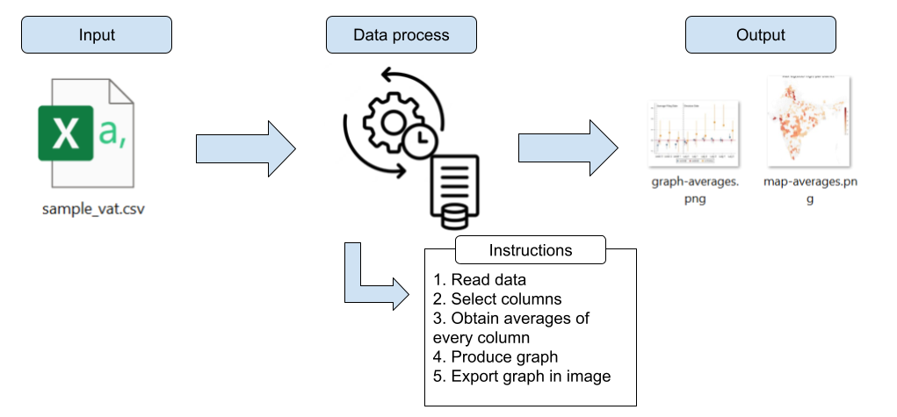
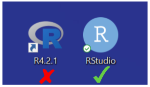
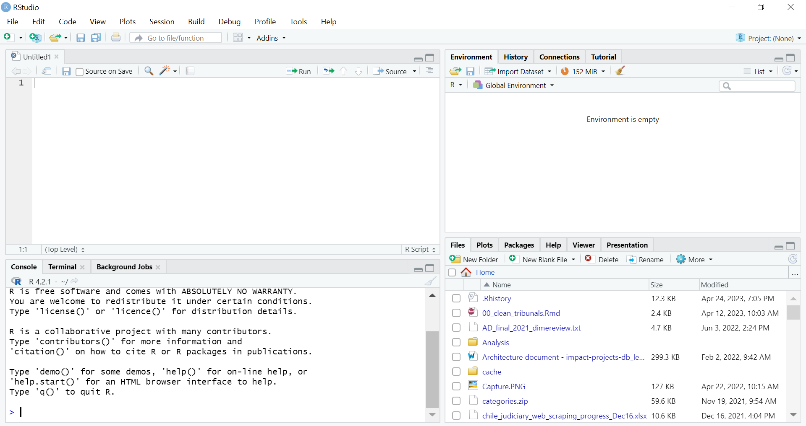
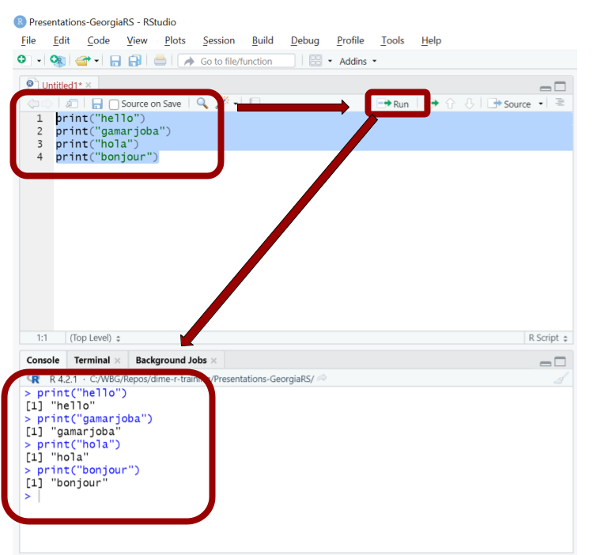
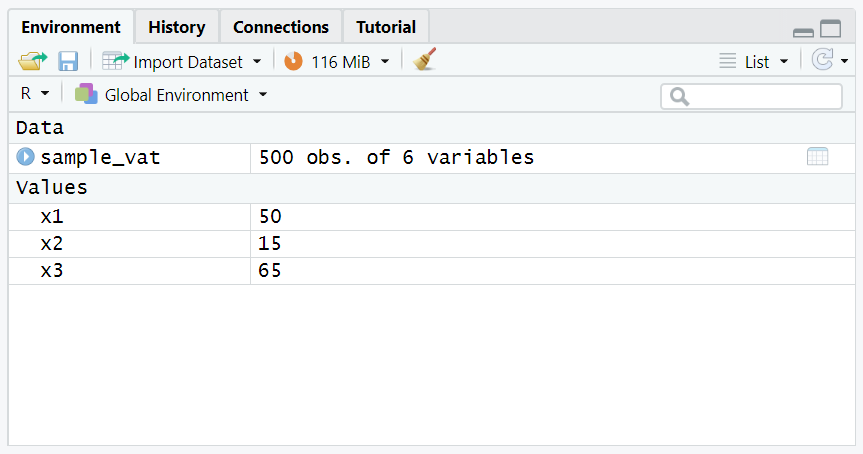
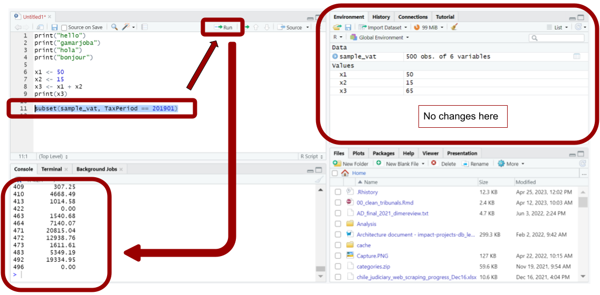
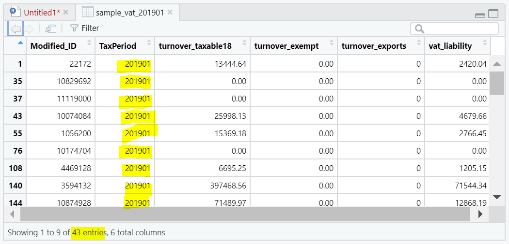
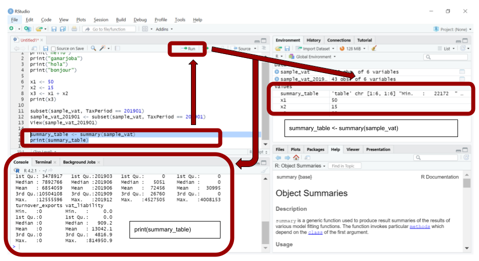
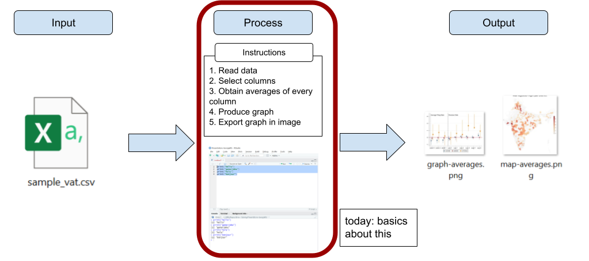

```{r setup, include = FALSE}
# Load packages
library(knitr)
library(xaringanExtra)
library(here)
here::i_am("session1.Rmd")
options(htmltools.dir.version = FALSE)
opts_chunk$set(
  fig.align = "center",
  fig.height = 4,
  dpi = 300,
  cache = T
  )
xaringanExtra::use_panelset()
xaringanExtra::use_webcam()
xaringanExtra::use_clipboard()
htmltools::tagList(
  xaringanExtra::use_clipboard(
    success_text = "<i class=\"fa fa-check\" style=\"color: #90BE6D\"></i>",
    error_text = "<i class=\"fa fa-times-circle\" style=\"color: #F94144\"></i>"
  ),
  rmarkdown::html_dependency_font_awesome()
)
xaringanExtra::use_logo(
  image_url = here("Presentations",
                   "img",
                   "lightbulb.png"),
  exclude_class = c("inverse", 
                    "hide_logo"),
  width = "50px"
)
```

```{css, echo = F, eval = T}
@media print {
  .has-continuation {
    display: block !important;
  }
}
```

# Table of contents // სარჩევი

1. [About the training](#about-this-training)
1. [Data work](#data-work)
1. [Statistical programming](#statistical-programming)
1. [Writing R code](#writing-r-code)
1. [Data in R](#data-in-r)
1. [Functions in R](#functions-in-r)
1. [Wrapping up](#wrapping-up)

---

class: inverse, center, middle
name: about-this-training

# About this training // ამ ტრენინგის შესახებ

<html><div style='float:left'></div><hr color='#D38C28' size=1px width=1100px></html>

---

# About this training // ამ ტრენინგის შესახებ

- This is an **introduction** to data work and statistical programming in R

- The course does not require any background in statistical programming

- The course requires a computer with R and RStudio installed

---

# About this training // ამ ტრენინგის შესახებ

## Learning objectives

By the end of the training, you will know:

- How to write **basic** R code
  
- A notion of how to conduct data work in R and how it differentiates from Excel

---

# About this course // ამ კურსის შესახებ

## Previous knowledge

- We assume that you have some experience working with data in Excel

- The idea of this short training is to use that knowledge and "translate" some of it to R

```{r echo = FALSE, out.width="70%"}

```

---

class: inverse, center, middle
name: data-work

# Data work // მონაცემთა მუშაობა

<html><div style='float:left'></div><hr color='#D38C28' size=1px width=1100px></html>

---

# Data work // მონაცემთა მუშაობა

For the context of this training, we'll call data work everything that:

1. Starts with a data input
1. Runs some process with the data
1. Produces an output with the result

```{r echo = FALSE, out.width="90%"}
knitr::include_graphics("img/data-work.png")
```

---

# Data work // მონაცემთა მუშაობა

- It's also possible to do data work with Excel
- However, we will show in this training why using statistical programming (through R) is a better way of conducting data work

```{r echo = FALSE, out.width="90%"}
knitr::include_graphics("img/data-work-excel-r.png")
```

---

class: inverse, center, middle
name: statistical-programming

# Statistical programming // სტატისტიკური პროგრამირება

<html><div style='float:left'></div><hr color='#D38C28' size=1px width=1100px></html>

---

# Statistical programming

## What do we mean by statistical programming?

- Programming consists of producing instructions to a computer to do something
- In the context of data work, that "something" is statistical analysis or mathematical operations
- Hence, statistical programming consists of producing instructions so our computers will conduct statistical analysis on data

```{r echo = FALSE, out.width="70%"}

```

---

# Statistical programming

- You can think of statistical programming as writing a recipe

```{r echo = FALSE, out.width="80%"}
knitr::include_graphics("img/data-work-and-cooking.png")
```

---

# Statistical programming

## How is R different than Excel?

- In Excel, you usually work on the data directly. The input changes as you work on it
- In R, you produce code which contains the instructions your computer follows to conduct the process you want to do

```{r echo = FALSE, out.width="75%"}
knitr::include_graphics("img/data-work-r-excel.png")
```

---

# Statistical programming

## How can this benefit my work?

.pull-left[
- Data work should be very exact to be correct

- Programming consists of giving computers "instructions" about what to do with data. This is more exact than manually working directly with the data, as we do in Excel

- Computers are **very exact**. In programming, they will do exactly what you tell them to do

- This means that you can generate code that is an exact record of how a result was generated
]

.pull-right[
```{r echo = FALSE, out.width="47%"}
knitr::include_graphics("img/code-workflow.png")
```
]

---

# Statistical programming

## Why use R

.pull-left[
- Statistical programming can be implemented through many different software. Other options are Stata and Python
- We recommend using R for these reasons:
  + R is free
  + R was designed specifically for statistical programming
  + There is a large worldwide community of R users. This means you can easily look for help or examples of code in the internet
]

.pull-right[
```{r echo = FALSE, out.width="70%"}
knitr::include_graphics("img/software-logos.png")
```
]

---

# Statistical programming

## How to write R code?

- The rest of today's session focuses on the basics of writing R code

- We'll use RStudio to write R code in this training

---

# Statistical programming

## How to write R code?

- Now open RStudio in your computer

- Please make sure you're opening RStudio and not R

```{r echo = FALSE, out.width="30%"}

```

---

# Statistical programming

## How to write R code?

- Now open RStudio in your computer

- Please make sure you're opening RStudio and not R

```{r echo = FALSE, out.width="60%"}

```

---

class: inverse, center, middle

# Questions? // კითხვები?

<html><div style='float:left'></div><hr color='#D38C28' size=1px width=1100px></html>

---

class: inverse, center, middle
name: writing-r-code

# Writing R code // R კოდის დაწერა

<html><div style='float:left'></div><hr color='#D38C28' size=1px width=1100px></html>

---

# Writing R code // R კოდის დაწერა

## RStudio interface

```{r echo = FALSE, out.width="70%"}

```

---

# Writing R code // R კოდის დაწერა

## RStudio interface

```{r echo = FALSE, out.width="74%"}
knitr::include_graphics("img/rstudio-panels.png")
```

---

# Writing R code // R კოდის დაწერა

## Exercise 1: writing code in the console

1. Write the following code in the console of RStudio

  + `print("gamarjoba")`
  + Make sure to include the quotes: `" "`

2. Press Enter to run the code

```{r echo = FALSE, out.width="50%"}
knitr::include_graphics("img/console.png")
```

---

# Writing R code // R კოდის დაწერა

```{r echo = FALSE, out.width="70%"}
knitr::include_graphics("img/exercise1.png")
```

---

# Writing R code // R კოდის დაწერა

## Exercise 2: writing a short script

.pull-left[
1. Write or copy the following text into the script section of RStudio

  + `print("gamarjoba")`
  + `print("hello")`
  + `print("hola")`
  + `print("bonjour")`
  
1. Select the text you introduced with your mouse

1. Press "Run"
]
.pull-right[
```{r echo = FALSE, out.width="90%"}
knitr::include_graphics("img/script.png")
```
]
---

# Writing R code // R კოდის დაწერა

```{r echo = FALSE, out.width="50%"}
knitr::include_graphics("img/exercise2.png")
```

---

# Writing R code // R კოდის დაწერა

```{r echo = FALSE, out.width="50%"}

```

---

# Writing R code // R კოდის დაწერა

## R scripts

.pull-left[
- Writing and running code from the console will execute it immediately

- Writing code in the script panel allow us to write multiple lines of code and execute them later

  + Each line is executed in order
  
  + The line and the results will show in the console
  
- **Important:** for the rest of the training, remember to always introduce your code in the script (and not in the console) so you can keep record of what you did
]

.pull-right[
```{r echo = FALSE, out.width="90%"}
knitr::include_graphics("img/exercise2.png")
```
]

---

# Writing R code // R კოდის დაწერა

## R scripts

- In other words: scripts contain the instructions you give to your computer when doing data work

```{r echo = FALSE, out.width="80%"}
knitr::include_graphics("img/data-work-script.png")
```

---

# Writing R code // R კოდის დაწერა

## Creating objects in R

- Remember we also mentioned the environment panel? that's where R keeps track of objects

- Objects are representations of data that currently exist in R's memory

  + A single number can be an object
  + A word can be an object
  + Even an entire data file can be an object

- We create objects in R with the arrow operator (`<-`)

- Example: creating an object called `x`

```{r eval=FALSE}
x <- 10
```

---

# Writing R code // R კოდის დაწერა

## Creating objects in R

- After an object is created, we can refer to it using its name

```{r}
x <- 10
print(x)
print(x + 5)
```

---

# Writing R code // R კოდის დაწერა

## Creating objects in R

- After an object is created, it will show in the environment panel

```{r echo = FALSE, out.width="90%"}
knitr::include_graphics("img/environment.png")
```

---

# Writing R code // R კოდის დაწერა

## Exercise 3: operations with objects

1. Create an object called `x1` in your script and assign to it the value of 50

2. Create an object called `x2` and make it equal to 15

3. Create an object called `x3` and make it the sum of x1 and x2

4. Print `x3`. It should show the value 65

---

# Writing R code // R კოდის დაწერა

```{r echo = FALSE, out.width="90%"}
knitr::include_graphics("img/exercise3.png")
```

---

# Writing R code // R კოდის დაწერა

```{r echo = FALSE, out.width="90%"}
knitr::include_graphics("img/exercise3-annotated.png")
```

---

# Writing R code // R კოდის დაწერა

- Now we know how to use RStudio to write R code and produce scripts

- However, we haven't still introduced the data to our data work. That comes next

---

class: inverse, center, middle
name: data-in-r

# Data in R // მონაცემები R

<html><div style='float:left'></div><hr color='#D38C28' size=1px width=1100px></html>
---

# Data in R // მონაცემები R

## Exercise 4: Loading data into R

 1 - Go to this page: https://osf.io/ds5w4 and download the file `sample_vat.csv`

```{r echo = FALSE, out.width="70%"}
knitr::include_graphics("img/download-data.png")
```

---

# Data in R // მონაცემები R

## Exercise 4: Loading data into R

 2 - In RStudio, go to `File` > `Import Dataset` > `From Text (base)` and select the file `sample_vat.csv`

  + If you don't know where the file is, check in the `Downloads` folder

.pull-left[
```{r echo = FALSE, out.width="70%"}
knitr::include_graphics("img/import_data1.png")
```
]

.pull-right[
```{r echo = FALSE, out.width="70%"}
knitr::include_graphics("img/file-selection.png")
```
]

---

# Data in R // მონაცემები R

## Exercise 4: Loading data into R

3 - Make sure to select `Heading` > `Yes` in the next window

4 - Select `Import`

```{r echo = FALSE, out.width="40%"}
knitr::include_graphics("img/import3.png")
```

---

# Data in R // მონაცემები R

- If you did this correctly, you will note that a viewer of the data now appears in RStudio
- You can click on the `x` next to `sample_vat` to return to the script
- To open the viewer again, use the code: `View(sample_vat)` (notice the uppercase "V")

```{r echo = FALSE, out.width="70%"}
knitr::include_graphics("img/data-viewer.png")
```

---

# Data in R // მონაცემები R

- Additionally, you will now see an object named `sample_vat` in your environment

```{r echo = FALSE, out.width="70%"}

```

---

# Data in R // მონაცემები R

- Remember we mentioned objects before? For R, `sample_vat` is an object just like `x1`, `x2`, or `x3`

- The difference is that `sample_vat` is not a single number like `x1`, but a collection of numeric values similar to an Excel spreadsheet. In R, this type of objects are called **dataframes**

- From now, we will refer to data loaded into R as **dataframes**

```{r echo = FALSE, out.width="60%"}

```

---

# Data in R // მონაცემები R

- Since dataframes are also objects, we can refer to them with their names (exm: `sample_vat`)

- We'll see an example of that in the next exercise

---

# Data in R // მონაცემები R

## A note about this dataframe

Understanding the data you use is very important. For this training, `sample_vat` is a "toy" dataframe that simulates tax data.

- `Modified_ID` is a taxpayer identifier
- `TaxPeriod` is a month variable (year + month)
- The rest are tax-related variables that we are not going to focus on in this session

```{r echo = FALSE, out.width="60%"}
knitr::include_graphics("img/data-viewer.png")
```

---

# Data in R // მონაცემები R

## Exercise 5: Subset the data

1. Use the following code to subset `sample_vat` and leave only the observations in January 2019: `subset(sample_vat, TaxPeriod == 201901)`

  + Note that the "T" and "P" in `TaxPeriod` are **uppercase**
  + Note that there are **two equal signs** in the condition, not one
  
2. Use `View(sample_vat)` to visualize the dataframe again and see how it changed (note the uppercase "V")

---

# Data in R // მონაცემები R

Does anything look strange?

```{r echo = FALSE, out.width="70%"}
knitr::include_graphics("img/data-viewer2.png")
```

---

# Data in R // მონაცემები R

- Indeed, the dataframe `sample_vat` didn't change

- That is because we didn't use the arrow operator (`<-`) to store the result in an object

- Instead, R only printed the result in the console for us (and nothing else)

---

# Data in R // მონაცემები R

```{r echo = FALSE, out.width="95%"}

```

---

# Data in R // მონაცემები R

## Exercise 6: Subsetting and storing the result

1. Subset the dataframe again and save the result into a new dataframe called `sample_vat_201901`. You can use this code for that: `sample_vat_201901 <- subset(sample_vat, TaxPeriod == 201901)`

2. Use `View(sample_vat_201901)` to visualize the result (notice the uppercase "V")

---

# Data in R // მონაცემები R

Now the resulting dataframe looks correct!

```{r echo = FALSE, out.width="70%"}

```

---

# Data in R // მონაცემები R

Note that this time R didn't print the resulting dataframe in the console, it only showed the code we were running. Also, now the new dataframe appears in the environment.

```{r echo = FALSE, out.width="85%"}
knitr::include_graphics("img/subset2-annotated.png")
```

---

# Data in R // მონაცემები R

- R can store multiple dataframes in the environment. This is analogous to having different spreadsheets in the same Excel window

- Always that dataframes are just objects in R. R differentiates which dataframe the code refers to with the dataframe name

```{r echo = FALSE, out.width="95%"}
knitr::include_graphics("img/multiple-dataframes.png")
```

---

class: inverse, center, middle
name: functions-in-r

# Functions in R // ფუნქციები R

<html><div style='float:left'></div><hr color='#D38C28' size=1px width=1100px></html>

---

# Functions in R // ფუნქციები R

- Functions are how we apply operations to objects in R

- We have used a few functions in the previous exercises. For example, `subset()` and `View()` are functions

- Everything that has a name plus parentheses is a function in R

```{r echo = FALSE, out.width="95%"}
knitr::include_graphics("img/function.png")
```

---

# Functions in R // ფუნქციები R

Functions have the following syntax:

```{r echo = FALSE, out.width="95%"}
knitr::include_graphics("img/function-syntax.png")
```

- **Function name:** the name we use to call a function. It goes before the parentheses

- **Arguments:** inputs and specifications for the function to be applied.

  + Arguments go inside the parentheses
  + The first argument is the object you apply the function on

---

# Functions in R // ფუნქციები R

- The results of a function can always be stored in an object with the arrow operator (`<-`)

```{r echo = FALSE, out.width="95%"}
knitr::include_graphics("img/function-stored.png")
```

- As we saw in exercise 5, the results of a function will only be printed in the console if you don't store them

---

# Functions in R // ფუნქციები R

## Exercise 7: Using the function `summary()`

1. Compute the summary statistics of the variables of `sample_vat` and save the result with `summary_table <- summary(sample_vat)`

2. Print the stored result with `print(summary_table)`

---

# Functions in R // ფუნქციები R

Note that this code is both creating a new object (with `summary_table <- summary(sample_vat)`) and printing the result in the console (with `print(summary_table)`)

```{r echo = FALSE, out.width="75%"}

```

---

class: inverse, center, middle

# Questions? // კითხვები?

<html><div style='float:left'></div><hr color='#D38C28' size=1px width=1100px></html>

---

class: inverse, center, middle
name: wrapping-up

# Wrapping up // შეფუთვა

<html><div style='float:left'></div><hr color='#D38C28' size=1px width=1100px></html>

---

# Wrapping up // შეფუთვა

## Always save your work!

- Click the floppy disk icon to save your work
- Select a location for your file and remember where you're saving it

```{r echo = FALSE, out.width="65%"}
knitr::include_graphics("img/save.png")
```

---

# Wrapping up // შეფუთვა

## Today

Today we focused on the basics for writing R code

```{r echo = FALSE, out.width="90%"}

```

---

# Wrapping up // შეფუთვა

## Tomorrow

Tomorrow we'll review a few simple examples of the entire data work pipeline

```{r echo = FALSE, out.width="90%"}
knitr::include_graphics("img/day2.png")
```

---

class: inverse, center, middle
name: statistical-programming

# Thanks! // მადლობა! // ¡Gracias!

<html><div style='float:left'></div><hr color='#D38C28' size=1px width=1100px></html>
