```{r setup, include = FALSE}
# Load packages
library(knitr)
library(dplyr)
library(ggplot2)
library(here)
library(xaringanExtra)
here::i_am("session2.Rmd")
options(htmltools.dir.version = FALSE)
opts_chunk$set(
  fig.align = "center",
  fig.height = 4,
  dpi = 300,
  cache = T
  )
xaringanExtra::use_panelset()
xaringanExtra::use_webcam()
xaringanExtra::use_clipboard()
htmltools::tagList(
  xaringanExtra::use_clipboard(
    success_text = "<i class=\"fa fa-check\" style=\"color: #90BE6D\"></i>",
    error_text = "<i class=\"fa fa-times-circle\" style=\"color: #F94144\"></i>"
  ),
  rmarkdown::html_dependency_font_awesome()
)
xaringanExtra::use_logo(
  image_url = here("Presentations",
                   "img",
                   "lightbulb.png"),
  exclude_class = c("inverse", 
                    "hide_logo"),
  width = "50px"
)
```

```{css, echo = F, eval = T}
@media print {
  .has-continuation {
    display: block !important;
  }
}
```

```{r, echo=FALSE}
vat_monthly <- read.csv('data/vat_monthly.csv')
```

# Table of contents // სარჩევი

1. [About this session](#about-this-session)
1. [R libraries](#r-libraries)
1. [Data wrangling](#data-wrangling)
1. [Exporting outputs](#exporting-outputs)
1. [Data visualization](#data-visualization)
1. [Wrapping up](#wrapping-up)

---

class: inverse, center, middle
name: about-this-session

# About this session // ამ სესიის შესახებ

<html><div style='float:left'></div><hr color='#D38C28' size=1px width=1100px></html>

---

# About this session // ამ სესიის შესახებ

```{r echo = FALSE, out.width="90%"}
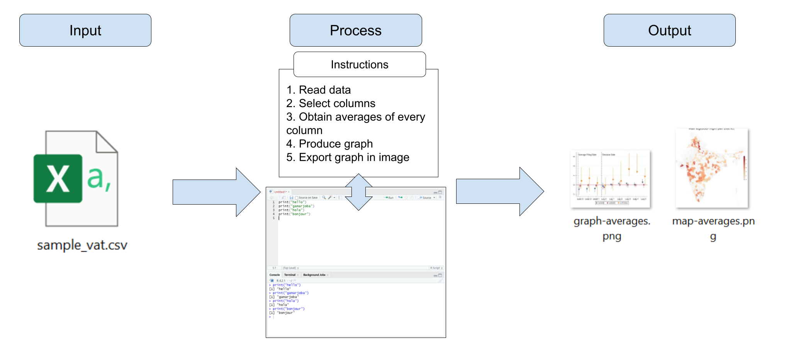
```

---

# About this session // ამ სესიის შესახებ

```{r echo = FALSE, out.width="90%"}
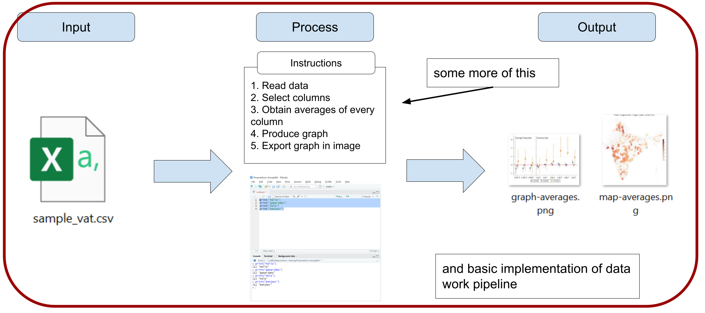
```

---

class: inverse, center, middle
name: r-libraries

# R libraries // R ბიბლიოთეკები

<html><div style='float:left'></div><hr color='#D38C28' size=1px width=1100px></html>

---

# R libraries // R ბიბლიოთეკები

- Installing R in your computer gives you access to its basic functions

- Additionally, you can also install libraries. Libraries are packages of additional R functions that allow you to do:

  + Operations that basic R functions don't do (example: work with geographic data)
  
  + Operations that basic R functions do, but easier (example: data wrangling)

---

# R libraries // R ბიბლიოთეკები

In a nutshell:

```{r echo = FALSE, out.width="90%"}
knitr::include_graphics("img/r-libraries.png")
```

---

# R libraries // R ბიბლიოთეკები

## Installing R libraries

- Installing libraries is usually simple, but it can be challenging in institutional network connections such as the World Bank or the Georgia RS

- The next exercise will set up RStudio so that it can install R libraries without problems

---

# R libraries // R ბიბლიოთეკები

## Exercise 1: Setting up the installation of libraries

1 - In RStudio, go to `Tools` >> `Global Options...`

```{r echo = FALSE, out.width="60%"}
knitr::include_graphics("img/global-options.png")
```

---

# R libraries // R ბიბლიოთეკები

## Exercise 1: Setting up the installation of libraries

.pull-left[
2 - Select `Packages` in the left pane

3 - Uncheck `Use secure download method for HTTP`

4 - Click `OK`

You will not see any changes in your RStudio window after this, but now you'll be able to install libraries.
]

.pull-right[
```{r echo = FALSE, out.width="90%"}
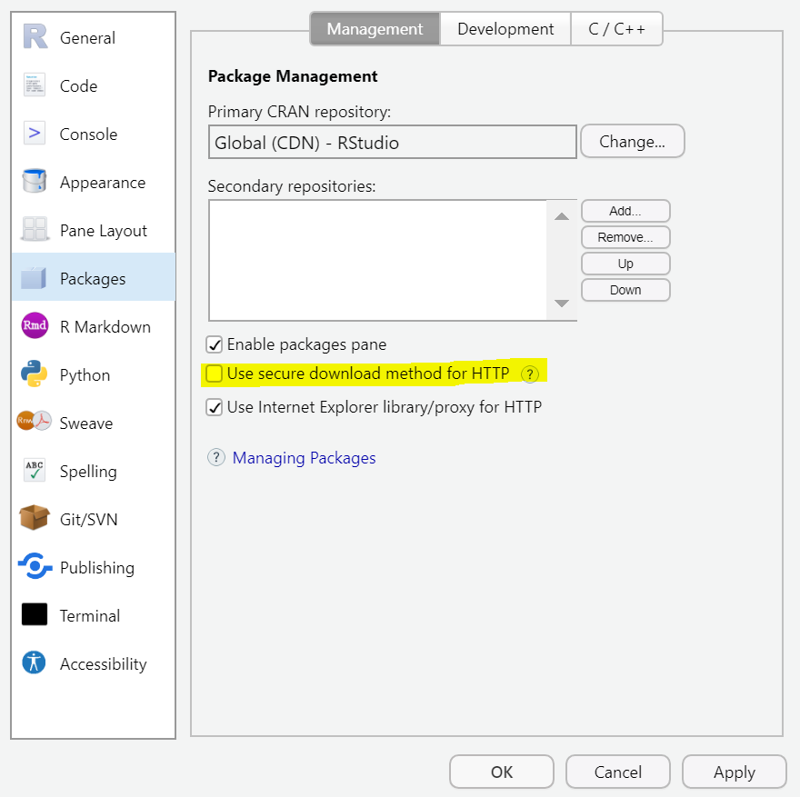
```
]

---

# R libraries // R ბიბლიოთეკები

We'll use two libraries in today's session: `dplyr` and `ggplot2`

## Exercise 2: Installing libraries

1. Install the libraries by using `install.packages()`

 + `install.packages("dplyr")`
 + `install.packages("ggplot2")`
 + Note the quotes (`" "`) in the packages names
 + **Introduce this code in the console**, not the script panel

```{r echo = FALSE, out.width="50%"}
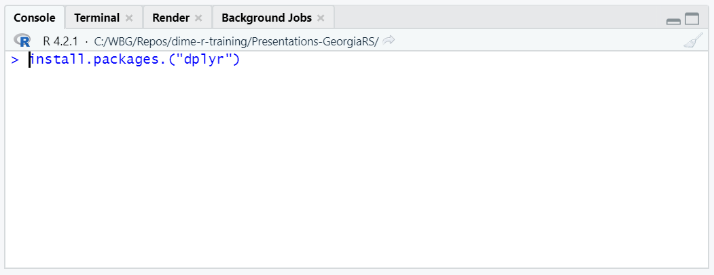
```

---

# R libraries // R ბიბლიოთეკები

## Installing libraries

```{r echo = FALSE, out.width="95%"}
knitr::include_graphics("img/installing-dplyr.png")
```

Remember to do this for the installation of `ggplot2` as well.

---

# R libraries // R ბიბლიოთეკები

Now that `dplyr` and `ggplot2` are installed, we only need to load them to start using the functions they have.

## Exercise 3: Loading libraries

.pull-left[
1. Open a new script with `File` >> `New File` >> `R Script`

1. Load `dplyr` with: `library(dplyr)`

1. Load `ggplot2` with `library(ggplot2)`

  + Run this code from the new script you just opened
  + Notice that we don't use quotes in the library names this time
]
.pull-right[
```{r echo = FALSE, out.width="90%"}
knitr::include_graphics("img/loading-dplyr.png")
```
]

---

# R libraries // R ბიბლიოთეკები

- Library installation:

```{r echo = FALSE, out.width="37%"}

```

- Library loading:

```{r echo = FALSE, out.width="37%"}

```

- You install R libraries only once in your computer

- You load libraries every time you open a new RStudio window (only load the libraries you will use)

---

class: inverse, center, middle
name: data-wrangling

# Data wrangling // მონაცემთა ჩხუბი

<html><div style='float:left'></div><hr color='#D38C28' size=1px width=1100px></html>

---

# Data wrangling // მონაცემთა ჩხუბი

## Getting your data ready

- Most of times in data work, your data inputs will not be ready to be converted into outputs

- In statistical programming, the process of transforming data into a condition where it's ready to be converted into an output is called **data wrangling**

```{r echo = FALSE, out.width="90%"}
knitr::include_graphics("img/data-wrangling.png")
```

---

# Data wrangling // მონაცემთა ჩხუბი

## Getting your data ready

- Data wrangling is one of the most crucial aspects of data work

- It involves not only the coding aspect, but also the mental exercise of thinking  what is the shape and condition that your dataframe needs to have in order to produce your desired output

```{r echo = FALSE, out.width="90%"}
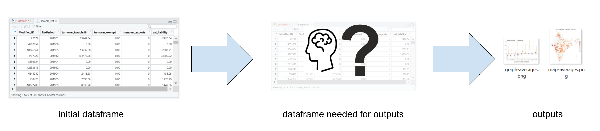
```

---

# Data wrangling // მონაცემთა ჩხუბი

## Getting your data ready

.pull-left[
- We'll use `dplyr` for data wrangling in this training

- You can also use basic R, but we recommend `dplyr` because its functions are easier to use
]
.pull-right[
```{r echo = FALSE, out.width="90%"}
knitr::include_graphics("img/dplyr.png")
```
]

---

# Data wrangling // მონაცემთა ჩხუბი

## Exercise 4: Loading data

Note that this is the same exercise we did yesterday. If you you can't locate your data file, download it from here: https://osf.io/download/ds5w4

.pull-left[
1. In RStudio, go to `File` > `Import Dataset` > `From Text (base)` and select the file `sample_vat.csv`

  + If you don't know where the file is, check in the `Downloads` folder

2. Make sure to select `Heading` > `Yes` in the next window

3. Select `Import`
]
.pull-right[
```{r echo = FALSE, out.width="85%"}
knitr::include_graphics("img/import3.png")
```
]

---

# Data wrangling // მონაცემთა ჩხუბი

## Loading data with a function

- You can also load CSV data with the function `read.csv()` instead of using this point-and-click approach

- The first argument of `read.csv()` is the path in your computer where your data is. For example

```{r, eval=FALSE}
sample_vat <- read.csv("C:/Users/wb532468/Downloads/sample_vat.csv")
```

- As usual, you need to save the result of `read.csv()` into a dataframe object with the arrow operator (`<-`) for it to be stored in the environment

---

# Data wrangling // მონაცემთა ჩხუბი

## Recap: knowing your data

- The dataframe name is `sample_vat`
- Each row is one monthly tax declaration for one taxpayer
- Column `Modified_ID` is a taxpayer identifier
- `TaxPeriod` is a month variable (year + month)
- The rest are tax-related variables that we are going to use to produce outputs

```{r echo = FALSE, out.width="60%"}
knitr::include_graphics("img/data-viewer.png")
```

---

# Data wrangling // მონაცემთა ჩხუბი

## Data work request

Imagine you're approached with the following request:

*"We're putting together a report where we want to include the monthly totals and averages of VAT liability for 2019. Can you calculate these numbers? There is data from monthly tax declarations you can use for this."*

---

# Data wrangling // მონაცემთა ჩხუბი

## Data work request

.pull-left[
*"There is data from monthly tax declarations you can use for this"*
]
.pull-right[
*"We want to include the monthly totals and averages of VAT liability for 2019"*
]

```{r echo = FALSE, out.width="95%"}
knitr::include_graphics("img/data-wrangling-planning.png")
```

---

# Data wrangling // მონაცემთა ჩხუბი

## Data work request

The data wrangling here involves a number of operations:

1. Keeping only the relevant columns and dropping everything else
1. Collapsing the dataframe by month
1. Calculating the total VAT liability by month
1. Calculating the average VAT liability by month

```{r echo = FALSE, out.width="95%"}
knitr::include_graphics("img/data-wrangling-planning.png")
```

---

# Data wrangling // მონაცემთა ჩხუბი

## 1. Keeping only relevant columns

Use `select()` for this:

```{r eval=FALSE}
df_temp1 <- select(sample_vat, TaxPeriod, vat_liability)
```

```{r echo = FALSE, out.width="90%"}
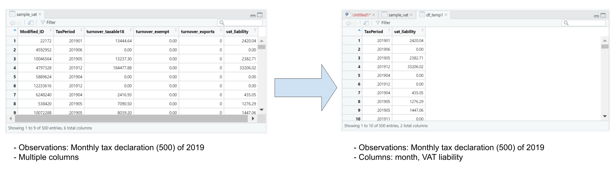
```

---

# Data wrangling // მონაცემთა ჩხუბი

## 2. Collapsing by month

Use `group_by()`:

```{r eval=FALSE}
df_temp2 <- group_by(df_temp1, TaxPeriod)
```

```{r echo = FALSE, out.width="90%"}
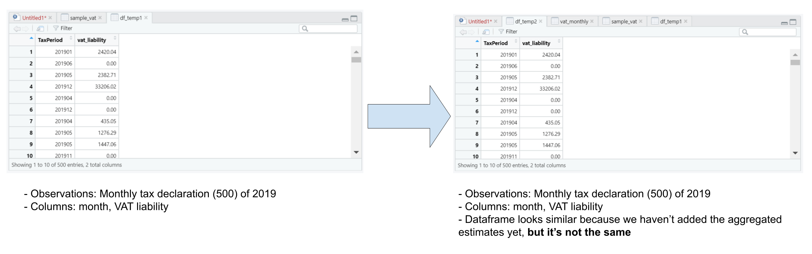
```

---

# Data wrangling // მონაცემთა ჩხუბი

## 3. Calculating aggregated columns: total and average VAT liability

Use `summarize()` combined with `sum()` and `mean()`:

```{r eval=FALSE}
vat_monthly <- summarize(df_temp2,
                         total = sum(vat_liability),
                         average = mean(vat_liability))
```

```{r echo = FALSE, out.width="90%"}
knitr::include_graphics("img/data-wrangling3.png")
```

---

# Data wrangling // მონაცემთა ჩხუბი

## Exercise 5: Wrangle your data

Now that we figured out the shape we need the dataframe to have, we can write code to execute the data wrangling.

1. Columns selection: `df_temp1 <- select(sample_vat, TaxPeriod, vat_liability)`
1. Collapsing by month: `df_temp2 <- group_by(df_temp1, TaxPeriod)`
1. Calculating the total and average by month:

```{r, eval=FALSE}
vat_monthly <- summarize(df_temp2,
                         total = sum(vat_liability),
                         average = mean(vat_liability))
```

Some notes:

- These are all functions from `dplyr`. Remember you have to have loaded `dplyr` first with `library(dplyr)` for this to work
- There is a line break and tabulation between each argument of `summarize()`. We use this for code clarity, R ignores line breaks when they are used between function arguments

---

# Data wrangling // მონაცემთა ჩხუბი

Some more notes:

- We're creating two intermediate results named `df_temp1` and `df_temp2` in the process
  + Note that `df_temp1` is the input of the collapsing and `df_temp2` is the result
  + This can be avoided by using something called the pipes operator (`%>%`)
  + We're not covering pipes in this training, but you should know they are commonly used in work with `dplyr`
- The result is the dataframe `vat_monthly`

```{r echo = FALSE, out.width="58%"}
knitr::include_graphics("img/ex5-environment.png")
```

---

# Data wrangling // მონაცემთა ჩხუბი

You can check your result with `View(vat_monthly)`. Now your dataframe is wrangled!

```{r echo = FALSE, out.width="75%"}
knitr::include_graphics("img/ex5-result.png")
```

---

# Data wrangling // მონაცემთა ჩხუბი

- This was a simple data wrangling example that we chose for convenience
- Data wrangling can involve lots of operations

| Operation | Function in `dplyr` |
| --------- | ------------------- |
| Subset columns | `select()`|
| Subset rows (based on condition) | `filter()` |
| Create new columns | `mutate()` |
| Create new rows | `add_row()` |
| Merge dataframes | `inner_join()`, `left_join()`, `right_join()`, `full_join()` |
| Append dataframes | `bind_rows()` |
| Deduplicate | `distinct()` |
| Collapse and create summary indicators | `group_by()`, `summarize()` |
| Pass a result as the first argument for the next function | `%>%` (operator, not function)|

---

class: inverse, center, middle
name: exporting-outputs

# Exporting outputs // პროდუქციის ექსპორტი

<html><div style='float:left'></div><hr color='#D38C28' size=1px width=1100px></html>

---

# Exporting outputs // პროდუქციის ექსპორტი

- Until now, we've seen full examples of part 1 and 2 of the data work pipeline
- What about exporting outputs?

```{r echo = FALSE, out.width="90%"}
knitr::include_graphics("img/data-work-progress.png")
```

- We'll see this in the next exercise

---

# Exporting outputs // პროდუქციის ექსპორტი

## Exporting dataframes

- The easiest way to export dataframe is with the function `write.csv()`

- `write.csv()` creates a CSV file with the dataframe

- It takes two basic arguments:

  1. The name of the dataframe you want to export
  1. A file path to export the dataframe to

- `write.csv()` includes the row numbers by default. You can add the argument `row.names = FALSE` to avoid this

---

# Exporting outputs // პროდუქციის ექსპორტი

## Exercise 6: Exporting `vat_monthly`

1. Use this code to export the result dataframe:

```{r eval=FALSE}
write.csv(vat_monthly,
          "vat_monthly.csv",
          row.names = FALSE)
```

---

# Exporting outputs // პროდუქციის ექსპორტი

Now `vat_monthly.csv` will show in your computer (probably in your `Documents` folder).

```{r echo = FALSE, out.width="70%"}
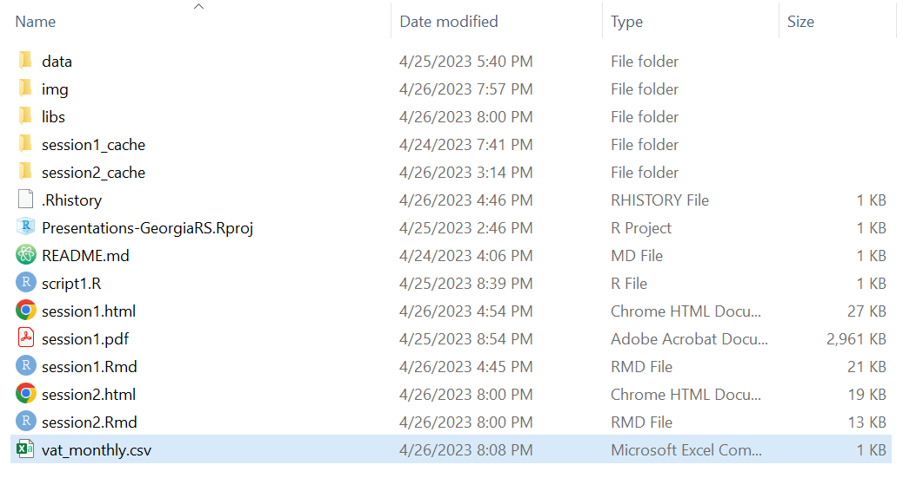
```

---

# Exporting outputs // პროდუქციის ექსპორტი

## Some notes on file paths

- The second argument of `write.csv()` specifies the file path we export the dataframe to

```{r eval=FALSE}
write.csv(vat_monthly,
          "vat_monthly.csv",
          row.names = FALSE)
```

- You can include any path in your computer and R will write the file in that location

  + For example: `"C:/Users/wb532468/OneDrive - WBG/Desktop`" exports the file to the desktop of my computer (this will not work in other computers)
  
  + Note that file paths in R use forward slashes (`/`). Back slashes (`\`) **do not work in R**

---

# Exporting outputs // პროდუქციის ექსპორტი

## Some notes on file paths

```{r eval=FALSE}
write.csv(vat_monthly,
          "vat_monthly.csv",
          row.names = FALSE)
```

- If you only include a file name (as in `vat_monthly.csv`), R will export the file to the current location of your RStudio window. This is usually the `Documents` folder in Windows

- You can check the current location of RStudio with the function `getwd()`

---

# Exporting outputs // პროდუქციის ექსპორტი

Our data pipeline has been fully implemented at this point. Great!

```{r echo = FALSE, out.width="70%"}
knitr::include_graphics("img/data-work-final-table.png")
```

---

class: inverse, center, middle
name: data-visualization

# Data visualization // მონაცემთა ვიზუალიზაცია

<html><div style='float:left'></div><hr color='#D38C28' size=1px width=1100px></html>

---

# Data visualization // მონაცემთა ვიზუალიზაცია

## Data visualization in the data work pipeline

- Compared to producing a table output, data visualization involves an extra step after data wrangling: producing the visualization

- We also us R code to produce data visualizations

- The input for that code is the wrangled dataframe

```{r echo = FALSE, out.width="80%"}
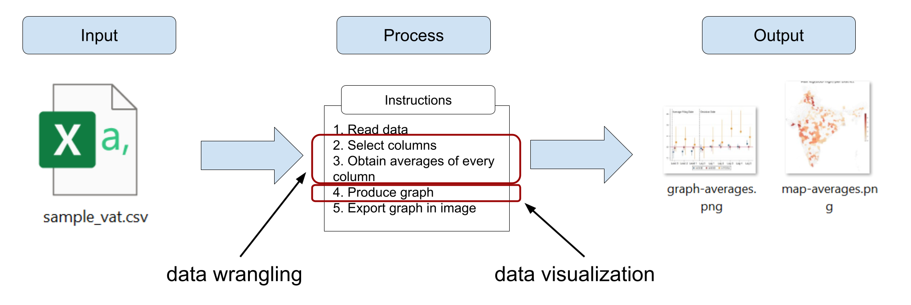
```

---

# Data visualization // მონაცემთა ვიზუალიზაცია

## Data visualization in R

.pull-left[
- We'll use the package `ggplot2` to create data visualizations

- `ggplot2` greatly facilitates producing plots in R

  + It follows a syntax based on a description of the plot you want to obtain
  
  + This syntax is called "grammar of graphics", a (somewhat) standard method of data visualization definition in statistical programming
]

.pull-right[
```{r echo = FALSE, out.width="70%"}
knitr::include_graphics("img/ggplot2.png")
```
]

---

# Data visualization // მონაცემთა ვიზუალიზაცია

## The grammar of graphics in `ggplot2`

```{r echo = FALSE, out.width="95%"}
knitr::include_graphics("img/grammar-of-graphics.png")
```

---

# Data visualization // მონაცემთა ვიზუალიზაცია

## The grammar of graphics in `ggplot2`

```{r echo = FALSE, out.width="95%"}
knitr::include_graphics("img/grammar-of-graphics2.png")
```

---

# Data visualization // მონაცემთა ვიზუალიზაცია

## The grammar of graphics in `ggplot2`

```{r echo = FALSE, out.width="95%"}
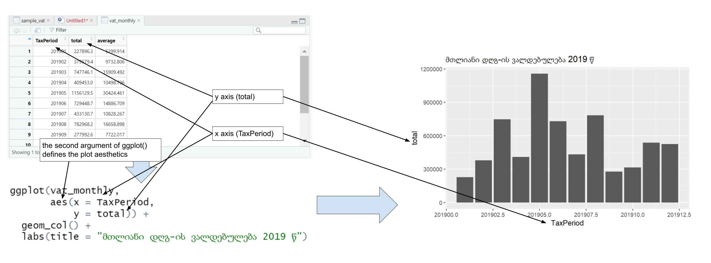
```

---

# Data visualization // მონაცემთა ვიზუალიზაცია

## The grammar of graphics in `ggplot2`

```{r echo = FALSE, out.width="95%"}
knitr::include_graphics("img/grammar-of-graphics4.png")
```

---

# Data visualization // მონაცემთა ვიზუალიზაცია

## Exercise 7

Use the dataframe `vat_monthly` to produce a bar plot (with more details) of the average VAT liability by month.

```{r eval=FALSE}
ggplot(vat_monthly,
       aes(x = as.factor(TaxPeriod),
           y = average)) +
  geom_col() +
  geom_text(aes(label = round(average)),
            position = position_dodge(width = 1),
            vjust = -0.5,
            size = 3) +
  labs(title = "დღგ-ის საშუალო თვიური ვალდებულება 2019 წ",
       x = "თვე",
       y = "თანხა") +
  theme_minimal() +
  theme(plot.title = element_text(hjust = 0.5),
        axis.text.x = element_text(size = 6.5)) +
  ylim(0, 35000)
```

---

# Data visualization // მონაცემთა ვიზუალიზაცია

```{r echo=FALSE, out.width="80%"}
bar_plot <- ggplot(vat_monthly,
                   aes(x = as.factor(TaxPeriod),
                       y = average)) +
  geom_col() +
  geom_text(aes(label = round(average)),
            position = position_dodge(width = 1),
            vjust = -0.5,
            size = 3) +
  labs(title = "დღგ-ის საშუალო თვიური ვალდებულება 2019 წ",
       x = "თვე",
       y = "თანხა") +
  theme_minimal() +
  theme(plot.title = element_text(hjust = 0.5),
        axis.text.x = element_text(size = 6.5)) +
  ylim(0, 35000)

bar_plot
```

---

# Data visualization // მონაცემთა ვიზუალიზაცია

When you produce a plot, RStudio will show it in a plot visualizer in the lower-right panel of your window.

```{r echo = FALSE, out.width="85%"}
knitr::include_graphics("img/rstudio-plot.png")
```

---

# Data visualization // მონაცემთა ვიზუალიზაცია

## Saving your plot in an output

- We use `ggsave()` to export the plot

- `ggsave()` by default saves the last plot you produced

- Just as `write.csv()`, `ggsave()` can use file paths to specify the location of the exported file

```{r eval=FALSE}
ggsave("vat-liability-2019.png")
```

---

# Data visualization // მონაცემთა ვიზუალიზაცია

## Saving your plot in an output

```{r echo = FALSE, out.width="65%"}
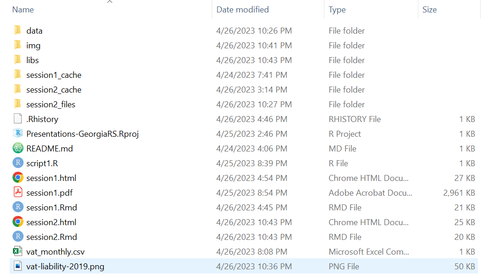
```

---

# Data visualization // მონაცემთა ვიზუალიზაცია

## Encodings in `ggplot2`

Encodings dictate how the data is represented in data visualizations. In a bar plot, the bars are the encoding. Some of the functions for encodings in `ggplot2` are:

| Encoding | Function in `ggplot2` |
| -------- | --------------------- |
| Bars | `geom_col()` |
| Lines | `geom_line()` |
| Points (scatterplot) | `geom_point()` |
| Area | `geom_area()` |
| Histogram | `geom_histogram()` |
| Floating labels (texts) | `geom_text()` |
| Box plot | `geom_boxplot()` |
| Pie chart | `geom_bar() + coord_polar()` |
| Smoothed line | `geom_smooth()` |


---

class: inverse, center, middle
name: wrapping-up

# Wrapping up // შეფუთვა

<html><div style='float:left'></div><hr color='#D38C28' size=1px width=1100px></html>

---

# Wrapping up // შეფუთვა

## Don't forget to save your work!

- Click the floppy disk icon to save your work
- Select a location for your file and remember where you're saving it

```{r echo = FALSE, out.width="65%"}
knitr::include_graphics("img/save-script2.png")
```

---

# Wrapping up // შეფუთვა

## Data work pipeline

```{r echo = FALSE, out.width="90%"}
knitr::include_graphics("img/data-work-final.png")
```

---

# Wrapping up // შეფუთვა

## Basic R code

```{r echo = FALSE, out.width="90%"}
knitr::include_graphics("img/data-work-final2.png")
```

---

# Wrapping up // შეფუთვა

## Looking ahead

```{r echo = FALSE, out.width="90%"}
knitr::include_graphics("img/data-work-expanded.png")
```

---

# Wrapping up // შეფუთვა

## Looking ahead

- [Connecting R with SQL databases](https://solutions.posit.co/connections/db/getting-started/connect-to-database/). Some libraries:
  + `dbConnect`
  + `dbplyr`
  + `DBI`

- [More on data wrangling](https://raw.githack.com/worldbank/dime-r-training/main/Presentations/03-data-wrangling.html#1). More libraries:
  + `tidyr`
  + `janitor`

- [More on data visualization](https://raw.githack.com/worldbank/dime-r-training/main/Presentations/04-data-visualization.html#1)

- [Geospatial data in R](https://raw.githack.com/worldbank/dime-r-training/main/Presentations/06-spatial-data.html#1). Libraries:
  + `sf`
  + `ggmap`

---

class: inverse, center, middle
name: statistical-programming

# Thanks! // მადლობა! // ¡Gracias! // Merci!    

<html><div style='float:left'></div><hr color='#D38C28' size=1px width=1100px></html>
