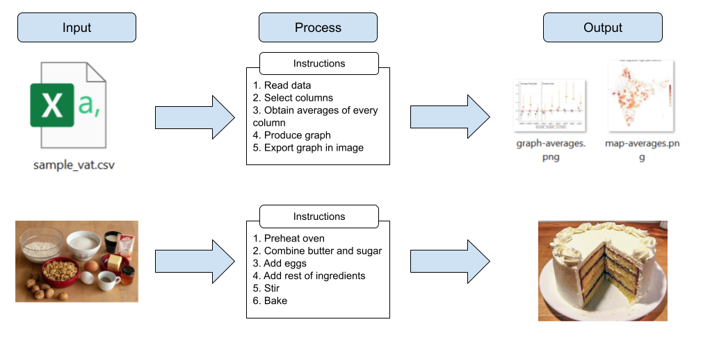
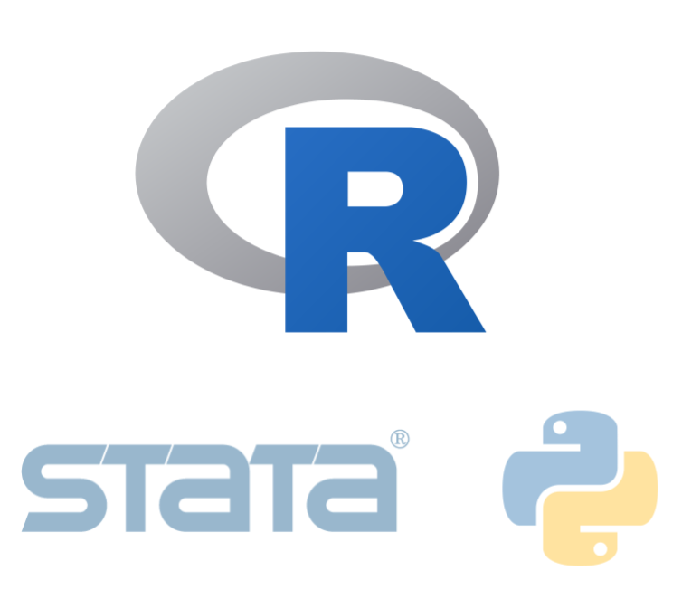
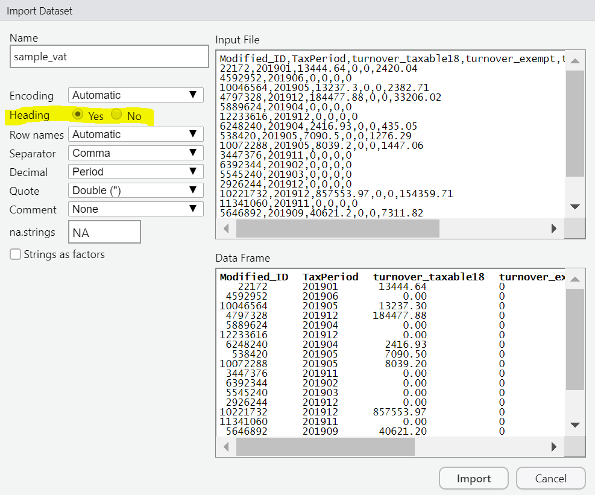
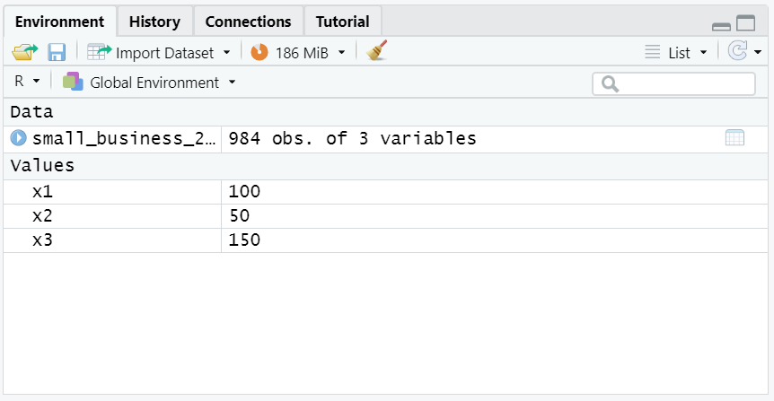
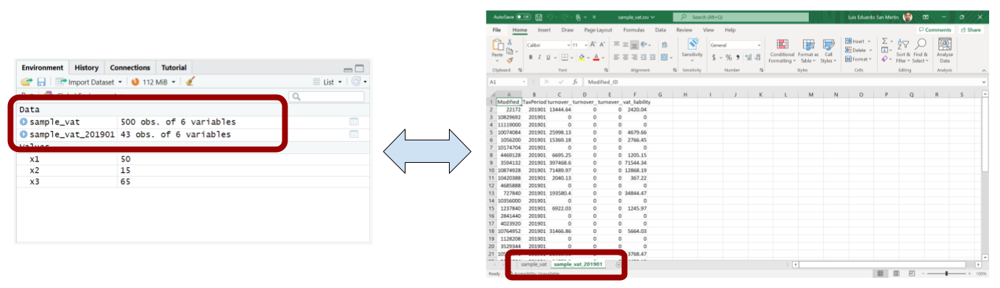
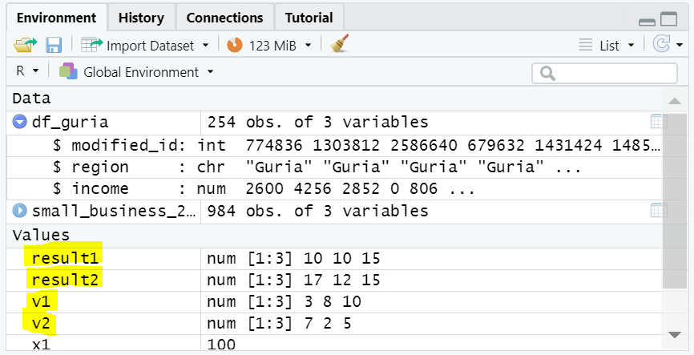
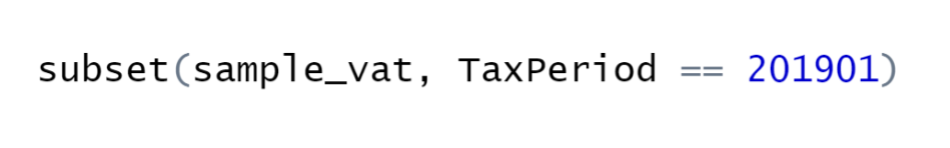
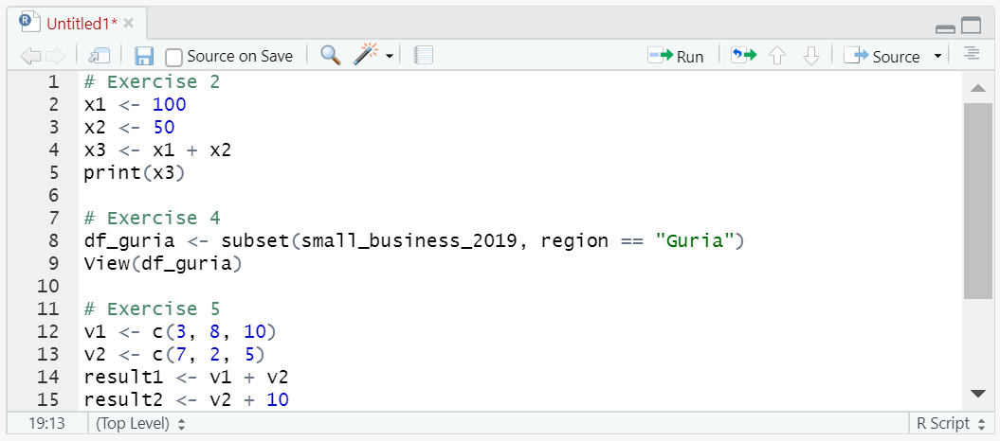
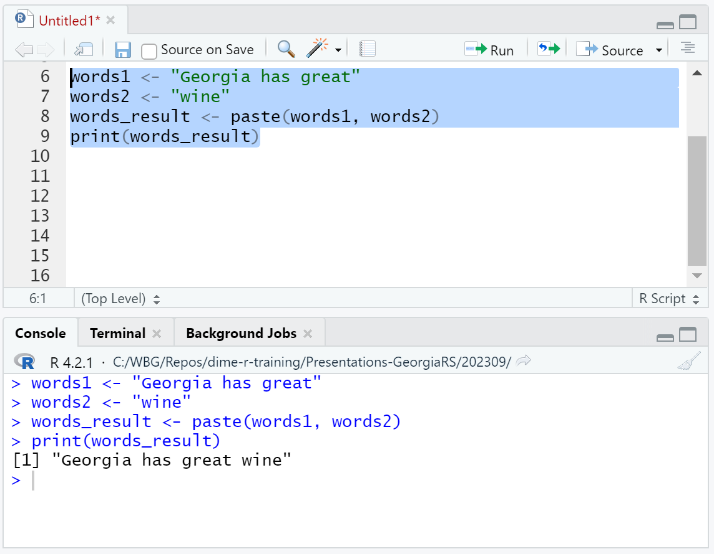

```{r setup, include = FALSE}
# Load packages
library(knitr)
library(xaringanExtra)
library(here)
here::i_am("1-introduction-to-r.Rmd")
options(htmltools.dir.version = FALSE)
opts_chunk$set(
  fig.align = "center",
  fig.height = 4,
  dpi = 300,
  cache = T
  )
xaringanExtra::use_panelset()
xaringanExtra::use_webcam()
xaringanExtra::use_clipboard()
htmltools::tagList(
  xaringanExtra::use_clipboard(
    success_text = "<i class=\"fa fa-check\" style=\"color: #90BE6D\"></i>",
    error_text = "<i class=\"fa fa-times-circle\" style=\"color: #F94144\"></i>"
  ),
  rmarkdown::html_dependency_font_awesome()
)
xaringanExtra::use_logo(
  image_url = here("img",
                   "lightbulb.png"),
  exclude_class = c("inverse", 
                    "hide_logo"),
  width = "50px"
)
```

```{css, echo = F, eval = T}
@media print {
  .has-continuation {
    display: block !important;
  }
}
```

# Table of contents // სარჩევი

1. [Introduction](#intro)
1. [Data work and statistical programming](#data-work)
1. [Statistical programming](#statistical-programming)
1. [Writing R code](#writing-r-code)
1. [Data in R](#data-in-r)
1. [Object types](#object-types)
1. [Functions in R](#functions-in-r)
1. [Wrapping up](#wrapping-up)
1. [Appendix](#appendix)

---

class: inverse, center, middle
name: intro

# Introduction // შესავალი

<html><div style='float:left'></div><hr color='#D38C28' size=1px width=1100px></html>

---

# Introduction // შესავალი

## About this training

- This is an **introduction** to data work and statistical programming in R

- The training does not require any background in statistical programming

- A computer with R and RStudio installed is required to complete the exercises

- Internet connection is required to download training materials

---

# Introduction // შესავალი

## Learning objectives

By the end of the training, you will know:

- How to approach data work through statistical programming using R and RStudio

- How to apply data wrangling and create outputs with descriptive statistics and data visualization by developing and running reproducible R code

---

class: inverse, center, middle
name: data-work

# Data work and statistical programming // სტატისტიკური პროგრამირება

<html><div style='float:left'></div><hr color='#D38C28' size=1px width=1100px></html>

---

# Data work // მონაცემთა მუშაობა

For the context of this training, we'll call data work everything that:

1. Starts with a data input
1. Runs some process with the data
1. Produces an output with the result

```{r echo = FALSE, out.width="90%"}
knitr::include_graphics("img/session1/data-work.png")
```

---

# Statistical programming // პროგრამირება

- Programming consists of producing instructions to a computer to do something
- In the context of data work, that "something" is statistical analysis or mathematical operations
- Hence, statistical programming consists of producing instructions so our computers will conduct statistical analysis on data

```{r echo = FALSE, out.width="70%"}
knitr::include_graphics("img/session1/data-work-with-instructions.png")
```

---

# Statistical programming // პროგრამირება

- You can think of statistical programming as writing a recipe

```{r echo = FALSE, out.width="80%"}

```

---

# Statistical programming // პროგრამირება

## Why use R

.pull-left[
- Statistical programming can be implemented through many different software. Other options are Stata and Python
- We recommend using R for these reasons:
  + R is free
  + R was designed specifically for statistical programming
  + There is a large worldwide community of R users. This means you can easily look for help or examples of code in the internet
]

.pull-right[
```{r echo = FALSE, out.width="70%"}

```
]

---

# Statistical programming // პროგრამირება

## How to write R code?

- The rest of today's session focuses on the basics of writing R code

- We'll use RStudio to write R code in this training

---

# Statistical programming // პროგრამირება

## How to write R code?

- Now open RStudio in your computer

- Please make sure you're opening RStudio and not R

```{r echo = FALSE, out.width="30%"}
knitr::include_graphics("img/session1/r-rstudio.png")
```

---

# Statistical programming // პროგრამირება

## How to write R code?

- Now open RStudio in your computer

- Please make sure you're opening RStudio and not R

```{r echo = FALSE, out.width="60%"}
knitr::include_graphics("img/session1/rstudio.png")
```

---

class: inverse, center, middle

# Questions? // კითხვები?

<html><div style='float:left'></div><hr color='#D38C28' size=1px width=1100px></html>

---

class: inverse, center, middle
name: writing-r-code

# Writing R code // R კოდის დაწერა

<html><div style='float:left'></div><hr color='#D38C28' size=1px width=1100px></html>

---

# Writing R code // R კოდის დაწერა

## RStudio interface

```{r echo = FALSE, out.width="74%"}
knitr::include_graphics("img/session1/rstudio-panels.png")
```

---

# Writing R code // R კოდის დაწერა

## Exercise 1: writing code in the console

1. Write the following code in the console of RStudio

  + `print("gamarjoba")`
  + Make sure to include the quotes: `" "`

2. Press Enter to run the code

```{r echo = FALSE, out.width="50%"}
knitr::include_graphics("img/session1/console.png")
```

---

# Writing R code // R კოდის დაწერა

```{r echo = FALSE, out.width="70%"}
knitr::include_graphics("img/session1/exercise1.png")
```

---

# Writing R code // R კოდის დაწერა

## Exercise 2: writing a short script

.pull-left[
1- Write or copy the following text into the script section of RStudio

```{r eval=FALSE}
x1 <- 100
x2 <- 50
x3 <- x1 + x2
print(x3)
```
  
2- Select the text you introduced with your mouse

3- Press "Run"
]
.pull-right[
```{r echo = FALSE, out.width="90%"}
knitr::include_graphics("img/session1/script.png")
```
]
---

# Writing R code // R კოდის დაწერა

```{r echo = FALSE, out.width="50%"}
knitr::include_graphics("img/session1/exercise2.png")
```

---

# Writing R code // R კოდის დაწერა

## R scripts

.pull-left[
- Writing and running code from the console will execute it immediately
]

.pull-right[
```{r echo = FALSE, out.width="110%"}
knitr::include_graphics("img/session1/exercise1.png")
```
]

---

# Writing R code // R კოდის დაწერა

## R scripts

.pull-left[
- Writing and running code from the console will execute it immediately

- Writing code in the script panel allow us to write multiple lines of code and execute them later

  + Each line is executed in order
  
  + The line and the results will show in the console
  
- **Important:** for the rest of the training, remember to always introduce your code in the script (and not in the console) so you can keep record of what you did
]

.pull-right[
```{r echo = FALSE, out.width="90%"}
knitr::include_graphics("img/session1/exercise2.png")
```
]

---

# Writing R code // R კოდის დაწერა

## R scripts

- In other words: scripts contain the instructions you give to your computer when doing data work

```{r echo = FALSE, out.width="80%"}
knitr::include_graphics("img/session1/data-work-script.png")
```

---

# Writing R code // R კოდის დაწერა

## Creating objects in R

- Remember we also mentioned the environment panel? that's where R keeps track of objects

- Objects are representations of data that currently exist in R's memory

  + A single number can be an object
  + A word can be an object
  + Even an entire data file can be an object

- We create objects in R with the arrow operator (`<-`)

- In exercise 2, we created objects each time we used `<-`

- After an object is created, we can refer to it using its name:

```{r echo=FALSE}
x3 <- 100 + 50
```

```{r}
print(x3 + 8)
```

---

# Writing R code // R კოდის დაწერა

## Creating objects in R

- After any objects are created, they will show in the environment panel

```{r echo = FALSE, out.width="60%"}
knitr::include_graphics("img/session1/environment.png")
```

---

# Writing R code // R კოდის დაწერა

- Now we know how to use RStudio to write R code and produce scripts

- We haven't still introduced the data to our data work. That comes next

---

class: inverse, center, middle
name: data-in-r

# Data in R // მონაცემები R

<html><div style='float:left'></div><hr color='#D38C28' size=1px width=1100px></html>

---

# Data in R // მონაცემები R

## Exercise 3: Loading data into R

 1.- Go to this page: https://osf.io/2apht and download the file `small_business_2019.csv`
 
```{r echo = FALSE, out.width="60%"}
knitr::include_graphics("img/session1/osf-screenshot.png")
```

---

# Data in R // მონაცემები R

## Exercise 3: Loading data into R

 2.- In RStudio, go to `File` > `Import Dataset` > `From Text (base)` and select the file `small_business_2019.csv`

  + If you don't know where the file is, check in your `Downloads` folder

.pull-left[
```{r echo = FALSE, out.width="70%"}
knitr::include_graphics("img/session1/import_data1.png")
```
]

.pull-right[
```{r echo = FALSE, out.width="70%"}
knitr::include_graphics("img/session1/downloads.png")
```
]

---

# Data in R // მონაცემები R

## Exercise 3: Loading data into R

3 - Make sure to select `Heading` > `Yes` in the next window

4 - Select `Import`

```{r echo = FALSE, out.width="40%"}

```

---

# Data in R // მონაცემები R

- If you did this correctly, you will note that a viewer of the data now appears in RStudio
- You can click on the `x` next to `small_business_2019` to return to the script
- To open the viewer again, use the code: `View(small_business_2019)` (notice the uppercase "V")

```{r echo = FALSE, out.width="70%"}
knitr::include_graphics("img/session1/data-viewer.png")
```

---

# Data in R // მონაცემები R

- Additionally, you will now see an object named `small_business_2019` in your environment

```{r echo = FALSE, out.width="70%"}

```

---

# Data in R // მონაცემები R

- Remember we mentioned objects before? For R, `small_business_2019` is an object just like `x1`, `x2`, or `x3`

- The difference is that `small_business_2019` is not a single number like `x1`, but a collection of numeric values similar to an Excel spreadsheet. In R, this type of objects are called **dataframes**

- From now, we will refer to data loaded into R as **dataframes**

```{r echo = FALSE, out.width="60%"}

```

---

# Data in R // მონაცემები R

- Since dataframes are also objects, we can refer to them with their names (exm: `small_business_2019`)

- We'll see an example of that in the next exercise

---

# Data in R // მონაცემები R

## A note about this dataframe

Understanding the data you use is very important. For this training, `small_business_2019` is an example dataframe with business income data for 2019

- `modified_id` is a business identifier
- `region` is region where the business is
- `income` is the income the business reported in 2019

```{r echo = FALSE, out.width="50%"}
knitr::include_graphics("img/session1/data-viewer.png")
```

---

# Data in R // მონაცემები R

## Exercise 4: Subset the data

1. Use the following code to subset `small_business_2019` and leave only the observations in the region named "Guria": `df_guria <- subset(small_business_2019, region == "Guria")`

  + Note that we are using the arrow operator (`<-`) to store the result
  + Note that there are **two equal signs** in the condition, not one
  + Also note that you need to write `"Guria"` enclosed in quotes and with uppercase `G`, because that's how it is in the data
  
2. Use `View(df_guria)` to visualize the dataframe again and see how it changed (note the uppercase "V")

---

# Data in R // მონაცემები R

```{r echo = FALSE, out.width="90%"}
knitr::include_graphics("img/session1/data-viewer2.png")
```

---

# Data in R // მონაცემები R

## Storing results in R

There is an important difference between using `<-` and not using it

- Not using `<-` **simply displays the result** in the console. The input dataframe will remain unchanged and the result **will not be stored**

```{r eval=FALSE}
subset(small_business_2019, region == "Guria")
```

```{r echo = FALSE, out.width="50%"}
knitr::include_graphics("img/session1/console-subset.png")
```

---

# Data in R // მონაცემები R

## Storing results in R

- Using `<-` tells R that we want to **store the result in a new object**, which is the object at the left side of the arrow. This time the result will not be printed in the console but the new dataframe will show in the environment panel

```{r echo=FALSE}
small_business_2019 <- read.csv(here("data", "small_business_2019.csv"))
```

```{r}
df_guria <- subset(small_business_2019, region == "Guria")
```

```{r echo = FALSE, out.width="60%"}
knitr::include_graphics("img/session1/environment3.png")
```

---

# Data in R // მონაცემები R

- R can store multiple dataframes in the environment. This is analogous to having different spreadsheets in the same Excel window

- Always remember that dataframes are just objects in R. R differentiates which dataframe the code refers to with the dataframe name

```{r echo = FALSE, out.width="95%"}

```

---

class: inverse, center, middle
name: object-types

# Object types // ობიექტების ტიპები

<html><div style='float:left'></div><hr color='#D38C28' size=1px width=1100px></html>

---

# Object types // ობიექტების ტიპები

- The objects in your environment have different types depending on the type of data they represent

- Different types of objects allow to apply different operations to them or apply the same operation in a different way

---

# Object types // ობიექტების ტიპები

- You can always check the type of an object with the function `class()`

```{r, echo=FALSE}
x1 <- 100
x2 <- 50
x3 <- x1 + x2
```

```{r}
class(x1)
```

```{r}
class(df_guria)
```
---

# Object types // ობიექტების ტიპები

We have worked with two classes of object until now:

- **Numeric:** single number values we can use for mathematical operations. The objects `x1`, `x2`, and `x3` are numeric. They are similar to values you would store in a single Excel cell

- **Dataframe:** a collection of values organized in rows and columns. `small_business_2019` and `df_guria` are dataframes. They are similar to an Excel spreadsheet

In the next exercise we will learn about another object type.

---

# Object types // ობიექტების ტიპები

## Vectors

- Vectors are a collection of values **with a single dimension**, instead of being organized in rows and columns as dataframes

- You can think of a vector in R as a single column in an Excel spreadsheet or an R dataframe

- You can create vectors with the function `c()`, the vector elements are separated by commas

```{r eval=FALSE}
my_vector <- c(4, 8, 2, 5)
```

---

# Object types // ობიექტების ტიპები

## Exercise 5: create and operate vectors

1- Create a vector with the elements 3, 8, and 10 and name it `v1`:

```{r}
v1 <- c(3, 8, 10)
```

2- Create a second vector with the elements 7, 2, and 5 and name it `v2`

```{r}
v2 <- c(7, 2, 5)
```

3- Create a third vector named `result1` with the sum of `v1` and `v2`:

```{r}
result1 <- v1 + v2
```

4- Lastly, create a fourth vector named `result2` with the sum of `v2` plus ten:

```{r}
result2 <- v2 + 10
```

5- Print `result1` and `result2` and observe the results

---

# Object types // ობიექტების ტიპები

```{r echo = FALSE, out.width="65%"}
knitr::include_graphics("img/session1/ex5.png")
```

---

# Object types // ობიექტების ტიპები

```{r echo = FALSE, out.width="75%"}

```

---

# Object types // ობიექტების ტიპები

Notice two things:

1.- Operating two vectors applies the operation **element-wise**

```{r echo = FALSE, out.width="75%"}
knitr::include_graphics("img/session1/element-wise-vector.png")
```

2.- Operating a vector with a numeric object will apply the **same operation to every element of the vector**

```{r echo = FALSE, out.width="75%"}
knitr::include_graphics("img/session1/same-operation-vector.png")
```

---

class: inverse, center, middle
name: functions-in-r

# Functions in R // ფუნქციონირებს R

<html><div style='float:left'></div><hr color='#D38C28' size=1px width=1100px></html>

---

# Functions in R // ფუნქციონირებს R

- Functions are how we apply operations to objects in R

- We have used a few functions in the previous exercises. For example, `subset()` and `paste()` are functions

- Everything that has a name plus parentheses is a function in R


```{r echo = FALSE, out.width="95%"}

```

---

# Functions in R // ფუნქციონირებს R

Functions have the following syntax:

```{r echo = FALSE, out.width="95%"}
knitr::include_graphics("img/session1/function-syntax.png")
```

- **Function name:** the name we use to call a function. It goes before the parentheses

- **Arguments:** inputs and specifications for the function to be applied.

  + Arguments go inside the parentheses
  + The first argument is the object you apply the function on

---

# Functions in R // ფუნქციონირებს R

- The results of a function can always be stored in an object with the arrow operator (`<-`)

```{r echo = FALSE, out.width="95%"}
knitr::include_graphics("img/session1/function-stored.png")
```

- As we saw previously, the results of a function will only be printed in the console if you don't store them

---

# Functions in R // ფუნქციონირებს R

## Exercise 6: Using the function `summary()`

1. Compute the summary statistics of the variables of `small_business_2019` and save the result with `summary_table <- summary(small_business_2019)`

2. Print the stored result with `print(summary_table)`

---

# Functions in R // ფუნქციონირებს R

Note that this code is both creating a new object (with `summary_table <- summary(small_business_2019)`) and printing the result in the console (with `print(small_business_2019)`)

```{r echo = FALSE, out.width="75%"}
knitr::include_graphics("img/session1/summary-result.png")
```

---

class: inverse, center, middle

# Questions? // კითხვები?

<html><div style='float:left'></div><hr color='#D38C28' size=1px width=1100px></html>

---

class: inverse, center, middle
name: wrapping-up

# Wrapping up // შეფუთვა

<html><div style='float:left'></div><hr color='#D38C28' size=1px width=1100px></html>

---

# Wrapping up // შეფუთვა

## Add code comments!

- Every line of code that starts with the pound symbol (`#`) will be ignored when R executes the code

- This means that you can add any clarifying comment with `#`. These are called **code comments**

- It's always a good practice to add code comments for yourself to later remember what the code is doing or to explain your code to others if you'll share it

---

# Wrapping up // შეფუთვა

- Try adding code comments to your script so you will remember which part corresponds to each exercise

```{r echo = FALSE, out.width="65%"}

```

---

# Wrapping up // შეფუთვა

## Always save your work!

- Click the floppy disk icon to save your work
- Select a location for your file and remember where you're saving it

```{r echo = FALSE, out.width="65%"}
knitr::include_graphics("img/session1/save.png")
```

---

# Wrapping up // შეფუთვა

## This session

This first session focused on the basics for writing R code

```{r echo = FALSE, out.width="90%"}
knitr::include_graphics("img/session1/session1.png")
```

---

# Wrapping up // შეფუთვა

## Next session

In the next session we will learn how to get data ready to be exported as outputs

```{r echo = FALSE, out.width="90%"}
knitr::include_graphics("img/session1/session2.png")
```

---

class: inverse, center, middle

# Thanks! // მადლობა! // ¡Gracias! // Obrigado!

<html><div style='float:left'></div><hr color='#D38C28' size=1px width=1100px></html>

---

class: inverse, center, middle
name: appendix

# Appendix // დანართი

<html><div style='float:left'></div><hr color='#D38C28' size=1px width=1100px></html>

---

# Appendix // დანართი

## Object types: character strings

- Character strings are collections of alphanumeric characters usually representing words or texts, or just characters in general

```{r}
s1 <- "gamarjoba"
print(s1)
```

- Strings characters are **always enclosed in quotes** (`" "`)

- They are usually referred to as just **strings**

---

# Appendix // დანართი

## Exercise: create and operate character strings

1. Create a character string object with the words `"Georgia has great"` and name it `words1`

2. Create a second string with the words `"wine"` and name it `words2`

  + Don't forget to use `<-` to create the string objects
  + Remember to include the quotes: `" "`

3. Use the following code to concatenate `words1` and `words2`, save the result in `words_result`, and print it:

```{r eval=FALSE}
words_result <- paste(words1, words2)
print(words_result)
```

---

# Appendix // დანართი

## Object types: character strings

```{r echo = FALSE, out.width="45%"}

```

---

# Appendix // დანართი

## Object types: character strings

```{r echo = FALSE, out.width="60%"}
knitr::include_graphics("img/session1/ex6-environment.png")
```