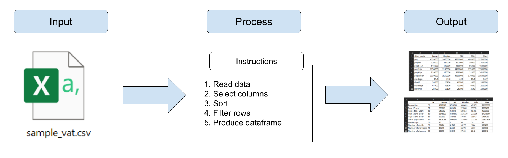
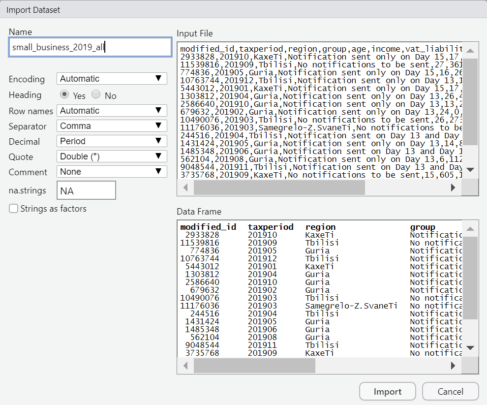
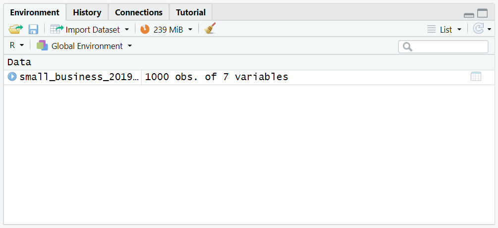
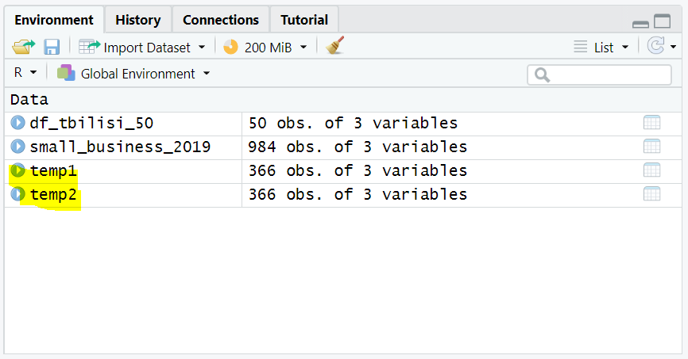
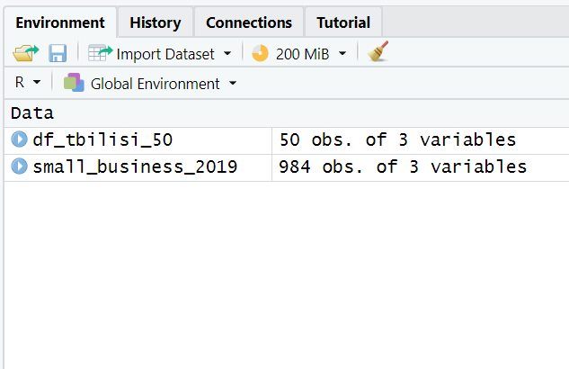
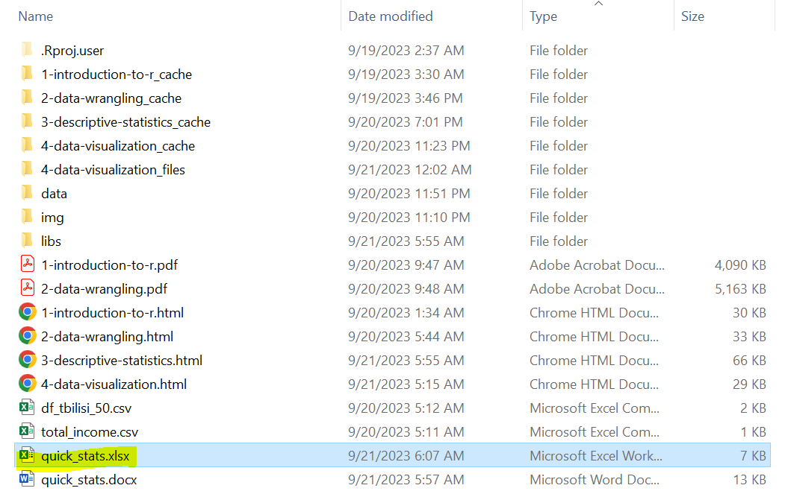

```{r setup, include = FALSE}
# Load packages
library(knitr)
library(xaringanExtra)
library(here)
library(dplyr)
library(modelsummary)
library(huxtable)
here::i_am("3-descriptive-statistics.Rmd")
options(htmltools.dir.version = FALSE)
opts_chunk$set(
  fig.align = "center",
  fig.height = 4,
  dpi = 300,
  cache = T
  )
xaringanExtra::use_panelset()
xaringanExtra::use_webcam()
xaringanExtra::use_clipboard()
htmltools::tagList(
  xaringanExtra::use_clipboard(
    success_text = "<i class=\"fa fa-check\" style=\"color: #90BE6D\"></i>",
    error_text = "<i class=\"fa fa-times-circle\" style=\"color: #F94144\"></i>"
  ),
  rmarkdown::html_dependency_font_awesome()
)
xaringanExtra::use_logo(
  image_url = here("img",
                   "lightbulb.png"),
  exclude_class = c("inverse", 
                    "hide_logo"),
  width = "50px"
)
```

```{css, echo = F, eval = T}
@media print {
  .has-continuation {
    display: block !important;
  }
}
```

# Table of contents // სარჩევი

- [Introduction](#intro)
- [Piping](#piping)
- [Quick summary statistics](#quick-summary-stats)
- [Customized summary statistics](#customized-summary-stats)
- [Exporting table](#exporting-tables)
- [Customizing table outputs](#customiing-table-outputs)
- [Wrapping up](#wrapping-up)

---

class: inverse, center, middle
name: intro

# Introduction // გაცნობა

<html><div style='float:left'></div><hr color='#D38C28' size=1px width=1100px></html>

---

# Introduction // გაცნობა

- We learned yesterday how to conduct statistical programming and export the results in `.csv` files
- However, sometime we might need more refined tables than simple (and ugly) CSVs

```{r echo = FALSE, out.width="95%"}

```

---

# Introduction // გაცნობა

- That's what today's session is about, along with an explanation of the pipes (`%>%`)

```{r echo = FALSE, out.width="95%"}

```

---

# Introduction // გაცნობა

## Exercise 1a: Getting the libraries for today's session

We're going to use two R libraries in this session: `modelsummary` and `huxtable`.

1. Install `modelsummary` and `huxtable`:

```{r eval=FALSE}
install.packages("modelsummary")
install.packages("huxtable")
```

```{r echo = FALSE, out.width="55%"}
knitr::include_graphics("img/session3/install.png")
```

---

# Introduction // გაცნობა

## Exercise 1b: Download and load the data we'll use

.pull-left[
1. Go to https://osf.io/z8snr and download the file

1. In RStudio, go to `File` > `Import Dataset` > `From Text (base)` and select the file `small_business_2019_all.csv`

  + If you don't know where the file is, remember to check in your `Downloads` folder

1. Select `Import`
]

.pull-right[
```{r echo = FALSE, out.width="85%"}

```
]

---

# Introduction // გაცნობა

You should have one dataframe loaded in the environment after this.

```{r echo = FALSE, out.width="90%"}

```

---

# Introduction // გაცნობა

## Recap: always know your data!

- This data is similar to the one we used before
- Every row is one business in one tax period (month)
- `modified_id` is a business identifier
- We also have information about the region, firm age, monthly income, VAT liability
- There is one more variable we didn't see before: `group` contains the group the firm was assigned to in a random experiment

```{r echo = FALSE, out.width="40%"}
knitr::include_graphics("img/session3/df.png")
```

---

class: inverse, center, middle
name: piping

# Piping

<html><div style='float:left'></div><hr color='#D38C28' size=1px width=1100px></html>

---

# Piping

- Before we start producing more refined outputs, we need to cover piping

- You probably remember this piece of code from one of yesterday's exercise:

```{r eval= FALSE}
# Filter only businesses in Tbilisi:
temp1 <- filter(small_business_2019, region == "Tbilisi")

# Sort previous result by income, descending order:
temp2 <- arrange(temp1, -income)

# Keep only the 50 first businesses after sorting:
df_tbilisi_50 <- filter(temp2, row_number() <= 50)
```

---

# Piping

This code works, but the problem with it is that it makes us generate unnecessary intermediate dataframes (`temp1`, `temp2`) that store results temporarily

```{r echo = FALSE, out.width="75%"}

```

---

# Piping

Instead, we can use pipes to **pass the results of a function and apply a new function on top of it**

.pull-left[
```{r eval= FALSE}
# Filter only businesses in Tbilisi:
temp1 <- filter(small_business_2019,
                region == "Tbilisi")

# Sort previous result by income, descending order:
temp2 <- arrange(temp1,
                 -income)

# Keep only the 50 first businesses after sorting:
df_tbilisi_50 <- filter(temp2,
                        row_number() <= 50)
```
]

.pull-right[
```{r eval=FALSE}
# The same but with pipes:
df_tbilisi_50 <- filter(small_business_2019,
                        region == "Tbilisi") %>%
  arrange(-income) %>%
  filter(row_number() <= 50)
```
]

---

# Piping

.pull-left[
```{r eval= FALSE}
# Filter only businesses in Tbilisi:
temp1 <- filter(small_business_2019,
                region == "Tbilisi")

# Sort previous result by income, descending order:
temp2 <- arrange(temp1,
                 -income)

# Keep only the 50 first businesses after sorting:
df_tbilisi_50 <- filter(temp2,
                        row_number() <= 50)
```
]

.pull-right[
```{r eval=FALSE}
# The same but with pipes:
df_tbilisi_50 <- filter(small_business_2019,
                        region == "Tbilisi") %>%
  arrange(-income) %>%
  filter(row_number() <= 50)
```
]

There are several important details to notice here:

1.- The resulting dataframe `df_tbilisi_50` is **the same in both cases**

---

# Piping

.pull-left[
```{r eval= FALSE}
# Filter only businesses in Tbilisi:
temp1 <- filter(small_business_2019,
                region == "Tbilisi")

# Sort previous result by income, descending order:
temp2 <- arrange(temp1,
                 -income)

# Keep only the 50 first businesses after sorting:
df_tbilisi_50 <- filter(temp2,
                        row_number() <= 50)
```
]

.pull-right[
```{r eval=FALSE}
# The same but with pipes:
df_tbilisi_50 <- filter(small_business_2019,
                        region == "Tbilisi") %>%
  arrange(-income) %>%
  filter(row_number() <= 50)
```
]

2.- The name of the resulting dataframe is now defined in the first line of this data wrangling operation. This is because **R evaluates lines with consecutive pipes as if they were a single line**

---

# Piping

.pull-left[
```{r eval= FALSE}
# Filter only businesses in Tbilisi:
temp1 <- filter(small_business_2019,
                region == "Tbilisi")

# Sort previous result by income, descending order:
temp2 <- arrange(temp1,
                 -income)

# Keep only the 50 first businesses after sorting:
df_tbilisi_50 <- filter(temp2,
                        row_number() <= 50)
```
]

.pull-right[
```{r eval=FALSE}
# The same but with pipes:
df_tbilisi_50 <- filter(small_business_2019,
                        region == "Tbilisi") %>%
  arrange(-income) %>%
  filter(row_number() <= 50)
```
]

3.- Notice that the functions `arrange()` and `filter()` used after the pipes now have only **one argument instead of two**. This is because when using pipes the first argument is implied to be result of the function before the pipes

---

# Piping

## Exercise 2: filtering and sorting revisited

1. Apply the same filtering and sorting now with pipes

```{r eval=FALSE}
df_tbilisi_50 <- filter(small_business_2019,
                        region == "Tbilisi") %>%
  arrange(-income) %>%
  filter(row_number() <= 50)
```

---

# Piping

Now we will not have any annoying intermediate results stored in our environment!

.pull-left[
```{r eval=FALSE}
# The same but with pipes:
df_tbilisi_50 <- filter(small_business_2019,
                        region == "Tbilisi") %>%
  arrange(-income) %>%
  filter(row_number() <= 50)
```
]

.pull-right[
```{r echo = FALSE, out.width="85%"}

```
]

---

# Piping

Lastly, we can also add more formatting to this code to improve its clarity even more:

.pull-left[
```{r eval=FALSE}
# Previous solution
df_tbilisi_50 <- filter(small_business_2019,
                        region == "Tbilisi") %>%
  arrange(-income) %>%
  filter(row_number() <= 50)
```
]

.pull-right[
```{r eval=FALSE}
# The same with better spacing
df_tbilisi_50 <-
  small_business_2019 %>%
  filter(region == "Tbilisi") %>%
  arrange(-income) %>%
  filter(row_number() <= 50)
```
]

---

# Piping

.pull-left[
```{r eval=FALSE}
# Previous solution
df_tbilisi_50 <- filter(small_business_2019,
                        region == "Tbilisi") %>%
  arrange(-income) %>%
  filter(row_number() <= 50)
```
]

.pull-right[
```{r eval=FALSE}
# The same with better spacing
df_tbilisi_50 <-
  small_business_2019 %>%
  filter(region == "Tbilisi") %>%
  arrange(-income) %>%
  filter(row_number() <= 50)
```
]

- Good code is code that is both correct (does what it's supposed to) and it's easy to understand

- Piping is **instrumental for writing good code in R**

---

# Piping

## Always use pipes!

Now that you now about the power of the pipes, use them wisely!

.pull-left[
- Remember that pipes are part of the library `dplyr`, you need to load it before using them

- Pipes also improve code clarity drastically

- Many R coders use pipes and internet examples assume you know them

- **We'll use pipes now in the next examples and exercises of the rest of this training**
]

.pull-right[
```{r echo = FALSE, out.width="45%"}
knitr::include_graphics("img/session3/pipes-joke.png")
```
]

---

class: inverse, center, middle
name: quick-summary-stats

# Quick summary statistics // სწრაფი შემაჯამებელი სტატისტიკა

<html><div style='float:left'></div><hr color='#D38C28' size=1px width=1100px></html>

---

# Quick summary statistics

We learned yesterday how to produce dataframes with results and export them.

## But what if you want to ... ?

- ...export results in a different format (example: Excel)

- ...further customize which rows and columns to display in a result

- ...format the results you export

---

# Quick summary statistics

## You will need `modelsummary` and `huxtable` for this

- These libraries allow you to export results in a customized way

- We chose a combination of both because together they export a large range of output types and allow fine-grained customization of outputs

```{r echo = FALSE, out.width="95%"}
knitr::include_graphics("img/session3/csv-to-excel.png")
```

---

# Quick summary statistics

We'll start by introducing the function `datasummary_skim()` from `modelsummary`

.command[
## `datasummary_skim(data, output, ...)`

 * **data:** the data set to be summarized, the only required argument
 * **output:** the type of output desired
 * **... :** additional options allow for formatting customization, such as including notes and titles
]

For example:

```{r, eval = F}
datasummary_skim(
  data,
  output = "default",
  type = "numeric",
  title = NULL,
  notes = NULL,
  ...
)
```

---

# Quick summary statistics

## Exercise 3: Calculate quick summary statistics

1. Load `modelsummary` with `library(modelsummary)`

1. Use `datasummary_skim()` to create a descriptive statistics table for `small_business_all`

```{r echo=FALSE}
small_business_2019_all <- read.csv("data/small_business_2019_all.csv")
```

```{r eval=FALSE}
datasummary_skim(small_business_2019_all)
```

---

# Quick summary statistics

You should be seeing this result in the lower right panel of RStudio.

```{r echo=FALSE}
datasummary_skim(small_business_2019_all)
```

---

# Quick summary statistics

- Most functions of `modelsummary` summarize only numeric variables by default

- To summarize categorical variables, use the argument `type = "categorical"`

```{r eval=FALSE}
datasummary_skim(small_business_2019_all, type = "categorical")
```

---

# Quick summary statistics

```{r echo=FALSE}
datasummary_skim(small_business_2019_all, type = "categorical")
```

---

# Quick summary statistics

- `datasummary_skim()` is convenient because it's fast, easy, and shows a lot of information

```{r echo = FALSE}
datasummary_skim(small_business_2019_all)
```

- But what if we wanted to customize what to show? that's when we use `datasummary()` instead, also from the library `modelsummary`

---

class: inverse, center, middle
name: customized-summary-stats

# Customized summary statistics // მორგებული შემაჯამებელი სტატისტიკა

<html><div style='float:left'></div><hr color='#D38C28' size=1px width=1100px></html>

---

# Customized summary statistics

`datasummary()` is very similar to `data_summary_skim()`. The only difference is that it requires a **formula argument**.

.command[
## `datasummary(formula, data, output)`

 * **formula:** a two-sided formula to describe the table as: rows ~ columns
 * **data:** the data set to be summarized
 * **output:** the type of output desired
 * **... :** additional options allow for formatting customization

]

```{r, eval = F}
datasummary(
  var1 + var2 + var3 ~ stat1 + stat2 + stat3 + stat4,
  data = data
)
```

---

# Customized summary statistics

## Exercise 4: 

Create a summary statistics table showing the nuber of observations, mean, standard deviation, minimum, and maximum for variables `age`, `income`, and `vat_liability` of the dataframe `small_business_2019_all`

1. Use `datasummary()` for this:

```{r eval=FALSE}
datasummary(
  age + income + vat_liability ~ N + Mean + SD + Min + Max,
  small_business_2019_all
)
```

---

# Customized summary statistics

```{r echo=FALSE}
datasummary(
  age + income + vat_liability ~ N + Mean + SD + Min + Max,
  small_business_2019_all
)
```

---

# Customized summary statistics

```{r eval=FALSE}
datasummary(
  age + income + vat_liability ~ N + Mean + SD + Min + Max, # this is the formula
  small_business_2019_all                                   # this is the data
)
```

Some notes:

- The arguments **formula** and **data** are mandatory for `datasummary()`
- All other arguments are optional (like `title = *some-title*`, to add a table title)
- The formula should always be defined as: rows ~ columns
- The rows and columns in the formula are separated by a plus (`+`) sign

---

# Customized summary statistics

```{r eval=FALSE}
datasummary(
  age + income + vat_liability ~ N + Mean + SD + Min + Max, # this is the formula
  small_business_2019_all                                   # this is the data
)
```

In this exercise we used the statistics N (number of observations), mean, SD (standard deviation), Min (minimum), and Max (maximum). Other statistics you can include are:

| Statistic | Keyword |
| --------- | ------- |
|Median|`Median`|
|25th percentile|`P25`|
|75th percentile|`P75`|
|In general: percentile XX| `PXX`|
|Small histogram|`Histogram`|

---

class: inverse, center, middle
name: exporting-tables

# Exporting tables // მაგიდების ექსპორტი

<html><div style='float:left'></div><hr color='#D38C28' size=1px width=1100px></html>

---

# Exporting tables // მაგიდების ექსპორტი

Remember that both `datasummary_skim()` and `datasummary()` have an optional argument named *output*? We can  use it to specify a file path for an output file.

For example:

```{r eval=FALSE}
datasummary_skim(small_business_2019_all,
                 output = "quick_stats.docx")
```

Will export the result to the `Documents` folder (in Windows) in a Word file named `quick_stats.docx`

---

# Exporting tables // მაგიდების ექსპორტი

The file type of the output is dictated by the file extension. For example:

| File name | File extension | Output type |
| --------- | -------------- | ----------- |
|"quick_stats.docx"|`.docx`|Word|
|"quick_stats.pptx"|`.pptx`|Power Point|
|"quick_stats.html"|`.html`|HTML (to open in a web explorer)|
|"quick_stats.tex"|`.tex`|Latex|
|"quick_stats.md"|`.md`|Markdown|

Noticed that we're missing Excel?

---

# Exporting tables // მაგიდების ექსპორტი

## That's because the functions of `modelsummary` can't export to Excel

- Nonetheless, we can use the library `huxtable` as an intermediary to transform results from `modelsummary` functions to Excel files

- `huxtable` is a package for exporting tables in general that allows you to **customize the output you're exporting**

- We'll know how to use it in the next exercise

---

# Exporting tables // მაგიდების ექსპორტი

## Exercise 5: Export a table to Excel

1. Load `huxtable` with `library(huxtable)`

1. Run the following code to export the result of `datasummary_skim()` to Excel:

```{r eval=FALSE}
# Store the table in a new object
stats_table <- datasummary_skim(small_business_2019_all, output = "huxtable")

# Export this new object to Excel with quick_xlsx()
quick_xlsx(stats_table, file = "quick_stats.xlsx")
```

---

# Exporting tables // მაგიდების ექსპორტი

Now the result will show in your `Documents` folder

```{r echo = FALSE, out.width="65%"}

```

---

# Exporting tables // მაგიდების ექსპორტი

And you can open it with Excel for further customization if you want

```{r echo = FALSE, out.width="65%"}
knitr::include_graphics("img/session3/quick-stats-excel.png")
```

---

# Exporting tables // მაგიდების ექსპორტი

```{r eval=FALSE}
# Store the table in a new object
stats_table <- datasummary_skim(small_business_2019_all, output = "huxtable")

# Export this new object to Excel with quick_xlsx()
quick_xlsx(stats_table, file = "quick_stats.xlsx")
```

Some comments about this code:

- `quick_xlsx()` is a function from `huxtable`. The first argument is the object we export and the second is the file name. We could also use a file path here

- Note that we now use the argument `output = "huxtable"` in `datasummary_skim()`. This tells R that the output should be an object type that we can operate later with `huxtable` functions, such as `quick_xlsx()`

---

class: inverse, center, middle
name: customizing-table-outputs

# Customizing table outputs // ცხრილის შედეგების მორგება

<html><div style='float:left'></div><hr color='#D38C28' size=1px width=1100px></html>

---

# Customizing table outputs

The code below shows how the table `stats_table` can be formatted:

.pull-left[
```{r eval=FALSE}
# We start with stats_table:
stats_table %>%
  # Use first row as table header
  set_header_rows(1, TRUE) %>%
  # Use first column as row header
  set_header_cols(1, TRUE)  %>%
  # Don't round large numbers
  set_number_format(everywhere, 2:ncol(.), "%9.0f") %>%
  # Center cells in first row
  set_align(1, everywhere, "center") %>%
  # Set a theme for quick formatting
  theme_basic()
```
]

.pull-right[
.small[
```{r echo=FALSE, message=FALSE, warning=FALSE}
stats_table <- datasummary_skim(small_business_2019_all, output = "huxtable")

# Format table
 stats_table %>%  
   set_header_rows(1, TRUE) %>% # Use first row as table header 
   set_header_cols(1, TRUE)  %>%  # Use first column as row header 
   set_number_format(everywhere, 2:ncol(.), "%9.0f") %>% # Don't round large numbers  
   set_align(1, everywhere, "center") %>% # Centralize cells in first row 
   theme_basic() # Set a theme for quick formatting 
```
]
]

---

# Customizing table outputs

## Exercise 6: Export a customized table to Excel

.pull-left[
1.- Customize `stats_table` in a new object called `stats_table_custom`

```{r eval = FALSE}
stats_table_custom <- stats_table %>%
  # Use first row as table header
  set_header_rows(1, TRUE) %>%
  # Use first column as row header
  set_header_cols(1, TRUE)  %>%
  # Don't round large numbers
  set_number_format(everywhere, 2:ncol(.), "%9.0f") %>%
  # Center cells in first row
  set_align(1, everywhere, "center") %>%
  # Set a theme for quick formatting
  theme_basic()
```
]

.pull-right[
2.- Export `stats_table_custom` to a file named `stats-custom.xlsx` with `quick_xlsx()`

```{r eval=FALSE}
quick_xlsx(
  stats_table_custom,
  file = "stats-custom.xlsx"
  )
```
]

---

# Customizing table outputs

```{r echo = FALSE, out.width="55%"}
knitr::include_graphics("img/session3/stats-custom.png")
```

---

# Customizing table outputs

Notice that here in the first part of the exercise we stored the result in a new object

```{r eval = FALSE}
stats_table_custom <- stats_table %>%  # <---- here
  set_header_rows(1, TRUE) %>%
  set_header_cols(1, TRUE)  %>%
  set_number_format(everywhere, 2:ncol(.), "%9.0f") %>%
  set_align(1, everywhere, "center") %>%
  theme_basic()
```

This is the object that we export later with `quick_xslx()`

```{r eval=FALSE}
quick_xlsx(
  stats_table_custom,
  file = "stats-custom.xlsx"
  )
```

---

# Customizing table outputs

.pull-left[
**Before:**

```{r echo = FALSE, out.width="95%"}
knitr::include_graphics("img/session3/quick-stats-excel.png")
```
]

.pull-right[
**After:**
```{r echo = FALSE, out.width="95%"}
knitr::include_graphics("img/session3/stats-custom.png")
```
]

---

# Customizing table outputs

We used `theme_basic()` to give a minimalistic, basic theme to the table. Other available themes are:

```{r echo = FALSE, out.width="75%"}
knitr::include_graphics("img/session3/themes.png")
```

---

class: inverse, center, middle
name: wrapping-up

# Wrapping up // შეფუთვა

<html><div style='float:left'></div><hr color='#D38C28' size=1px width=1100px></html>

---

# Wrapping up // შეფუთვა

## Save your work!

Click the floppy disk to save the script you wrote in this session.

```{r echo = FALSE, out.width="55%"}
knitr::include_graphics("img/session3/save.png")
```

---

# Wrapping up // შეფუთვა

## What else is available?

- This was a short overview of how `modelsummary` and `huxtable` work together to produce professional-looking table outputs in R

- Other formatting options are: (all from `huxtable`)

| Formatting | Command |
|------------|---------|
|Export in new Excel tabs instead of new files|`as_Workbook()`|
|Change row names|`add_rownames()`|
|Change column names|`add_colnames()`|
|Cells in bold|`set_bold()`|
|Cells in italics|`set_italic()`|
|Cell font size|`font_size()`|
|Cell color|`background_color()`|

---

# Wrapping up // შეფუთვა

## What else is available?

More of this is explained in the libraries documentation:

  + `modelsummary` documentation: https://modelsummary.com/index.html
  + `huxtable` documentation: https://hughjonesd.github.io/huxtable/
  
---

# Wrapping up // შეფუთვა

## This session

```{r echo = FALSE, out.width="95%"}

```

---

# Wrapping up // შეფუთვა

## Next session (last one)

```{r echo = FALSE, out.width="95%"}
knitr::include_graphics("img/session4/data-work-data-vis.png")
```

---

class: inverse, center, middle

# Thanks! // მადლობა! // ¡Gracias! // Obrigado!

<html><div style='float:left'></div><hr color='#D38C28' size=1px width=1100px></html>
