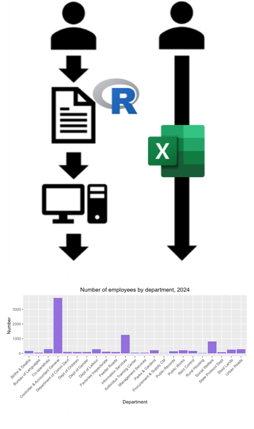
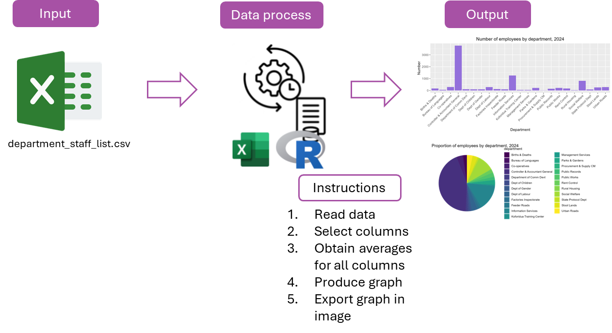
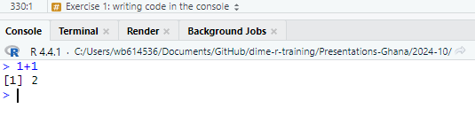
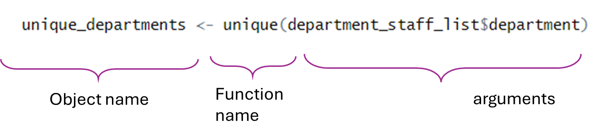
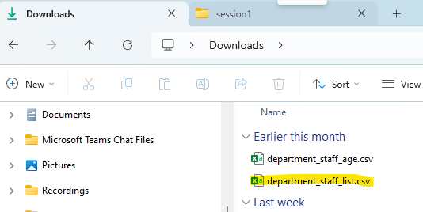
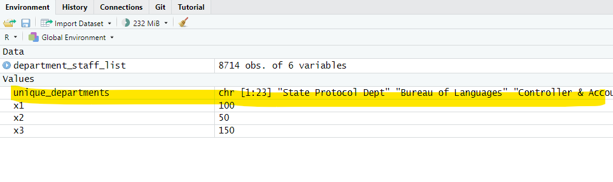
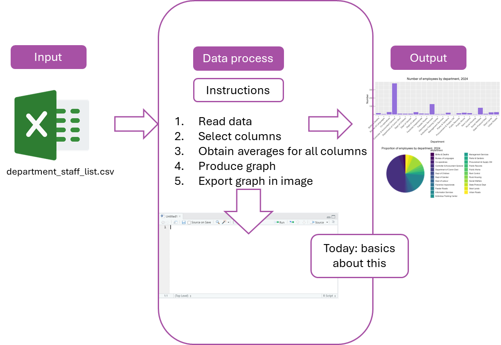

```{r setup, include = FALSE}
# Load packages
library(knitr)
library(xaringanExtra)
library(here)
library(readxl)
library(dplyr)
here::i_am("1-introduction-to-r.Rmd")
options(htmltools.dir.version = FALSE)
opts_chunk$set(
  fig.align = "center",
  fig.height = 4,
  dpi = 300,
  cache = T
  )
xaringanExtra::use_panelset()
xaringanExtra::use_webcam()
xaringanExtra::use_clipboard()
htmltools::tagList(
  xaringanExtra::use_clipboard(
    success_text = "<i class=\"fa fa-check\" style=\"color: #90BE6D\"></i>",
    error_text = "<i class=\"fa fa-times-circle\" style=\"color: #F94144\"></i>"
  ),
  rmarkdown::html_dependency_font_awesome()
)
xaringanExtra::use_logo(
  image_url = here("img",
                   "lightbulb.png"),
  exclude_class = c("inverse", 
                    "hide_logo"),
  width = "50px"
)
```

```{css, echo = F, eval = T}
@media print {
  .has-continuation {
    display: block !important;
  }
}
```


```{r, out.width = "100%", include=T, echo=F}

knitr::include_graphics("img/template.png")


```

# Table of contents 

1. [Introduction](#intro)
1. [Data work and Statistical Programming](#data-work)
1. [Statistical Programming](#statistical-programming)
1. [Writing R code](#writing-r-code)
1. [Object Types](#object-types)
1. [Functions in R](#functions-in-r)
1. [Data in R](#data-in-r)
1. [Wrapping up](#wrapping-up)
1. [Appendix](#appendix)

---

class: inverse, center, middle
name: intro

# Introduction

<html><div style='float:left'></div><hr color='#D38C28' size=1px width=1100px></html>

---

# Introduction 

## About this training

- This is an **introduction** to data work and statistical programming in R

- The training does not require any background in statistical programming

- A computer with R and RStudio installed is required to complete the exercises

- Internet connection is required to download training materials

---

# Introduction 

## Learning objectives

By the end of the training, you will know:

- How to write **basic** R code
  
- A notion of how to conduct data work in R and how it differentiates from Excel


---

class: inverse, center, middle
name: data-work

# Data work and Statistical Programming 

<html><div style='float:left'></div><hr color='#D38C28' size=1px width=1100px></html>

---

# Data work 

For the context of this training, we'll call data work everything that:

1. Starts with a data input
1. Runs some process with the data
1. Produces an output with the result

```{r echo = FALSE, out.width="90%"}

```

---

# Data work

- It's also possible to do data work with Excel
- However, we will show in this training why using statistical programming (through R) is a better way of conducting data work

```{r echo = FALSE, out.width="90%"}

```

---

# Statistical Programming

## How Can it Benefit My Work?


.pull-left[
- **Reproducibility**: Code provides an exact record of every step, making results easy to trace and verify.

- **Reusability**: Code can be reused for similar projects, saving time on future reports.

- **Transparency Over Excel**: Instructions are documented and less prone to error compared to manual steps in Excel.
]

.pull-right[
```{r echo = FALSE, out.width="50%"}

```
]

---

# Statistical Programming 

- Programming consists of producing instructions to a computer to do something
- In the context of data work, that "something" is statistical analysis or mathematical operations
- Hence, statistical programming consists of producing instructions so our computers will conduct statistical analysis on data

```{r echo = FALSE, out.width="70%"}

```

---

# Statistical Programming 

- You can think of statistical programming as writing a recipe

```{r echo = FALSE, out.width="80%"}

```

---

# Statistical Programming 

## Why use R

.pull-left[
- Statistical programming can be implemented through many different software. Other options are Stata and Python
- We recommend using R for these reasons:
  + R is free
  + R was designed specifically for statistical programming
  + There is a large worldwide community of R users. This means you can easily look for help or examples of code in the internet
]

.pull-right[
```{r echo = FALSE, out.width="70%"}
knitr::include_graphics("img/session1/software-logos.png")
```
]

---
# Statistical Programming

## It's not unusual to struggle at first but it gets better!

.pull-left[
- By the end of this training, you will learn how to leverage your existing data to create exhibits for your annual reports using R.

- We know this may feel challenging, but you’ll get there!

- Remember to ask questions, be patient with yourself, and take it step by step.


]

.pull-right[
```{r echo = FALSE, out.width="70%"}

```
]

---
# Statistical Programming 

## How to write R code?

- The rest of today's session focuses on the basics of writing R code

- We'll use RStudio to write R code in this training

---

# Statistical Programming 

## How to write R code?

- Now open RStudio in your computer

- Please make sure you're opening RStudio and not R

```{r echo = FALSE, out.width="30%"}
knitr::include_graphics("img/session1/r-rstudio.png")
```

---

# Statistical Programming 

## How to write R code?

- Now open RStudio in your computer

- Please make sure you're opening RStudio and not R

```{r echo = FALSE, out.width="60%"}
knitr::include_graphics("img/session1/rstudio.png")
```

---

class: inverse, center, middle

# Questions? 

<html><div style='float:left'></div><hr color='#D38C28' size=1px width=1100px></html>

---

class: inverse, center, middle
name: writing-r-code

# Writing R code 

<html><div style='float:left'></div><hr color='#D38C28' size=1px width=1100px></html>

---

# Writing R code 

At its core, R can function as a (very fancy) calculator, allowing you to perform basic mathematical operations. Here are some common operators:

.pull-left[

### Mathematical Operators

- **Addition**: `+` 
- **Subtraction**: `-`
- **Multiplication**: `*`
- **Division**: `/`
- **Exponentiation**: `^`

]


.pull-right[
### Comparison

- **Equal**: `==`
- **Not Equal**: `!=`
- **Greater than** `>`
- **Less Than** `<`

### Logical Operators 

- **AND**: &
- **OR**: |


]

And many more ... you can see [this list](https://www.w3schools.com/r/r_operators.asp) with a lot of examples.

---

# Writing R code 

## RStudio interface

RStudio has different elements, each with a specific use. 

```{r echo = FALSE, out.width="74%"}
knitr::include_graphics("img/session1/rstudio-panels.png")
```

---

# Writing R code 

## Exercise 1: writing code in the console

1. Write the following code in the console of RStudio

  + `1 + 1`

2. Press Enter to run the code

```{r echo = FALSE, out.width="50%"}

```

---
# Writing R code

## R objects

- Remember we also mentioned the environment panel? that's where R keeps track of objects

- You can think of R objects as saving information, for example simple numbers or just plain text.

  + A single number can be an object
  + A word can be an object
  + Even an entire data file can be an object

- We create objects in R with the arrow operator (`<-`)

- After an object is created, we can refer to it using its name:

```{r}
x1 <- 100 + 50
```

```{r}
x1
```

---

# Writing R code 

## Exercise 2: writing a short script and create objects

.pull-left[
1- Write or copy the following text into the script section of RStudio

```{r eval=FALSE}
x1 <- 100
x2 <- 50
x3 <- x1 + x2
x3
```
  
2- Select the text you introduced with your mouse

3- Press "Run"
]
.pull-right[
```{r echo = FALSE, out.width="90%"}
knitr::include_graphics("img/session1/script.png")
```
]
---

# Writing R code 

```{r echo = FALSE, out.width="50%"}

```

---

# Writing R code 

## Creating objects in R

- After any objects are created, they will show in the environment panel

```{r echo = FALSE, out.width="60%"}

```

---

# Writing R code 

## R scripts

.pull-left[
- Writing and running code from the console will execute it immediately
]

.pull-right[
```{r echo = FALSE, out.width="110%"}

```
]

---

# Writing R code 

## R scripts

.pull-left[
- Writing and running code from the console will execute it immediately

- Writing code in the script panel allow us to write multiple lines of code and execute them later

  + Each line is executed in order
  
  + The line and the results will show in the console
  
- **Important:** for the rest of the training, remember to always introduce your code in the script (and not in the console) so you can keep record of what you did
]

.pull-right[
```{r echo = FALSE, out.width="90%"}

```
]

---

# Writing R code 

## R scripts

- In other words: scripts contain the instructions you give to your computer when doing data work

```{r echo = FALSE, out.width="80%"}

```

---


class: inverse, center, middle
name: object-types

# Object Types 

<html><div style='float:left'></div><hr color='#D38C28' size=1px width=1100px></html>

---

# Object Types 

## What Are Object Types?

- **R objects** are containers for data, and they come in different **types**.
- The type of an object determines:
  - What **operations** can be performed on it.
  - How R will treat it during analysis.

Examples of common object types:
1. **Numeric**: Used for numbers, such as `100` or `3.14`.Can be used for mathematical operations like addition, subtraction, etc.
2. **Character**: Represents text or words, like `"Hello"` or `"Region A"`.  
3. **Vector**: A collection of values stored in a single dimension, like a list or a column in Excel. Example: A list of ages: `c(25, 30, 35, 40)`.  
4. **Dataframe**: A collection of rows and columns, similar to a table or spreadsheet.Each column can have its own type (e.g., numeric, character).  

---

# Object Types

## Let’s Explore Object Types

Create objects in RStudio:
```r
   num_object <- 42               # Numeric
   
   char_object <- "Learning R"    # Character
   
   vector_object <- c(1, 2, 3, 4) # Vector
   
   df_object <- data.frame(
     Name = c("Alice", "Bob"),   # Dataframe
     Age = c(25, 30)
   )                              
```

We will discuss more about the last type, but first we need to introduce one last concept. 

---

class: inverse, center, middle
name: functions-in-r

# Functions in R 

<html><div style='float:left'></div><hr color='#D38C28' size=1px width=1100px></html>

---

# Functions in R 


---

# Functions in R 

- Functions are how we apply operations to objects in R

- You can think of functions as little machines that (in most cases) process some kind of **input** and create an **output**.

- Input is everything that goes into a function (arguments and values)

Let's take a look at an example: the star producer!

---

# Functions in R 

## The Star Producer


.pull-left[
Let's consider the following function (that does not exist unfortunately): **A star_producer!**

This little machine creates tiny hand-drawn stars depending on some input. It takes two arguments:

- `how_many` tells the machine how many stars to produce.
- `type` tells the machine how the stars should look like (in this case the machine only supports "squiggly" stars, but it could be upgraded in the future when we learn how to create our own functions later on).
]

.pull-right[
```{r echo = FALSE, out.width="100%"}

```
]

---

# Functions in R 

## Getting `?help`

How do we know what function takes what kind of arguments?

Within R, you can always run the code:

```r
?function_name
```

This will open up the documentation for the function, which explains how to use it.

Googling the function name (adding "R" or "rstats" to the search) will also often bring up relevant documentation or examples!

---

# Functions in R 

Now in a real function ...

```{r echo = FALSE, out.width="95%"}
knitr::include_graphics("img/session1/function-syntax.png")
```

- **Function name:** the name we use to call a function. It goes before the parentheses

- **Arguments:** inputs and specifications for the function to be applied.

  + Arguments go inside the parentheses
  + The first argument is the object you apply the function on

---

# Functions in R

- The results of a function can always be stored in an object with the arrow operator (`<-`)

```{r echo = FALSE, out.width="95%"}

```

- The results of a function will only be printed in the console if you don't store them

---

# Functions in R

Okay now let's try it! 

## Exercise 3: Using a function `sum()`

1. Compute the sum of the numbers 1 to 10 and store it in the object sum_example: 

```{r, include=TRUE}
sum_example <- sum(c(1:10))
```


2. Print the stored result with `print(sum_example)`

```{r, include=TRUE}
print(sum_example)
```


---

# Functions in R 

Note that this code is both creating a new object (with `sum_example <- sum(c(1:10))`) and printing the result in the console (with `print(sum_example)`)

```{r echo = FALSE, out.width="75%"}

```

---

# Writing R code 

- Now we know how to use RStudio to write R code and produce scripts. 

- We also know about objects and functions.

- We haven't still introduced the data to our data work. That comes next


 

---

class: inverse, center, middle
name: data-in-r

# Data in R 

<html><div style='float:left'></div><hr color='#D38C28' size=1px width=1100px></html>

---

# Data in R 

## Exercise 4: Loading data into R

 1.- Go to this page: https://osf.io/2apht and download the file `department_staff_list.xlsx`
 
```{r echo = FALSE, out.width="60%"}

```

---

# Data in R 

## Exercise 4: Loading data into R

There are different ways of importing data to R, one is using the point and click. Let's start with that one. 

 2.- In RStudio, go to `File` > `Import Dataset` > `From Excel` and select the file `department_staff_list.xlsx`

  + If you don't know where the file is, check in your `Downloads` folder

.pull-left[
```{r echo = FALSE, out.width="70%"}

```
]

.pull-right[
```{r echo = FALSE, out.width="70%"}

```
]

---

# Data in R 

## Exercise 4: Loading data into R

3 - Make sure to select `Heading` > `Yes` in the next window

4 - Select `Import`

5 - You will see that the second way to read it by code (using functions), and is what R is doing for you in the background. 

```{r echo = FALSE, out.width="40%"}
knitr::include_graphics("img/session1/import3.png")
```

---

# Data in R 

- If you did this correctly, you will note that a viewer of the data now appears in RStudio
- You will also note that this appeared as a new object in your environment

```{r echo = FALSE, out.width="70%"}
knitr::include_graphics("img/session1/data-viewer.png")
```

---

# Data in R 

- Remember we mentioned **dataframe** objects before? For R, `department_staff_list` is an object just like `x1`, `x2`, or `x3`

- The difference is that `department_staff_list` is not a single number like `x1`, but a collection of numeric values similar to an Excel spreadsheet. In R, this type of objects are called **dataframes**

- From now, we will refer to data loaded into R as **dataframes**

```{r echo = FALSE, out.width="60%"}

```

---

# Data in R 

- Since dataframes are also objects, we can refer to them with their names (exm: `department_staff_list.xlsx`)

- We'll see an example of that in the next exercise

---

# Data in R 

## A note about this dataframe

- Understanding the data you use is very important. For this training, `department_staff_list` is a dataframe from your department. 

- Let's use another function to see what's in there

```{r, echo=FALSE, include=FALSE, message=FALSE}
library("readxl")
department_staff_list <- read_xlsx("data/department_staff_list.xlsx")
```


```{r, include=TRUE, echo=TRUE, message=FALSE}
glimpse(department_staff_list)
```

---

# Data in R 

## Exercise 5: Subset the data

1. Use the following code to subset `department_staff_list` and leave only the observations who are "Female":

```{r, echo=TRUE, include=TRUE, message=FALSE, warning=FALSE}
df_female <- subset(department_staff_list, sex == "Female")
```

  + Note that we are using the arrow operator (`<-`) to store the result
  + Note that there are **two equal signs** in the condition, not one
  + Also note that you need to write `"Female"` enclosed in quotes and with uppercase `F`, because that's how it is in the data
  
2. Use `View(df_female)` to visualize the dataframe again and see how it changed (note the uppercase "V")

---

# Data in R 

```{r echo = FALSE, out.width="90%"}

```

---

# Data in R 

## Storing results in R

There is an important difference between using `<-` and not using it

- Not using `<-` **simply displays the result** in the console. The input dataframe will remain unchanged and the result **will not be stored**

```{r}
subset(department_staff_list, sex == "Female")
```
---

# Data in R 

## Storing results in R

- Using `<-` tells R that we want to **store the result in a new object**, which is the object at the left side of the arrow. This time the result will not be printed in the console but the new dataframe will show in the environment panel

```{r echo=FALSE, message=FALSE}
department_staff_list <- read_xlsx("data/department_staff_list.xlsx")
```

```{r, message=FALSE}
df_female <- subset(department_staff_list, sex == "Female")
```

---

# Data in R 

- R can store multiple dataframes in the environment. This is analogous to having different spreadsheets in the same Excel window

- Always remember that dataframes are just objects in R. R differentiates which dataframe the code refers to with the dataframe name

```{r echo = FALSE, out.width="60%"}

```

---


class: inverse, center, middle

# Questions? 

<html><div style='float:left'></div><hr color='#D38C28' size=1px width=1100px></html>

---

class: inverse, center, middle
name: wrapping-up

# Wrapping up 

<html><div style='float:left'></div><hr color='#D38C28' size=1px width=1100px></html>

---

# Wrapping up 

## Add code comments!

- Every line of code that starts with the pound symbol (`#`) will be ignored when R executes the code

- This means that you can add any clarifying comment with `#`. These are called **code comments**

- It's always a good practice to add code comments for yourself to later remember what the code is doing or to explain your code to others if you'll share it

---

# Wrapping up 

- Try adding code comments to your script so you will remember which part corresponds to each exercise

```{r echo = FALSE, out.width="65%"}
knitr::include_graphics("img/session1/code-comments.png")
```

---

# Wrapping up 

## Always save your work!

- Click the floppy disk icon to save your work
- Select a location for your file and remember where you're saving it

```{r echo = FALSE, out.width="65%"}

```

---

# Wrapping up 

## This session

This first session focused on the basics for writing R code

```{r echo = FALSE, out.width="90%"}

```

---

# Wrapping up 
## Next session

In the next session we will learn how to get data ready to be exported as outputs

```{r echo = FALSE, out.width="90%"}

```

---

class: inverse, center, middle

# Thanks! // ¡Gracias! // Obrigado!

<html><div style='float:left'></div><hr color='#D38C28' size=1px width=1100px></html>
```{r echo = FALSE, out.width="90%"}

```

---

class: inverse, center, middle
name: appendix

# Appendix 

<html><div style='float:left'></div><hr color='#D38C28' size=1px width=1100px></html>

---

# Appendix 

## Object Types: character strings

- Character strings are collections of alphanumeric characters usually representing words or texts, or just characters in general

```{r}
s1 <- "Hello World"
print(s1)
```

- Strings characters are **always enclosed in quotes** (`" "`)

- They are usually referred to as just **strings**

---

# Appendix 

## Exercise: create and operate character strings

1. Create a character string object with the words `"Ghana has"` and name it `words1`

2. Create a second string with the words `"amazing people"` and name it `words2`

  + Don't forget to use `<-` to create the string objects
  + Remember to include the quotes: `" "`

3. Use the following code to concatenate `words1` and `words2`, save the result in `words_result`, and print it:

```{r eval=FALSE}
words_result <- paste(words1, words2)
print(words_result)
```

---

# Appendix 

## Object Types: character strings

```{r echo = FALSE, out.width="45%"}

```

---

# Appendix 

## Object Types: character strings

```{r echo = FALSE, out.width="60%"}

```

---
# Appendix

## Object Types: Vectors

- Vectors are a collection of values **with a single dimension**, instead of being organized in rows and columns as dataframes

- You can think of a vector in R as a single column in an Excel spreadsheet or an R dataframe

- You can create vectors with the function `c()`, the vector elements are separated by commas

```{r eval=FALSE}
my_vector <- c(4, 8, 2, 5)
```

---

# Appendix

## Exercise: Create vectors

1- Create a vector with the elements 3, 8, and 10 and name it `v1`:

```{r}
v1 <- c(3, 8, 10)
```

2- create a vector named `result1` with the sum of `v1` + 1.

```{r}
result1 <- v1+1
```

3- Print `v1` and observe the results

```{r}
print(result1)
```


---

# Appendix

## Exercise: Create vectors
```{r echo = FALSE, out.width="65%"}

```

---

# Appendix

## Exercise: Create vectors

```{r echo = FALSE, out.width="75%"}

```
