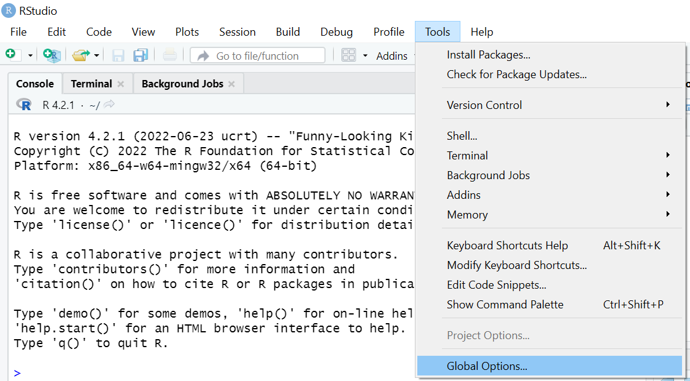
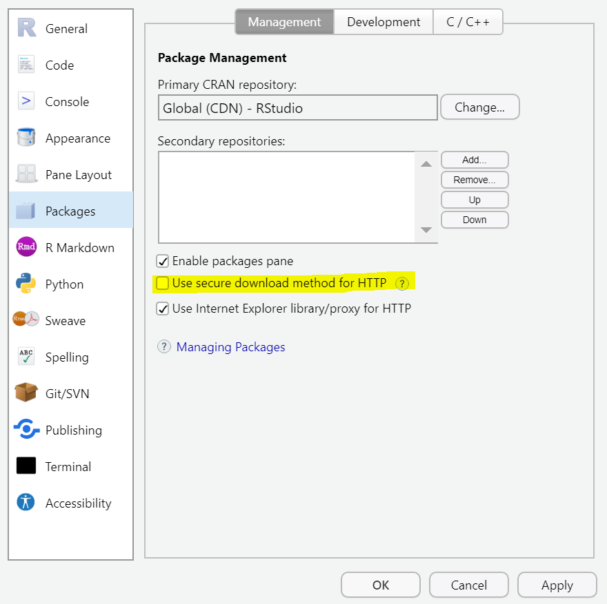
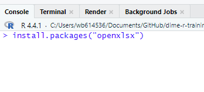
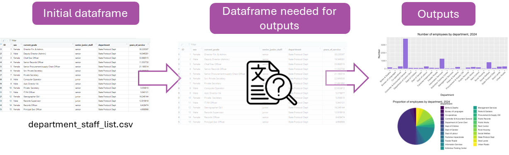
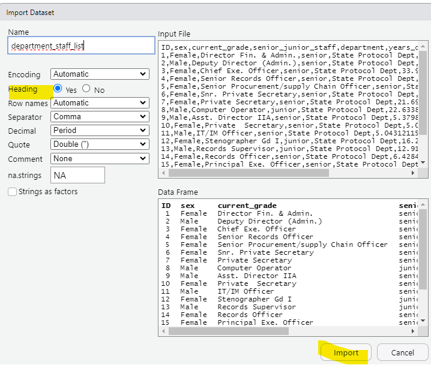
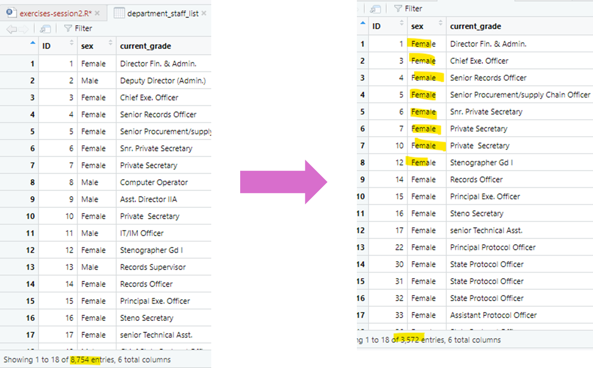
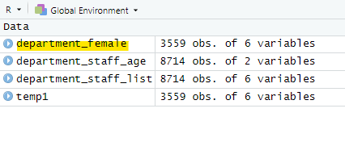
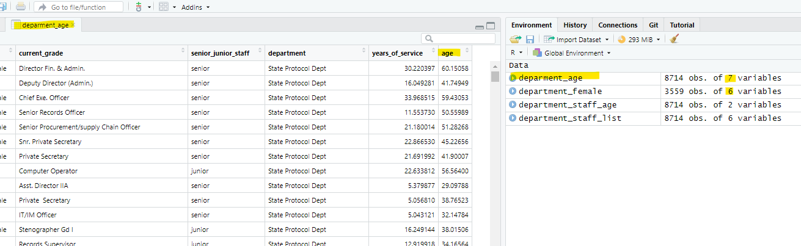
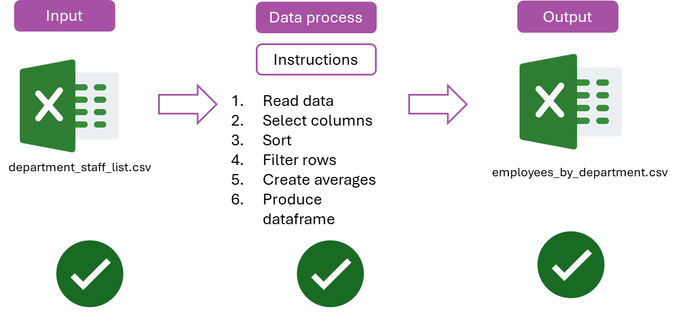

```{r setup, include = FALSE}
# Load packages
library(knitr)
library(xaringanExtra)
library(here)
library(dplyr)
here::i_am("2-data-wrangling.Rmd")
options(htmltools.dir.version = FALSE)
opts_chunk$set(
  fig.align = "center",
  fig.height = 4,
  dpi = 300,
  cache = T
  )
xaringanExtra::use_panelset()
xaringanExtra::use_webcam()
xaringanExtra::use_clipboard()
htmltools::tagList(
  xaringanExtra::use_clipboard(
    success_text = "<i class=\"fa fa-check\" style=\"color: #90BE6D\"></i>",
    error_text = "<i class=\"fa fa-times-circle\" style=\"color: #F94144\"></i>"
  ),
  rmarkdown::html_dependency_font_awesome()
)
xaringanExtra::use_logo(
  image_url = here("img",
                   "session1",
                   "lightbulb.png"),
  exclude_class = c("inverse", 
                    "hide_logo"),
  width = "50px"
)
```

```{r, out.width = "100%", include=T, echo=F}

knitr::include_graphics("img/template.png")


```

```{css, echo = F, eval = T}
@media print {
  .has-continuation {
    display: block !important;
  }
}
```

# Table of contents 

1. [About this session](#about-this-session)
1. [R packages](#r-packages)
1. [Data wrangling](#data-wrangling)
1. [Filtering and sorting](#filtering-sorting)
1. [Merging dataframes](#merging)
1. [Exporting outputs](#exporting-outputs)
1. [Wrapping up](#wrapping-up)
1. [Appendinx](#appendix)

---

class: inverse, center, middle
name: about-this-session

# About this session 

<html><div style='float:left'></div><hr color='#D38C28' size=1px width=1100px></html>

---

# About this session 

```{r echo = FALSE, out.width="90%"}
knitr::include_graphics("img/session2/data-work-script.png")
```

---

# About this session 

```{r echo = FALSE, out.width="90%"}

```

---

class: inverse, center, middle
name: r-packages

# R Packages

<html><div style='float:left'></div><hr color='#D38C28' size=1px width=1100px></html>

---

# R Packages

- Installing R in your computer gives you access to its basic functions

- Additionally, you can also install packages. Packages are a collection of R functions that allow you to do:

  + Operations that basic R functions don't do (example: work with geographic data)
  
  + Operations that basic R functions do, but easier (example: data wrangling)
  
- They contain code that other R users have prepared for the community.

---

# R Packages 

In a nutshell:

```{r echo = FALSE, out.width="90%"}

```

---

# R Packages

## Installing R Packages

- Installing packages is usually simple, but it can be challenging in institutional network connections such as the World Bank.

- The next exercise will set up RStudio so that it can install R Packages without problems

---

# R Packages

## Exercise 1: Setting up the installation of packages

1 - In RStudio, go to `Tools` >> `Global Options...`

```{r echo = FALSE, out.width="60%"}

```

---

# R Packages

## Exercise 1: Setting up the installation of R Packages

.pull-left[
2 - Select `Packages` in the left pane

3 - Uncheck `Use secure download method for HTTP`

4 - Click `OK`

You will not see any changes in your RStudio window after this, but now you'll be able to install packages.
]

.pull-right[
```{r echo = FALSE, out.width="90%"}

```
]

---

# R Packages

We'll use two package in today's session: `dplyr` (really useful library for data wrangling) and `openxlsx` (to work with Excel files)  

## Exercise 2: Installing R Packages

1. Install the R Packages by using `install.packages()`

 + `install.packages("dplyr")`
 + `install.packages("openxlsx")`
 + Note the quotes (`" "`) in the packages names
 + **Introduce this code in the console**, not the script panel

.pull-left[
```{r echo = FALSE, out.width="85%"}

```
]

.pull-right[
```{r echo = FALSE, out.width="85%"}

```
]


---

# R packages 

## Installing packages

```{r echo = FALSE, out.width="95%"}

```

---

# R packages

Now that `dplyr` and `openxlsx ` are installed, we only need to load them to start using the functions they have.

## Exercise 3: Loading packages

.pull-left[
1. Open a new script with `File` >> `New File` >> `R Script`

1. Load the packages with: 

```{r, warning=FALSE, message=FALSE}
library(dplyr)
library(openxlsx)
```

  + Run this code from the new script you just opened
  + Notice that we don't use quotes in the package names this time
]
.pull-right[
```{r echo = FALSE, out.width="90%"}

```
]

---

# R packages 

- Library installation:

```{r echo = FALSE, out.width="37%"}
knitr::include_graphics("img/session2/installation.png")
```

- Library loading:

```{r echo = FALSE, out.width="37%"}
knitr::include_graphics("img/session2/loading.png")
```

- You install R packages only once in your computer

- You load packages every time you open a new RStudio window (only load the packages you will use)

---

class: inverse, center, middle
name: data-wrangling

# Data wrangling 

<html><div style='float:left'></div><hr color='#D38C28' size=1px width=1100px></html>

---

# Data wrangling 

## Getting your data ready

- Data is rarely in a format where it can be converted in an output right away

- In statistical programming, the process of transforming data into a condition where it's ready to be converted into an output is called **data wrangling**

```{r echo = FALSE, out.width="90%"}

```

---

# Data wrangling 

## Getting your data ready

- Data wrangling is one of the most crucial and time-consuming aspects of data work

- It involves not only coding, but also the mental exercise of thinking  what is the shape and condition that your dataframe needs to have in order to produce your desired output

```{r echo = FALSE, out.width="90%"}

```

---

# Data wrangling 

## Getting your data ready

.pull-left[
- As we said before we'll use `dplyr` and `tidyr` for data wrangling in this training

- You can also use basic R, but we recommend these packages because its functions are easier to use
]
.pull-right[
```{r echo = FALSE, out.width="90%"}

```
]

---

# Data wrangling 

## Exercise 4: Loading data

Note that this part of this is the same exercise we did in session 1, but it's okay to repeat it in order to start using a new RStudio session. **If you have RStudio open, start by closing the window and opening RStudio again**.

.pull-left[
1. Inyou new RStudio window, go to `File` > `Import Dataset` > `From Excel` and select again the file `department_staff_list.xslx`

  + if you don't know where the file is, check in the `Downloads` folder
  + if you need to download it again, it's here: https://osf.io/2apht 

1. Make sure to select `Heading` > `Yes` in the next window

1. Select `Import`

1. Download this new file: https://osf.io/v6psa and repeat steps 1-3  with it

]
.pull-right[

```{r echo = FALSE, out.width="85%"}

```
]

---

# Data wrangling 

```{r, echo=FALSE}
department_staff_list <- read.xlsx("data/department_staff_list.xlsx")
department_staff_age <- read.xlsx("data/department_staff_age.xlsx")
```

```{r echo = FALSE, out.width="85%"}

```

---

# Data wrangling 

## Note: loading data with a function

- You can also load Excel data with the function `read.xlsx()` instead of using this point-and-click approach

- The **argument** of `read.xlsx()` is the path in your computer where your data is. For example

```{r, eval=FALSE}
department_staff_list <- read.xlsx("C:/Users/wb614536/Downloads/department_staff_list.xlsx")
```

- As usual, you need to save the result of `read.xlsx()` into a dataframe object with the arrow operator (`<-`) for it to be stored in the environment

---

# Data wrangling 

## Recap: knowing your data

- Dataframe `department_staff_list` is the same dataframe we used last session that contains the data from your department. 

```{r, warning=FALSE, message=FALSE}
glimpse(department_staff_list)
```

---

# Data wrangling 

## Recap: knowing your data

- Now we are introducing a second dataset that only has the ID number (one that I invented), and the age of that person. 

```{r, warning=FALSE, message=FALSE}
glimpse(department_staff_age)
```

---

# Data wrangling 

- We will only use this second dataframe in one of the next exercises, but we load it now because it's in general a good practice to have data loaded into the memory so it's ready to be used.

- For the next exercises, we will face mention scenarios that could show up in doing your annual reports on in day-to-day operations.

---

# The pipe ( %>% ) operator


- Before diving into data wrangling, we will to introduce a **super useful tool**:  
  **the pipe (`%>%`)**.

- The pipe is part of the `dplyr` package. It helps to write code in a way that is easier to read and understand.

- Reading and understanding multiple operations can be difficult.

- The pipe operator (**%>%**) can help with this.  

---

# The pipe operator


- With the pipe, code reads from left to right, top to bottom, which is more intuitive.

- %>% can be read as "then" and simplifies code structure. 

For example let's see at this mock get to work sequence example: 

**Without pipe ( %>% )** (hard to read and understand the sequence)

```{r, eval=FALSE}
go_to_work(make_breakfast(work_out(brush_teeth(wake_up(Mer)))))
```

**With pipe ( %>% )** (the order is clear)

```{r, eval=FALSE}
Mer %>% 
  wake_up() %>%
  brush_teeth() %>%
  work_out() %>%
  make_breakfast() %>%
  go_to_work()
```

---

# The pipe

Normally the functions that we will use are organized around a set of verbs, or actions to be taken. 

--

* Most *verbs* work as follows:


$$\text{verb}(\underbrace{\text{data.frame}}_{\text{1st argument}}, \underbrace{\text{what to do}}_\text{2nd argument})$$

--

* Alternatively you can (**should**) use the `pipe` operator `%>%`:

$$\underbrace{\text{data.frame}}_{\text{1st argument}} \underbrace{\text{ %>% }}_{\text{"pipe" operator}} \text{verb}(\underbrace{\text{what to do}}_\text{2nd argument})$$

We will start using the pipe from this point. Please ask if something is not clear.

**Tip**💡: Use Shift + Ctrl/Cmd + M as a shortcut for the pipe operator.

---

# Questions?


---

class: inverse, center, middle
name: filtering-sorting

# Filtering and sorting 

<html><div style='float:left'></div><hr color='#D38C28' size=1px width=1100px></html>

---

# Filtering and sorting 

```{r echo = FALSE, out.width="85%"}

```


## Data work request

**Scenario 1**: Imagine you want to include in the annual reports, the number of total female employees in the department staff:

---

# Filtering and sorting 

## Data work request

.pull-left[
*We will use the data from our dataframe department_staff_list*
]
.pull-right[
*For this we can filter the Female rows from the sex category*
]

```{r echo = FALSE, out.width="95%"}

```

---

# Filtering and sorting 

## Data work request

Now let's say that we are also interested at a first glance of the females that recently joined the department. We would have to do the following 

1. Keeping only the female employees
1. Sorting by years of service


---

# Filtering and sorting 

## 1. Keeping only the female employees

Use `filter()` for this:

```{r, eval=FALSE}
department_female <- department_staff_list %>% # pipe takes data as first argument "and then"
                          filter(sex == "Female") # we filter by Female
```

Remember that we said we were starting to use the pipe (%>%). The pipe takes our data as the first argument, and then we need to pass only the instruction (filter)

```{r echo = FALSE, out.width="45%"}

```
---

# Filtering and sorting 

## 2. Sorting by years of service

Use the function `arrange()` to sort. Sortings are ascending by default in R (this will get us from less years of service to more years of service). 

```{r eval=FALSE}
department_female <- department_staff_list %>%  
                          filter(sex == "Female") %>% # pipe takes previous instruction "and then"
                          arrange(years_of_service)  # arrange by years of service
                          
```

```{r echo = FALSE, out.width="45%"}

```

---

# Filtering and sorting 

## Exercise 5: Now let's do it.. filter and sort your data

We can write the whole code for this in our exercise script. (You can copy and paste the code below)

1.- Filter by `Female`:

2.- Sort by `years_of_service`:

```{r, eval=FALSE}
department_female <- department_staff_list %>% 
                      filter( sex == "Female") %>% 
                      arrange(years_of_service)
```

---

# Filtering and sorting 

Some notes:

.pull-left[
- `filter()` and `arrange()` are all functions from `dplyr`. Remember you have to always load `dplyr` first with `library(dplyr)` to be able to use them
- The resulting dataframe is `department_female`
]
.pull-right[
```{r echo = FALSE, out.width="95%"}

```
]
---

# Filtering and sorting

- Filtering and sorting are two very common data wrangling operations in statistical programming

- Now we'll review a new data wrangling operation that is also quite common and useful: **mutate**, which basically means creating new variables

---

class: inverse, center, middle
name: mutate

# Mutate

<html><div style='float:left'></div><hr color='#D38C28' size=1px width=1100px></html>

---

# Mutate

- `mutate` will take a statement like this:


```{r, eval=FALSE}
mutate(variable_name = some_calculation)
```

- And attach variable_name at the end of the dataset.

```{r echo = FALSE, out.width="45%"}
knitr::include_graphics("img/session2/mutate.png")
```

---

# Mutate

## Example

Using our data frame let's say that we want to include a variable that for any reason instead of years of service we want days of service. We would do this by doing the following: 

```{r, eval=FALSE}
example_mutate <- department_staff_list %>% 
  mutate(days_of_service = years_of_service*365)
```

We will not use that variable for our datawork examples, but this is a really useful data wrangling function. 

---

class: inverse, center, middle
name: merging

# Merging dataframes

<html><div style='float:left'></div><hr color='#D38C28' size=1px width=1100px></html>

---


# Merging dataframes

Merging data is a common task in data analysis, especially when working with large datasets. 

Let's see how it would apply to our dataframes.

## Data work request

**Scenario 2:**

*Let's imagine that for our annual report we are also interested in the age distribution from the employees*

---

# Merging dataframes

## Data work request

.pull-left[
*Use the data `department_staff_list` that you already know with the department_staff_age*
]
.pull-right[
*We want to include the `age` variable to our dataframe*
]

```{r echo = FALSE, out.width="80%"}

```

---

# Merging dataframes

To do this we will use `left_join()` to merge the dataframes:

- The arguments of the function are 1. our previous selected data (passed by the pipe) and 2. the dataframe we want to merge to the first one

```{r eval=FALSE}
deparment_staff_list_age <- deparment_staff_list %>% # Our original data frame " %>% and then" 
                            left_join(department_staff_age) # our second data frame
```


```{r echo = FALSE, out.width="55%"}

```

---

# Merging dataframes

## Exercise 6: Now let's do it. 

- You can copy and paste the code to your exercise script. 

```{r eval=FALSE}
deparment_age <- department_staff_list %>% # Our original data frame "and then" 
                left_join(department_staff_age) # our second data frame
```
```{r echo = FALSE, out.width="95%"}

```
---

# group_by() and summarize()

We use this when we want to aggregate your data (by groups).

This is one of the most commons operations. Sometimes we want to calculate statistics by groups 

```{r echo = FALSE, out.width="55%"}

```

---

# Grouping and summarizing 

## Data work request

**Let's say that we are interested again in the number of employees by department**

We will use our department_staff_list dataset to do this. 

1. The first step is to define the group, in this case `department`

```{r, eval=FALSE}

employees_by_deparment <- department_staff_list %>% 
  group_by(department)

```

If we **only** do this, this won't do anything, to complete the function we need to use this with `summarise()`

---

# Grouping and summarizing 

## Data work request

summarize works in a similar way to mutate:

```{r, eval=FALSE}
variable_name = some_calculation
```

In this case the `some_calculation` will be to count the number of employees

```{r, warning=FALSE, message=FALSE}
employees_by_deparment <- department_staff_list %>% 
  group_by(department) %>% 
  summarise(number = n()) 
```

---
# Grouping and summarizing 

## Data work request

This will create the following dataframe/table:

```{r, warning=FALSE, message=FALSE, echo=FALSE}
employees_by_deparment
```

---

# More wrangling operations

These were two examples we chose to show different possible data wrangling operations. A summary of these and other common operations are:

| Operation | Function in `dplyr` |
| --------- | ------------------- |
| Subset columns | `select()`|
| Subset rows (based on condition) | `filter()` |
| Create new columns | `mutate()` |
| Create new columns based on condition | `mutate()` and `case_when()` |
| Create new rows | `add_row()` |
| Merge dataframes | `inner_join()`, `left_join()`, `right_join()`, `full_join()` |
| Append dataframes | `bind_rows()` |
| Deduplicate | `distinct()` |
| Collapse and create summary indicators | `group_by()`, `summarize()` |
| Pass a result as the first argument for the next function | `%>%` (operator, not function)|

---

class: inverse, center, middle
name: exporting-outputs

# Exporting outputs 

<html><div style='float:left'></div><hr color='#D38C28' size=1px width=1100px></html>

---

# Exporting outputs 

- Until now, we've seen full examples of part 1 and 2 of the data work pipeline
- What about exporting outputs?

```{r echo = FALSE, out.width="90%"}

```

- We'll see this in the next exercise

---

# Exporting outputs 

## Exporting dataframes

- We can export it as an Excel file with the function `write.xlsx()`

- `write.xlsx()` creates a Excel file with the dataframe

- It takes two basic arguments:

  1. The name of the object you want to export
  1. A file path to export the object to

---

# Exporting outputs 

## Exercise 7: Export `employees_by_deparment` 

1. Use this code to export the results of the last two exercises:

```{r eval=FALSE}
write.xslx(employees_by_deparment,
          "employees_by_deparment",
          row.names = FALSE)
```

---

# Exporting outputs 

Now `employees_by_deparment.xlsx` (probably in your `Documents` folder).

```{r echo = FALSE, out.width="70%"}

```

---

# Exporting outputs 

## Some notes on file paths

- The second argument of `write.xlsx()` specifies the file path we export the dataframe to

```{r eval=FALSE}
write.xslx(employees_by_deparment,
          "employees_by_deparment",
          row.names = FALSE)
```

- You can include any path in your computer and R will write the file in that location

  + For example: `"C:/Users/wb614536/OneDrive - WBG/Desktop`" exports the file to the desktop of my computer (this will not work in other computers)
  
  + Note that file paths in R use forward slashes (`/`). Back slashes (`\`) **do not work in R**

---

# Exporting outputs 

Our data pipeline has been fully implemented at this point. Great!

```{r echo = FALSE, out.width="70%"}

```

---

class: inverse, center, middle
name: wrapping-up

# Wrapping up 

<html><div style='float:left'></div><hr color='#D38C28' size=1px width=1100px></html>

---

# Wrapping up 

## Don't forget to save your work!

- If you haven't, add code comments with `#` to differentiate your solutions for each exercise
- Click the floppy disk to save your work
- Make sure to remember where you're saving your file

```{r echo = FALSE, out.width="55%"}

```

---

# Wrapping up 

## Data work pipeline

```{r echo = FALSE, out.width="85%"}

```

---

# Wrapping up 

## Data work pipeline

```{r echo = FALSE, out.width="85%"}

```


---

class: inverse, center, middle

# Thanks! // ¡Gracias! // Obrigado!

<html><div style='float:left'></div><hr color='#D38C28' size=1px width=1100px></html>
```{r echo = FALSE, out.width="80%"}

```

---

class: inverse, center, middle
name: appendix

# Appendix 

<html><div style='float:left'></div><hr color='#D38C28' size=1px width=1100px></html>

---

# Appendix 

## Keeping only relevant columns

Imaging I only want a list with ID and department. 

Use `select()` for this:

```{r eval=FALSE}
temp1 <- department_staff_list %>% 
          select(ID, department)
```

---

# Appendix 
## Calculating aggregated columns: total and average income

Use `summarize()` combined with `sum()` and `mean()`:

For our current data this does not apply, but this will be really useful for budget dataframes.

This would look something like this

```{r eval=FALSE}
budget_2024 <- budget_data %>% 
                group_by(year, product) %>% 
                summarise(total = sum(income),
                average = mean(income))
```

---

# Useful links 

- **R for Data Science** by Hadley Wickham and Garrett Grolemund  
  - Comprehensive introduction to data wrangling and visualization.  
  - [Read it online for free](https://r4ds.had.co.nz/).  

- **Tidyverse Cookbook**  
  - Practical solutions for common data wrangling tasks.  
  - [Tidyverse Cookbook GitHub](https://github.com/Tidyverse/tidyverse-cookbook).
  
- **Tidyverse Cheat Sheets**  
  - Official cheat sheets for `dplyr`, `tidyr`, and other Tidyverse packages.  
  - [Tidyverse Resources](https://www.tidyverse.org/resources/).  

