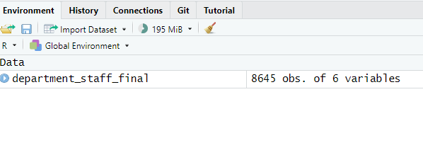

```{r setup, include = FALSE}
# Load packages
library(knitr)
library(xaringanExtra)
library(here)
library(dplyr)
library(modelsummary)
library(huxtable)
library(readxl)
library(kableExtra)
here::i_am("3-descriptive-statistics.Rmd")
options(htmltools.dir.version = FALSE)
opts_chunk$set(
  fig.align = "center",
  fig.height = 4,
  dpi = 300,
  cache = T
  )
xaringanExtra::use_panelset()
xaringanExtra::use_webcam()
xaringanExtra::use_clipboard()
htmltools::tagList(
  xaringanExtra::use_clipboard(
    success_text = "<i class=\"fa fa-check\" style=\"color: #90BE6D\"></i>",
    error_text = "<i class=\"fa fa-times-circle\" style=\"color: #F94144\"></i>"
  ),
  rmarkdown::html_dependency_font_awesome()
)
xaringanExtra::use_logo(
  image_url = here("img",
                   "lightbulb.png"),
  exclude_class = c("inverse", 
                    "hide_logo"),
  width = "50px"
)
```

```{css, echo = F, eval = T}
@media print {
  .has-continuation {
    display: block !important;
  }
}
```

```{r, out.width = "100%", include=T, echo=F}

knitr::include_graphics("img/template.png")


```

# Table of contents 

- [Introduction](#intro)
- [Piping](#piping)
- [Quick summary statistics](#quick-summary-stats)
- [Customized summary statistics](#customized-summary-stats)
- [Exporting table](#exporting-tables)
- [Customizing table outputs](#customiing-table-outputs)
- [Wrapping up](#wrapping-up)

---

class: inverse, center, middle
name: intro

# Introduction 

<html><div style='float:left'></div><hr color='#D38C28' size=1px width=1100px></html>

---

# Introduction 

- We learned yesterday how to conduct statistical programming and export the results in `.csv` files
- However, sometime we might need more refined tables than simple (and ugly) csvs

```{r echo = FALSE, out.width="95%"}
knitr::include_graphics("img/session3/data-work-final-table.png")
```

---

# Introduction 

- That's what today's session is about, along with an introduction of the pipe (`%>%`)

```{r echo = FALSE, out.width="95%"}
knitr::include_graphics("img/session3/data-work-final-table.png")
```

---

# Introduction 

## Relevance to your work

In your **annual reports**, you often include:
- Summary tables like **revenue by year**, **spending across categories**, or **staff counts by department**.
- These tables help summarize key trends and patterns for decision-makers.

```{r echo = FALSE, out.width="45%"}

```

- Today, we will practice **creating similar summary tables** using our staff list data.
- While we’re using a simple dataset today, the same steps can be applied to your own data for reports with many more variables.

---

# Introduction 

## Exercise 1a: Getting the packages for today's session

We're going to use several R packages in this session: `modelsummary`, `huxtable` and ` dplyr` (you already have this). You can download the solutions 3 from the materials package, were I listed all the packages you need to install, and the instructions. You can start with the script as your base for today's exercise. 

1. Install needed packages: (the package modelsummary has many dependencies)

```{r eval=FALSE}
install.packages("modelsummary")
install.packages("huxtable")
install.packages("ggplot2")
install.packages("rstudioapi")
install.packages("openxlsx")
install.packages("dplyr")
```

```{r echo = FALSE, out.width="55%"}

```

## Exercise 1b: Download and load the data we'll use

1. First of all let's open a script. `File`>`New File`>`R Script`

```{r echo = FALSE, out.width="55%"}

```

2. Add the packages we will use today 

```{r, eval=FALSE}
library(modelsummary)
library(huxtable)
library(ggplot2)
library(rstudioapi)
library(openxlsx)
library(dplyr)
```

3. Load the data we will use. (remember our two methods point click and code)

```{r}
department_staff_final <- read.csv("data/department_staff_final.csv")
```

---

# Introduction 

## Exercise 1b: Download and load the data we'll use

.pull-left[
1. Go to https://osf.io/rk9ht and download the file

1. In RStudio, go to `File` > `Import Dataset` > `From Text (base)` and select the file `department_staff_final.csv`

  + If you don't know where the file is, remember to check in your `Downloads` folder

1. Select `Import`
]

.pull-right[
```{r echo = FALSE, out.width="85%"}

```
]

---

# Introduction 

You should have one dataframe loaded in the environment after this.

```{r echo = FALSE, out.width="90%"}

```

---

# Introduction 

## Recap: always know your data!

- This is the data that we created yesterday! (after merging the age data)

```{r, echo=TRUE}
glimpse(department_staff_final)
```

---

class: inverse, center, middle
name: piping

# Piping

<html><div style='float:left'></div><hr color='#D38C28' size=1px width=1100px></html>

---

# The pipe ( %>% ) operator


- Before diving into the contents of today's session, we will to introduce a **super useful tool**:  
  **the pipe (`%>%`)**.

- The pipe is part of the `dplyr` package. It helps to write code in a way that is easier to read and understand.

- Reading and understanding multiple operations can be difficult.

- The pipe operator (**%>%**) can help with this.  

---

# The pipe operator


- With the pipe, code reads from left to right, top to bottom, which is more intuitive.

- %>% can be read as "then" and simplifies code structure. 

For example let's see at this mock get to work sequence example: 

**Without pipe ( %>% )** (hard to read and understand the sequence)

```{r, eval=FALSE}
go_to_work(make_breakfast(work_out(brush_teeth(wake_up(Mer)))))
```

**With pipe ( %>% )** (the order is clear)

```{r, eval=FALSE}
Mer %>% 
  wake_up() %>%
  brush_teeth() %>%
  work_out() %>%
  make_breakfast() %>%
  go_to_work()
```

---

# The pipe

As we saw yesterday the functions are normally organized around a set of verbs, or actions to be taken. 

--

* Most *verbs* work as follows:


$$\text{verb}(\underbrace{\text{data.frame}}_{\text{1st argument}}, \underbrace{\text{what to do}}_\text{2nd argument})$$

--

* Alternatively you can (**should**) use the `pipe` operator `%>%`:

$$\underbrace{\text{data.frame}}_{\text{1st argument}} \underbrace{\text{ %>% }}_{\text{"pipe" operator}} \text{verb}(\underbrace{\text{what to do}}_\text{2nd argument})$$

We will start using the pipe from this point. Please ask if something is not clear.

**Tip**💡: Use Shift + Ctrl/Cmd + M as a shortcut for the pipe operator.

---

# The pipe

- You probably remember this piece of code from one of yesterday's exercise:

```{r eval= FALSE}
# Filter only female employees:
temp1 <-  filter(department_staff_list, sex == "Female") # filter by female

# Sort previous result by years of service
department_female <- arrange(temp1, years_of_service) # order by years of service
```

---

# The pipe

This code works, but the problem with it is that it makes us generate unnecessary intermediate dataframes (`temp1`) that store results temporarily

```{r echo = FALSE, out.width="75%"}

```

---

# The pipe

Instead, we can use pipes to **pass the results of a function and apply a new function on top of it** (just like Mer's waking up sequence)

.pull-left[
```{r eval= FALSE}
# Filter only female employees:
temp1 <-  filter(department_staff_list, sex == "Female") # filter by female

# Sort previous result by years of service
department_female <- arrange(temp1, years_of_service) # order by years of service
```
]

.pull-right[
```{r eval=FALSE}
# The same but with pipes:
department_female <- filter(department_staff_list, sex == "Female") %>% 
                     arrange(years_of_service)
```
]

- The usefulness of the pipe (%>%) becomes more evident when the code starts to get more complicated. 

---

# Piping

.pull-left[
```{r eval= FALSE}
# Filter only female employees:
temp1 <-  filter(department_staff_list, sex == "Female") # filter by female

# Sort previous result by years of service
department_female <- arrange(temp1, years_of_service) # order by years of service
```
]

.pull-right[
```{r eval=FALSE}
# The same but with pipes:
department_female <- filter(department_staff_list, sex == "Female") %>% 
                     arrange(years_of_service)
```
]

There are several important details to notice here:

1.- The resulting dataframe `department_female` is **the same in both cases**

---

# Piping

.pull-left[
```{r eval= FALSE}
# Filter only female employees:
temp1 <-  filter(department_staff_list, sex == "Female") # filter by female

# Sort previous result by years of service
department_female <- arrange(temp1, years_of_service) # order by years of service
```
]

.pull-right[
```{r eval=FALSE}
# The same but with pipes:
department_female <- filter(department_staff_list, sex == "Female") %>% 
                     arrange(years_of_service)
```
]

2.- Notice that the functions `arrange()` and `filter()` used after the pipes now have only **one argument instead of two**. This is because when using pipes the first argument is implied to be result of the function before the pipes

---

# Piping

## Exercise 2: filtering and sorting revisited

1. Apply the same filtering and sorting now with pipes

**Solution**

```{r eval=FALSE}
department_female <- filter(department_staff_final, sex == "Female") %>% 
                     arrange(years_of_service)
```

* Note: that our dataframe now is named `depatment_staf_final` (is the joined dataframe from yesterday's session)

---

# Piping

Now we will not have any annoying intermediate results stored in our environment!

- Good code is code that is both correct (does what it's supposed to) and it's easy to understand

- Piping is **instrumental for writing good code in R**

---

# Piping

## Always use pipes!

Now that you now about the power of the pipes, use them wisely!

.pull-left[
- Remember that pipes are part of the library `dplyr`, you need to load it before using them

- Pipes also improve code clarity drastically

- Many R coders use pipes and internet examples assume you know them

- **We'll use pipes now in the next examples and exercises of the rest of this training**
]

.pull-right[
```{r echo = FALSE, out.width="45%"}
knitr::include_graphics("img/session3/pipes-joke.png")
```
]

---

class: inverse, center, middle
name: quick-summary-stats

# Quick summary statistics 

<html><div style='float:left'></div><hr color='#D38C28' size=1px width=1100px></html>

---

# Quick Summary Statistics  

## Refresher: Grouping and Summarizing Data  

Yesterday, we learned how to:  
1. **Group data** using `group_by()`  
2. **Summarize** results with `summarise()`  

This is a powerful tool to create **summary tables**—such as totals, averages, or counts—that are essential for your annual reports.

### Example  

```{r, eval=FALSE}
# Summarize total revenue by month
summary_table <- psrl_data %>%
  group_by(Month) %>%
  summarise(Total_Revenue = sum(Revenue, na.rm = TRUE))

print(summary_table)
```

---

# Quick summary statistics 

```{r, echo=FALSE, eval=TRUE, include=FALSE}
# Creating a mock PSRL dataset
psrl_data <- data.frame(
  Month = c("Jan-23", "Feb-23", "Mar-23", "Apr-23", "May-23", "Jun-23",
            "Jul-23", "Aug-23", "Sep-23", "Oct-23", "Nov-23", "Dec-23"),
  Diesel = c(120, 130, 125, 140, 150, 155, 160, 170, 165, 180, 190, 200),
  LPG = c(60, 65, 63, 70, 75, 78, 80, 85, 83, 90, 95, 100),
  Petrol = c(100, 105, 110, 115, 120, 125, 130, 135, 140, 145, 150, 155),
  MGO_F = c(30, 35, 33, 40, 42, 45, 50, 48, 47, 55, 58, 60),
  Gas_Oil = c(25, 30, 28, 35, 38, 40, 42, 45, 48, 50, 52, 55),
  Unified_Naphtha = c(15, 18, 20, 22, 24, 26, 28, 30, 32, 35, 38, 40),
  Total = c(350, 383, 379, 422, 449, 469, 490, 513, 515, 555, 583, 610)
)

# View the dataset
print(psrl_data)

```

Applying This to Your Work
.pull-left[
**Annual Report Table**  
  
*Monthly totals for different products.*
]

.pull-right[
**Code to Recreate the Table**  

```{r}
# Summarize all numeric columns by Month
summary_table <- psrl_data %>%
  group_by(Month) %>%
  summarise(across(where(is.numeric), \(x) sum(x, na.rm = TRUE)))

```
]

---

# Quick summary statistics 

```{r}
# Print the summary table
print(summary_table)
```


---

# Quick summary statistics

## Beyond Basic Summaries: Customizing Your Results

We learned yesterday how to produce dataframes with results and export them.

## But what if you want to ... ?

- ...export results in a different format (example: Excel)

- ...further customize which rows and columns to display in a result

- ...format the results you export

---

# Quick summary statistics

## You will need `modelsummary` and `huxtable` for this

- These libraries allow you to export results in a customized way

- We chose a combination of both because together they export a large range of output types and allow fine-grained customization of outputs

```{r echo = FALSE, out.width="95%"}

```

---

# Quick summary statistics

We'll start by introducing the function `datasummary_skim()` from `modelsummary`

.command[
## `datasummary_skim(data, output, ...)`

 * **data:** the data set to be summarized, the only required argument
 * **output:** the type of output desired
 * **... :** additional options allow for formatting customization, such as including notes and titles
]

For example:

```{r, eval = F}
datasummary_skim(
  data,
  output = "default",
  type = "numeric",
  title = NULL,
  notes = NULL,
  ...
)
```

---

# Quick summary statistics

## Exercise 3: Calculate quick summary statistics

1. Load `modelsummary` with `library(modelsummary)`

1. Use `datasummary_skim()` to create a descriptive statistics table for `department_staff`

```{r echo=FALSE}
department_staff <- read.csv("data/department_staff_final.csv")
```

```{r eval=FALSE, warning=FALSE, message=FALSE}
datasummary_skim(department_staff)
```

---

# Quick summary statistics

You should be seeing this result in the lower right panel of RStudio.

```{r echo = FALSE, out.width="55%"}

```

---

# Quick summary statistics

- Most functions of `modelsummary` summarize only numeric variables by default

- To summarize categorical variables, use the argument `type = "categorical"`

```{r eval=FALSE, warning=FALSE, message=FALSE}
datasummary_skim(department_staff, type = "categorical")
```

---

# Quick summary statistics

```{r echo = FALSE, out.width="55%"}

```

---

# Quick summary statistics

- `datasummary_skim()` is convenient because it's fast, easy, and shows a lot of information

- But what if we wanted to customize what to show? that's when we use `datasummary()` instead, also from the library `modelsummary`

---

class: inverse, center, middle
name: customized-summary-stats

# Customized summary statistics

<html><div style='float:left'></div><hr color='#D38C28' size=1px width=1100px></html>

---

# Customized summary statistics

`datasummary()` is very similar to `data_summary_skim()`. The only difference is that it requires a **formula argument**.

.command[
## `datasummary(formula, data, output)`

 * **formula:** a two-sided formula to describe the table as: rows ~ columns
 * **data:** the data set to be summarized
 * **output:** the type of output desired
 * **... :** additional options allow for formatting customization

]

```{r, eval = F}
datasummary(
  var1 + var2 + var3 ~ stat1 + stat2 + stat3 + stat4,
  data = data
)
```

---

# Customized summary statistics

## Exercise 4: 

Create a summary statistics table showing the number of observations, mean, minimum, and maximum for variables `years_of_service` of the dataframe `department_staff`

1. Use `datasummary()` for this:

```{r eval=FALSE}
datasummary(
  years_of_service  ~ N + Mean + Min + Max,
  department_staff
)
```

```{r echo = FALSE, out.width="55%"}

```
---

# Customized summary statistics

```{r eval=FALSE}
datasummary(
   years_of_service  ~ N + Mean + SD + Min + Max, # this is the formula
   department_staff                         # this is the data
)
```

Some notes:

- The arguments **formula** and **data** are mandatory for `datasummary()`
- All other arguments are optional (like `title = *some-title*`, to add a table title)
- The formula should always be defined as: rows ~ columns
- The rows and columns in the formula are separated by a plus (`+`) sign


In Excel ❎ you would need to calculate each of the statistics in a new table, by selecting the data and using the appropriate formula.

---

# Customized summary statistics

```{r eval=FALSE}
datasummary(
  years_of_service  ~ N + Mean + SD + Min + Max, # this is the formula
  department_staff                          # this is the data
)
```

In this exercise we used the statistics N (number of observations), mean, SD (standard deviation), Min (minimum), and Max (maximum). Other statistics you can include are:

| Statistic | Keyword |
| --------- | ------- |
|Median|`Median`|
|25th percentile|`P25`|
|75th percentile|`P75`|
|In general: percentile XX| `PXX`|
|Small histogram|`Histogram`|

---

class: inverse, center, middle
name: exporting-tables

# Exporting tables 

<html><div style='float:left'></div><hr color='#D38C28' size=1px width=1100px></html>

---

# Exporting tables 

Remember that both `datasummary_skim()` and `datasummary()` have an optional argument named *output*? We can  use it to specify a file path for an output file.

For example:

```{r warning=FALSE, message=FALSE}
datasummary_skim(department_staff,
                 output = "quick_stats.docx")
```

Will export the result to the `Documents` folder (in Windows) in a Word file named `quick_stats.docx` 

*Note* for this code to work we would need to install an extra package  `pandoc`

---

# Exporting tables 

The file type of the output is dictated by the file extension. For example:

| File name | File extension | Output type |
| --------- | -------------- | ----------- |
|"quick_stats.docx"|`.docx`|Word|
|"quick_stats.pptx"|`.pptx`|Power Point|
|"quick_stats.html"|`.html`|HTML (to open in a web explorer)|
|"quick_stats.tex"|`.tex`|Latex|
|"quick_stats.md"|`.md`|Markdown|

Noticed that we're missing Excel?

---

# Exporting tables 

## That's because the functions of `modelsummary` can't export to Excel

- Nonetheless, we can use the library `huxtable` as an intermediary to transform results from `modelsummary` functions to Excel files

- `huxtable` is a package for exporting tables in general that allows you to **customize the output you're exporting**

- We'll know how to use it in the next exercise

---

# Exporting tables 

## Exercise 5: Export a table to Excel

1. Load `huxtable` with `library(huxtable)` (we already did this at the beginning of the session)

1. Run the following code to export the result of `datasummary_skim()` to Excel:

```{r eval=FALSE}
# Store the table in a new object
stats_table <- datasummary_skim(department_staff, output = "huxtable")

# Export this new object to Excel with quick_xlsx()
quick_xlsx(stats_table, file = "quick_stats.xlsx")
```

---

# Exporting tables 

Now the result will show in your `Documents` folder

```{r echo = FALSE, out.width="65%"}

```

---

# Exporting tables 

And you can open it with Excel for further customization if you want...

```{r echo = FALSE, out.width="65%"}

```

- However... remember that any manual changes will be hard to track affecting the  reproducibility of your work. 

---

# Exporting tables

```{r eval=FALSE}
# Store the table in a new object
stats_table <- datasummary_skim(department_staff, output = "huxtable")

# Export this new object to Excel with quick_xlsx()
quick_xlsx(stats_table, file = "quick_stats.xlsx")
```

Some comments about this code:

- `quick_xlsx()` is a function from `huxtable`. The first argument is the object we export and the second is the file name. We could also use a file path here

- Note that we now use the argument `output = "huxtable"` in `datasummary_skim()`. This tells R that the output should be an object type that we can operate later with `huxtable` functions, such as `quick_xlsx()`

---

class: inverse, center, middle
name: customizing-table-outputs

# Customizing table outputs 

<html><div style='float:left'></div><hr color='#D38C28' size=1px width=1100px></html>

---

# Customizing table outputs

The code below shows how the table `stats_table` can be formatted:

.pull-left[
```{r eval=FALSE}
# We start with stats_table:
stats_table %>%
  # Use first row as table header
  set_header_rows(1, TRUE) %>%
  # Use first column as row header
  set_header_cols(1, TRUE)  %>%
  # Don't round large numbers
  set_number_format(everywhere, 2:ncol(.), "%9.0f") %>%
  # Center cells in first row
  set_align(1, everywhere, "center") %>%
  # Set a theme for quick formatting
  theme_blue()
```
]

.pull-right[
.small[
```{r echo=FALSE, message=FALSE, warning=FALSE}
stats_table <- datasummary_skim(department_staff, output = "huxtable")

# Format table
 stats_table %>%  
   set_header_rows(1, TRUE) %>% # Use first row as table header 
   set_header_cols(1, TRUE)  %>%  # Use first column as row header 
   set_number_format(everywhere, 2:ncol(.), "%9.0f") %>% # Don't round large numbers  
   set_align(1, everywhere, "center") %>% # Centralize cells in first row 
   theme_blue() # Set a theme for quick formatting 
```
]
]

---

# Customizing table outputs

## Exercise 6: Export a customized table to Excel

.pull-left[
1.- Customize `stats_table` in a new object called `stats_table_custom`

```{r eval = FALSE}
stats_table_custom <- stats_table %>%
  # Use first row as table header
  set_header_rows(1, TRUE) %>%
  # Use first column as row header
  set_header_cols(1, TRUE)  %>%
  # Don't round large numbers
  set_number_format(everywhere, 2:ncol(.), "%9.0f") %>%
  # Center cells in first row
  set_align(1, everywhere, "center") %>%
  # Set a theme for quick formatting
  theme_blue()
```
]

.pull-right[
2.- Export `stats_table_custom` to a file named `stats-custom.xlsx` with `quick_xlsx()`

```{r eval=FALSE}
quick_xlsx(
  stats_table_custom,
  file = "stats-custom.xlsx"
  )
```
]

---

# Customizing table outputs

```{r echo = FALSE, out.width="55%"}

```

---

# Customizing table outputs

Notice that here in the first part of the exercise we stored the result in a new object

```{r eval = FALSE}
stats_table_custom <- stats_table %>%  # <---- here
  set_header_rows(1, TRUE) %>%
  set_header_cols(1, TRUE)  %>%
  set_number_format(everywhere, 2:ncol(.), "%9.0f") %>%
  set_align(1, everywhere, "center") %>%
  theme_blue()
```

This is the object that we export later with `quick_xslx()`

```{r eval=FALSE}
quick_xlsx(
  stats_table_custom,
  file = "stats-custom.xlsx"
  )
```

---

# Customizing table outputs

.pull-left[
**Before:**

```{r echo = FALSE, out.width="95%"}

```
]

.pull-right[
**After:**
```{r echo = FALSE, out.width="95%"}

```
]

---

# Customizing table outputs

We used `theme_blue()`. Other available themes are:

```{r echo = FALSE, out.width="75%"}

```

---

# Use it on your work

### Key Takeaways:
- This was a **basic example** with a few variables from your staff list, but the **possibilities are endless**.
- With this and the contents from yesterday's session, you can create **summaries** of **anything you can think of**.

### Real-World Example:
 **Annual Report: Programmed vs. Billings for 2023 (In GH¢)**

```{r echo = FALSE, out.width="40%"}

```

- If we have the data, you can easily create summaries like this directly in R.
- Once written, the code can be re-used for the next year or quarter.

---

# Questions?


---

class: inverse, center, middle
name: wrapping-up

# Wrapping up 

<html><div style='float:left'></div><hr color='#D38C28' size=1px width=1100px></html>
---

# Wrapping up

## Save your work!

Click the floppy disk to save the script you wrote in this session.

```{r echo = FALSE, out.width="55%"}

```

---

# Wrapping up 

## What else is available?

- This was a short overview of how `modelsummary` and `huxtable` work together to produce professional-looking table outputs in R

- Other formatting options are: (all from `huxtable`)

| Formatting | Command |
|------------|---------|
|Export in new Excel tabs instead of new files|`as_Workbook()`|
|Change row names|`add_rownames()`|
|Change column names|`add_colnames()`|
|Cells in bold|`set_bold()`|
|Cells in italics|`set_italic()`|
|Cell font size|`font_size()`|
|Cell color|`background_color()`|

---

# Wrapping up 

## What else is available?

More of this is explained in the libraries documentation:

  + `modelsummary` documentation: https://modelsummary.com/index.html
  + `huxtable` documentation: https://hughjonesd.github.io/huxtable/
  
---

# Wrapping up 

## This session

```{r echo = FALSE, out.width="95%"}
knitr::include_graphics("img/session3/data-work-descriptive-stats.png")
```

---

# Wrapping up 

## Next session (last one)

```{r echo = FALSE, out.width="95%"}
knitr::include_graphics("img/session4/data-work-data-vis.png")
```

---

class: inverse, center, middle

# Thanks! // ¡Gracias! // Obrigado!

<html><div style='float:left'></div><hr color='#D38C28' size=1px width=1100px></html>
```{r echo = FALSE, out.width="80%"}

```
