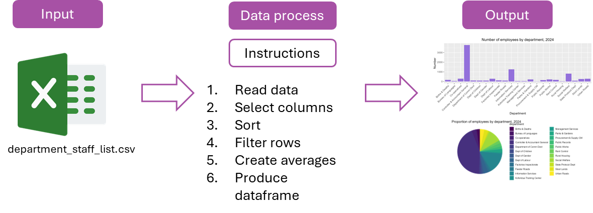
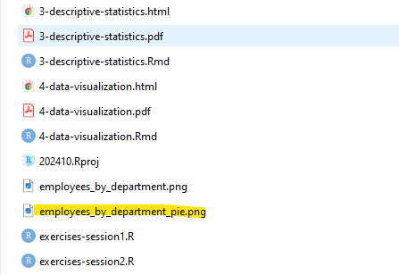

```{r setup, include = FALSE}
# Load packages
library(knitr)
library(xaringanExtra)
library(here)
library(ggplot2)
here::i_am("3-descriptive-statistics.Rmd")
options(htmltools.dir.version = FALSE)
opts_chunk$set(
  fig.align = "center",
  fig.height = 4,
  dpi = 300,
  cache = T
  )
xaringanExtra::use_panelset()
xaringanExtra::use_webcam()
xaringanExtra::use_clipboard()
htmltools::tagList(
  xaringanExtra::use_clipboard(
    success_text = "<i class=\"fa fa-check\" style=\"color: #90BE6D\"></i>",
    error_text = "<i class=\"fa fa-times-circle\" style=\"color: #F94144\"></i>"
  ),
  rmarkdown::html_dependency_font_awesome()
)
xaringanExtra::use_logo(
  image_url = here("img",
                   "lightbulb.png"),
  exclude_class = c("inverse", 
                    "hide_logo"),
  width = "50px"
)
```

```{css, echo = F, eval = T}
@media print {
  .has-continuation {
    display: block !important;
  }
}
```

```{r, out.width = "100%", include=T, echo=F}

knitr::include_graphics("img/template.png")


```

# Table of contents 

- [Introduction](#intro)
- [The grammar of graphics](#grammar-of-graphics)
- [Bar plots](#bar-plots)
- [Pie charts](#pie-charts)
- [Line plots](#line-plots)
- [Wrapping up](#wrapping-up)

---

class: inverse, center, middle
name: intro

# Introduction  

<html><div style='float:left'></div><hr color='#D38C28' size=1px width=1100px></html>

---

# Introduction  

## About this session

```{r echo = FALSE, out.width="80%"}

```

---

# Introduction  

## Data visualization in the data work pipeline

- Compared to other kind of outputs, data visualization involves an extra step after data wrangling: producing the visualization itself

- We also us R code to produce data visualizations

- The input for that code is a wrangled dataframe, dataframe that is ready to be used

```{r echo = FALSE, out.width="70%"}

```

---

# Introduction

## From Your Annual Reports  

In your annual reports, the most common visualizations include:  

1. **Bar Graphs**: Used to compare categories (e.g., spending across departments or revenue by month).  
2. **Pie Charts**: Used to show proportions (e.g., product share, budget breakdown).  

.pull-left[
**Bar Graph Example**  

]

.pull-right[
**Pie Chart Example**  

]

---

# Introduction

## What You Will Learn  

Today, I will teach you how to:  

1. **Recreate these common visualizations** (and more) using code.  
2. Build clean and reproducible charts that you can easily include in your annual reports.  
3. Explore additional visualization techniques to make your data more impactful.  

We will keep using the data we have been using from the beginning to keep this simple, but the code could be recycled to fit the data of your annual reports. 

Let’s get started!  

---

# Introduction  

## Data visualization in R

.pull-left[
- We'll use the package `ggplot2` to create data visualizations

- `ggplot2` greatly facilitates producing plots in R

  + It follows a syntax based on a description of the plot you want to obtain
  
  + This syntax is called **grammar of graphics**, a benchmark method of data visualization definition in statistical programming
]

.pull-right[
```{r echo = FALSE, out.width="70%"}
knitr::include_graphics("img/session4/ggplot2.png")
```
]

---

# ggplot2

```{r echo = FALSE, out.width="70%"}

```

---

class: inverse, center, middle
name: grammar-of-graphics

# The grammar of graphics 

<html><div style='float:left'></div><hr color='#D38C28' size=1px width=1100px></html>

---

# The grammar of graphics

## What is ggplot2?  

- **ggplot2** is a powerful and flexible tool for creating data visualizations in R.  
- It combines **philosophy + functions** into a well-organized framework.  

### Things to Keep in Mind:  
1. ggplot2 may feel like **a lot to learn**, but let's do it step by step. 
2. Today, we’ll cover the basics, but you’ll also get resources to keep exploring on your own.  

---

# The grammar of graphics

## The Structure of ggplot2  

Creating a plot with ggplot2 requires **three basic components**:  

1. **Data**: The dataset you want to visualize.  
2. **Aesthetics (aes)**: How you map your data to visual elements (e.g., x-axis, y-axis, color).  
3. **Geometry (geom)**: The type of plot you want (e.g., bar graph, scatter plot).  

(and many more but we will keep it simple in this presentation)

---

# The grammar of graphics  

## The grammar of graphics in `ggplot2`

I will use the table of employees by department we created in session two to start with this.

You can also download it from here: https://osf.io/th6qk if you don't have it. 

```{r}
employees_by_department <- read.csv("data/employees_by_department.csv")
```


```{r echo = FALSE, out.width="50%"}

```

---

# The grammar of graphics  

## The grammar of graphics in `ggplot2`

```{r echo = FALSE, out.width="70%"}

```

---

# The grammar of graphics  

## The grammar of graphics in `ggplot2`

```{r echo = FALSE, out.width="70%"}

```

---

# The grammar of graphics 

## The grammar of graphics in `ggplot2`

```{r echo = FALSE, out.width="70%"}

```

---

# The grammar of graphics  

## The grammar of graphics in `ggplot2`

```{r echo = FALSE, out.width="70%"}

```

---

# The grammar of graphics 

## The grammar of graphics in `ggplot2`

```{r echo = FALSE, out.width="70%"}

```

---

class: inverse, center, middle
name: bar-plots

# Bar plots  

<html><div style='float:left'></div><hr color='#D38C28' size=1px width=1100px></html>

---

# Bar plots  

## Exercise 1a: Create a basic bar plot

1. Open a new script for this session by clicking on `File` >> `New File` >> `R Script`

1. Load `ggplot2`

```{r eval=FALSE}
library(ggplot2)
```

1. Produce a basic bar plot with the following code:

```{r eval = FALSE}
ggplot(employees_by_department) +
  aes(x = department,
      y = number) +
  geom_col() +
  labs(title = "Number of employees by department, 2024")
```

---

# Bar plots  

```{r echo=FALSE}
employees_by_department <- read.csv("data/employees_by_department.csv")
```

This result should be displayed in the lower right panel of your RStudio window

```{r echo=FALSE, out.width="60%"}
ggplot(employees_by_department) +
  aes(x = department,
      y = number) +
  geom_col() +
  labs(title = "Number of employees by department, 2024")
```

In Excel ❎ you would select the data and insert bar graph. 

---

# Bar plots  

This plot doesn't look great yet!

.pull-left[
- `department` is too crowded as the names are long, but R does not know this. We need to tell R that those labels should be rotated

- We can center the title

- We should add axis labels (instead of just variable names)

- We can add color
]

.pull-right[
```{r echo=FALSE, out.width="100%"}
ggplot(employees_by_department) +
  aes(x = department,
      y = number) +
  geom_col() +
  labs(title = "Number of employees by department, 2024") 
  
```
]

---

# Bar plots  

## Exercise 1b: Improve your bar plot

1. Use the following code to improve the aesthetics of your plot

```{r eval=FALSE}
ggplot(employees_by_department) +
  aes(x = department,
      y = number) +
  geom_col(fill = "#9370DB") + #<< 
  labs(
    title = "Number of employees by department, 2024", # title
    x = "Department",   #<< 
    y = "Number"    #<< 
  ) +
  # Title and subtitles
  theme(
    plot.title = element_text(hjust = 0.5),  #<< 
    axis.text.x = element_text(angle = 45, hjust = 1) #<< 
  )
```

---

# Bar plots 

Now this looks better:

```{r echo=FALSE, out.width="70%"}
ggplot(employees_by_department) +
  aes(x = department,
      y = number) +
  geom_col(fill = "#9370DB") +
  labs(
    title = "Number of employees by department, 2024",
    # x-axis title
    x = "Department",
    # y-axis title
    y = "Number"
  ) +
  # Centering plot title
  theme(
    plot.title = element_text(hjust = 0.5),
    axis.text.x = element_text(angle = 45, hjust = 1) # Rotating x-axis labels
  )
```

---

# Bar plots 

## Exercise 1c: Improve your bar plot

But we can actually make this even better. I would reorder by amount of employees, and add labels. 

```{r, eval=FALSE}
# Create the bar plot
ggplot(employees_by_department) +
  aes(x = reorder(department, -number), y = number) + #<<  # Reorder bars by `number`
  geom_col(fill = "#9370DB") +
    geom_text( #<< 
    aes(label = number), #<< 
    angle = 90 #<< 
  ) + #<< 
  labs(
    title = "Number of employees by department, 2024",
    x = "Department",
    y = "Number"
  ) +
  theme(
    plot.title = element_text(hjust = 0.5),
    axis.text.x = element_text(angle = 45, hjust = 1) # Rotate x-axis labels
  )
```

---

# Bar plots

Now this is ready to be in one of your reports. 

```{r, echo=FALSE}
# Create the bar plot
ggplot(employees_by_department) +
  aes(x = reorder(department, -number), y = number) + #<<  # Reorder bars by `number`
  geom_col(fill = "#9370DB") +
    geom_text( #<< 
    aes(label = number), #<< 
    angle = 90 #<< 
  ) + #<< 
  labs(
    title = "Number of employees by department, 2024",
    x = "Department",
    y = "Number"
  ) +
  theme(
    plot.title = element_text(hjust = 0.5),
    axis.text.x = element_text(angle = 45, hjust = 1) # Rotate x-axis labels
  )
```


---

# Bar plots 

## Exercise 1d: save your plot

Now that your plot looks good, you can save it into an output with `ggsave()`

1. Use this code to save your plot:

```{r eval = FALSE}
ggsave("employees_by_department.png",
       width = 20,
       height = 10,
       units = "cm")
```

---

# Bar plots  

.pull-left[
- `ggsave()` by default saves the last plot your produced

- The first argument in `ggsave()` is the name of the file we save the plot into. We can also use file paths here

- The rest are optional arguments that define the dimensions of the image you export, it's better to define them so the image has the correct proportions and text size
]

.pull-right[
```{r echo = FALSE, out.width="95%"}

```
]

---

# You Did Your First Plot! 🎉  

## The Possibilities Are Endless  

- Congratulations on creating your **first plot**!  
- From here, you can explore countless options to visualize your data:  
  - Bar graphs, line plots, scatterplots, pie charts, and more.  
- Experimentation is key! Don’t be afraid to try new things or make mistakes.  

## You Have the Power 💪  

- Data visualization is a skill that grows with practice.  
- Use online resources and communities like:  
  - [ggplot2 Documentation](https://ggplot2.tidyverse.org/)  
  - [ggplot presentation](https://pkg.garrickadenbuie.com/gentle-ggplot2)

---

# Now the sky is the limit! 🎉  

.pull-center[
  
]

---

class: inverse, center, middle
name: pie-charts

# Pie charts

<html><div style='float:left'></div><hr color='#D38C28' size=1px width=1100px></html>

---

# Pie charts

## From Bar Plots to Pie Charts  

- We just created a **bar plot** to visualize the number of employees by department.  
- Let’s now use the **same data** to create a **pie chart**, a common way to show proportions.  

### Geoms and Graph Types  
Remember: The **geom** controls the type of graph we create.  
- **`geom_col()`**: Creates bar plots.  
- **`geom_bar()`** with **coord_polar()**: Converts data into a pie chart.  

---

# Pie Charts  

## Exercise 2a: Create a Pie Chart  

1. Use the following code to create a pie chart:

```{r, eval=FALSE}
ggplot(employees_by_department) +
  aes(x = "", y = number, fill = department) +
  geom_bar(stat = "identity", width = 1) +
  coord_polar(theta = "y") +
  labs(
    title = "Proportion of employees by department, 2024"
  ) +
  theme_void()
```
---

# Pie chart

You should see this on your Plots panel.

```{r, echo=FALSE, out.width="60%"}
ggplot(employees_by_department) +
  aes(x = "", y = number, fill = department) +
  geom_bar(stat = "identity", width = 1) +
  coord_polar(theta = "y") +
  labs(
    title = "Proportion of employees by department, 2024"
  ) +
  theme_void()
```

---

# Pie chart

## Exercise 2b

The chart is alright, but we can customize it further.. What about changing the colors? 


```{r, eval=FALSE}
ggplot(employees_by_department) +
  aes(x = "", y = number, fill = department) +
  geom_bar(stat = "identity", width = 1) +
  coord_polar(theta = "y") +
  labs(
    title = "Proportion of employees by department, 2024"
  ) +
  theme_void() +
  scale_fill_viridis_d(option = "D") #<<
```

---

# Pie chart

## Exercise 2c

Now this is ready to go into our report, so let's save it. 

```{r, echo=FALSE, out.width="60%"}
ggplot(employees_by_department) +
  aes(x = "", y = number, fill = department) +
  geom_bar(stat = "identity", width = 1) +
  coord_polar(theta = "y") +
  labs(
    title = "Proportion of employees by department, 2024"
  ) +
  theme_void() +
  scale_fill_viridis_d(option = "D") #<<
```


---

# Pie chart

## Exercise 2c

Now this is ready to go into our report, so let's save it. 

```{r, eval=FALSE}
ggsave("employees_by_department_pie.png")
```

```{r echo = FALSE, out.width="40%"}

```


---

class: inverse, center, middle
name: line-plots

# Line plots 

<html><div style='float:left'></div><hr color='#D38C28' size=1px width=1100px></html>

---

# Line plots 

Another Common Plot: Line Plots  

- **Line plots** are commonly used to show **trends over time** or changes across a sequence.  
- Examples include visualizing **monthly sales**, **yearly growth**, or **temperature changes**.  


**Description**  
- Each point represents a value at a specific time.  
- Lines connect the points to show a continuous trend.  


---

# Line plots 
.pull-left[
**Code Example**  

```{r, eval=FALSE}
library(ggplot2)

# Using built-in `economics` dataset from ggplot2
ggplot(economics) +
  aes(x = date, y = unemploy) +
  geom_line(color = "#9370DB", size = 1) +
  labs(
    title = "Unemployment Over Time",
    x = "Date",
    y = "Number of Unemployed"
  ) +
  theme_minimal()
```
]

.pull-right[
**Output Example**  

```{r, echo=FALSE, warning=FALSE, message=FALSE}
library(ggplot2)

# Using built-in `economics` dataset from ggplot2
ggplot(economics) +
  aes(x = date, y = unemploy) +
  geom_line(color = "#9370DB", size = 1) +
  labs(
    title = "Unemployment Over Time",
    x = "Date",
    y = "Number of Unemployed"
  ) +
  theme_minimal()
```
]


---

class: inverse, center, middle
name: wrapping-up

# Wrapping up  

<html><div style='float:left'></div><hr color='#D38C28' size=1px width=1100px></html>

---

# Wrapping up  

## More in `ggplot2` 

This table lists several of the most popular encoding types in `ggplot2`. Also see more [here](https://ggplot2.tidyverse.org/reference/)

| Encoding | Function in `ggplot2` |
| -------- | --------------------- |
| Bars | `geom_col()` |
| Lines | `geom_line()` |
| Points (scatterplot) | `geom_point()` |
| Area | `geom_area()` |
| Histogram | `geom_histogram()` |
| Floating labels (texts) | `geom_text()` |
| Box plot | `geom_boxplot()` |
| Pie chart | `geom_bar() + coord_polar()` |
| Smoothed line | `geom_smooth()` |

---

# Wrapping up 

## Save your code!

Click on the floppy disk to save your code in a location that you will remember.

```{r echo = FALSE, out.width="55%"}

```

---

# Wrap-Up: Looking Ahead 🚀  

## Key Takeaways  

- Today, you learned how **data + code** can create powerful visualizations and tables for your annual reports.  
- **Why this matters:**  
   - Code is **reusable**: Use it for next quarters or years without starting from scratch.  
   - Code is **transparent**: Everyone can see and verify all the calculations.  

---

# Wrap-Up: Looking Ahead 🚀  

## From Data to Annual Reports  

.pull-center[
**Data + Code** → **Annual Report**  
  
*Reproducible workflows save time and improve accuracy.*  
]

## What’s Next?  

- **Tomorrow**: Bring your own data, graphs, or tables.  
   - We’ll have a **long hands-on session** where you can:  
     - Ask questions about how to code specific visualizations or tables.  
     - Work with your own data to make real progress.  

---

# Wrap-Up: Looking Ahead 🚀  

## Final Thoughts 💡  

- This is **new and challenging**, but it’s also incredibly **powerful** and **useful**.  
- The only way to get better is to **keep practicing**.  
- Experiment, google/chatgpt-it, ask questions, and remember—this will make your reports clearer, faster, and less error-prone!  

Keep going—you’ve got this! 


---

class: inverse, center, middle

# Thanks! // ¡Gracias! // Obrigado!

<html><div style='float:left'></div><hr color='#D38C28' size=1px width=1100px></html>
```{r echo = FALSE, out.width="60%"}
knitr::include_graphics("img/session4/welcome-r.png")
```

---

# Resources for Data Visualization 📚  

## Learn More About ggplot2  

- **ggplot2 Documentation**  
  [ggplot2.tidyverse.org](https://ggplot2.tidyverse.org)  

- **R Graphics Cookbook** (Online resource for practical examples)  
  [r-graphics.org](https://r-graphics.org)  

- **R for Data Science**: Chapter on Data Visualization  
  [r4ds.had.co.nz](https://r4ds.had.co.nz/data-visualisation.html)  

- **ggplot2 Cheatsheet** (Quick reference for all functions)  
  [Download the cheatsheet here](https://github.com/rstudio/cheatsheets/raw/main/data-visualization-2.1.pdf)  