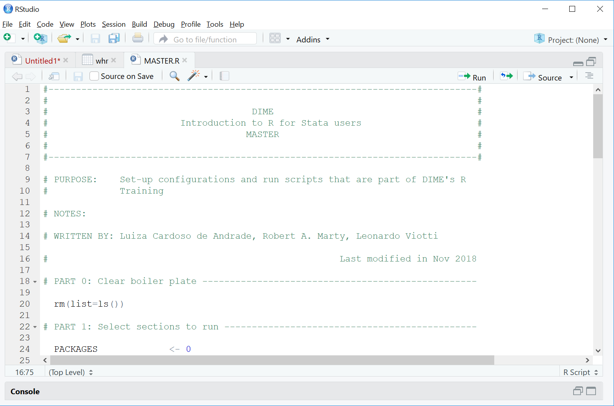
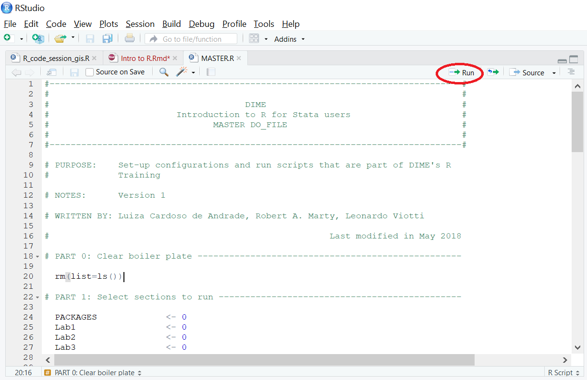
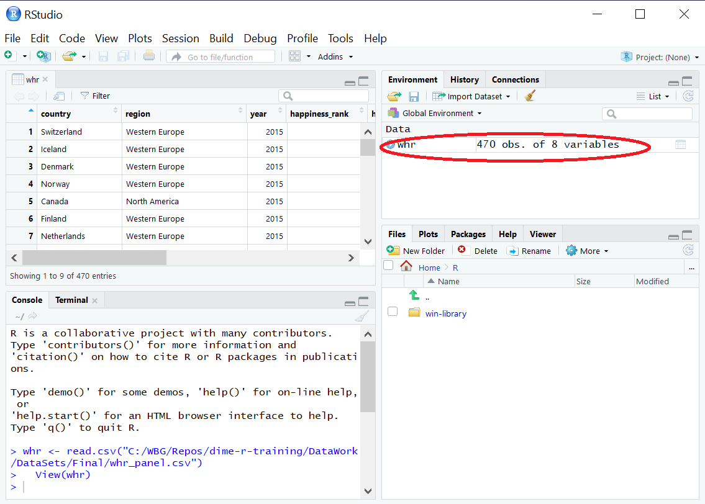
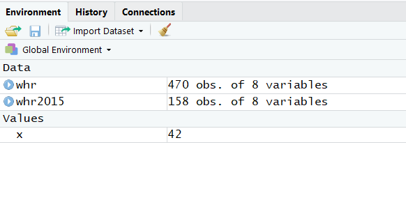
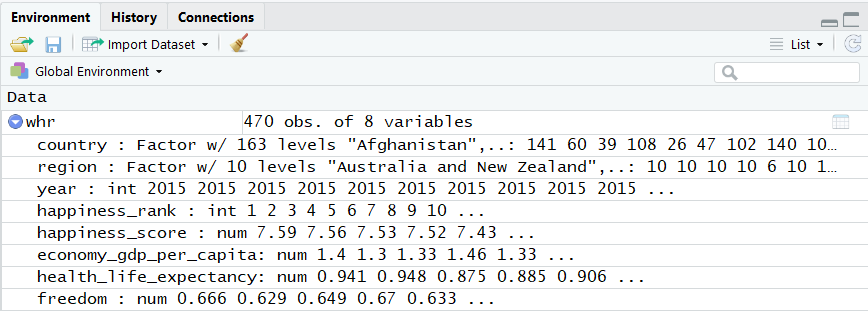

```{r setup, include=FALSE}
options(htmltools.dir.version = FALSE)
library(knitr)
opts_chunk$set(
  fig.align="center",  
  fig.height=4, #fig.width=6,
  # out.width="748px", #out.length="520.75px",
  dpi=300, #fig.path='Figs/',
  cache=T#, echo=F, warning=F, message=F
  )
library(tidyverse)
library(hrbrthemes)
library(fontawesome)
library(xaringanExtra)
xaringanExtra::use_panelset()
```

```{r xaringan-logo, echo=FALSE}
xaringanExtra::use_logo(
  image_url = "img/lightbulb.png",
  exclude_class = c("inverse", "hide_logo"),
  width = "50px"
)
```

```{r, echo = F, eval=T}

# Load the package than contains ToothGrowth dataset
library(datasets)

# File paths

if (Sys.getenv("USERNAME") == "luis_eduardo"){
  projectFolder  <- "/home/luis_eduardo/cs_projects/dime-r-training"
  
}

if (Sys.getenv("USERNAME") == "WB532468"){
  projectFolder  <- "C:/WBG/Repos/dime-r-training"
  
}

if (Sys.getenv("USERNAME") == "WB501238"){
  projectFolder  <- "C:/Users/WB501238/Documents/GitHub/dime-r-training"
  
}

if (Sys.getenv("USERNAME") == "Leonardo"){
  projectFolder  <- "C:/Users/Leonardo/Documents/GitHub/dime-r-training"

}

if (Sys.getenv("USERNAME") == "wb519128"){
  projectFolder <- file.path("C:/Users/WB519128/Documents/GitHub/dime-r-training")
}

if (Sys.getenv("USERNAME") == "maximiliano"){
  projectFolder <- file.path("D:/Documents/RA Jobs/DIME/trainings/dime-r-training")
}

# File paths
  dataWorkFolder    <- file.path(projectFolder,"DataWork")
  Data              <- file.path(dataWorkFolder,"DataSets")
  finalData         <- file.path(Data,"Final")
  
# Load CSV data
# lwh <- read.csv(file.path(finalData,"lwh_clean.csv"), 
#                 header = T)

whr <- read.csv(file.path(finalData,"whr_panel.csv"), 
                header = T)

```

```{css, echo = F, eval = T}
@media print {
  .has-continuation {
    display: block !important;
  }
}
```

# Table of contents

1. [Installation](#installation)
2. [Introduction](#introduction)
3. [Getting started](#getting-started)
4. [Data in R](#data-in-r)
5. [Functions](#functions)
6. [R objects](#r-objects)
7. [Basic types of data](#basic-types-of-data)
8. [Advanced types of data](#advanced-types-of-data)
9. [Help, Google, and Stack Overflow](#help-google-and-stack-overflow)
10. [Useful resources](#useful-resources)
11. [Appendix](#appendix)

---

# Sessions format

## Welcome!

We're glad you're joining us today!

## Format

- These are hands-on sessions. You are strongly encouraged to __follow along in your computer__ what the presenter is doing

- The sessions include exercises where we give 1-2 minutes to solve them. Then, the presenter will call names to discuss what you did and which issues you encountered

  + If you prefer not to be called or have connectivity issues which prevent participation, please let us know by sending a private message to __Luiza Cardoso De Andrade__

- Every session has two TAs. For this session, our TAs are __Luiza Cardoso De Andrade__ and __Rony Rodriguez Ramirez__

---

# Sessions format

## Format

- The TAs will help you troubleshooting __particular issues__ which make you unable to follow along the presentation. Send them a private message whenever you need help

- Otherwise, if you have a __general question__ feel free to unmute yourself or use the chat to ask it

- Please mute your microphone the rest of the time

- If your connection is good enough, please leave your video on

- The materials of each session will be shared in the OSF page on the course after the end of each session: https://osf.io/b7hm6/

---

class: inverse, center, middle
name: installation

# Installation

<html><div style='float:left'></div><hr color='#D38C28' size=1px width=1100px></html>

---
# Installation

## Installation

This training requires that you have R and RStudio installed in your computer:

### Instructions

 * Please visit (https://cran.r-project.org) and select a Comprehensive R Archive Network (CRAN) mirror close to you.

 * If you're in the US, you can directly visit the mirror at Berkeley University at (https://cran.cnr.berkeley.edu).

 * To install RStudio, go to https://www.rstudio.com/. Note that you need to install R first.

---

class: inverse, center, middle
name: introduction

# Introduction

<html><div style='float:left'></div><hr color='#D38C28' size=1px width=1100px></html>

---

# Introduction

These training sessions will offer an introduction to R, its amazing features and how Stata users can adapt from using Stata to using R.

This first session will present the basic concepts you will need to use R.

The next sessions will include:

* __Introduction to R - part II__

* __Data processing__

* __Data visualization__

* __Exploratory analysis__

* __Geospatial data and geospatial analysis in R__

For the most recent versions of these trainings, visit the R-training GitHub repository at
https://github.com/worldbank/dime-r-training

---

# Introduction

## R vs Stata

* R is object oriented while Stata is action oriented:
  + Classic example: Stata's `summarize()` vs R's `summary()`
  + In Stata you declare what you want to do, while in R you usually declare the result you want to get

* R needs to load non-base commands (packages) at the beginning of each session
  + Imagine that in Stata you'd have to load a command installed with `ssc install` every time you'll use it in a new session

* R is less specialized, which means more flexibility and functionalities.

* R has a much broader network of users:
  + More resources online, which makes using Google a lot easier. You'll never want to see Statalist again in your life!
  + Development of new features and bug fixes happen faster.

---

# Introduction

Some possible disadvantages of R vs Stata:

* Higher cost of entry than Stata for learning how to use it.

* Stata is more specialized:
  + Certain common tasks are simpler in Stata. For example:
    * Running a regression with clustered standard errors
    * Analyzing survey data with weights

* Stata has wider adoption among micro-econometricians (though R adoption is steadily increasing).
  + Network externalities in your work environment.
  + Development of new specialized techniques and tools could happen faster (e.g. *ietoolkit*).

---

# Introduction

Here are some advantages:

* R is a free and open source software!

* It allows you to have several datasets open simultaneously.
  + No need to use `keep`, `preserve`, `restore`

* It can run complex Geographic Information System (GIS) analyses.

* You can use it for web scrapping.

* You can run machine learning algorithms with it.

* You can create complex Markdown documents. This presentation, for example, is entirely done in RStudio.

* You can create interactive dashboards and online applications with the Shiny package.

---

# Introduction

But Python is even more flexible and has more users than R, so why should I learn R?

* Despite being super popular for data science, Python has fewer libraries developed for econometrics.

* Python is a bit harder to set up and get started.

* It can be a harder to find help only for statistics and econometrics in Python than in R, especially for beginners.

---

class: inverse, center, middle
name: getting-started

# Getting started

<html><div style='float:left'></div><hr color='#D38C28' size=1px width=1100px></html>

---

# Getting started - RStudio interface

```{r echo = FALSE, out.width = "70%"}
knitr::include_graphics("img/Interface.png")
```

---

# Getting started - RStudio interface

```{r echo = FALSE, out.width = "70%"}

```

---

# Getting started - RStudio interface

```{r echo = FALSE, out.width = "70%"}

```
---

# Getting started - RStudio interface

```{r echo = FALSE, out.width = "70%"}
knitr::include_graphics("img/scritpt3.png")
```

---

# Getting started - RStudio interface

```{r echo = FALSE, out.width = "70%"}
knitr::include_graphics("img/scritpt4.png")
```

---

# Getting started - Importing data

Let's start by loading the data set we'll be using:

## Exercise 1: Import data

1. Go to the OSF page of the course (https://osf.io/b7hm6/) and download the file located in `DataWork/DataSets/Final/whr_panel.csv`

2. In RStudio, go to `File > Import Dataset > From Text (base)` and open the `whr_panel.csv` file. 
  + Depending on your Rstudio version, it might be `File > Import Dataset > From CSV`

3. The file should be in `GitHub/dime-r-training/DataWork/DataSets/Final/whr_panel.csv`.

4. Assign the name `whr` to the dataset on the import window.

---

# Getting started - Importing data

```{r echo = FALSE, out.width = "50%"}
knitr::include_graphics("img/import_data1.png")
```

---

# Getting started - Importing data

```{r echo = FALSE, out.width = "50%"}
knitr::include_graphics("img/import_data2.png")
```

---

# Getting started - RStudio interface

```{r echo = FALSE, out.width = "70%"}

```

---

class: inverse, center, middle
name: data-in-r

# Data in R

<html><div style='float:left'></div><hr color='#D38C28' size=1px width=1100px></html>

---

# Data in R

In __Stata__:

* You can open __one dataset__ and perform operations that can change that dataset.

* You can also have other things, such as matrices, macros and tempfiles, but they are secondary. __Most functions only use the main dataset__.

* If you wish to do any non-permanent changes to your data, __you'll need to preserve the original data to keep it intact__.

---

# Data in R

__R__ works in a completely different way: 
 
* You can have __as many datasets (objects) as you wish__ or your computer's memory allows.

* Operations will have lasting effects __only if you store them__.

---

# Data in R

* Everything that exists in R's memory -- variables, datasets, functions -- __is an object__.

* You could think of an object like a chunk of data with some properties that has a name by which you call it.

* If you create an object, it's going to be stored in memory until you delete it or quit R.

* Whenever you run anything you intend to use in the future, __you need to store it as an object__.

---

# Data in R

To better understand the idea, we're going to use the data we opened from the United Nations' World Happiness Report.

First, let's take a look at the data.

Type the following code to explore the data:
```{r, include = T, results = "hide"}

# We can use the function View() to browse the whole data
View(whr)

# Alternatively we can print the first 6 obs. with head()
head(whr)

```

---

# Data in R

```{r echo = FALSE, out.width = "70%"}
knitr::include_graphics("img/View.png")
```

---

# Data in R

```{r, include = T}

head(whr)

```

---

# Data in R

Now, let's try some simple manipulations. First, assume we're only interested in data of the year 2015.

## Exercise 2: Subset the data 

1. Subset the data set, keeping only observations where variable `year` equals `2015`.

```{r, eval=FALSE}
# To do that we'll use the subset() function
subset(whr, year == 2015)

```

2. Then, look again at the first 6 observations
```{r, include = T, results = "hide"}
# Use the head() function again
head(whr)
```

#### Important: Always write your code in the script window and run it from there

---

# Data in R

```{r, eval = F}
head(whr)
```

```{r, echo = F}
# Use the head() function again
head(whr)
```

---

# Data in R

We can see that nothing happened to the original data. This happens because we didn't store the edit we made anywhere.

### To store an object, we use the assignment operator (`<-`):

```{r, include = T, results = "hide"}
# Assign the Answer to the Ultimate Question of Life, 
# the Universe, and Everything
x <- 42
```

From now on, `x` is associated with the stored value (until you replace it, delete it, or quit the R session).

```{r echo = FALSE, out.width = "40%"}
knitr::include_graphics("img/x_42.png")
```

---

# Data in R

## Exercise 3: Create an object

Create a new dataset, called `whr2015`, that is a subset of the `whr` data set containing only data from the year 2015.

```{r, include = T, results = "hide"}
# Using the same function but now assigning it to an object
whr2015 <- subset(whr, year == 2015)

# Display the 5 first obs. of the new data
head(whr2015)

# Notice that we still have the original data set intact
head(whr)

```

---

# Data in R

```{r, eval= F}
head(whr2015)
```

```{r, echo= F}
# Use the head() function again
head(whr2015)
```

---

# Data in R

```{r, eval= F}
head(whr)
```

```{r, echo= F}
# Use the head() function again
head(whr)
```

---

# Data in R

You can also see that your environment pane now has two `Data` objects:



---

# Data in R

### Important concepts to take note:

* In R, if you want to change your data, you need to __store it in an object__.

* It is possible to simply replace the original data. This happens if you assign the new object to the same name as the original.
 
 ```{r, eval = F}
 # This would have replaced "whr" instead of creating a new object:
 whr <- subset(whr, year == 2015)
 ```

* Print (display) is built into R. If you execute any action without storing it, R will simply __print the results of that action__ but won't save anything in the memory.

```{r, eval = F}
# For instance, this will only print the observations that meet the specified condition:
subset(whr, year == 2016)

# To actually store the result, we would need to assign it to an object:
whr2016 <- subset(whr, year == 2016)

```

---

class: inverse, center, middle
name: functions

# Functions

<html><div style='float:left'></div><hr color='#D38C28' size=1px width=1100px></html>

---

# Functions

## Quick intro to functions

`head()`, `View()`, `subset()` and`read.csv()` are functions!

* Functions in R take named arguments (unlike in Stata that you have arguments and options).

* Usually the first argument is the object you want to use the function on, e.g. `subset(whr, ...)`

* Functions usually return values that you can store in an object, print or use directly as an argument of another function.

We will explore these ideas in depth in the next session.

---

class: inverse, center, middle
name: r-objects

# R objects

<html><div style='float:left'></div><hr color='#D38C28' size=1px width=1100px></html>

---

# R objects

Objects are the __building blocks of R programming__. This section will explore some of the most common classes, with a focus on data structures.

This will give you the foundation to explore your data and construct analytical outputs.

---

# R objects

## What is an object?

* An object is like a global or local in Stata, it's __something you can refer to later__ in your code to get a value.

* But while you can only put a number or a string in a global, __you can put anything into an object__: scalars, strings, datasets, vectors, plots, functions, etc.

* Objects also have attributes that can be used to manipulate it.

---

# R objects

Here are the object classes we will cover in this first session:

* __Vectors:__ an uni-dimensional object that __stores a sequence of values of the same class__

* __Data frames:__ a combination of different vectors of the same length (the same as your dataset in Stata)

* __Lists:__ a multidimensional object that can store several objects __of different classes and dimensions__

---

# R objects - Vectors

## Vectors

A vector is an uni-dimensional object composed by one or more elements of the same type.

#### Use the following code to create vectors in two different ways
```{r}
# Creating a vector with the c() function
v1 <- c(1,2,3,4,5)

# Alternative way to create an evenly spaced vector
v2 <- 1:5

```

#### You can use brackets for indexing
```{r}
# Print the 4th element of the vector
v2[4]
```

---

# R objects - Vectors

## Vectors

To R, each of the columns of the object `whr` is a vector.

#### Calling a vector from a `data.frame` column
We use the `$` character to call vectors (variables) by their names in a `data.frame`

#### Type the following code:
```{r}
# Create a vector with the values of the "year" variable
year_vector <- whr$year

# See the 3 first elements of the year column
whr$year[1:3]

```

---

# R objects - Data frames

## Data frames

The `whr` and `whr2015` objects are both data frames. You can also construct a new data frame from scratch by __combining vectors with the same number of elements__.

#### Now, type the following code to create a new data frame
```{r}
# Dataframe created by biding vectors
df1 <- data.frame(v1,v2)
df1
```

---

# R objects - Data frames

## Data frames

Since a data frame has two dimensions, you can use indices for both. The first index indicates the row selection and the second indicates the column.

### Numeric indexing
```{r, eval = F}
# The first column of whr
whr[,1]

# The 45th row of whr
whr[45,]

# Or the 45th element of the first column
whr[45,1]

```

---

# R objects - Data frames

## Data frames

Alternatively, you can use the column names for indexing, which is the same as using the `$` sign.

### Names indexing
```{r}
# The 22th element of the country column
whr[22,"country"] # The same as whr$country[22]

```

---

# R objects - Lists

## Lists

Lists are more complex objects that can contain many objects __of different classes and dimensions__.

The outputs of many functions, a regression for example, are similar to lists.

It would be beyond the scope of this introduction to go deep into them, but here's a quick example:

### Combine several objects of different types in a list
```{r, include = T, results = "hide"}
# Use the list() function
lst <- list(v1, df1, 45)

```
Print the list yourself to see how it looks like.

---

# R objects - Lists

## Lists

```{r}
# Check the contents of lst
print(lst)
```

---

class: inverse, center, middle
name: basic-types-of-data

# Basic types of data

<html><div style='float:left'></div><hr color='#D38C28' size=1px width=1100px></html>

---

# Basic types of data

R has different kinds of data that can be recorded inside objects. They are very similar to what you have in Stata, and the main types are string, integer, numeric, factor and boolean.

Let's start with the simpler ones:

## Strings
A sequence of characters that are usually represented between double quotes. They can contain single letters, words, phrases or even some longer text.

## Integer and numeric
As in Stata, there are two different ways to store numbers. They are different because they use memory differently. As default, R stores numbers in the numeric format (double).

---

# Basic types of data

## Strings

Now we'll use string data to practice some basic object manipulations in R.

### Exercise 4: Create a vector of strings
Create a string vector containing the names of commonly used statistical software in order of importance:
```{r, include = T, results = "hide"}

# Creating string vector
str_vec <- c("R",
             "Python",
             "SAS",
             "Excel",
             "Stata")
```
Now print them to check them out.

---

# Basic types of data

## Strings

### Exercise 5: Concatenate strings
 1. Create a scalar (a vector of one element) containing the phrase "is cooler than" and call it `str_scalar`.

 2. Use the function `paste()` with 3 arguments separated by commas:
  + The first argument as the 1st element of `str_vec`.
  + The second argument as the `str_scalar`.
  + The third argument as the 5th element of `str_vec`.

 3. If you're not sure where to start, type:
```{r, eval=FALSE}
help(paste)
```

---

# Basic types of data

## Strings

```{r}
### Using the paste function to combine strings

# Scalar
str_scalar <- "is cooler than"

# Using the paste() function
paste(str_vec[1], str_scalar, str_vec[5])
```

---

class: inverse, center, middle
name: advanced-types-of-data

# Advanced types of data

<html><div style='float:left'></div><hr color='#D38C28' size=1px width=1100px></html>

---

# Advanced types of data

R also has other more complex ways of storing data. These are the most used:

## Factors
Factors are __numeric categorical values with text labels__, equivalent to labeled variables in Stata. Turning strings into factors makes it easier to run different analyses on them and also uses less space in your memory.

## Booleans
Booleans are __logical binary variables__, accepting either `TRUE` or `FALSE` as values. They are automatically generated when performing logical operations.

---

# Advanced types of data

## Factors

In `whr`, we can see that `country` and `region` are factor variables. In your environment panel you can see the information about the types of every variable in the `whr` dataframe, and for factors you can see the number of levels (unique values).



---

# Advanced types of data

## Factors

We'll learn how to deal with factors in detail on the next session, since they are very important for the kind of analysis we usually do. For now, here are two important things to keep in mind when using them.

Unlike Stata, in R:

1. __You use the labels to refer to factors__

2. __You cannot choose the underlying values__

---

# Advanced types of data

## Booleans

Boolean data is the result of logical conditions. It can take two possible values: `TRUE` or `FALSE`.

* Whenever you're using an `if` statement in Stata, you're implicitly using boolean data. 
* One difference is that in R, this can be done in 2 steps.
* Another difference is that in R you can assign a boolean value to an object:

```{r}
# Storing boolean values:
boolean_true  <- TRUE
boolean_false <- FALSE
```

```{r}
# Printing the objects:
boolean_true
boolean_false
```

---

# Advanced types of data

## Booleans

### Exercise 6:
Create a boolean vector with the condition of annual income below average:
```{r}
# Create vector
bool_vec <- whr$happiness_score < mean(whr$happiness_score)

# See the 6 first elements of the vector
head(bool_vec)
```

---

# Advanced types of data

## Booleans

Now let's use the boolean vector created to add a dummy variable in the `whr` data set for the same condition.

### Exercise 7:
 * Create a column in `whr` containing zeros and call it `rank_low`. You can do this by typing:

```{r,  eval = T}
whr$rank_low <- 0
```

 * Now use `bool_vec` to index the lines of the `income_low` column and replace all observations that meet the condition with the value 1.

```{r,  eval = F}
whr$rank_low[bool_vec] <- 1
```

---

# Advanced types of data

## Booleans

Instead of indexing the lines with the boolean vector `bool_vec`, we could also use the boolean condition itself:

```{r}

# Replace with 1 those obs that meet the condition
whr$rank_low [bool_vec] <- 1 
# is the same as
whr$rank_low [whr$happiness_score < mean(whr$happiness_score)] <- 1 
# This in stata would be
# gen     rank_low = 0
# replace rank_low = 1 if (...)
```

---

class: inverse, center, middle
name: help-google-and-stack-overflow

# Help, Google and Stack Overflow

<html><div style='float:left'></div><hr color='#D38C28' size=1px width=1100px></html>

---

# Help, Google and Stack Overflow

Help in R works very much like in Stata: the help files usually start with a brief description of the function, explain its syntax and arguments and list a few examples. There are two ways to access help files:

## Exercise 8: Use help

```{r, eval=FALSE}
# You can use the help() function
help(summary)

# or its abbreviation
?summary

```

---

# Help, Google and Stack Overflow

 * The biggest difference, however, is that __R has a much wider user community__ and it has __a lot more online resources__.

 * For instance, in 2014, Stata had 11 dedicated blogs written by users, while R had 550 (check http://r4stats.com/articles/popularity/ for more details).

 * The most powerful problem-solving tool in R, however, is Google. Searching the something yields tons of results.
 
 * Often that means a Stack Overflow page where someone asked the same question and several people gave different answers. Here's a typical example:
 https://stackoverflow.com/questions/1660124/how-to-sum-a-variable-by-group

---

class: inverse, center, middle
name: useful-resources

# Useful resources

<html><div style='float:left'></div><hr color='#D38C28' size=1px width=1100px></html>

---

# Useful resources

## Blogs, courses and resources:

* Surviving graduate econometrics with R:
https://thetarzan.wordpress.com/2011/05/24/surviving-graduate-econometrics-with-r-the-basics-1-of-8/

* CRAN's manuals:
https://cran.r-project.org/manuals.html

* R programming in Coursera:
https://www.coursera.org/learn/r-programming

* R programming for dummies:
http://www.dummies.com/programming/r/

* R bloggers:
https://www.r-bloggers.com/

* R statistics blog:
https://www.r-statistics.com/

* The R graph gallery:
https://www.r-graph-gallery.com/

* R Econ visual library: (developed and maintained by DIME Analytics!)
https://worldbank.github.io/r-econ-visual-library/

---

# Useful resources

## Books:

* R for Stata Users - Robert A. Muenchen and Joseph Hilbe

* R Graphics Cookbook - Winston Chang
https://r-graphics.org/

* R for Data Science - Hadley Wickham and Garrett Grolemund
https://r4ds.had.co.nz/

---

class: inverse, center, middle

# Thank you!

---

class: inverse, center, middle
name: appendix

# Appendix

<html><div style='float:left'></div><hr color='#D38C28' size=1px width=1100px></html>

---

# Appendix - Syntax

R's syntax is a bit heavier than Stata's:

* Parentheses to separate function names from its arguments.
* Commas to separate arguments.
* For comments we use the `#` sign.
* You can have line breaks inside function statements.
* In R, functions can be treated much like any other object. Therefore, they can be passed as arguments to other functions.

Similarly to Stata:

* Square brackets are used for indexing.
* Curly braces are used for loops and if statements.
* Largely ignores white spaces.

---

# Appendix - RStudio interface

## Script
Where you write your code. Just like a do file.

## Console
Where your results and messages will be displayed. But you can also type commands directly into the console, as in Stata.

## Environment
What's in R's memory.

## The 4th pane
Can display different things, including plots you create, packages loaded and help files.

---

# Appendix - Matrices

A matrix a bi-dimensional object composed by one or more vectors of the same type.

## Type the following code to test two different ways of creating matrices
```{r, include = T, results = "hide"}
# Matrix created by joining two vectors:
m1 <- cbind(v1,v1)

# Matrix using the 
m2 <- matrix(c(1,1,2,3,5,8), ncol = 2)

```

---

# Appendix - Matrices

### Now use the following code to check the elements of these matrices by indexing
```{r, include = T, results = "hide"}
# Matrix indexing: typing matrix[i,j] will give you
# the element in the ith row and jth column of that matrix
#m2[1,2]

# Matrix indexing: typing matrix[i,] will give you the
# ith row of that matrix
m1[1,]

# Matrix indexing: typing matrix[,j] will give you the
# jth column of that matrix (as a vector)
m1[,2]

```

---

# Appendix - Advanced types of data - Factors

## Factors

#### Create a factor vector using the following code
```{r, include = T, results = "hide"}
# Basic factor vector
num_vec <- c(1,2,2,3,1,2,3,3,1,2,3,3,1)
fac_vec <- factor(num_vec)

# A bit fancier factor vector
fac_vec <- factor(num_vec,labels=c("A","B","C"))

# Change labels
levels(fac_vec) = c('One','Two','Three')

```

---

# Appendix - Numbers and integers

### Two scalars, one with a round number the other with a fractional part:
```{r}
# a numeric scalar with an integer number
int <- 13
num <- 12.99
```

---

# Appendix - Numbers and integers

Now we can see the objects classes with the `class()` function and test it with the `is.integer()` and `is.numeric()` functions.

```{r}
# you can see the number's format using the class function:
class(int)
class(num)

is.integer(int)
is.numeric(int)
```

Did you notice anything strange? That happens because the default way R stores numbers is *numeric*, which is equivalent to *double* in Stata.

---

# Appendix - Numbers and integers

## Numbers and integers

We can, however, coerce objects into different classes. We just need to be careful because the result might not be what we're expecting.

#### Use the `as.integer()` and `round()` functions on the `num` object to see the difference:

```{r}
as.integer(num)

# and

round(num)

```