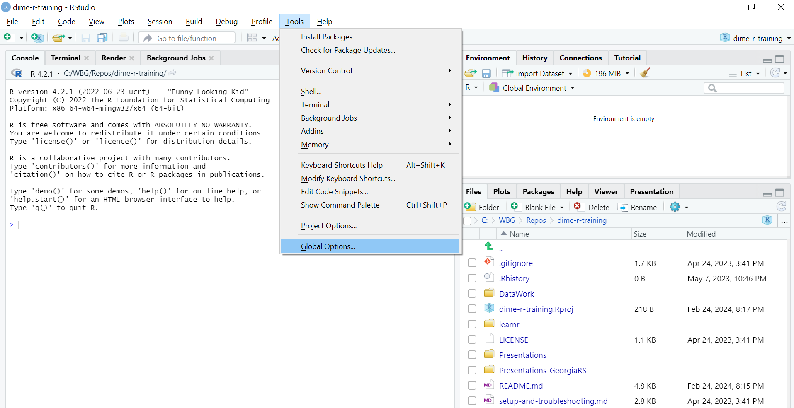
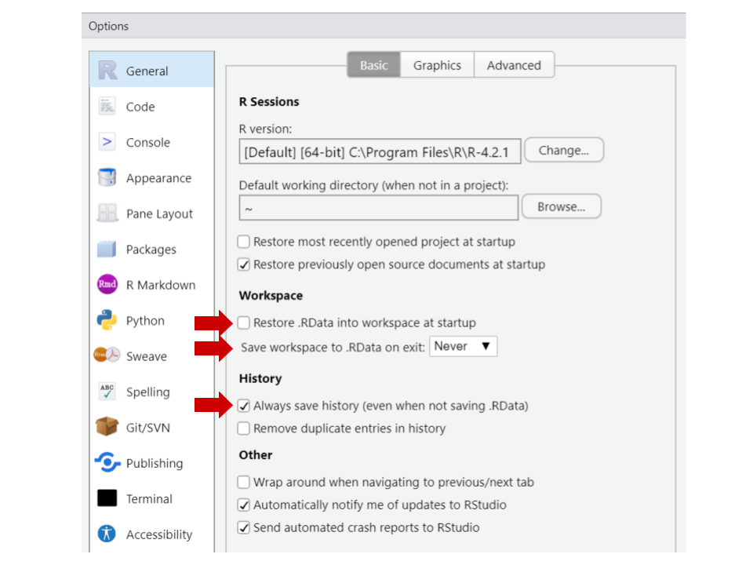
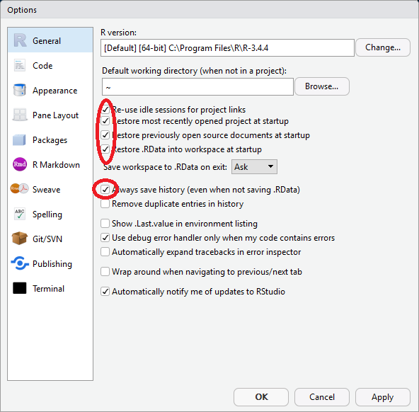
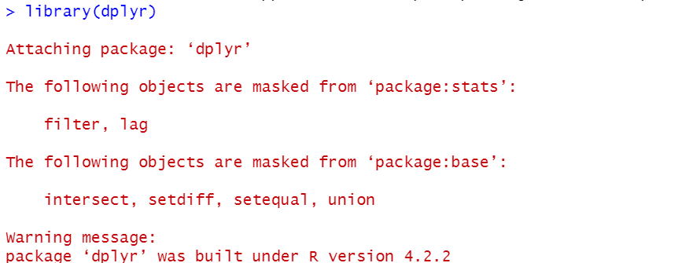
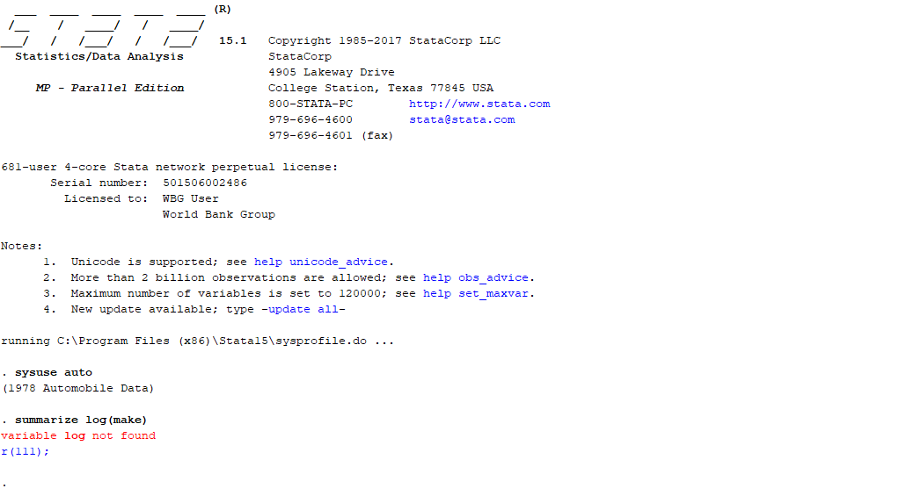

```{r setup, include=FALSE}
options(htmltools.dir.version = FALSE)
library(knitr)
opts_chunk$set(
  fig.align="center",  
  fig.height=4, #fig.width=6,
  # out.width="748px", #out.length="520.75px",
  dpi=300, #fig.path='Figs/',
  cache=T#, echo=F, warning=F, message=F
  )
library(tidyverse)
library(hrbrthemes)
library(fontawesome)
library(xaringanExtra)
xaringanExtra::use_panelset()
```

```{r xaringan-logo, echo=FALSE}
xaringanExtra::use_logo(
  image_url = "img/lightbulb.png",
  exclude_class = c("inverse", "hide_logo"),
  width = "50px"
)
```

```{r, echo = F, eval= T}

# File paths
if (Sys.getenv("USERNAME") %in% c("WB501238", "wb501238")){
  projectFolder  <- "C:/Users/WB501238/Documents/GitHub/dime-r-training"
  
}

if (Sys.getenv("USERNAME") == "luis_eduardo"){
  projectFolder  <- "/home/luis_eduardo/cs_projects/dime-r-training"
  
}

if (Sys.getenv("USERNAME") == "Leonardo"){
  projectFolder  <- "C:/Users/Leonardo/Documents/GitHub/dime-r-training"

}

if (Sys.getenv("USERNAME") == "wb519128"){
  projectFolder <- file.path("C:/Users/WB519128/Documents/GitHub/dime-r-training")
}

if (Sys.getenv("USERNAME") == "maximiliano"){
  projectFolder <- file.path("D:/Documents/RA Jobs/DIME/trainings/dime-r-training")
}

# File paths
  dataWorkFolder    <- file.path(projectFolder,"DataWork")
  Data              <- file.path(dataWorkFolder,"DataSets")
  finalData         <- file.path(Data,"Final")
  rawOutput         <- file.path(dataWorkFolder,"Output","Raw")

# Load CSV data

whr <- read.csv(file.path(finalData,"whr_panel.csv"), 
                header = T)

#library(tidyverse)


```

```{css, echo = F, eval = T}
@media print {
  .has-continuation {
    display: block !important;
  }
}
```


# Table of contents

1. [Introduction](#introduction)
2. [Initial settings](#initial-settings)
3. [File paths](#file-paths)
4. [Exploring a dataset](#exploring-a-dataset)
5. [Commenting](#commenting)
6. [Creating a document outline in RStudio](#creating-a-document-outline-in-rstudio)
7. [Using packages](#using-packages)
8. [Functions inception](#functions-inception)
9. [Looping](#looping)
10. [Custom functions](#custom-functions)
11. [Indentation](#indentation)
12. [Appendix](#appendix)

---

# Sessions format

## Format

- These are hands-on sessions. You are strongly encouraged to __follow along in your computer__ what the presenter is doing

- The sessions include exercises where we give 1-2 minutes to solve them. Then, the presenter will call names to discuss what you did and which issues you encountered

  + If you prefer not to be called or have connectivity issues which prevent participation, please let us know by sending a private message to one of our TAs

- Every session has two TAs. For this session, our TAs are __Luiza Cardoso De Andrade__ and __Rony Rodriguez Ramirez__

---

# Sessions format

- The TAs will help you troubleshooting __particular issues__ which make you unable to follow along the presentation. Send them a private message whenever you need help

- Otherwise, if you have a __general question__ feel free to unmute yourself or use the chat to ask it

- Please mute your microphone the rest of the time

- If your connection is good enough, please leave your video on

- The materials of each session will be shared in the OSF page on the course after the end of each session

---

class: inverse, center, middle
name: introduction

# Introduction

<html><div style='float:left'></div><hr color='#D38C28' size=1px width=1100px></html>

---

# Introduction

## Why are we here today?

* In the last session, you learned the basic concepts to work in R

* You are probably eager to get your hands into some data using R by now, and you would figure out __what should be in your code__ for it to work

* But you would probably not know right away __how to write that__, so that in the end you might have code that is only intelligible for yourself -- and not for a very long time

---

# Introduction

## Why are we here today?

* In this session, we will cover common coding practices in R so that you can make __the most efficient use__ for it

* We will also discuss some styling conventions to make your code __readable and reproducible__

* This will give you a solid foundation to code in R, and hopefully you'll be able to skip some painful steps of the "getting-your-hands-dirty" learning approach

---

class: inverse, center, middle
name: initial-settings

# Initial settings

<html><div style='float:left'></div><hr color='#D38C28' size=1px width=1100px></html>

---

# Initial settings

* Ok, let's start by opening RStudio, or by reopening it if you had it opened already

* What do you see in your environment?

* If you saved the last RStudio session in `.Rhistory` (and that is the default), the objects that were in RStudio's memory last time you closed it will still be there whenever you open it again

---

# Initial settings

Raise your hand if you have ever seen these lines of code before:

```{r echo = FALSE, out.width = "40%"}
knitr::include_graphics("img/stataheader.jpg")
```

---

# Initial settings

* We __don't need to set the memory or the maximum number of variables in R__, and the equivalent of `set more off` is the default in R

* You can see all the objects currently in you memory in the *Environment* pane

---

# Initial settings

## Exercise 1: Clear workspace

* Make sure the `Environment` window is open. Is anything there?

* Create an object called `foo` with any content you pick

* Type `rm(foo)` to remove the `foo` object from you memory

* Type `ls()` to print the names of the object in memory

* To remove all objects, use `rm(list=ls())`

---

# Initial settings

```{r echo = FALSE, out.width = "50%"}
knitr::include_graphics("img/rm.png")
```

---

# Initial settings

## Exercise 2: To make sure that no one will burn your computer, here's how you change these settings:

---

# Initial settings

```{r echo = FALSE, out.width = "70%"}

```

---

# Initial settings

```{r echo = FALSE, out.width = "50%"}

```

---

# Initial settings

```{r echo = FALSE, out.width = "50%"}

```

---

class: inverse, center, middle
name: file-paths

# File paths

<html><div style='float:left'></div><hr color='#D38C28' size=1px width=1100px></html>

---

# File paths

* For the purpose of this training, we will assume that you are dealing with a specific folder structure.

* Folder organization, though an important part of data work, is outside the scope of this course.

* You can find resources about it in the appendix, and we have shared with you a folder that is organized as we want it to be.

* To follow today's session, go to the `DataWork/Code` folder and open the file called `Lab 2 - Intro II.R`.

* We will use this script as a basis for the exercises, and you should modify it during this session to complete them.

---

# File paths

* In the last session, we used the menu bar to load a data set into R

* Today, we will do that using code and referring a file's path

* File paths in R, as in Stata, are basically just strings

* Note, however, that in R we can only use forward slashes (`/`) to separate folder names

### Exercise 3: File path to your folder
Let's start by adding the folder path to the training's folder in your computer to the beginning of `PART 2`

---

# File paths

* You can set file paths in your script using the `file.path()` function

* This function concatenates strings using `/` as a separator to create file paths

* This is similar to using globals to define folder paths in Stata

---

# File paths

Let's test if that worked:
```{r, eval = T}

  # Project folder
  projectFolder  <-
    "/home/luis_eduardo/cs_projects/dime-r-training"

  # Data work folder
  dataWorkFolder    <- file.path(projectFolder,"DataWork")

  # Print data work folder
  dataWorkFolder

```

---

# File paths

## Loading a dataset from CSV

Use the `read.csv()` command:

```{r, eval=F}
read.csv(file, header = FALSE, stringsAsFactors = FALSE)
```

* __file__: is the path (string) to the file you want to open, including its name and format (`.csv`).

* __header__: if `TRUE`, will read the first row as variable names (default is `header = FALSE`).

* __stringsAsFactors__: logical. See next slide for more.

---

# File paths

## Loading a dataset from CSV

* Since R 4.0.0 and beyond, `stringsAsFactors = FALSE` is the default. In every previous version, the default is `TRUE`.

* This means that if your R version is 3.X.X, R will turn any string variables into factors by default when reading a `csv` file.

* This format __saves memory__, but can be tricky if you actually want to use the variables as strings.

* You can specify the option `stringsAsFactors = FALSE` to make sure you prevent R from turning strings into factors.

---

# File paths

### Exercise 4: Test file paths

1. Save your code.

2. Start a new R session: go to `Session > New Session`. This session should be completely blank.

3. Open the code you just saved.

4. Add a line opening the data set in your code
```{r, eval = F}
# Load data set
whr <- read.csv(file.path(finalData,"whr_panel.csv"),
                header = T)

```

5. Run the whole script. If it worked, your environment should now include the `whr` dataset and the path locals.

---

class: inverse, center, middle
name: exploring-a-dataset

# Exploring a dataset

<html><div style='float:left'></div><hr color='#D38C28' size=1px width=1100px></html>

---

# Exploring a dataset

Some useful functions:

* **`View()`:** open the data set

* **`class()`:** reports object type or type of data stored

* **`dim()`:** reports the size of each one of an object's dimension

* **`names()`:** returns the variable names of a data set

* **`str()`:** general information on an R object

* **`summary()`:** summary information about the variables in a data frame

* **`head()`:** shows the first few observations in the dataset

* **`tail()`:** shows the last few observations in the dataset

---

# Exploring a dataset

### Exercise 5: Explore a dataset

Use some of the functions listed above to explore the `whr` data set.

---

# Exploring a dataset

```{r, eval = F}
# View the data set (same as clicking on it in the Environment pane)
View(whr)
```

---

# Exploring a dataset

```{r}
class(whr)
dim(whr)
```

---

# Exploring a dataset

```{r}
str(whr)
```

---

# Exploring a dataset

```{r}
summary(whr)
```

---

# Exploring a dataset

```{r}
head(whr)
```

---

# Exploring a data set

Didn't get all of those? 

Don't worry, you'll see them again soon.

---

class: inverse, center, middle
name: commenting

# Commenting

<html><div style='float:left'></div><hr color='#D38C28' size=1px width=1100px></html>

---

# Commenting

* To comment a line, write `#` as its first character

* You can also add `#` half way through a line to comment whatever comes after it

* In Stata, you can use `/*` and `*/` to comment part of a line's code. That is not possible in R: whatever comes after `#` will be a comment

* To comment a selection of lines, press `Ctrl + Shift + C`

---

# Commenting

### Exercise 6: Commenting

1. Go the `Lab 2 - Intro II.R` script. Select the lines under `PART 2: Set folder paths`.

2. Use the keyboard shortcut to comment these lines.

3. Use the keyboard shortcut to comment these lines again. What happened?

---

class: inverse, center, middle
name: creating-a-document-outline-in-rstudio

# Creating a document outline in RStudio

<html><div style='float:left'></div><hr color='#D38C28' size=1px width=1100px></html>

---

# Creating a document outline in RStudio

* RStudio also allows you to __create an interactive index__ for your scripts

* To add a section to your code, create a commented line with the title of your section and add at least 4 trailing dashes, pound signs or equal signs after it

---

# Creating a document outline in RStudio

### Exercise 7: Headers

1. Open the script index and make `PART 1` a section header. Do the same for parts 2 and 3.

2. Note that once you create a section header, an arrow appears right next to it. Click on the arrows of parts 2 and 3 to see what happens.

---

# Creating a document outline in RStudio

* The outline can be accessed by clicking on the button on the top right corner of the script window. You can use it to jump from one section to another
* You can also use the keyboard shortcuts `Alt + L` (`Cmd + Option + L` on Mac) and `Alt + Shift + L` to collapse and expand sections

---

class: inverse, center, middle
name: using-packages

# Using packages

<html><div style='float:left'></div><hr color='#D38C28' size=1px width=1100px></html>

---

# Using packages

* Since there is a lot of people developing for R, it can have many different functionalities.

* To make it simpler, these functionalities are bundled into packages.

* A package is just __a unit of shareable code__.

---

# Using packages

* It may contain new functions, but also more complex functionalities, such as a Graphic User Interface (GUI) or settings for parallel processing (similar to Stata MP).

* They can be shared through R's official repository - CRAN (13,000+ packages reviewed and tested).

* There are many other online sources such as GitHub, but it's important to be careful, as these probably haven't gone through a review process as rigorous as those in CRAN.

---

# Using packages

* To install and use packages you can either do it with the user interface or by the command prompt.
```{r, eval = F}
# Installing a package
install.packages("stargazer",
                 dependencies = T)
# the dependencies argument also installs all other packages
# that it may depend upon to run
```

* You only have to install a package once, but you have to __load it every new session__.

---

# Using packages

### Exercise 8

1. Now load the package we just installed. Use the `library()` function to do it.

---

# Using packages

```{r, eval = F}
  library(stargazer)
```

Notice that we used quotes around the name to install the package, but we don't need them anymore to load it.

---

# Using packages

## Warnings vs errors

What if this happens?

```{r echo = FALSE, out.width = "70%"}

```

---

# Using packages

## Warnings vs errors

R has two types of error messages, `warnings` and actual `errors`:

  * `Errors` - break your code, usually preventing it from running.
  * `Warnings` - usually mean that nothing went wrong yet, but you should be careful.

RStudio's default is to print warning messages, but not stop the code at the lines where they occur. You can configure R to stop at warnings if you want.

---

class: inverse, center, middle
name: functions-inception

# Functions inception

<html><div style='float:left'></div><hr color='#D38C28' size=1px width=1100px></html>

---

# Functions inception

* In R, you can __write one function inside another__

* In fact, you have already done this a few times in this course

* Here's an example:

---

# Functions inception

```{r}
  # Doing it the long way -----------------------------
  # Create a vector with the log of the happiness score
  log_score <- log(whr$happiness_score)

  # Get descriptive statistics for the log vector
  summary(log_score)

  # Shortcut to get to the same place ----------------
  summary(log(whr$happiness_score))
```

---

# Functions inception

* This is a simple example of __metaprogramming__ (that's the real name of this technique) and may seem trivial, but it's not

* For starters, you can't do it in Stata!

---

# Functions inception

```{r echo = FALSE, out.width = "50%"}

```
---

# Functions inception  
  
* This is a __very powerful technique__, as you will soon see

* It's __also a common source of error__, as you can only use one function inside the other if the output of the inner function is the same as the input of the outer function

* It can also get quite tricky to follow what a line of code with multiple functions inceptions is doing

* Which is why we sometimes use pipes: `%>%`

---

# Functions inception  

```{r, eval = F}
  # 1: Doing it the long way -----------------------------
  # Create a vector with the log of the happiness score
  log_score <- log(whr$happy_score)

  # Get descriptive statistics for the log vector
  mean(log_score)

  # 2: Shortcut to get to the same place -----------------
  mean(log(whr$happy_score))

  # 3: Now with pipes ------------------------------------
  whr$happy_score %>%
    log() %>%
    mean()
```

In a few words, `x %>% f()` is the same as `f(x)`

---

# Functions inception  
  
Now that you know piping exists in R, you should know that it can __drastically improve code readability__. And from now on you can also laugh if you see this in some tidyverse nerd laptop sticker or t-shirt:

```{r echo = FALSE, out.width = "50%"}
knitr::include_graphics("img/pipe.jpg")
```

---

class: inverse, center, middle
name: looping

# Looping

<html><div style='float:left'></div><hr color='#D38C28' size=1px width=1100px></html>

---

# Looping

* One thing that usually gives people away as Stata users writing R code are loops

* In Stata, we use for loops quite a lot

* The equivalent to that in R would be to write a for loop like this

```{r, eval = F}
    # A for loop in R
    for (number in 1:5) {
        print(number)
    }
```

---

# Looping

```{r}
    # A for loop in R
    for (number in 1:5) {
        print(number)
    }
```

---

# Looping

* R, however, has a whole function family that allows users to loop through an object _in a more efficient way__, without using explicit loops

* They're called `apply` and there are many of them, with different use cases

* If you look for the `apply` help file, you can see all of them

* For the purpose of this training, we will only use two of them, `sapply` and `apply`

---

# Looping

#### `sapply(X, FUN, ...)`: applies a function to all elements of a vector or list and returns the result in a vector. Its arguments are:

* **X:** a data frame (or matrix) the function will be applied to

* **FUN:** the function you want to apply

* **...:** possible function options

---

# Looping

```{r}
    # A for loop in R
    for (number in c(1.2,2.5)) {
      print(round(number))
    }

    # A much more elegant loop in R
    sapply(c(1.2,2.5), round)
```

---

# Looping

A more general version is the `apply` function.

#### `apply(X, MARGIN, FUN, ...)`: applies a function to all columns or rows of matrix. Its arguments are

* **X:** a data frame (or matrix) the function will be applied to

* **MARGIN:** 1 to apply the function to all rows or 2 to apply the function to all columns

* **FUN:** the function you want to apply

* **... :** possible function options

---

# Looping


```{r, eval = T}
    # Create a matrix
    matrix <- matrix(c(1, 24, 9, 6, 9, 4, 2, 74, 2),
                       nrow = 3)

    # Look at the matrix
    matrix
```

---

# Looping

```{r, eval = T}
    # Row means
    apply(matrix, 1, mean)

    # Column means
    apply(matrix, 2, mean)
```

---

class: inverse, center, middle
name: custom-functions

# Custom functions

<html><div style='float:left'></div><hr color='#D38C28' size=1px width=1100px></html>

---

# Custom functions

* As we have said several times, __R is super flexible__

* One example of that is that it's __super easy and quick to create custom functions__

* Here's how:

---

# Custom functions

```{r}
  square <- function(x) {
    
    y <- x ^ 2
    
    return(y)
    
  }

  square(2)
```  

---

# Custom functions

### Exercise 9: Create a function 

1. Create a function that calculates the z-score of a vector.

---

# Custom functions

```{r}
  zscore <- function(x) {
    
    mean <- mean(x, na.rm = T)
    sd   <- sd(x, na.rm = T)
    z    <- (x - mean)/sd
    
    return(z)
    
  }

  summary(zscore(whr$happiness_score))
  
```

---

class: inverse, center, middle
name: indentation

# Indentation

<html><div style='float:left'></div><hr color='#D38C28' size=1px width=1100px></html>

---

# Indentation

```{r, eval = F}
# Here's some code
annualHappy_reg <- aggregate(happy_score ~ year + region, data = whr, FUN = mean)
plot <- ggplot(annualHappy_reg,aes(y = happy_score,x = year, color = region, group = region))
+ geom_line() + geom_point()
print(plot)
```

```{r, eval = F}
# Here's the same code
annualHappy_reg <-
  aggregate(happiness_score ~ year + region,
            data = whr,
            FUN = mean)

plot <-
  ggplot(annualHappy_reg,
         aes(y = happiness_score,
             x = year,
             color = region,
             group = region)) +
  geom_line() +
  geom_point()

print(plot)
```

---

# Indentation

```{r, eval = T, echo = F, out.width = "60%"}
annualHappy_reg <-
  aggregate(happiness_score ~ year + region,
            data = whr,
            FUN = mean)

plot <-
  ggplot(annualHappy_reg,
         aes(y = happiness_score,
             x = year,
             color = region,
             group = region)) +
  geom_line() +
  geom_point()

print(plot)
```

---

# Indentation

## Why indent?

* Even though R understands what unindented code says, it can be __quite difficult for a human being to read it__

* On the other hand, __white space does not have a special meaning for R__, so it will understand code that is more readable for a human being

---

# Indentation

## Why indent?

* Indentation in R looks different than in Stata:

 - To indent a whole line, you can select that line and press `Tab`
 - To unindent a whole line, you can select that line and press `Shift + Tab`
 - However, this will not always work for different parts of a code in the same line

* In R, we typically don't introduce white space manually

* It's rather introduced by RStudio for us

---

# Indentation

### Exercise 8: Indentation in R
To see an example of how indenting works in RStudio, go back to our first example with `sapply`:

```{r, eval = F}
# A much more elegant loop in R
sapply(c(1.2,2.5), round)
```

1. Add a line between the two arguments of the function (the vector of numbers and the `round` function)

2. Now add a line between the numbers in the vector.

---

# Indentation

Note that RStudio formats the different arguments of the function differently:

```{r, eval = F}
# A much more elegant loop in R
sapply(c(1.2,
         2.5),
       round)
```

---

class: inverse, center, middle

# Thank you!

---

class: inverse, center, middle
name: appendix

# Appendix

---

# Appendix - Assignment 1

## Assignment 1

Create a function that

  1. Takes as argument a vector of packages names
  
  2. Loops through the packages listed in the input vector
  
  3. Install the packages
  
  4. Loads the packages

---

# Appendix - If statements

## If statements

* Installing packages can be time-consuming, especially as the number of packages you're using grows, and each package only needs to be installed once

* We often use locals in Stata to create section switches to install packages

* In R, the equivalent to that would be to create a new object as a section switch

### Exercise 9: Creating an if statement

Create a dummy scalar object called PACKAGES.

- TIP: Section switches can also be Boolean objects.

---

# Appendix - If statements

* Now we need to create an if statement using this switch

* If statements in R look like this:

```{r, eval = F}

    # Turn switch on
    PACKAGES <- 1

    # Install packages
    if (PACKAGES == 1) {
      install.packages(packages,
                       dependencies = TRUE)
    }

```

---

# Appendix - If statements

## If statements

Possible variations would include

```{r, eval = F}
    # Turn switch on
    PACKAGES <- TRUE

    # Using a Boolean object
    if (PACKAGES == TRUE) {
      install.packages(packages, dep = T)
    }

    # Which is the same as
    if (PACKAGES) {
      install.packages(packages, dep = T)
    }

```

---

# Appendix - Assignment 2

Create a function that

1. Takes as argument a vector of packages names

2. Loops through the packages listed in the input vector

3. Tests if a package is already installed

4. Only installs packages that are not yet installed

5. Loads the packages

- TIP: to test if a package is already installed, use the following code:
```{r, eval = F}
    # Test if object x is contained in
    # the vector of installed packages
    x %in% installed.packages()
```

---

# Appendix - File paths best practices

## File paths best practices

* We at DIME Analytics recommend always using **explicit** and **dynamic** file paths

* **Explicit** means you're explicitly stating where the file will be saved -- instead of setting the working directory, for example

* **Dynamic** means that you don't need to adjust every file path in the script when you change from one machine to another -- they're updated based on a single line of code to be changed  

---

# Appendix - File paths best practices

## File paths

* Explicit and dynamic file path:

```{r, eval = F}
  # Define dynamic file path
  finalData <- "C:/Users/luiza/Documents/GitHub/
                dime-r-training/
                DataWork/DataSets/Final"

  # Load data set
  whr <- read.csv(file.path(finalData,"whr_panel.csv"),
                  header = T)

```

---

# Appendix - Using packages

## Using packages

Once a package is loaded, you can use its features and functions. Here's a list of some useful and cool packages:

* `Rcmdr` - easy to use GUI
* `swirl` - an interactive learning environment for R and statistics.
* `ggplot2` - beautiful and versatile graphics (the syntax is a pain, though)
* `stargazer` - awesome latex regression and summary statistics tables
* `foreign` - reads `.dta` and other formats from inferior statistical software
* `zoo` - time series and panel data manipulation useful functions
* `data.table` - some functions to deal with huge data sets
* `sp` and `rgeos` - spatial analysis
* `multiwayvcov` and `sandwich` - clustered and robust standard errors
* `RODBC`, `RMySQL`, `RPostgresSQL`, `RSQLite` - For relational databases and using SQL in R.

---

# Appendix - Resources

## Resources

* A discussion of folder strucutre and data managament can be found here: https://dimewiki.worldbank.org/wiki/DataWork_Folder

* For a broader discussion of data management, go to https://dimewiki.worldbank.org/wiki/Data_Management

---

# Appendix - Git

## Git

Git is a version-control system for tracking changes in code and other text files. It is a great resource to include in your work flow.

We didn't cover it here because of time constraints, but below are some useful links, and DIME Analytics provides trainings on Git and GitHub, so keep an eye out for them.

* **DIME Analytics git page:** https://worldbank.github.io/dimeanalytics/git/

* **A Quick Introduction to Version Control with Git and GitHub:** https://journals.plos.org/ploscompbiol/article?id=10.1371/journal.pcbi.1004668

---

# Appendix - R projects

## R projects

If you have used R before, you may have heard of RStudio Projects. It's RStudio's suggested tool for workflow management. DIME Analytics has found that it is not the best fit for our needs, because

1. In DIME, we mainly use Stata, and we prefer to keep a similar structure in R (Stata 15 also has a projects feature, but it is not yet widely adopted)

2. We need to keep our code and data in separate folders, as we store code in GitHub and data in DropBox

However, if you want to learn more about it, we recommend starting here:
https://r4ds.had.co.nz/workflow-projects.html
