```{r setup, include = FALSE}

# Load packages
library(knitr)
library(tidyverse)
library(hrbrthemes)
library(fontawesome)
library(here)
library(xaringanExtra)

here::i_am("Presentations/01-intro-to-R.Rmd")

options(htmltools.dir.version = FALSE)
opts_chunk$set(
  fig.align = "center",
  fig.height = 4,
  dpi = 300,
  cache = T
  )

xaringanExtra::use_panelset()
xaringanExtra::use_webcam()
xaringanExtra::use_clipboard()
htmltools::tagList(
  xaringanExtra::use_clipboard(
    success_text = "<i class=\"fa fa-check\" style=\"color: #90BE6D\"></i>",
    error_text = "<i class=\"fa fa-times-circle\" style=\"color: #F94144\"></i>"
  ),
  rmarkdown::html_dependency_font_awesome()
)

xaringanExtra::use_logo(
  image_url = here("Presentations",
                   "img",
                   "lightbulb.png"),
  exclude_class = c("inverse", 
                    "hide_logo"),
  width = "50px"
)
```

```{css, echo = F, eval = T}
@media print {
  .has-continuation {
    display: block !important;
  }
}

```

```{r echo = FALSE, include = FALSE, eval = TRUE}
whr <- read.csv(here("DataWork", "DataSets", "Final", "whr_panel.csv"))
```

# Table of contents

1. [Introduction](#introduction)
2. [Getting started](#getting-started)
3. [Data in R](#data-in-r)
4. [Functions](#functions)
5. [R objects](#r-objects)
6. [Basic types of data](#basic-types-of-data)
7. [Advanced types of data](#advanced-types-of-data)
8. [Appendix](#appendix)

---

# Sessions format

## Welcome!

We're glad you're joining us today!

## Format

- These are hands-on sessions. You are strongly encouraged to __follow along in your computer__ what the presenter is doing

- The sessions include exercises. You will be given 3-4 minutes to solve each exercise before we show the solution

---

# Sessions format

## Format

- Every session has two TAs. For this session, our TAs are __Luiza Cardoso De Andrade__ and __Marc-Andrea Fiorina__

- The TAs will help you troubleshooting __particular issues__ which make you unable to follow along the presentation. Send a message over the chat whenever you need help

---

# Sessions format

## Format


- If you have a question feel free to unmute yourself or use the chat to ask it

- Please mute your microphone the rest of the time

- If your connection is good enough, please leave your video on

- The materials of each session will be shared in the OSF page of the course by the end of each session: https://osf.io/86g3b/

- The recordings will be shared each day after the session

---

class: inverse, center, middle
name: introduction

# Introduction

<html><div style='float:left'></div><hr color='#D38C28' size=1px width=1100px></html>

---

# Introduction

## About this course

These training sessions will offer an introduction to R, its amazing features, and how Stata users can adapt from using Stata to using R.

We assume that you know how to do statistical programming in Stata or that you have a computer programming background.

## About this session

This first session will present the basic concepts you will need to use R.

---

class: inverse, center, middle
name: getting-started

# Getting started

<html><div style='float:left'></div><hr color='#D38C28' size=1px width=1100px></html>

---

# Getting started - RStudio interface

```{r echo = FALSE, out.width = "70%"}
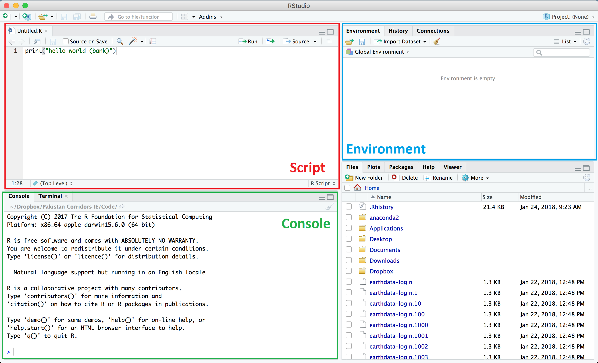
```

---

# Getting started - RStudio interface

```{r echo = FALSE, out.width = "70%"}
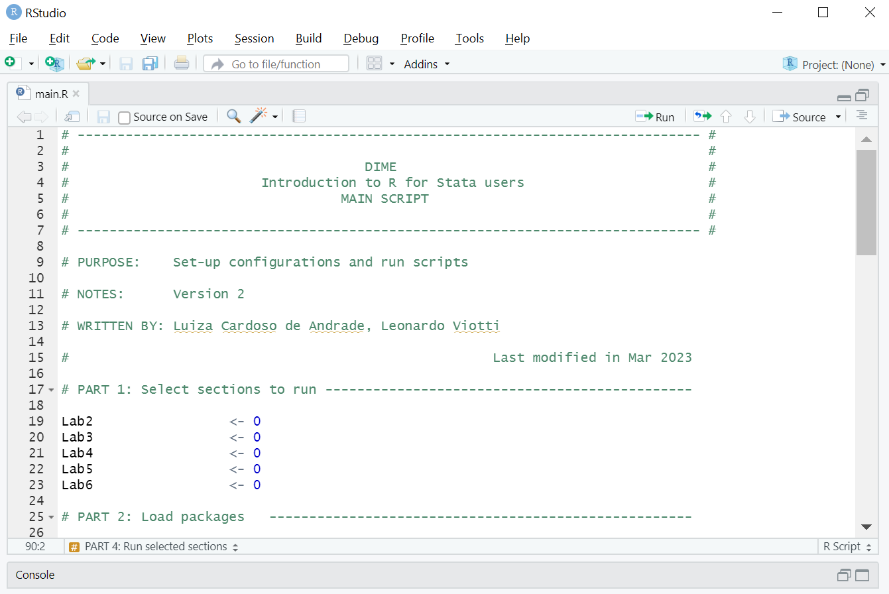
```

---

# Getting started - RStudio interface

```{r echo = FALSE, out.width = "70%"}
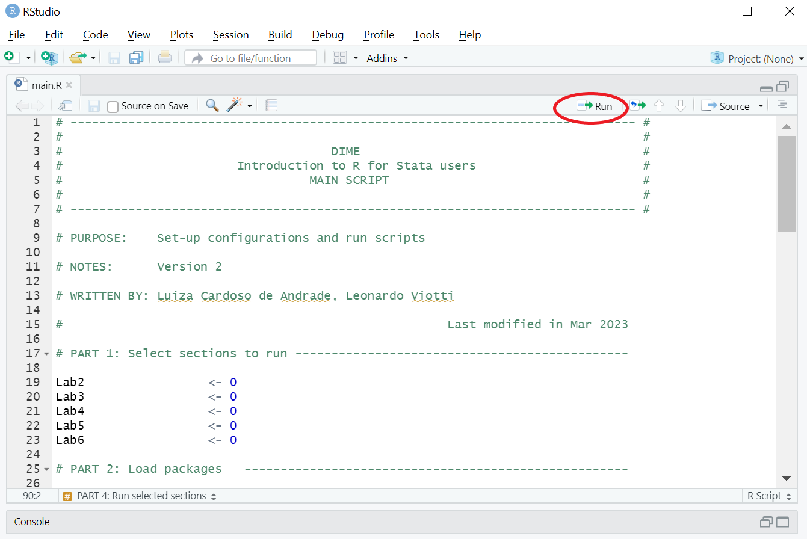
```
---

# Getting started - RStudio interface

```{r echo = FALSE, out.width = "70%"}
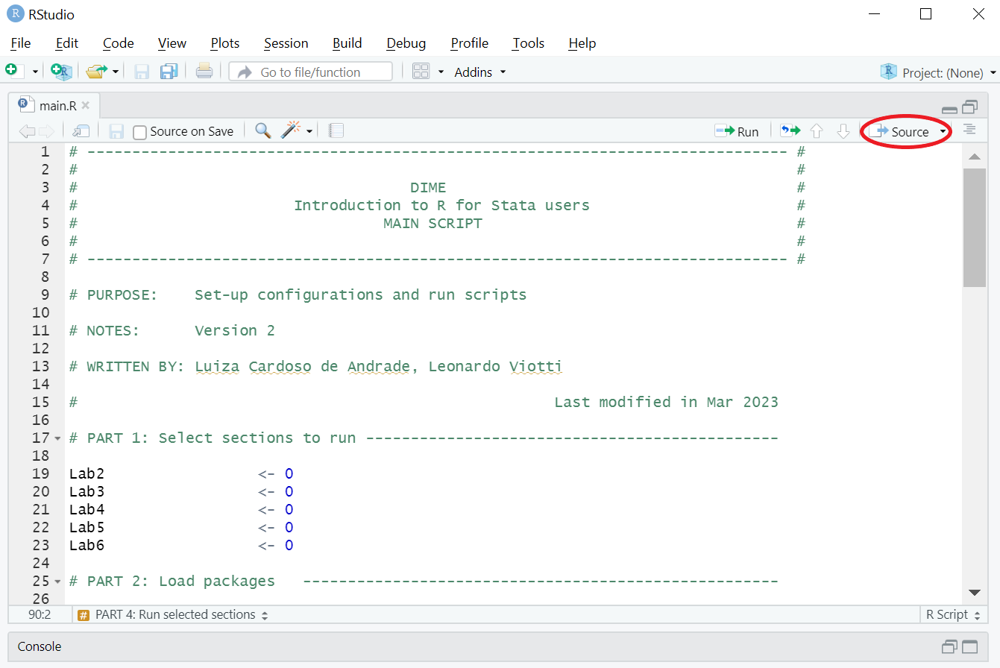
```

---

# Getting started - RStudio interface

```{r echo = FALSE, out.width = "70%"}
knitr::include_graphics("img/script4.png")
```

---

# Getting started - Importing data

Let's start by loading the data we'll be using:

## Exercise 1: Import data manually <font size="5">(`r fa("clock")` 3 min)</font> 


1. Go to the OSF page of the course (https://osf.io/86g3b/) and download the file located in `R for Stata Users - 2023 March` > `Data` > `whr_panel.csv`

2. In RStudio, go to `File` > `Import Dataset` > `From Text (base)` and open the `whr_panel.csv` file. 
  + Depending on your Rstudio version, it might be `File` > `Import Dataset` > `From CSV`

3. Assign the name `whr` to the data on the import window.
  + If you solved the exercise correctly, you'll see that RStudio opens a tab with a viewer of the dataframe

---

# Getting started - Importing data

```{r echo = FALSE, out.width = "40%"}
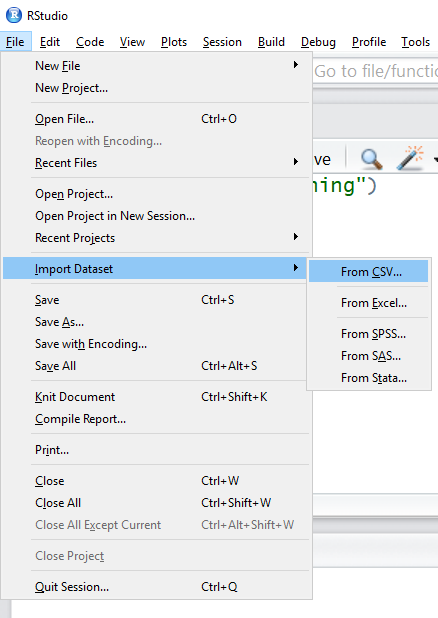
```

---

# Getting started - Importing data

```{r echo = FALSE, out.width = "50%"}
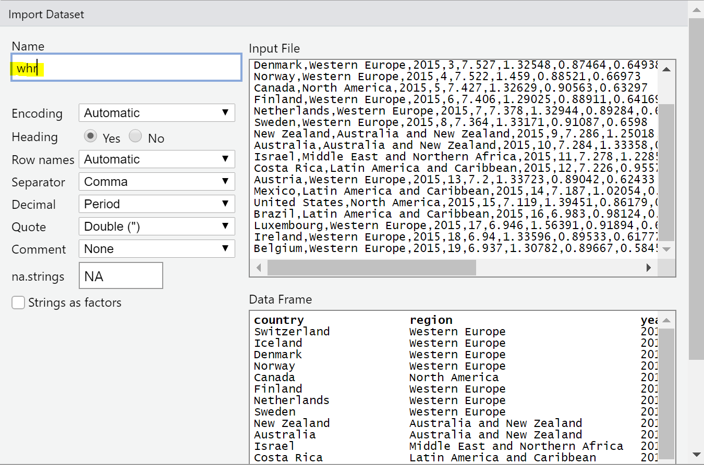
```

---

# Getting started - RStudio interface

```{r echo = FALSE, out.width = "70%"}
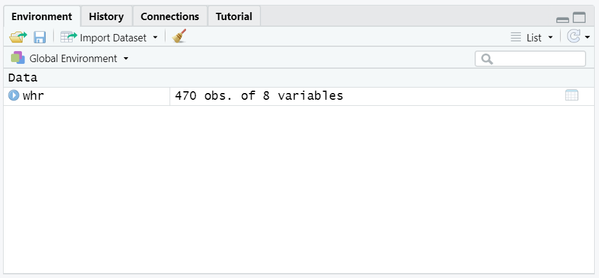
```

---

class: inverse, center, middle
name: data-in-r

# Data in R

<html><div style='float:left'></div><hr color='#D38C28' size=1px width=1100px></html>

---

# Data in R

## In Stata:

* You can open __one dataset__ and perform operations that can change that dataset.

* You can also have other things, such as matrices, macros and tempfiles, but they are secondary. __Most functions only use the main dataset__.

* If you wish to do any non-permanent changes to your data, __you'll need to preserve the original data to keep it intact__.

---

# Data in R

## In R:

Datasets are called __dataframes__. R works with them in a different way: 
 
* You can load __as many dataframes as you wish__ or your computer's memory allows

* Operations will have lasting effects __only if you store their results__

---

# Data in R

## In R:

* Everything that exists in R's memory -variables, dataframes, functions- __is an object__

* You could think of an object like a chunk of data with some properties that has a name by which you call it

* If you create an object, it's going to be stored in memory until you delete it or quit R

* Whenever you run anything you intend to use in the future, __you need to store it as an object__.

---

# Data in R

To better understand the idea, we're going to use the data we opened from the United Nations' World Happiness Report.

First, let's take a look at the data.

Type the following code __in the Console panel__ and press Enter to explore the data: 
```{r, include = T, results = "hide"}

# We can use the function View() to browse the whole data
View(whr) # <--- Note that the first letter is uppercase

```

```{r echo = FALSE, out.width = "50%"}
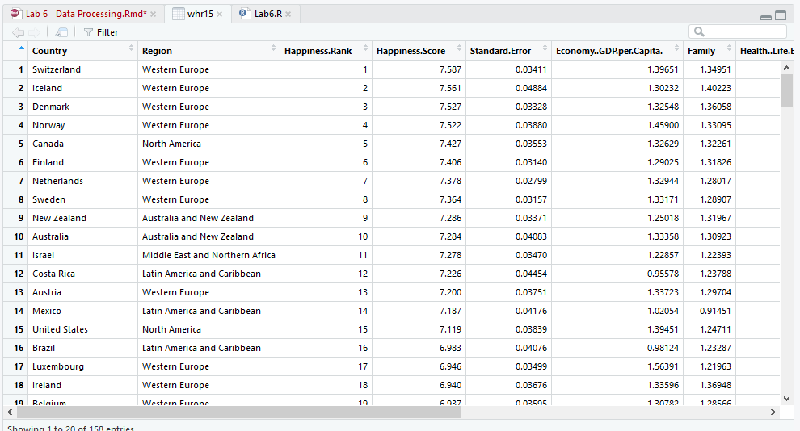
```

---

# Data in R

Alternatively we can print the first 6 obs. with `head()`:

```{r echo=FALSE}
knitr::include_app("https://luizaandrade.shinyapps.io/learnr/")
```

---

# Data in R

Now, let's try some simple manipulations. First, assume we're only interested in data of the year 2016.

## Exercise 2: Subset the data <font size="5">(`r fa("clock")` 1 min)</font> 

- Subset the dataframe, keeping only observations where variable `year` equals `2016`.

```{r, eval=FALSE}
# To do that we'll use the subset() function
subset(whr, year == 2016)
```

- Then, look again at the first 6 observations
```{r, include = T, results = "hide"}
# Use the head() function again
head(whr)
```

**Important:** It is a good practice to always write your code in the script window and run it from there

---

# Data in R

```{r, eval=FALSE}
subset(whr, year == 2016)
head(whr)
```

```{r echo=FALSE}
knitr::include_app("https://luizaandrade.shinyapps.io/learnr/")
```

---

# Data in R

We can see that nothing happened to the original data. This was because we didn't store the edit we made.

### To store an object, we use the assignment operator (`<-`):

```{r, include = T, results = "hide"}
# Assign the Answer to the Ultimate Question of Life, 
# the Universe, and Everything
x <- 42
```

---

# Data in R

```{r, include = T, results = "hide"}
# Assign the Answer to the Ultimate Question of Life, 
# the Universe, and Everything
x <- 42
```

```{r echo=FALSE}
knitr::include_app("https://luizaandrade.shinyapps.io/learnr/")
```

---

# Data in R

From now on, `x` is associated with the stored value (until you replace it, delete it, or quit the R session).

```{r echo = FALSE, out.width = "60%"}
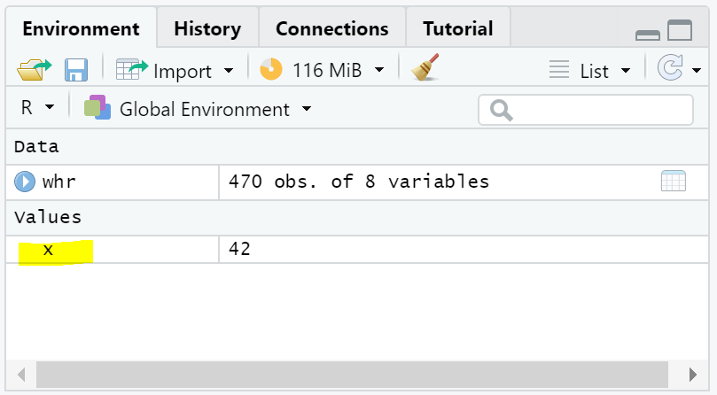
```

---

# Data in R

## Exercise 3: Create an object <font size="5">(`r fa("clock")` 1 min)</font> 

Create a new dataframe, called `whr2016`, that is a subset of the `whr` dataframe containing only data from the year 2016.

```{r, include = T, results = "hide"}
# Using the same function but now assigning it to an object
whr2016 <- subset(whr, year == 2016)

# Display the 6 first obs. of the new data
head(whr2016)

# Notice that we still have the original dataframe intact
head(whr)

```

---

# Data in R

You can also see that your environment panel now has two data objects:

```{r echo = FALSE, out.width = "60%"}
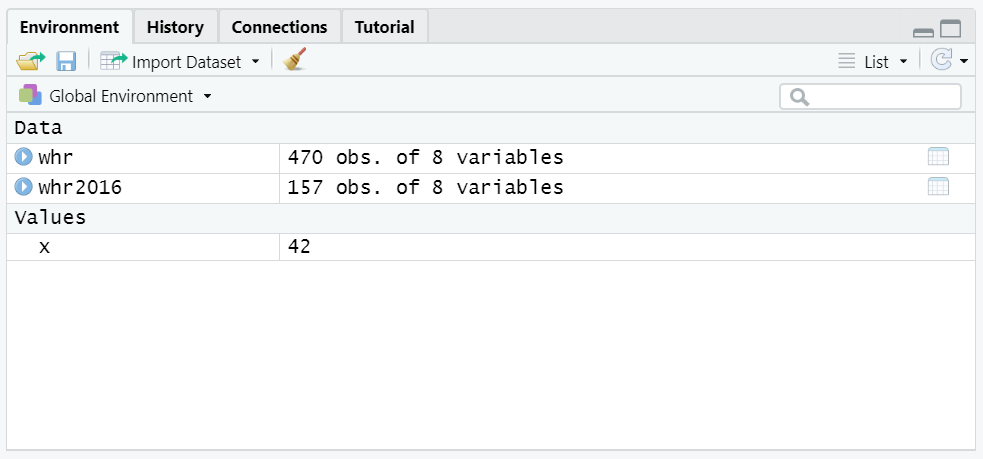
```
---

# Data in R

### Important features to take note:

* In R, if you want to change your data, you need to __store the result in an object__ using the arrow operator `<-`

* It is also possible to simply replace the original data. This happens if you assign the new object to the same name as the original.
 
 ```{r, eval = F}
 # This would have replaced "whr" instead of creating a new object:
 whr <- subset(whr, year == 2016)
 ```
 
__Important:__ This will modify the original object -- `whr` in this case. R will not give you a warning when you're modifying an existing object with `<-`

---

# Data in R

## Printing a result vs storing a result

Print (display) is built into R. If you execute any action without storing it, R will simply __print the results of that action__ but will not save anything in the memory.

```{r, eval = F}
# For instance, this will only print the observations that meet the specified condition:
subset(whr, year == 2016)

# To actually store the result, we would need to assign it to an object:
whr2016 <- subset(whr, year == 2016)

```

---

class: inverse, center, middle
name: functions

# Functions

<html><div style='float:left'></div><hr color='#D38C28' size=1px width=1100px></html>

---

# Functions

## Quick intro to functions

* `head()`, `View()`, `subset()` and`read.csv()` are functions.

* Functions in R take **named arguments** (unlike in Stata that you have arguments and options)

* Type `help(subset)` in the console to check the arguments of the `subset()` function

```{r echo = FALSE, out.width = "60%"}
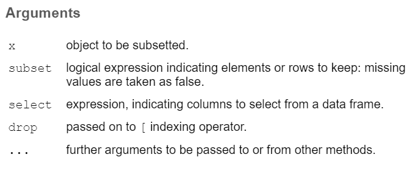
```

---

# Functions

## Quick intro to functions

* When we used `subset(whr, year == 2016)` we're implicitily telling R that the `x` argument is `whr` and the `subset` argument is `year == 2016`

* In other words, these two commands will return the same results:

  + `subset(whr, year == 2016)`
  + `subset(x = whr, subset = year == 2016)`

```{r echo = FALSE, out.width = "60%"}

```

---

# Functions

## Quick intro to functions

* Arguments are always enclosed in parentheses

* Usually the first argument is the object you want to use the function on, e.g. `subset(whr, ...)`

* Functions usually return values that you can store in an object, print or use directly as an argument of another function. __They rarely modify an object in-place__

We will explore these ideas in depth in a later session.

---

class: inverse, center, middle
name: r-objects

# R objects

<html><div style='float:left'></div><hr color='#D38C28' size=1px width=1100px></html>

---

# R objects

## R objects

Objects are the __building blocks of R programming__. This section will explore some of the most common classes, with a focus on data structures.

This will give you the foundation to explore your data and construct analytical outputs.

---

# R objects

## What is an object?

* An object is like a global or local in Stata, it's __something you can refer to later__ in your code to get a value

* But while you can only put a number or a string in a global, __you can put anything into an object__: scalars, strings, dataframes, vectors, plots, functions

* Objects also have attributes that can be used to manipulate them

---

# R objects

## Object classes

Here are the object classes we will cover in this first session:

* __Vectors:__ an uni-dimensional object that __stores a sequence of values of the same class__

* __Dataframes:__ a combination of different vectors of the same length (the same as a dataset in Stata)

* __Lists:__ a multidimensional object that can store several objects __of different classes and dimensions__

---

# R objects - Vectors

## Vectors

A vector is an uni-dimensional object composed by one or more elements of the same type.

#### Use the following code to create vectors in two different ways
```{r}
# Creating a vector with the c() function
v1 <- c(1,2,3,4,5)

# Alternative way to create an evenly spaced vector
v2 <- 1:5

```

---

# R objects - Vectors

```{r,eval=F}
v1 <- c(1,2,3,4,5) # Creating a vector with the c() function
v2 <- 1:5          # Alternative way to create an evenly spaced vector
```

```{r echo=FALSE}
knitr::include_app("https://luizaandrade.shinyapps.io/learnr/")
```

---

# R objects - Vectors

#### You can use brackets for indexing vector elements
```{r, eval=F}
v2[4]   # Prints the 4th element of the vector
v2[1:3] # Prints from the 1st to the 3rd element
```

```{r echo=FALSE}
knitr::include_app("https://luizaandrade.shinyapps.io/learnr/")
```

---

# R objects - Dataframes

## Dataframes

The `whr` and `whr2016` objects are both dataframes. You can also construct a new dataframe from scratch by __combining vectors with the same number of elements__ with the command `data.frame()`.

#### Now, type the following code to create a new dataframe
```{r}
# Dataframe created by biding vectors
df1 <- data.frame(v1,v2)
df1
```

---

# R objects - Dataframes

```{r, eval=F}
df1 <- data.frame(v1,v2) #creates a df by binding to existing vectors
df1
```

```{r echo=FALSE}
knitr::include_app("https://luizaandrade.shinyapps.io/learnr/")
```

---

# R objects - Dataframes

## Dataframes

Since a dataframe has two dimensions, you can use indices for both. The first index indicates the row selection and the second indicates the column.

### Numeric indexing
```{r, eval = F}
# The first column of whr
whr[,1]

# The 45th row of whr
whr[45,]

# Or the 45th element of the first column
whr[45,1]

```

---

# R objects - Dataframes

```{r, eval = F}
whr[,1]   # The first column of whr
whr[45,]  # The 45th row of whr
whr[45,1] # Or the 45th element of the first column
```

```{r echo=FALSE}
knitr::include_app("https://luizaandrade.shinyapps.io/learnr/")
```

---

# R objects - Dataframes

## Dataframes

Alternatively, you can use the column names for indexing, which is the same as using the `$` sign.

### Names indexing
```{r}
# The 22th element of the country column
whr[22,"country"] # The same as whr$country[22]
```

---

# R objects - Dataframes

```{r, eval=F}
# The 22th element of the country column
whr[22,"country"] # The same as whr$country[22]
```

```{r echo=FALSE}
knitr::include_app("https://luizaandrade.shinyapps.io/learnr/")
```

---

# R objects - Dataframes

## Vectors in dataframes

To R, each of the columns of the object `whr` is a vector.

### Calling a vector from a dataframe:

We use the `$` character to extract vectors (variables) by their names in a dataframe

For example:

```{r}
# Create a vector with the values of the "year" variable
year_vector <- whr$year
```

---

# R objects - Dataframes

```{r, eval=F}
year_vector <- whr$year # creates a vector with the values of the "year" variable
```

```{r echo=FALSE}
knitr::include_app("https://luizaandrade.shinyapps.io/learnr/")
```

---

# R objects - Lists

## Lists

Lists are more complex objects that can contain many objects of __different classes and dimensions__.

The outputs of many functions, a regression for example, are similar to lists (more on this in a later session).

Here's a quick example:

### Combine several objects of different types in a list
```{r, include = T, results = "hide"}
# Use the list() function
lst <- list(v1, df1, 45)
```
Print the list yourself to see how it looks like.

---

# R objects - Lists

```{r, eval=F}
lst <- list(v1, df1, 45) # definition of lst
print(lst)               # checking the content of lst
```

```{r echo=FALSE}
knitr::include_app("https://luizaandrade.shinyapps.io/learnr/")
```

---

# R objects - Lists

You can subset lists using single brackets (`[]`) or double brackets (`[[]]`)

- `my_list[[i]]` will return the actual item in the i-th position
- `my_list[i]` will return a list with the item in the i-th position
- Importantly, `[]` can be used to index elements with a numeric vector indicating the positions of the elements to subset
- `[[]]`, on the other hand, only allows a single index

---

# R objects - Lists

```{r, eval=F}
lst <- list(v1, df1, 45)
lst[[3]]    # returns 45
lst[3]      # returns a list of one element (45)
```

```{r echo=FALSE}
knitr::include_app("https://luizaandrade.shinyapps.io/learnr/")
```
---

class: inverse, center, middle
name: basic-types-of-data

# Basic types of data

<html><div style='float:left'></div><hr color='#D38C28' size=1px width=1100px></html>

---

# Basic types of data

R has different kinds of data that can be recorded inside objects. They are very similar to what you have in Stata, and the main types are string, integer and numeric, factors, and boolean.

Let's start with the simpler ones:

## Strings
A sequence of characters that are usually represented between double quotes. They can contain single letters, words, phrases or even some longer text.

## Integer and numeric
As in Stata, there are two different ways to store numbers. They are different because they use memory differently. As default, R stores numbers in the numeric format (double).

---

# Basic types of data - Strings

### Exercise 4: Concatenate strings <font size="5">(`r fa("clock")` 3 min)</font> 

1. Create the following vector of strings: `str_vec <- c("R", "Python", "SAS", "Excel", "Stata")`

1. Create a scalar (a vector of one element) containing the phrase "can be an option to" and call it `str_scalar`. Your code will be similar to this: `str_scalar <- "can be an option to"`

1. Use the function `paste()` with 3 arguments separated by commas:
  + The first argument as the 1st element of `str_vec`.
  + The second argument as the `str_scalar`.
  + The third argument as the 5th element of `str_vec`.

1. If you're not sure where to start, type:
```{r, eval=FALSE}
help(paste)
```

---

# Basic types of data - Strings

```{r, eval=F}
str_vec <- c("R", "Python", "SAS", "Excel", "Stata")
str_scalar <- "can be an option to"       # creating str_scalar
paste(str_vec[1], str_scalar, str_vec[5]) # using paste()
```

```{r echo=FALSE}
knitr::include_app("https://luizaandrade.shinyapps.io/learnr/")
```

---

class: inverse, center, middle
name: advanced-types-of-data

# Advanced types of data

<html><div style='float:left'></div><hr color='#D38C28' size=1px width=1100px></html>

---

# Advanced types of data

R also has other more complex ways of storing data. These are the most used:

## Factors

Factors are __numeric categorical values with text labels__, equivalent to labeled variables in Stata. Turning strings into factors makes it easier to run different analyses on them and also uses less space in your memory.

## Booleans

Booleans are __logical binary variables__, accepting either `TRUE` or `FALSE` as values. They are automatically generated when performing logical operations.

---

# Advanced types of data

## Booleans

Boolean data is the result of logical conditions. It can take two possible values: `TRUE` or `FALSE`.

* Stata doesn't have boolean types as such, but Whenever you're using an `if` statement, you're implicitly using boolean data.
* Another difference is that in R you can assign a boolean value to an object:

```{r}
# Storing boolean values:
boolean_true  <- TRUE
boolean_false <- FALSE
```

```{r}
# Printing:
boolean_true
boolean_false
```

---

# Advanced types of data - Booleans

```{r, eval=F}
boolean_true  <- TRUE
boolean_false <- FALSE
```

```{r echo=FALSE}
knitr::include_app("https://luizaandrade.shinyapps.io/learnr/")
```

---

# Advanced types of data

## Booleans

### Exercise 5 <font size="5">(`r fa("clock")` 3 min)</font> 

Create a boolean vector with the condition of annual income below average:

```{r}
# Create vector
inc_below_avg <- whr$economy_gdp_per_capita < mean(whr$economy_gdp_per_capita)

# See the 6 first elements of the vector
head(inc_below_avg)
```

---

# Advanced types of data - Booleans

```{r, eval=F}
inc_below_avg <- whr$economy_gdp_per_capita < mean(whr$economy_gdp_per_capita) # Create vector
head(inc_below_avg) # See the 6 first elements of the vector
```

```{r echo=FALSE}
knitr::include_app("https://luizaandrade.shinyapps.io/learnr/")
```

---

# Advanced types of data

## Booleans

We can use boolean vectors to index elements:

```{r}
# Creating a vector with 5 elements:
my_vector <- c("1st", "2nd", "3rd", "4th", "5th")
my_vector

# Selecting and printing the first and last elements only:
boolean1 <- c(TRUE, FALSE, FALSE, FALSE, TRUE)
my_vector[boolean1]

# Selecting and printing every element but the first:
boolean2 <- c(FALSE, TRUE, TRUE, TRUE, TRUE)
my_vector[boolean2]
```

---

# Advanced types of data - Booleans

```{r, eval=F}
my_vector <- c("1st", "2nd", "3rd", "4th", "5th")
boolean1 <- c(TRUE, FALSE, FALSE, FALSE, TRUE) # We'll use this to select the first and last elements only
boolean2 <- c(FALSE, TRUE, TRUE, TRUE, TRUE)   # And this to select every element but the first
```

```{r echo=FALSE}
knitr::include_app("https://luizaandrade.shinyapps.io/learnr/")
```

---

# Advanced types of data

## Booleans

Now let's use the boolean vector `inc_below_avg` to add a dummy variable in the `whr` dataframe for the same condition.

### Exercise 6 <font size="5">(`r fa("clock")` 3 min)</font> 

 * Create a column in `whr` containing zeros and call it `rank_low`. You can do this by typing:

```{r,  eval = T}
whr$rank_low <- 0
```

 * Now use `inc_below_avg` to index the lines of the `income_low` column and replace all observations that meet the condition with the value 1.

```{r,  eval = F}
whr$rank_low[inc_below_avg] <- 1
```

 **Important:** Notice that `whr$rank_low[inc_below_avg]` is subsetting the column `whr$rank_low` to the observations that have a value of `TRUE` in the boolean vector `inc_below_avg` 

---

# Advanced types of data - Booleans

```{r,  eval = F}
whr$rank_low <- 0 # this creates a vector of zeros
whr$rank_low[inc_below_avg] <- 1
# this ^ turns its values to 1, for the observations with a TRUE value in inc_below_avg
```

```{r echo=FALSE}
knitr::include_app("https://luizaandrade.shinyapps.io/learnr/")
```

---

# Advanced types of data

## Booleans

Instead of indexing the lines with the boolean vector `inc_below_avg`, we could also use the boolean condition itself:

```{r}

# Replace with 1 those obs that meet the condition
whr$rank_low[inc_below_avg] <- 1 
# is the same as
whr$rank_low[whr$happiness_score < mean(whr$economy_gdp_per_capita)] <- 1 

# This in stata would be:
# gen     rank_low = 0
# replace rank_low = 1 if (...)
```

---

class: inverse, center, middle

# Thank you!

---

class: inverse, center, middle
name: appendix

# Appendix

<html><div style='float:left'></div><hr color='#D38C28' size=1px width=1100px></html>


---

# Appendix - R and RStudio Installation

## Installation

This training requires that you have R and RStudio installed in your computer:

### Instructions

* To install R, visit (https://cran.r-project.org) and select a Comprehensive R Archive Network (CRAN) mirror close to you.

* To install RStudio, go to https://www.rstudio.com/. Note that you need to install R first.

---

# Appendix - R vs Stata

* R is object oriented while Stata is action oriented:
  + Classic example: Stata's `summarize` vs R's `summary()`
  + In Stata you declare what you want to do, while in R you usually declare the result you want to get

* R needs to load non-base commands (packages) at the beginning of each session
  + Imagine that in Stata you'd have to load a command installed with `ssc install` every time you'll use it in a new session

* R is less specialized, which means more flexibility and functionalities.

* R has a much broader network of users:
  + More resources online, which makes using Google a lot easier. You'll never want to see Statalist again in your life!
  + Development of new features and bug fixes happen faster.

---

# Appendix - R vs Stata

Some possible disadvantages of Stata:

* Higher cost of entry than Stata for learning how to use R.

* Stata is more specialized, which makes certain common tasks simpler. For example:
  - Running a regression with clustered standard errors
  - Analyzing survey data with weights

* Stata has wider adoption among micro-econometricians (though R adoption is steadily increasing).
  + Network externalities in your work environment.
  + Development of new specialized techniques and tools could happen faster (e.g. *ietoolkit*).

---

# Appendix - R vs Stata

Here are some advantages of R:

* R is a free and open source software, a huge advantage for open science

* It allows you to have several dataframes open simultaneously
  + No need to use `keep`, `preserve`, `restore`

* It can run complex Geographic Information System (GIS) analyses

* You can use it for web scrapping and APIs

* You can easily run machine learning algorithms with it

* You can create complex Markdown documents. This presentation, for example, is entirely done in R

* You can create interactive dashboards and online applications with the Shiny package

---

# Appendix - Syntax

R's syntax is heavier than Stata's:

* Parentheses to separate function names from its arguments.
* Commas to separate arguments.
* For comments we use the `#` sign.
* You can have line breaks inside function statements.
* In R, functions can be treated much like any other object. Therefore, they can be passed as arguments to other functions.

Similarly to Stata:

* Square brackets are used for indexing.
* Curly braces are used for loops and if statements.
* Largely ignores white spaces.

---

# Appendix - RStudio interface

## Script
Where you write your code. Just like a do file.

## Console
Where your results and messages will be displayed. But you can also type commands directly into the console, as in Stata.

## Environment
What's in R's memory.

## The 4th pane
Can display different things, including plots you create, packages loaded and help files.

---

# Appendix - RStudio vs R GUI

## RStudio

- RStudio is an integrated development environment for R

- It's a software that uses the base R installation of your computer and provides an expanded interface that greatly facilitates R programming

## R GUI

- The basic R Graphic User Interface (GUI) can also be used to program in R. You will find it in your computer with a name similar to `R<version>`, as in `R4.0.2`

- Opening the R GUI allows to work with R in a command line format, where you introduce one R command and the interface executes it and prints any message if needed

- It's very similar to the console panel of RStudio and it also allows to open a script editor, but it will not show you a list of the variables loaded on your environment

---

# Appendix - RStudio vs R GUI

```{r echo = FALSE, out.width = "90%"}
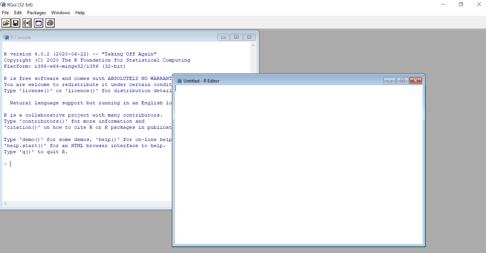
```

---

# Appendix - Matrices

A matrix a bi-dimensional object composed by one or more vectors of the same type.

## Type the following code to test two different ways of creating matrices
```{r, include = T, results = "hide"}
# Matrix created by joining two vectors:
m1 <- cbind(v1,v1)

# Matrix using the 
m2 <- matrix(c(1,1,2,3,5,8), ncol = 2)

```

---

# Appendix - Matrices

### Now use the following code to check the elements of these matrices by indexing
```{r, include = T, results = "hide"}
# Matrix indexing: typing matrix[i,j] will give you
# the element in the ith row and jth column of that matrix
#m2[1,2]

# Matrix indexing: typing matrix[i,] will give you the
# ith row of that matrix
m1[1,]

# Matrix indexing: typing matrix[,j] will give you the
# jth column of that matrix (as a vector)
m1[,2]

```

---

# Appendix - Advanced types of data - Factors

## Factors

#### Create a factor vector using the following code
```{r, include = T, results = "hide"}
# Basic factor vector
num_vec <- c(1,2,2,3,1,2,3,3,1,2,3,3,1)
fac_vec <- factor(num_vec)

# A bit fancier factor vector
fac_vec <- factor(num_vec,labels=c("A","B","C"))

# Change labels
levels(fac_vec) = c('One','Two','Three')

```

---

# Appendix - Numbers and integers

### Two scalars, one with a round number the other with a fractional part:
```{r}
# a numeric scalar with an integer number
int <- 13
num <- 12.99
```

---

# Appendix - Numbers and integers

Now we can see the objects classes with the `class()` function and test it with the `is.integer()` and `is.numeric()` functions.

```{r}
# you can see the number's format using the class function:
class(int)
class(num)

is.integer(int)
is.numeric(int)
```

Did you notice anything strange? That happens because the default way R stores numbers is *numeric*, which is equivalent to *double* in Stata.

---

# Appendix - Numbers and integers

## Numbers and integers

We can, however, coerce objects into different classes. We just need to be careful because the result might not be what we're expecting.

#### Use the `as.integer()` and `round()` functions on the `num` object to see the difference:

```{r}
as.integer(num)

# and

round(num)

```

---

# Appendix - Help, Google and Stack Overflow

Help in R works very much like in Stata: the help files usually start with a brief description of the function, explain its syntax and arguments and list a few examples. There are two ways to access help files:

## Exercise 7: Use help

```{r, eval=FALSE}
# You can use the help() function
help(summary)

# or its abbreviation
?summary

```

---

# Appendix - Help, Google and Stack Overflow

 * The biggest difference, however, is that __R has a much wider user community__ and it has __a lot more online resources__.

 * For instance, in 2014, Stata had 11 dedicated blogs written by users, while R had 550 (check http://r4stats.com/articles/popularity/ for more details).

 * The most powerful problem-solving tool in R, however, is Google. Searching the something yields tons of results.
 
 * Often that means a Stack Overflow page where someone asked the same question and several people gave different answers. Here's a typical example:
 https://stackoverflow.com/questions/1660124/how-to-sum-a-variable-by-group

---

# Appendix - Useful resources

## Blogs, courses and resources:

* Surviving graduate econometrics with R:
https://thetarzan.wordpress.com/2011/05/24/surviving-graduate-econometrics-with-r-the-basics-1-of-8/

* CRAN's manuals:
https://cran.r-project.org/manuals.html

* R programming in Coursera:
https://www.coursera.org/learn/r-programming

* R programming for dummies:
http://www.dummies.com/programming/r/

* R bloggers:
https://www.r-bloggers.com/

* R statistics blog:
https://www.r-statistics.com/

* The R graph gallery:
https://www.r-graph-gallery.com/

* R Econ visual library: (developed and maintained by DIME Analytics!)
https://worldbank.github.io/r-econ-visual-library/

---

# Appendix - Useful resources

## Books:

* R for Stata Users - Robert A. Muenchen and Joseph Hilbe

* R Graphics Cookbook - Winston Chang
https://r-graphics.org/

* R for Data Science - Hadley Wickham and Garrett Grolemund
https://r4ds.had.co.nz/

---
exclude: true

```{R, pdfs, include = F, eval = F}
pagedown::chrome_print("01-intro-to-R.html", output = "01-intro-to-R.pdf")

# or
source("https://git.io/xaringan2pdf")
xaringan_to_pdf("Presentations/01-intro-to-R.html")
```