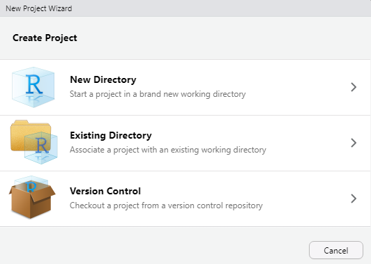
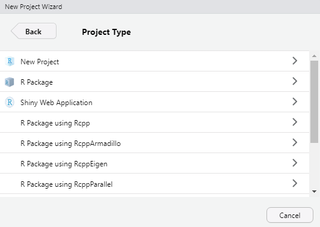
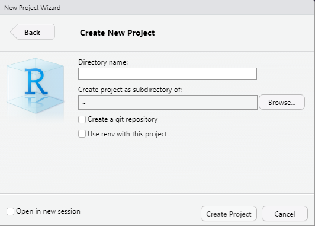

```{r setup, include = FALSE}

# Load packages
library(knitr)
library(tidyverse)
library(hrbrthemes)
library(fontawesome)
library(here)
library(xaringanExtra)

here::i_am("Presentations/02-data-processing.Rmd")

options(htmltools.dir.version = FALSE)
opts_chunk$set(
  fig.align = "center",
  fig.height = 4,
  dpi = 300,
  cache = T
  )

xaringanExtra::use_panelset()
xaringanExtra::use_webcam()
xaringanExtra::use_clipboard()
htmltools::tagList(
  xaringanExtra::use_clipboard(
    success_text = "<i class=\"fa fa-check\" style=\"color: #90BE6D\"></i>",
    error_text = "<i class=\"fa fa-times-circle\" style=\"color: #F94144\"></i>"
  ),
  rmarkdown::html_dependency_font_awesome()
)

xaringanExtra::use_logo(
  image_url = here("Presentations",
                   "img",
                   "lightbulb.png"),
  exclude_class = c("inverse", 
                    "hide_logo"),
  width = "50px"
)
```


# Table of contents

1. [Introduction](#intro)

2. [Exploring your data](#exploring)

3. [ID variables](#id)

4. [Wrangling your data](#wrangling)

4. [Create variables](#variables)

5. [Appending and marging](#bind)

6. [Saving a dataframe](#saving)

7. [Factor variables](#factor)

8. [Reshaping](#reshaping)


---
class: inverse, center, middle
name: intro

# Introduction

<html><div style='float:left'></div><hr color='#D38C28' size=1px width=1100px></html>

---

# Introduction

### Goals of this session

- To understand what RStudio projects are and how they can be used in your daily work.

- To organize data in a way that it will be easier to analyze it and communicate it.

- To get familiar with the packages bundled into the `tidyverse`.


--

### Things to keep in mind

- We'll take you through the same steps we've taken when we were preparing the datasets used in this course. 

- In most cases, your datasets won't be `tidy`. 

> **Tidy data**: A dataset is said to be tidy if it satisfies the following conditions: 
1. Every column is a variable.
2. Every row is an observation.
3. Every cell is a single value.

---

# Introduction

In this session, you'll be introduced to some basic concepts of data cleaning in R. We will cover: 

1. RStudio projects; 
2. Exploring a dataset;
3. Creating new variables;
4. Filtering and subsetting datasets;
5. Merging datasets;
6. Dealing with factor variables;
7. Saving data.

--

> There are many other tasks that we usually perform as part of data cleaning that are beyond the scope of this session.

---

# Introduction: RStudio Projects

#### What are RStudio projects? 

- Projects should be reproducible, and if you happen to code in R, RStudio Projects will make your science reproducible and easier in the long-run. 
- RStudio projects are simply working directories associated with a `.Rproj`. 
  - If you open a `.Rproj` file, your working directory will be set automatically. Therefore, in this directory you should create folders containing your data, codes, notes, and other material. 
- To create a RStudio project go to `File > New Project`, click on `New Repository`:

```{r projects1, echo = FALSE, out.width="35%"}

```
---

# Introduction: RStudio Projects

.pull-left[

```{r projects2, echo = FALSE, out.width="80%"}

```
- Click on New Project 
]

.pull-right[
```{r projects3, echo = FALSE, out.width="80%"}

```

- Add a name to your project and directory, and click on create project. 
]

---

# Introduction: RStudio Projects

### RStudio projects give you a solid workflow: 

- Uses relative paths. 
- Keep data files there. 
- You will have a history of the functions you have used.
- It could load the last state of your environment. 

---

# Introduction: Packages

### Another important aspect to consider is R packages. Consider the following: 

.pull-left[

#### R is a new phone

```{r, echo = FALSE, out.width="30%"}
knitr::include_graphics("https://images-na.ssl-images-amazon.com/images/I/81F-QC1N5WL._AC_SY550_.jpg")
```
]

.pull-right[

#### R packages are apps in your phone

```{r, echo = FALSE, out.width="80%"}
knitr::include_graphics("https://www.apple.com/v/app-store/a/images/meta/og__c59t0pflacq6.png?202009232211")
```
]

---

# Introduction: Packages

### To install a package you can run the following command:

```{r, echo = TRUE, eval = FALSE, include = TRUE}

# To Install
install.packages("tidyverse")

```

* Unlike in Stata, R packages need to be loaded in each R session that will use them. 
* That means that for example a functions that comes from the tidyverse cannot be used if the tidyverse package has not been installed and loaded first. 

### To load a package you can run the following command:

```{r, echo = TRUE, eval = FALSE, include = TRUE}

# To Install
library(tidyverse)
```

* Notice that we se double quotes for installing but not for loading a package. 

---

# Introduction

### Before we start, let's make sure we are all set: 

1. Start a fresh RStudio session.
2. Open your RStudio project.

### Notes for this session

* Most of our exercises for today focus on the tidyverse. 
* The setup is a bit different than yesterday. 
* Since we are "exploring" our data, we something don't need to assign everything to an object. 

---

# Let's load the two following packages:

```{r tverse, cache = FALSE, message = FALSE}
# If you haven't installed the packages uncomment the next line
# install.packages("tidyverse")
# install.packages("here")
# install.packages("janitor")
library(tidyverse)
library(here)       # A package to work with relative file paths
library(janitor)    # Additional data cleaning tools
```

> *Notes*: Remember you should always load your packages before your start coding.

---

# File paths

The `here` package allows you to interact with your working directory. It will look for the closest R Project and set its location as the working directory. That's why it is important to set your RStudio project correctly. 

The goal of this package is to:

- Easily reference your files in project-oriented workflows. 


```{r here, echo = FALSE, out.width = "40%"}
knitr::include_graphics("https://raw.githubusercontent.com/allisonhorst/stats-illustrations/master/rstats-artwork/here.png")
```


---

# Loading a dataset in R

Before we start wrangling our data, let's read ourdataset. In R, we can use the `read.csv` function from Base R, or `read_csv` from the `readr` package if we want to load a CSV file. For this exercise, we are going to use the World Happiness Report (2015-2018)


### Exercise 1: Load Data. This is a recap from yesterday's session.

Use either of the functions mentioned above and load the three WHR datasets from the `DataWork/DataSets/Raw/Un WHR` folder. Use the following notation for each dataset: `whrYY`. 

* Remember to use `here()` to simplify the folder path. 

--

### How to do it? 

```{r readcsv, message = FALSE}
whr15 <- read_csv(here("DataWork", "DataSets", "Raw", "Un WHR", "WHR2015.csv")) %>% clean_names()
whr16 <- read_csv(here("DataWork", "DataSets", "Raw", "Un WHR", "WHR2016.csv")) %>% clean_names()
whr17 <- read_csv(here("DataWork", "DataSets", "Raw", "Un WHR", "WHR2017.csv")) %>% clean_names()
```

> Notice the `clean_names()` function and the `pipe (%>%)` operator. More on this in the next slide.

---

# The pipe %>% operator.

* "Piping" in R can be seen as "**chaining**." This means that we are invoking multiple method calls. 
* Every time you have invoked a method (a function) this return an object that then is going to be used in the next pipe.

.pull-left[

```{r, eval = FALSE}
rony %>% 
  wake_up(time = "6:30") %>% 
  get_out_of_bead() %>% 
  do_exercise() %>% 
  shower() %>% 
  get_dressed() %>% 
  eat(meal = "breakfast", coffee = TRUE) %>% 
  brush_teeth() %>%
  work(effort = "mininum")
```
]

.pull-right[

```{r, eval = FALSE}
  work(
    brush_teeth(
      eat(
        get_dressed(
          shower(
            do_exercise(
              get_out_of_bed(
                wake_up(me, time = "6:30")
              ), 
            )
          )
        ), meal = "breakfast", coffee = TRUE
      )
    ), effort = "minimum"
  )

```

]

---
# The clean_names() function

The `clean_names()` function helps us big time when our variables names are pretty bad. For example, if we have a variable that is called GDP_per_CApita_2015, the `clean_names()` function will help us fix those messy names. 

> **Pro tip**: Use the `clean_names()` function in a pipe after you load a dataset as we did in the last slide. It will make sure column names are well-suited for use in R

If we wanto to rename our variable manually, we could use: 

```{r manual_names, eval=FALSE}

whr15 <- whr15 %>% 
  rename(
    var_newname = var_oldname
  )

```

---
class: inverse, center, middle
name: exploring

# Exploring your data

<html><div style='float:left'></div><hr color='#D38C28' size=1px width=1100px></html>

---

# Exploring a data set

Some useful functions from base R: 

* `View()`: open the data set
* `class()`: reports object type of type of data stored.
* `dim()`: reports the size of each one of an object's dimension.
* `names()`: returns the variable names of a dataset.
* `str()`: general information on an R object.
* `summary()`: summary information about the variables in a data frame.
* `head()`: shows the first few observations in the dataset.
* `tail()`: shows the last few observations in the dataset.

Some other useful functions from the tidyverse:

* `glimpse()`: get a glimpse of your data

---

# Load and show a dataset

We can just show our dataset using the name of the object; in this case, `whr15`. 

```{r show}
whr15
```

---

# Glimpse your data

Use `glimpse()` to get information about your variables (e.g., type, row, columns,)

```{r glimpse}
whr15 %>% 
  glimpse()

```

---
class: inverse, center, middle
name: id

# ID variables

<html><div style='float:left'></div><hr color='#D38C28' size=1px width=1100px></html>

---

# ID variables

Desired properties of an ID variable: uniquely and fully identifying.

* An ID variable cannot have duplicates
* An ID variable may never be missing
* The ID variable must be constant across a project
* The ID variable must be anonymous

---

# ID variables

Let's see first: 

* **Dimensions of your data**: 

```{r}
dim(whr15) 

```

* **The number of distinct values of a particular variable**:

```{r eval = FALSE}

n_distinct(DATASET$variable, na.rm = TRUE)

```

--

The `$` sign is a subsetting operator. In R, we have three subsetting operators (`[[`, `[`, and `$`.). It is often used to access variables in a dataframe. 

---

# Missing values in R


#### Quick Note: 

.pull-left[
* Missings in R are treated differently than in Stata. They are represented by the NA symbol.
* Impossible values are represented by the symbol NaN which means 'not a number.' 
* R uses the same symbol for character and numeric data.
]

.pull-right[
* NA is not a string or a numeric value, but an indicator of missingness.
* NAs are contagious. This means that if you compare a number with NAs you will get NAs. 
* Therefore, always remember the `na.rm = TRUE` argument if needed.
]

---

# ID variables

In the last example, we used `n_distinct`. This allows us to count the number of unique values of a variable length of a vector. We included `na.rm = TRUE`, so we don't count missing values.

--

### Exercise 2: Identify the ID.

Using the `n_distinct` function, can you tell if the following variables are IDs of the whr15 data set? Is any of these variables an ID variable?

1. Region
2. Country

--

### How to do it? 

```{r}
n_distinct(whr15$country, na.rm = TRUE)
n_distinct(whr15$region, na.rm = TRUE)
```

---

# ID variables

We can also test whether the number of rows is equal to the number of distinct values in a specific variable as follows:


```{r}
nrow(whr15)
```

--

We can use the two functions (`nrow` and `n_distinct`) together to test if their result is the same.

--

```{r}
n_distinct(whr15$country, na.rm = TRUE) == nrow(whr15)

n_distinct(whr16$country, na.rm = TRUE) == nrow(whr16)

n_distinct(whr17$country, na.rm = TRUE) == nrow(whr17)
```

---

class: inverse, center, middle
name: wrangling

# Wrangling your data

<html><div style='float:left'></div><hr color='#D38C28' size=1px width=1100px></html>

---

# dplyr::filter

- The `filter` function is used to subset rows in a dataset. 

```{r filter}
whr15 %>% filter(region == "Western Europe")

```

---

# dplyr::filter

### Exercise 3: Filter the dataset.

* Use `filter()` to extract only rows in one of these regions: (1) Eastern Asia and (2) North America.

--

The *or* operator (`|`) is one way to do it: 

```{r, eval = FALSE}
whr15 %>% 
  filter(region == "Eastern Asia" | region == "North America") 
```

--

A more elegant approach would be to use the `%in%` operator (equivalent to `inlist()` in Stata): 

```{r, eval = FALSE}
whr15 %>% 
  filter(region %in% c("Eastern Asia", "North America")) 
```

---

# dplyr::filter missing cases

If case you want to remove (or identify) the missing cases for a specific variable, you can use `is.na()`. 

* This function returns a value of true and false for each value in a data set.
* If the value is NA the is.na() function return the value of true, otherwise, return to a value of false.
* In this way, we can check NA values that can be used for other functions.
* We can also negate the function using `!is.na()` which indicates that we want to return those observations with no missings values in a specif variable.

The function syntax in a pipeline is as follows:

```{r eval = FALSE}
DATA %>% 
  filter(is.na(VAR))
```

--

#### What are we returning here? 

--

The observations that have missing values for the variable VAR.

---

# dplyr::filter missing cases

Let's try filtering the whr15 data. Let's keep those observations that have information per region, i.e., no missing values.

```{r missings}
whr15 %>% 
  filter(!is.na(region)) %>% 
  head(5)

```

> Notice that we are negating the function, i.e., `!is.na()`
<br> In case we want to keep the observations that contains missing information we will only use `is.na()`. 

---
class: inverse, center, middle
name: variables

# Creating new variables

<html><div style='float:left'></div><hr color='#D38C28' size=1px width=1100px></html>

---

# Creating new variables

### In the tidyverse, we refer to creating variables as mutating

So, we use the `mutate()` function. Let's say we want to have interactions:

```{r mut}
whr15 %>%
  mutate(
    hap_hle = happiness_score * health_life_expectancy, 
  ) %>% 
  select(country:happiness_score, health_life_expectancy, hap_hle) %>% 
  head(5)
```

---

# Creating new variables: Dummy variables

```{r include = TRUE, eval = FALSE}
whr15 %>%
  mutate(happiness_score_6 = (happiness_score > 6))
```

What do you think is happening to this variable? 

--

> The variable we created contains either `TRUE` or `FALSE`. <br> If we wanted to have it as a numeric (1 or 0, respectively), we could include `as.numeric()`. However, the point of having logical variables is to treat them as numbers when relevant (for example as dummy variables in a regression) and as categories when relevant (for example in graphs)

--

```{r include = TRUE, eval = FALSE}
whr15 %>%
  mutate(happiness_score_6 = as.numeric((happiness_score > 6)))
```

--

Finally, instead of using a random number such as 6, we can do the following: 

```{r include = TRUE, eval = FALSE}
whr15 %>%
  mutate(happiness_high_mean = as.numeric((happiness_score > mean(happiness_score)))) 
```

---

# Some notes: mutate() vs transmute()

`mutate()` *vs* `transmute()`

Similar in nature but: 

1. `mutate()` returns original and new columns (variables). 
2. `transmute()` returns only the new columns (variables).


---

# Creating variables by groups

Let's imagine now that we want to create a variable at the region level (recall `bys gen` in Stata).In R, we can use `group_by()` before we mutate. So for this example, we are going to pipe the following functions. 

1. Group our data by the `region` variable.
2. Create a variable that would be the mean of happiness_score by each region.
3. Select the variables `country, region, happiness_score, mean_hap`. 

--

```{r eval = FALSE}
whr15 %>% 
  group_by(region) %>%
  mutate(
    mean_hap = mean(happiness_score)
  ) %>% 
  select(country, region, happiness_score, mean_hap) 
```

---

# Creating multiple variables at the same time

We can create multiple variables in an easy way. So, let's imagine that we want to estimate the mean value for the variables: happiness_score, health_life_expectancy, and trust_government_corruption.

#### How we can do it? 

* We can use the function `across()`. It behaves this way: `across(VARS that you want to transform, FUNCTION to execute)`. 
* `across()` should be always use inside `summarise()` or `mutate()`.

.panelset[
.panel[.panel-name[Across]

```{r across, eval = FALSE}
vars <- c("happiness_score", "health_life_expectancy", "trust_government_corruption")

whr15 %>%
  group_by(region) %>%
  summarize(
    across(all_of(vars), mean)
  )

```

]

.panel[.panel-name[Output]

```{r across2, echo = FALSE}
vars <- c("happiness_score", "health_life_expectancy", "trust_government_corruption")

whr15 %>%
  group_by(region) %>%
  summarize(
    across(all_of(vars), mean)
  ) %>% 
  head(3)

```
]
]

---

# Creating variables

### Exercise 5: Create a variable called year that equals to the year of each dataframe .

* Use `mutate()`
* Remember to assign it to the same dataframe.

--

### How to do it?  

```{r}
whr15 <- whr15 %>% 
  mutate(
    year = 2015
  )

whr16 <- whr16 %>% 
  mutate(
    year = 2016
  )

whr17 <- whr17 %>% 
  mutate(
    year = 2017
  )

```


---
class: inverse, center, middle
name: bind

# Appending and merging data sets

<html><div style='float:left'></div><hr color='#D38C28' size=1px width=1100px></html>

---

# Appending and merging data sets

Now that we can identify the observations, we can combine the data set. Here are two functions to append objects by row

```{r eval = FALSE}
rbind(df1, df2, df3) # The base R function

bind_rows(df1, df2, df3) # The tidyverse function, making some improvements to base R
```

### Exercise 6: Append data sets.

* Use the function `bind_rows` to append the three WHR datasets:

--

### How to do it?

```{r bind_rows, eval = FALSE}

bind_rows(whr15, whr16, whr17)

```

--

### What problems do you think we can have with these approach?

--

* One of the problems with binding rows like this is that, sometimes, some columns are not compatible.

---

# Appending and merging data sets

### Exercise 7: Fixing our variables and appending the dfs correctly.

#### Exercise 7a: 

* Load the R data set `regions.RDS` from `DataWork/DataSets/Raw/Un WHR`

--

```{r regions}
regions <- read_rds(here("DataWork", "DataSets", "Raw", "Un WHR", "regions.RDS"))

```

---

# Appending and merging data sets

We can use the `left_join()` function merge two dataframes. The function syntax is: `left_join(a_df, another_df, by = c("id_col1"))`. 

> A left join takes all the values from the first table, and looks for matches in the second table. If it finds a match, it adds the data from the second table; if not, it adds missing values. It is the equivalent of `merge, keep(master matched)` in Stata.

--

#### Exercise 7b:

* Now, we join the `regions` dataframe with the `whr17` dataframe. 

--

```{r}
whr17 <- whr17 %>% 
  left_join(regions, by = "country") %>% 
  select(country, region, everything()) 
```

> _**Notes**_: Look at the everything() function. It takes all the variables from the dataframe and put them after country and region. In this way, select can be use to **order** columns! 

---

# Appending and merging data sets

#### Exercise 7c: 

Check if there is any other country without region info:

* Only use pipes %>%
* And `filter()`
* Do not assign it to an object.

--

```{r}
whr17 %>% 
  filter(is.na(region))
  
```

---

# So we ended up with two countries with NAs

This is due to the name of the countries. The regions dataset doesn't have "Taiwan Province of China" nor "Hong Kong S.A.R., China" but "Taiwan" and "Hong Kong."

#### How do you think we should solve this? 

--

* My approach would be to: 

1. fix the names of these countries in the whr17 dataset and; 
2. merge (left_join) it with the regions dataset.


---

# Appending and merging data sets

Finally, let's keep those relevant variables first and bind those rows. 

### Exercise 8: Bind all rows and create a panel called: `whr_panel`. 

* Use `rbind()`
* Select the variables: `country`, `region`, `year`, `happiness_rank`, `happiness_score`, `economy_gdp_per_capita`, `health_life_expectancy`, `freedom` for each df, i.e., `whr15`, `whr16`, `whr17`.

--

```{r}
keepvars <- c("country", "region", "year", "happiness_rank", 
              "happiness_score", "economy_gdp_per_capita", 
              "health_life_expectancy", "freedom")

whr15 <- select(whr15, all_of(keepvars))
whr16 <- select(whr16, all_of(keepvars))
whr17 <- select(whr17, all_of(keepvars))

whr_panel <- rbind(whr15, whr16, whr17)    # or bind_rows
```

---

class: inverse, center, middle
name: saving

# Saving a dataset

<html><div style='float:left'></div><hr color='#D38C28' size=1px width=1100px></html>

---

# Saving a dataset

* The data set you have now is the same data set we’ve been using for earlier sessions, so we can save it now
* As mentioned before, R data sets are often save as csv.
* To save a dataset we can use the `write_csv` function from the tidyverse, or `write.csv` from base R. 

The function takes the following structure: 

`write_csv(x, file, append = FALSE)`: 

* `x:` the object (usually a data frame) you want to export to CSV
* `file:` the file path to where you want to save it, including the file name and the format (“.csv”)
* `append:` If FALSE, will create a new file. If TRUE, will append to an existing file.

---

# Saving a dataset

### Exercise 9: Save the dataset.

* Use `write_csv()`
* Use `here()`

```{r}
# Save the whr data set

write_csv(whr_panel, 
          here("DataWork", "DataSets", "Final", "whr_panel.csv")) 
```

--

* The problem with CSVs is that they cannot differentiate between `strings` and `factors`
* They also don’t save factor orders
* Data attributes (which are beyong the scope of this training, but also useful to document data sets) are also lost in csv data

---

# Saving a dataset

The R equivalent of a `.dta` file is a `.rds` file. It can be saved and loaded using the following commands:

* `write_rds(object, file = "")`: Writes a single R object to a file.

* `read_rds(file)`: Load a single R object from a file. 


```{r}
# Save the data set

write_rds(whr_panel, file = here("DataWork", "DataSets", "Final", "whr_panel.Rds"))

```

---
class: inverse, center, middle

# Thank you~~ 


---
class: inverse, center, middle
name: appendix

# Appendix

<html><div style='float:left'></div><hr color='#D38C28' size=1px width=1100px></html>

---

# Other relevant functions: slice, subset, select

.panelset[
.panel[.panel-name[Arrange]

`Arrange`: allows you to order by a specific column.

```{r arrange}
whr15 %>% 
  arrange(region, country) %>% 
  head(5)

```

]

.panel[.panel-name[Slice]

`Slice`: allows you to select, remove, and duplicate rows. 

```{r slice}
whr15 %>% 
  slice(1:5) # to select the first 5 rows

```

You can also use `slice_head` and `slice_tail` to select the first or last rows respectively. Or `slice_sample` to randomly draw n rows.

]

.panel[.panel-name[Select]

`Select`: allows you to select specific columns.

```{r select}
whr15 %>% 
  select(region, country, happiness_rank)
```

]

.panel[.panel-name[Combining functions]

`Select`: allows you to specific columns.

```{r mix}
whr15 %>% 
  arrange(region, country) %>%                        # Sort by region and country
  filter(!is.na(region)) %>%                          # Filter those non-missing obs for region if any
  select(country, region, starts_with("happin")) %>%  # Select country, year, and vars that stars with happin
  slice_head()                                        # Get the first row

```

]

]


---

# Using ifelse when creating a variable

We can also create a dummy variable with the `ifelse()` function. The way we use this function is as: `ifelse(test, yes, no)`. We can also use another function called `case_when()`.

```{r}
whr15 %>% 
  mutate(
    latin_america_car = ifelse(region == "Latin America and Caribbean", 1, 0)
  ) %>% 
  arrange(-latin_america_car) %>% 
  head(5)
```

---
class: inverse, center, middle
name: factor

# Factor variables

<html><div style='float:left'></div><hr color='#D38C28' size=1px width=1100px></html>

---

# Factor variables

* When we imported this data set, we told R explicitly to not read strings as factor.
* We did that because we knew that we’d have to fix the country names.
* The region variable, however, should be a factor.

```{r}
str(whr_panel$region)
```

---

# Factor variables

To create a factor variable, we use the `factor()` function (or `as_factor()` from the `forcats` package).

* `factor(x, levels, labels)` : turns numeric or string vector `x` into a factor vector.
* `levels`: a vector containing the possible values of `x`.
* `labels`: a vector of strings containing the labels you want to apply to your factor variable
* `ordered`: logical flag to determine if the levels should be regarded as ordered (in the order given).

--

If your categorical variable does not need to be ordered, and your string variable already has the label you want, making the conversion is quite easy.


---

# Factor variables

### Exercise 10: Turn a string variable into a factor.

* Use the mutate function to create a variable called region_cat containing a categorical version of the region variable.
* TIP: to do this, you only need the first argument of the factor function.

--

### How to do it? 

```{r}
whr_panel <- mutate(whr_panel, region_cat = factor(region)) 
```

--

And now we can check the class of our variable.

```{r}
class(whr_panel$region_cat)
```

---
class: inverse, center, middle
name: reshaping

# Reshaping a dataset

<html><div style='float:left'></div><hr color='#D38C28' size=1px width=1100px></html>

---

# Reshaping a dataset

Finally, let's try to reshape our dataset using the tidyverse functions. No more `reshape` from Stata. We can use `pivot_wider` or `pivot_longer`. Let's assign our wide format panel to an object called whr_panel_wide. 

.panelset[
.panel[.panel-name[Long to Wide]

```{r echo = FALSE, include = FALSE, message = FALSE, eval = TRUE}
whr_panel_wide <- whr_panel %>% 
  select(country, region, year, happiness_score) %>% 
  pivot_wider(
    names_from = year, 
    values_from = happiness_score
  ) 
```


```{r}
whr_panel %>% 
  select(country, region, year, happiness_score) %>% 
  pivot_wider(
    names_from = year, 
    values_from = happiness_score
  ) %>% 
  head(5)
```
]

.panel[.panel-name[Wide to Long]
```{r echo = FALSE, include = FALSE, message = FALSE, eval = TRUE}
whr_panel_long <- whr_panel_wide %>% 
  pivot_longer(
    cols = `2015`:`2017`,  
    names_to = "year",
    values_to = "happiness_score" 
  )

```

```{r}
whr_panel_wide %>% 
  pivot_longer(
    cols = `2015`:`2017`,  
    names_to = "year",
    values_to = "happiness_score" 
  ) %>% 
  head(5)
```
] 
]

---
class: inverse, center, middle

# Thank you~~ 

---
exclude: true

```{R, pdfs, include = F, eval = F}
pagedown::chrome_print("02-data-processing.html", output = "02-data-processing.pdf")

# Or
source("https://git.io/xaringan2pdf")
xaringan_to_pdf("02-data-processing.html")
```
