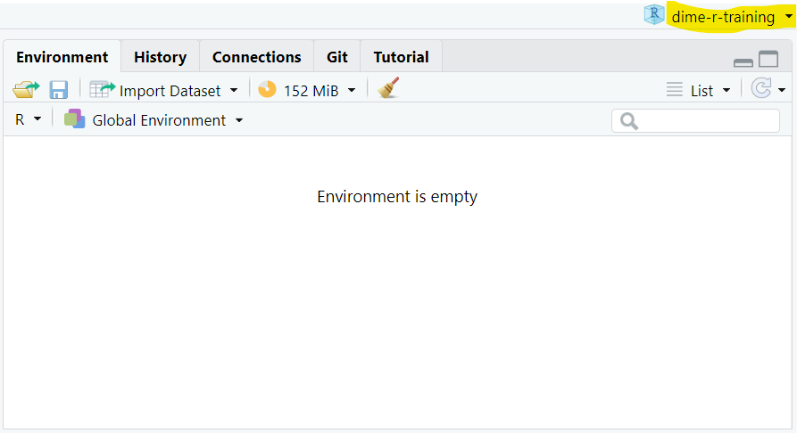
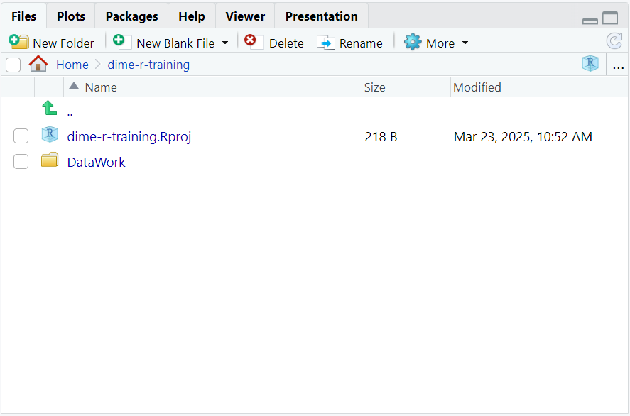

```{r setup, include=FALSE}

# Load packages
library(knitr)
library(tidyverse)
library(hrbrthemes)
library(fontawesome)
library(xaringanExtra)
library(here)

here::i_am("Presentations/02-intro-to-R-programming.Rmd")

options(htmltools.dir.version = FALSE)
opts_chunk$set(
  fig.align = "center",
  fig.height = 4,
  dpi = 300,
  cache = T
  )

xaringanExtra::use_panelset()
xaringanExtra::use_webcam()
xaringanExtra::use_clipboard()
htmltools::tagList(
  xaringanExtra::use_clipboard(
    success_text = "<i class=\"fa fa-check\" style=\"color: #90BE6D\"></i>",
    error_text = "<i class=\"fa fa-times-circle\" style=\"color: #F94144\"></i>"
  ),
  rmarkdown::html_dependency_font_awesome()
)

xaringanExtra::use_logo(
  image_url = here("Presentations",
                   "img",
                   "lightbulb.png"),
  exclude_class = c("inverse", 
                    "hide_logo"),
  width = "50px"
)
```

```{css, echo = F, eval = T}
@media print {
  .has-continuation {
    display: block !important;
  }
}

```

```{r, echo = FALSE, include=FALSE, eval = TRUE}
whr <- read_csv(here("DataWork", "DataSets", "Final", "whr_panel.csv"))
```

# Table of contents

1. [Introduction](#introduction)
1. [Initial settings](#initial-settings)
1. [File paths](#file-paths)
1. [Using libraries](#using-packages)
1. [Functions inception](#functions-inception)
1. [Mapping and iterations](#mapping-and-iterations)
1. [Custom functions](#custom-functions)
1. [Appendix](#appendix)

---

class: inverse, center, middle
name: introduction

# Introduction

<html><div style='float:left'></div><hr color='#D38C28' size=1px width=1100px></html>

---

# What this session is about

* In the first session, you learned how to work with R

* You are probably eager to start programming in R by now

* But before you start, we recommend learning how to write R code that will be __reproducible, efficient, intelligible and easy to navigate__

* Indeed, that's what this session is about!

---

# What this session is about

* We will cover common coding practices in R so that you can make __the most efficient use__ for it

* We will also discuss some styling conventions to make your code __readable and reproducible__

* This will give you a solid foundation to write code in R and hopefully you'll be able to skip some painful steps of the "getting-your-hands-dirty" learning approach

---

class: inverse, center, middle
name: initial-settings

# Initial settings

<html><div style='float:left'></div><hr color='#D38C28' size=1px width=1100px></html>

---

# Initial settings

* Let's start by opening RStudio or by closing and opening it again

* Notice two things:

  1. Your environment is *probably* empty (it's okay if it's not)

```{r echo = FALSE, out.width = "60%"}
knitr::include_graphics("img/empty_environment.png")
```

---

# Initial settings

* Let's start by opening RStudio or by closing and opening it again

* Notice two things:

  1. Your environment is *probably* empty (it's OK if it's not)
  1. Go to the `Console` panel and use the up and down keys to navigate through previously executed commands. They are saved by default in a file named `.Rhistory` that you might have noticed

```{r, echo = FALSE, out.width ="70%"}
knitr::include_graphics("img/rhistory.png")
```

---

# Initial settings

* Let's start by opening RStudio or by closing and opening it again

* Notice two things:

  1. Your environment is *probably* empty (it's OK if it's not)
  1. Go to the `Console` panel and use the up and down keys to navigate through previously executed commands. They are saved by default in a file named `.Rhistory` that you might have noticed
  
* We usually want these two things —an __empty environment__ and the __history of commands__ executed in previous sessions— to be present every time we open a new RStudio session

---

# Initial settings

Have you ever seen these lines of code before?

```{r echo = FALSE, out.width = "40%"}
knitr::include_graphics("img/stataheader.jpg")
```

---

# Initial settings

Have you ever seen these lines of code before?

```{r echo = FALSE, out.width = "40%"}
knitr::include_graphics("img/stataheader.jpg")
```

* We __don't need to set the memory or the maximum number of variables__ in R

* The equivalent of `set more off` is the default

* The equivalent of `clear` is not always default setting, but we'll make sure it is set in exercise 1

---

# Initial settings

.exercise[

### Exercise 1 `r fa("keyboard")` <font size="5">(`r fa("clock")` 1 min)</font>

After this, you'll never have to use  the equivalent of `clear all`

1. Go to `Tools` > `Global Options...`

2. In the `General` tab, make sure the following options are set:

  + Un-check *Restore .RData into workspace at startup*
  + For *Save workspace to .RData on exit*, select *Never*
  + Make sure *Always save history (even when not saving .RData)* is checked
  
3. Now restart RStudio
]

---

# Initial settings

```{r echo = FALSE, out.width = "90%"}
knitr::include_graphics("img/options1.png")
```

---

# Initial settings

```{r echo = FALSE, out.width = "60%"}
knitr::include_graphics("img/options2.png")
```

---

class: inverse, center, middle
name: file-paths

# File paths

<html><div style='float:left'></div><hr color='#D38C28' size=1px width=1100px></html>

---

# File paths

* What about working directories? We usually do something like this every time we start a new script in Stata:

```{r echo = FALSE, out.width = "35%"}
knitr::include_graphics("img/stata_cd.png")
```

* The direct equivalent to `cd` in R is this command:

```{r, eval=FALSE}
setwd("your/path")
```

* However, we recommend not using it unless it's absolutely necessary (never, if possible)

---

# RStudio projects

* Instead, you should use RStudio projects and the `here` library

* RStudio projects let you "bind" your project files to a root directory, regardless of the path to it

* This is crucial because it allows smooth interoperability between different computers where the exact path to the project root directory differs

* Additionally, each RStudio project you work on keeps their own history of commands!

__Important:__ We won't get into the specifics of directory organization here, but we'll assume that all the files you use for a specific project (data, scripts, and outputs) reside in the same project directory. We'll call this the __working directory__.

---

# RStudio projects

.exercise[

### Exercise 2 `r fa("keyboard")` <font size="5">(`r fa("clock")` 3 min)</font>

1. Create a folder named `dime-r-training-202403` in your preferred location in your computer

1. Go to https://osf.io/86g3b/ and download the file in: `R for Stata Users - 2024 March` > `Data` > `DataWork.zip`

1. Unzip `DataWork.zip` in your folder `dime-r-training-202403`

1. On RStudio, select `File` > `New Project...`

1. Select `Existing Directory`

1. Browse to the location of `dime-r-training-202403` and select `Create Project`
]

---

# RStudio projects

```{r echo = FALSE, out.width = "60%"}

```

---

# RStudio projects

```{r echo = FALSE, out.width = "60%"}

```

---

# The `here` library

* `here` locates files relative to your project root

* It uses the root project directory to build paths to files easily

* It allows for interoperability between different computers where the absolute path to the same file is not the same

---

# Usage of `here`

- Load `here`

```{r, eval=FALSE}
install.packages("here") # install first if you don't have it
library(here)
```

- Now you'll be able to use `here()` to point the location of every file relative to your project root

  + For example, to load a `csv` file located in: `C:/WBG/project-root/data/raw/data-file.csv`, you should use:
  
```{r, eval=FALSE}
path <- here("data", "raw", "data-file.csv")
df   <- read.csv(path)
```

* __Notes:__

  + Your project root is the directory that contains the `.Rproj` file
  + The result of `here()` is an absolute path that points to a file or folder location in your computer

---

# File paths

.exercise[

### Exercise 3 `r fa("keyboard")` <font size="5">(`r fa("clock")` 3 min)</font>

1. Go to `File` > `New File` > `R Script` to open a new script

1. In the new script, load `here` and read the `.csv` file in `DataWork/DataSets/Final/whr_panel.csv` using `here()`

  + Use the function `read.csv()` to load the file. The argument for `read.csv()` is the result of `here()`
  + Remember to assign the dataframe you're reading to an object. You can call it `whr` as we did yesterday

]

```{r, eval=FALSE}
library(here)
whr <- read.csv(here("DataWork", "DataSets", "Final", "whr_panel.csv"))
```

---

# RStudio projects and `here`

If you did the exercise correctly, you should see the `whr` dataframe listed in the Environment panel

```{r echo = FALSE, out.width = "80%"}
knitr::include_graphics("img/environment_2021.png")
```

---

class: inverse, center, middle
name: using-packages

# Using libraries

<html><div style='float:left'></div><hr color='#D38C28' size=1px width=1100px></html>

---

# Libraries

- Installing R in your computer gives you access to its basic functions

- Additionally, you can also install libraries. Libraries are packages of additional R functions that allow you to do:

  + Operations that basic R functions don't do (example: work with geographic data)
  
  + Operations that basic R functions do, but easier (example: data wrangling)

---

# Libraries

In a nutshell:

```{r echo = FALSE, out.width = "99%"}
knitr::include_graphics("img/r-libraries.png")
```

---

# Libraries

* You can install libraries with the command `install.packages()`. Libraries are also commonly called "packages" in R programming

```{r, eval = F}
# Installing a package
install.packages("dplyr")
```

* You only have to install a library once, but you have to __load them every new session__ with `library()`

```{r, eval = F}
# Installing a package
library(dplyr)
```

---

# Libraries

- Library installation:

```{r echo = FALSE, out.width="37%"}
knitr::include_graphics("img/installation.png")
```

- Library loading:

```{r echo = FALSE, out.width="37%"}

```

---

# Using packages

.exercise[

### Exercise 4 `r fa("keyboard")` <font size="5">(`r fa("clock")` 1 min)</font>

1. Load the packages `dplyr` and `purrr` using `library(dplyr)` and `library(purrr)`

]

__Note:__ There is no need to install `dplyr` and `purrr` as they are part of the meta-library `tidyverse`, which we asked to install before this course. If you didn't have the chance to install `tidyverse`, then install `dplyr` and `purrr` with:

```{r, eval=FALSE}
install.packages("dplyr")
install.packages("purrr")
```

---

# Warnings vs errors

What if this happens?

```{r echo = FALSE, out.width = "70%"}
knitr::include_graphics("img/Warning.png")
```

---

# Warnings vs errors

R has two types of error messages, warnings and actual errors:

  * **Errors** - break your code, usually preventing it from running
  * **Warnings** - your code kept running, but R wants you to be aware of something that might be a problem later

RStudio prints warning messages but it doesn't stop the code excution if warnings occur.

---

class: inverse, center, middle
name: functions-inception

# Functions inception

<html><div style='float:left'></div><hr color='#D38C28' size=1px width=1100px></html>

---

# A function inside a function

* In R, you can __write one function inside another__

* Here's an example:

---

# A function inside a function

```{r, eval=FALSE}
# Print the summary of the logarithm of the happiness score

## The long way:
log_score <- log(whr$happiness_score)
summary(log_score)

# The shortcut
summary(log(whr$happiness_score))
```

```{r echo=FALSE}
knitr::include_app("https://luizaandrade.shinyapps.io/learnr/")
```

---

# A function inside a function

* This is a simple example of __metaprogramming__ (that's the real name of this technique) and may seem trivial, but it's not

* For starters, you can't do it in Stata!

---

# A function inside a function

```{r echo = FALSE, out.width = "50%"}
knitr::include_graphics("img/statalog.png")
```

---

# A function inside a function

* Metaprogramming is a __very powerful technique__, as you will soon see

* It's __also a common source of error__, as you can only use one function inside the other if the output of the inner function can be taken as the input of the outer function

* It can also get quite tricky to follow what a line of code with multiple functions inceptions is doing

---

# Piping

* Ever heard of piping? It's this: `%>%`

* Piping is a way of doing metaprogramming

* The actual meaning of the pipes is: *Pipes take the __output__ of the function at the left and pass it as the __first argument__ of the function at the right*

* The advantages of using piping is that it allows to have a cleaner division of successively applied functions in R code, __drastically improving code readability__

---

# Piping

```{r, eval = F}
  # 1: Doing it the long way -----------------------------
  log_score <- log(whr$happy_score)
  mean(log_score)

  # 2: Shortcut to get to the same place -----------------
  mean(log(whr$happy_score))

  # 3: Now with pipes ------------------------------------
  whr$happy_score %>%
    log() %>%
    mean()
```

In other words:

* `x %>% f()` is the same as `f(x)`

* `x %>% f() %>% g()` is the same as `g(f(x))`

---

# Piping

## Always use pipes!

Now that you now about the power of the pipes, use them wisely!

.pull-left[
- Remember that pipes are part of the library `dplyr`, you need to load it before using them

- Pipes also avoid the hassle of having to save intermediate results in new objects in nthe environment, improving efficiency

- Many R coders use pipes and internet examples assume you know them

- **We'll use pipes now in the next examples and exercises of the rest of this training**
]

.pull-right[
```{r echo = FALSE, out.width="45%"}
knitr::include_graphics("img/pipes-joke.png")
```
]

---

class: inverse, center, middle
name: mapping-and-iterations

# Mapping and iterations

<html><div style='float:left'></div><hr color='#D38C28' size=1px width=1100px></html>

---

# Iterations in R

* In Stata, we use `for` loops very frequently

* In R, the syntax of `for` loops is this:

```{r, eval = T}
    for (number in 1:3) {
        print(number)
    }
```

---

# Map

* R, however, has a set of functions that allows users to loop through an object __in a more efficient way__, without using explicit loops

* In this training we'll introduce `map()`. It is a function part of `purrr`,  a package that contains tools for functional programming

* Also, in case you have not noticed yet: __R is vectorized!__ this means that many operations are applied element-wise by default so you don't have to code loops to apply them to each element of a vector or dataframe

---

# Map

* To use `map()`, you need to load the package `purrr`

* The basic syntax of `map()` is:

.command[

**`map(X, function, ...)`:** applies `function` to each of the elements of `X`. If `X` is a dataframe then `function` is applied column-wise while if it's a vector or a list it is applied item-wise. The output of `map()` is always a list with the results.

  + **X:** a dataframe, matrix or vector the function will be applied to
  + **function:** the name of the function you want to apply to each of the elements of `X`
]


---

# Map

```{r, eval=FALSE}
# Round the values of the following vector
x <- c(1.2, 2.5, 9.1, 5.8)
x %>% map(round) # Rounding the vector elements (same as map(x, round))
round(x)         # since R is vectorized, this also works
```

```{r echo=FALSE}
knitr::include_app("https://luizaandrade.shinyapps.io/learnr/")
```

---

# Map vs looping

* When looping, you repeat the same operation over a set of items

* `map()`, instead, takes all your elements at once and applies an operation to them simultaneously

* The difference is like this:

  + Imagine you ask a yes/no question to a group of people
  + You can collect the answers by asking each one of them individually -- __this is looping__
  + Otherwise, you can ask them to raise their hands and collect all answers at once -- __this is `map()`__

---

# Map vs looping

* The output of a loop is the regular output of the operation you're repeating, times the number of iterations you did

* The output of `map()` will be always a list

* When it comes to code clarity, `map()` has a few advantages:

 + Loops often have side effect results, like a temporary variable that stays in the environment after the loop finishes
 + `map()` often involves less lines of code than loops

---

# Map vs looping

.exercise[

### Exercise 5: Looping over a dataframe <font size="5">(`r fa("clock")` 3 min)</font>

- Create a toy dataframe of 50,000 columns and 400 observations using this code

```{r, eval = FALSE}
df <- data.frame(replicate(50000, sample(1:100, 400, replace=TRUE)))
```

- Create an empty vector named `col_means_loop` where you will store column means with this code: `col_means_loop <- c()`
- Loop over every column to get the column means and store them in the vector

```{r, eval = FALSE}
for (column in df) {
  ....
}
```

- Inside the loop:

  + Use `mean()` to get each column mean
  + Use `append()` to add a new mean to the vector: `col_means_loop <- append(col_means_loop, new_mean)`

]

---

# Map vs looping

The solution is this:

```{r, eval=FALSE}
df <- data.frame(replicate(50000, sample(1:100, 400, replace=TRUE)))

col_means_loop <- c()

for (column in df){
  col_means_loop <- append(col_means_loop, mean(column))
}
```

---

# Map vs looping

.exercise[

### Exercise 6: Now use `map()` `r fa("keyboard")` <font size="5">(`r fa("clock")` 1 min)</font>

1. Use `map()` to produce a list with the means of the columns of `df`
1. Store the result in a list named `col_means_map`

]

Hints:
  + Remember the syntax of `map()`: `map(X, function_name)`
  + The function name inside `map()` shouldn't have parentheses next to it (i.e.: `mean` instead of `mean()`)

---

# Map vs looping

Compare the syntax of the solutions of both exercises:

```{r, eval=FALSE}
# Dataframe creation
df <- data.frame(replicate(50000, sample(1:100, 400, replace=TRUE)))

# Loop exercise
col_means_loop <- c()

for (col in df){
  col_means_loop <- append(col_means_loop, mean(col))
}

# Map exercise
col_means_map <- map(df, mean)
```

Do you remember which one ran faster?

---

# Map vs looping

Also, remember we said that loops produce side effects?

```{r echo = FALSE, out.width = "50%"}
knitr::include_graphics("img/loop-side-effects.png")
```

---

# Map vs looping

* `map()` looks nice, doesn't it?

* But what about cases when it's impossible to implement the operations I want to apply in only one function? Do I have to use `for` loops then?

* Not at all! Let's get to the next section for those cases.

---

class: inverse, center, middle
name: custom-functions

# Custom functions

<html><div style='float:left'></div><hr color='#D38C28' size=1px width=1100px></html>

---

# Writing your own functions

* As we have said several times, __R is super flexible__

* One example of that is that it's __super easy and quick to create custom functions__

* Here's how:

---

# Custom functions

```{r, eval=FALSE}
  square <- function(x) {
    y <- x ^ 2
    return(y)
  }
```  

```{r echo=FALSE}
knitr::include_app("https://luizaandrade.shinyapps.io/learnr/")
```

---

# Custom functions

.exercise[

### Exercise 7 `r fa("keyboard")` <font size="5">(`r fa("clock")` 2 min)</font>

Create a function named `zscore` that standardizes the values of a vector.

> **Hints:**
* The command to obtain the mean of a vector is `mean(x)`
* The command to get the SD of a vector is `sd(x)`
* R is vectorized: you can operate vectors and numbers directly and the result will be a vector
* Don't forget to include the argument `na.rm = TRUE` in `mean()` and `sd()`
* Recall the syntax of custom functions in R:

```{r eval=F}
function_name <- function(input) {
  
  output <- operation(input)
  
  return(output)

}
```

]


---

# Custom functions

```{r}
zscore <- function(x) {
    mean <- mean(x, na.rm = TRUE)
    sd   <- sd(x, na.rm = TRUE)
    z    <- (x - mean)/sd
    return(z)
  }
```

```{r echo=FALSE}
knitr::include_app("https://luizaandrade.shinyapps.io/learnr/")
```

---

# Custom functions

.exercise[

### Exercise 8 `r fa("keyboard")`

1. Subselect the columns `health_life_expectancy` and `freedom` in `whr`

  + Use dplyr's `select()` for this, as in: `whr %>% select(freedom, happiness_score)` 

2. Use `map()` combined with the `zscore` function to get the z-score of these two columns and assign the resulting list to an object named `z_scores`

3. Use list indexing on `z_scores` to generate two new columns in `whr` with the standardized values of `health_life_expectancy` and `freedom`
  
 **Hints:**
* Don't use parenthesis next to the function name we're using `map()` with
* Use double brackets instead of single brackets or the symbol `$` to index the elements of a list

]

---

# Custom functions

```{r, eval=FALSE}
z_scores <- whr %>%
  select(health_life_expectancy, freedom) %>%
  map(zscore)
whr$hle_st <- z_scores[[1]]
whr$freedom_st <- z_scores[[2]]
```

```{r echo=FALSE}
knitr::include_app("https://luizaandrade.shinyapps.io/learnr/")
```

---

class: inverse, center, middle

# Thank you!

---

class: inverse, center, middle
name: appendix

# Appendix

---

# Appendix - `.Rhistory` and `.RData`

* `.Rhistory` automatically stores the commands entered in the console

* `.RData` stores the objects in your environment only if you save your workspace, and loads them again in the next RStudio session

* Both files are stored in the working directory where your RStudio session started

---

# Appendix - More on packages

Once a package is loaded, you can use its features and functions. Here's a list of some useful packages:

* `Rcmdr` - easy to use GUI
* `swirl` - an interactive learning environment for R and statistics.
* `ggplot2` - beautiful and versatile graphics (the syntax is a pain, though)
* `stargazer` - awesome latex regression and summary statistics tables
* `foreign` - reads `.dta` and other formats from inferior statistical software
* `zoo` - time series and panel data manipulation useful functions
* `data.table` - some functions to deal with huge dataframes
* `sp` and `rgeos` - spatial analysis
* `multiwayvcov` and `sandwich` - clustered and robust standard errors
* `RODBC`, `RMySQL`, `RPostgresSQL`, `RSQLite` - For relational databases and using SQL in R.

---

# Appendix - Git

Git is a version-control system for tracking changes in code and other text files. It is a great resource to include in your work flow.

We didn't cover it here because of time constraints, but below are some useful links, and DIME Analytics provides trainings on Git and GitHub, so keep an eye out for them.

* **DIME Analytics git page:** https://worldbank.github.io/dimeanalytics/git/

* **A Quick Introduction to Version Control with Git and GitHub:** https://journals.plos.org/ploscompbiol/article?id=10.1371/journal.pcbi.1004668

---

# Appendix - More on R projects

If you want to learn more about them, we recommend starting here:
https://r4ds.had.co.nz/workflow-projects.html

---

# Appendix - More on folder management

* A discussion of folder structure and data managament can be found here: https://dimewiki.worldbank.org/wiki/DataWork_Folder

* For a broader discussion of data management, go to https://dimewiki.worldbank.org/wiki/Data_Management

---

# Appendix - Column extraction operators

* Remember the use of `$` to extract columns from a dataframe?

* Other than `$`, we can also use double brackets to extract the column of a dataframe:

```{r, eval=FALSE}
# With $:
whr$year
```

```{r, eval=FALSE}
# With [[]]:
whr[["year"]] # Notice the use of double quotes
```

---

# Appendix - Column extraction operators: `[[]]` vs `$`

What's the key difference between them?

Well, `[[]]` lets us use other objects to refer to column names, while `$` doesn't

```{r}
col_name <- "year"
head(whr$col_name) # this returns a NULL object because no column has the name "col_name" in whr
```

```{r}
col_name <- "year"
head(whr[[col_name]])
```

---

# Appendix - Column extraction operators: `[[]]` vs `$`

This difference is key because we can use `[[]]` to loop through column names, while this is not directly possible with `$`.

```{r}
# Printing the first observation of every column of whr
for (col in colnames(whr)) {
  whr[[col]] %>%
    head(1) %>%
    print()
}
```

---

# Appendix - Apply

* Apart from purrr's `map()`, base R also has a set of functions that allows users to apply a function to a number of objects without using explicit loops

* They're called `apply` and there are many of them, with different use cases

* If you look for the `apply` help file, you can see all of them

* We'll show only two of them, `sapply` and `apply`

---

# Appendix - Apply

* The syntax of `sapply()` is:

```{r, eval=FALSE}
sapply(X, FUN, ...)
```

* Its main arguments are:

  + **X:** a dataframe, matrix or vector the function will be applied to
  + **FUN:** the function you want to apply

* `sapply()` applies the function (`FUN`) to all the elements of `X`. If `X` is a dataframe then the function is applied column-wise, while if it's a vector or a list it is applied item-wise

* The output of `sapply()` is usually a vector with the results, but it can be a matrix if the results have more than one dimension

---

# Appendix - Apply

```{r, eval=FALSE}
    # A for loop in R
    for (number in c(1.2, 2.5)) {
      print(round(number))
    }

    # A much more elegant option
    sapply(c(1.2, 2.5), round)
```

---

# Appendix - Apply

```{r, eval=FALSE}
# Printing the first observation of every column of whr
for (col in names(whr)) {
  print(head(whr[[col]], 1))
} # Option 1

sapply(whr, head, 1) # A more elegant and efficient option
```

---

# Appendix - Apply

* A more general version of `sapply()` is the `apply()` function. This is its syntax:

```{r, eval=FALSE}
apply(X, MARGIN, FUN, ...)
```

* Arguments:

  + **X:** a dataframe (or matrix) the function will be applied to
  + **MARGIN:** 1 to apply the function to all rows or 2 to apply the function to all columns
  + **FUN:** the function you want to apply

* `apply()` applies a function (`FUN`) to all columns or rows of matrix (`X`). A value of 1 in `MARGIN` indicates that the funcion should be applied row-wise, while 2 indicates columns

---

# Appendix - Apply

```{r, eval = FALSE}
matrix <- matrix(c(1, 24, 9, 6, 9, 4, 2, 74, 2), nrow = 3) # Defining a matrix
apply(matrix, 1, mean) # row means
apply(matrix, 2, mean) # column means
```

---

# Appendix - Assignment 1

### Exercise: Get the row max

1. Select the columns `freedom` and `happiness_score` of `whr`

2. Use `apply()` to get the row max between these two columns, for every row

* Hints:
  + Remember the syntax of `apply()`: `apply(X, MARGIN, FUN)`
  + A value of 1 for `MARGIN` indicates that the function must applied row-wise
  + The function to get the maximum over a set of number is `max`

---

# Appendix - Apply

Solution: 

```{r, eval=FALSE}
whr %>%
  select(freedom, happiness_score) %>%
  apply(1, max)
```

---

# Appendix - Commenting

* To comment a line, write `#` as its first character

```{r, eval=FALSE}
# This is a comment
print("But this part is not")
```

* You can also add `#` halfway through a line to comment whatever comes after it

```{r, eval=FALSE}
print("This part is not a comment") # And this is a comment
```

* In Stata, you can use `/*` and `*/` to comment in the middle of a line's code. That is not possible in R: everything that comes after `#` will always be a comment

* To comment a selection of lines, press `Ctrl` + `Shift` + `C`

---

# Appendix - Assignment 2

.exercise[

### Exercise `r fa("keyboard")`

1. In your script panel, select all the lines of your script

2. Use the keyboard shortcut to comment these lines.
  + Shortcut: `Ctrl` + `Shift` + `C`

3. Use the keyboard shortcut to comment these lines again. What happened?

]

---

# Appendix - Document outline

* RStudio allows you to __create an interactive index__ for your scripts

* To add a section to your code, create a commented line with the title of your section and add at least 4 trailing dashes (`----`), pound signs (`####`) or equal signs (`====`) after it

---

# Appendix - Document outline

* The outline can be accessed by clicking on the button on the top right corner of the script window. You can use it to jump from one section to another

* You can also use the keyboard shortcuts `Alt + L` (`Cmd + Option + L` on Mac) and `Alt + Shift + L` to collapse and expand sections

```{r echo = FALSE, out.width = "65%"}
knitr::include_graphics("img/document-outline.png")
```

---

# Appendix - Indentation

```{r, eval = F}
# Here's some code
annualHappy_reg <- aggregate(happy_score ~ year + region, data = whr, FUN = mean)
ggplot(annualHappy_reg,aes(y = happy_score,x = as.factor(year), color = region, group = region)) +
geom_line() + geom_point()

```

```{r, eval = F}
# Here's the same code
annualHappy_reg <-
  aggregate(happiness_score ~ year + region,
            data = whr,
            FUN = mean)

ggplot(annualHappy_reg,
       aes(y = happiness_score,
           x = as.factor(year),
           color = region,
           group = region)) +
geom_line() +
geom_point()

```

---

# Appendix - Indentation

```{r, eval = T, echo = F, out.width = "60%"}
annualHappy_reg <-
  aggregate(happiness_score ~ year + region,
            data = whr,
            FUN = mean)

ggplot(annualHappy_reg,
       aes(y = happiness_score,
           x = as.factor(year),
           color = region,
           group = region)) +
geom_line() +
geom_point()
```

---

# Appendix - Indentation

* R understands what unindented code says, but it can be __quite difficult for a human being to read it__

* On the other hand, __white space does not have a special meaning for R__, so it will understand code that is more readable for a human being

---

# Appendix - Indentation

* Indentation in R looks different than in Stata:

 - To indent a whole line, you can select that line and press `Tab`
 - To unindent a whole line, you can select that line and press `Shift + Tab`
 - However, this will not always work for different parts of a code in the same line

* In R, we typically don't introduce white space manually

* It's rather introduced by RStudio for us

---

# Appendix - Assignment 3

.exercise[

### Exercise `r fa("keyboard")`

To see an example of how indenting works in RStudio, let's use an example with `map()`:

```{r, eval = F}
# An elegant "loop" in R
map(c(1.2, 2.5, 9.1, 5.8), round)
```

1. Add a line between the two arguments of the function (the vector of numbers and `round`)

2. Now add a line between the numbers in the vector.
]

---

# Appendix - Indentation

Note that RStudio formats the different arguments of the function differently:

```{r, eval = F}
# A much more elegant loop in R
map(c(1.2,
      2.5,
      9.1,
      5.8),
    round)
```

---

# Appendix - Exploring a dataframe

Some useful functions:

* **`View()`:** opens a visualization of the dataframe

* **`class()`:** reports object type or type of data stored

* **`dim()`:** reports the size of each one of an object's dimension

* **`names()`:** returns the variable names of a dataframe

* **`str()`:** general information about the structure of an R object

* **`summary()`:** summary information about the variables in a dataframe

* **`head()`:** shows the first few observations in the dataframe

* **`tail()`:** shows the last few observations in the dataframe

---
exclude: true

```{R, pdfs, include = F, eval = F}
pagedown::chrome_print("02-intro-to-R-programming.html", output = "02-intro-to-R-programming.pdf")

# or
source("https://git.io/xaringan2pdf")
xaringan_to_pdf("Presentations/02-intro-to-R-programming.html")
```