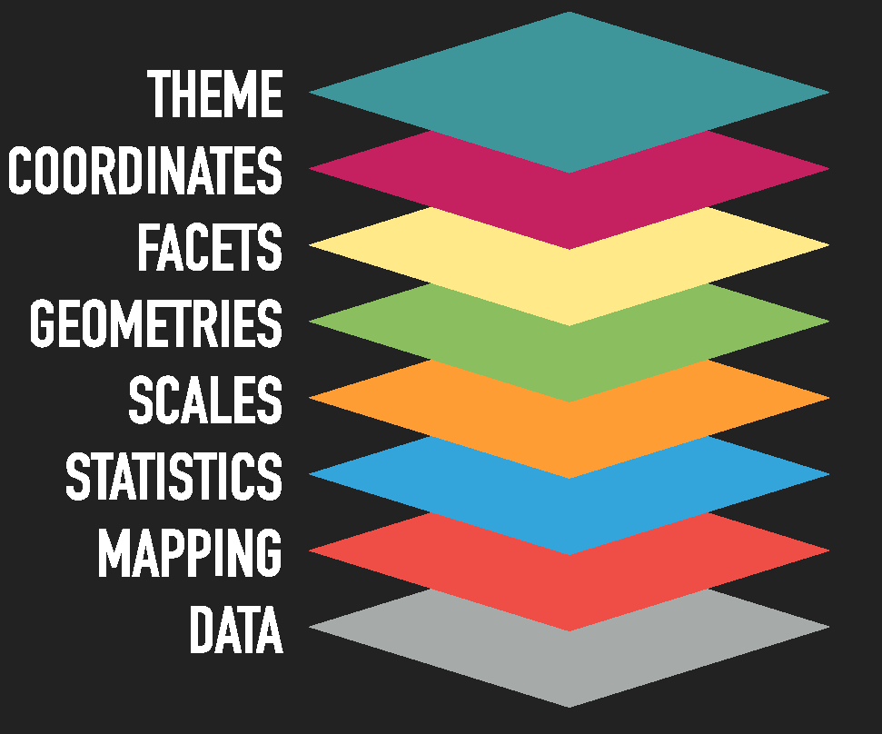

```{r setup, include = FALSE}

# Load packages
library(knitr)
library(tidyverse)
library(hrbrthemes)
library(fontawesome)
library(here)
library(xaringanExtra)

here::i_am("Presentations/03-data-visualization.Rmd")

options(htmltools.dir.version = FALSE)
opts_chunk$set(
  fig.align = "center",
  fig.height = 4,
  dpi = 300,
  cache = T
  )

xaringanExtra::use_panelset()
xaringanExtra::use_webcam()
xaringanExtra::use_clipboard()
htmltools::tagList(
  xaringanExtra::use_clipboard(
    success_text = "<i class=\"fa fa-check\" style=\"color: #90BE6D\"></i>",
    error_text = "<i class=\"fa fa-times-circle\" style=\"color: #F94144\"></i>"
  ),
  rmarkdown::html_dependency_font_awesome()
)

xaringanExtra::use_logo(
  image_url = here("Presentations",
                   "img",
                   "lightbulb.png"),
  exclude_class = c("inverse", 
                    "hide_logo"),
  width = "50px"
)
```

# Table of contents

1. [Introduction](#intro)

2. [Exploratory Analysis](#ea)

4. [`ggplot`](#ggplot)

5. [Saving a plot](#saving)

6. [Homework](#hw)

7. [References and recommendations](#references)


---

class: inverse, center, middle
name: intro

# Introduction

<html><div style='float:left'></div><hr color='#D38C28' size=1px width=1100px></html>

---

# Introduction

### Goals of this session

In this session, you’ll learn how to use R to produce insightful, meaningful and (hopefully) nice-looking graphs. In particular, you’ll use a package
called `ggplot2` from the `tidyverse` meta-package.

Similarly to previous sessions, you can find some references at the end of this presentation that include a more comprehensive discussions on data visualization.

---

# Introduction

### Before we start

* Make sure the packages `ggplot2` and `plotly` are installed and loaded.
* Load the `whr_panel` data set.

```{r, warnings = F}
# Packages
library(tidyverse)
library(plotly)
library(here)

whr_panel <- readRDS(here("DataWork", 
                          "DataSets", 
                          "Final", 
                          "whr_panel.Rds"))

```


---

# Introduction

In our workflow there are usually two distinct uses for plots:

1. **Exploratory analysis**: Quickly visualize your data in an insightful way.
  * Base R can be used to quickly create (ugly) basic figures
  * We will also use `ggplot2` to quickly create (less ugly) basic figures.

2. **Publication/Reporting**: Make pretty graphs for a presentation, a project report, or to just show your boss something other than the laziest graph you could come up with:
  * We’ll do this using `ggplot2` with more customization. The idea is to create beautiful graphs.
  * `ggplot2`’s syntax is more complicated, but it’s easier to make your graphs look good with it.

---
class: inverse, center, middle
name: ea

# Exploratory Analysis

<html><div style='float:left'></div><hr color='#D38C28' size=1px width=1100px></html>

---

# Base Plot

First, we’re going to use base plot, i.e., using Base R default libraries. It is easy to use and can produce useful graphs with very few lines of code.

### Exercise 1: Exploratory graph.

Let's plot the `whr` dataset that we constructed last week. We are going to use the function `plot()`. Before we plot it, let's create a vector called `vars` that contains the variables: `economy_gdp_per_capita`, `happiness_score`, `health_life_expectancy`, and `freedom`.

--

```{r}
# Vector of variables

vars <- c("economy_gdp_per_capita", "happiness_score", "health_life_expectancy", "freedom")

# Create a subset with only those variables, let's called this subset whr_simp

whr_simp <- whr_panel %>%
  select(all_of(vars))

```

---

# Base Plot

```{r, out.width = "70%"}
plot(whr_simp)
```

---

# The beauty of ggplot2

### Some advantages of `ggplot2`

1. Consistency with the [**Grammar of Graphics**](https://www.springer.com/gp/book/9780387245447)
  * This book is the foundation of several data viz applications: `ggplot2`, `polaris-tableau`, `vega-lite`
2. Flexibility
3. Layering and theme customization
4. Community

It is a powerful and easy to use tool (once you understand its logic) that produces complex and multifaceted plots.

---

# ggplot2: structure

After we have load our dataset. Let's plot something basic. The structure of a basic ggplot is:


.pull-left[
```
ggplot(data = <DATA>) +
  <GEOM_FUNCTION>(
     mapping = aes(<MAPPINGS>),
     stat = <STAT>,
     position = <POSITION>
  ) +
  <COORDINATE_FUNCTION> +
  <FACET_FUNCTION> +
  <SCALE_FUNTION> +
  <THEME_FUNCTION>

```
]

.pull-right[

1. `Data`: The data that you want to visualize
2. `Layers`: geom_ and stat_ → The geometric shapes and statistical summaries representing the data
3. `Aesthetics`: aes() → Aesthetic mappings of the geometric and statistical objects
4. `Scales` scale_ → Maps between the data and the aesthetic dimensions
5. `Coordinate system`: coord_ → Maps data into the plane of the data rectangle
6. `Facets`: facet_ → The arrangement of the data into a grid of plots
7. `Visual themes`: theme() and theme_ → The overall visual defaults of a plot
]

---

# ggplot2: decomposition

.pull-left[

.center[

### There are multiple ways to structure plots in ggplot. 

For this presentation, I will stick to Thomas Lin Pedersen's decomposition who is one of most prominent developers of the ggplot and gganimate package
]
]

.pull-right[



]


---

# Exploratory Analysis

#### Let's start making some plots.


```{r, out.width = "65%"}
ggplot(data = whr_panel) +    #<<
  geom_point(mapping = aes(x = happiness_score, y = economy_gdp_per_capita))
```

---

# Exploratory Analysis

#### Ok, enough chit-chat about the gramar of graphics. Let's start making some plots.


```{r, out.width = "65%"}
ggplot(data = whr_panel) +
  geom_point(mapping = aes(x = happiness_score, y = economy_gdp_per_capita))  #<<
```

---

# Exploratory Analysis

#### We can also set up our mapping in the `ggplot()` function.

```{r, out.width = "65%"}
ggplot(data = whr_panel, aes(x = happiness_score, y = economy_gdp_per_capita)) +   #<<
  geom_point()
```

---

# Exploratory Analysis

#### We can also set up the data outside the `ggplot()` function as follows:

```{r, out.width = "65%"}
whr_panel %>%  #<<
  ggplot(aes(x = happiness_score, y = economy_gdp_per_capita)) +
  geom_point()
```

---

# Exploratory Analysis

I prefer to use the second way of structuring our ggplot.

1. First, setting our data;
2. pipe it;
3. then aesthetics;
4. and finally the geometries.

Both structures will work but this will make a difference if you want to load more datasets at the same time, and whether you would like to combine more geoms in the same ggplot. More on this in the following slides.

---

# Exploratory Analysis

### Exercise 2: Create a scatter plot with x = freedom and y = economy_gdp_per_capita.

--

```{r, out.width = "55%"}
ggplot(data = whr_panel, aes(x = freedom, y = economy_gdp_per_capita)) +
  geom_point()
```

---

# Exploratory Analysis

The most common `geoms` are:


* `geom_bar()`, `geom_col()`: bar charts.
* `geom_boxplot()`: box and whiskers plots.
* `geom_density()`: density estiamtes.
* `geom_jitter()`: jittered points.
* `geom_line()`: line plots.
* `geom_point()`: scatter plots.


> If you want to know more about layers, you can refer to [this](https://ggplot2.tidyverse.org/reference/).


---

# Exploratory Analysis

In summary, our basic plots should have the following:

.pull-left[

```{r eval = FALSE}
ggplot(data = whr_panel, #<<
       aes(x = happiness_score,
           y = economy_gdp_per_capita)) +
  geom_point()
```

]

.pull-right[

The data we want to plot.
]

---

# Exploratory Analysis

In summary, our basic plots should have the following:

.pull-left[

```{r eval = FALSE}
ggplot(data = whr_panel,
       aes(x = happiness_score,           #<<
           y = economy_gdp_per_capita)) + #<<
  geom_point()
```

]

.pull-right[

Columns to use for `x` and `y`
]

---

# Exploratory Analysis

In summary, our basic plots should have the following:

.pull-left[

```{r eval = FALSE}
ggplot(data = whr_panel,
       aes(x = happiness_score,
           y = economy_gdp_per_capita)) +
  geom_point()  #<<
```

]

.pull-right[

How the plot is going to be drawn.
]

---

# Exploratory Analysis

We can also **map** colors.

```{r, out.width = "50%"}
ggplot(data = whr_panel,
       aes(x = happiness_score,
           y = economy_gdp_per_capita,
           color = region)) +  #<<
  geom_point()
```

---

# Exploratory Analysis

Let's try to do something different, try, instead of `region`, adding `color = "blue"` inside `aes()`.

* What do you think is the problem with this code?

--

```{r, out.width = "50%"}
ggplot(data = whr_panel,
       aes(x = happiness_score,
           y = economy_gdp_per_capita,
           color = "blue")) +  #<<
  geom_point()
```

---

# Exploratory Analysis

In `ggplot2`, these settings are called **aesthetics**.

> "Aesthetics of the geometric and statistical objects".

We can set up:

* `position`:  x, y, xmin, xmax, ymin, ymax, etc.
* `colors`: color and fill.
* `transparency`: alpha.
* `sizes`: size and width.
* `shapes`: shape and linetype.


Notice that it is important to know where we are setting our aesthetics. For example:

* `geom_point(aes(color = region))` to color points based on the variable `region`
* `geom_point(color = "red")` to color all points in the same color.


---

# Exploratory Analysis

Let's modify our last plot. Let's add `color = "blue"` inside `geom_point()`.

--

```{r, out.width = "50%"}
ggplot(data = whr_panel,
       aes(x = happiness_score,
           y = economy_gdp_per_capita)) +
  geom_point(color = "blue") #<<
```

---

# Exploratory Analysis

### Exercise 3: Map colors per year for the freedom and gdp plot we did before.

* Keep in mind the type of the variable `year`.

--

```{r, out.width = "45%"}
ggplot(data = whr_panel,
       aes(x = freedom, y = economy_gdp_per_capita, color = year)) +
  geom_point()
```

--

* How do you think we could solve it?

---

# Exploratory Analysis

### Exercise 3: Map colors per year for the freedom and gdp plot we did before.

* Keep in mind the type of the variable `year`.
* Change the variable `year`as: `as.factor(year)`.

--

```{r, out.width = "45%"}
ggplot(data = whr_panel,
       aes(x = freedom, y = economy_gdp_per_capita, color = as.factor(year))) + #<<
  geom_point()
```

---
class: inverse, center, middle
name: ggplot

# ggplot2: settings

<html><div style='float:left'></div><hr color='#D38C28' size=1px width=1100px></html>

---

# ggplot2: settings

Now, let's try to modify our plots. In the following slides, we are going to:

1. Change shapes.

1. Include more geoms.

1. Separate by regions.

1. Pipe and mutate before plotting.

1. Change scales.

1. Modify our theme.


---

# ggplot2: shapes


```{r, out.width = "65%"}
ggplot(data = whr_panel,
       aes(x = happiness_score,
           y = economy_gdp_per_capita)) +
  geom_point(shape = 5) #<<
```

---

# ggplot2: shapes

```{r echo = FALSE, eval = TRUE, out.width = "75%", message = FALSE}
library(ggpubr)
show_point_shapes()+
 theme_minimal()
```

---

# ggplot2: including more geoms

```{r, out.width = "60%"}
ggplot(data = whr_panel,
       aes(x = happiness_score,  y = economy_gdp_per_capita)) +
  geom_point() +
  geom_smooth()   #<<

```

---

# ggplot2: Facets

```{r, out.width = "55%"}
ggplot(data = whr_panel,
       aes(x = happiness_score,  y = economy_gdp_per_capita)) +
  geom_point() +
  facet_wrap(~ region) #<<
```

---

# ggplot2: Colors and facets

### Exercise 4: Use the last plot and add a color aesthetic per region.

--

```{r, out.width = "55%"}
ggplot(data = whr_panel,
       aes(x = happiness_score,  y = economy_gdp_per_capita, color = region)) + #<<
  geom_point() +
  facet_wrap(~ region)

```

---

# ggplot2: Pipe and mutate before plotting

Let's imagine now, that we would like to transform a variable before plotting.


.panelset[
.panel[.panel-name[R Code]


```{r, out.width = "55%", eval = FALSE}
whr_panel %>%
  mutate( #<<
    latam = ifelse(region == "Latin America and Caribbean", TRUE, FALSE) #<<
  ) %>%  #<<
  ggplot(aes(x = happiness_score, y = economy_gdp_per_capita,
             color = latam)) + #<<
  geom_point()

```

]

.panel[.panel-name[Plot]


```{r, out.width = "55%", echo = FALSE}
whr_panel %>%
  mutate(
    latam = ifelse(region == "Latin America and Caribbean", TRUE, FALSE)
  ) %>%
  ggplot(aes(x = happiness_score, y = economy_gdp_per_capita,
             color = latam)) +
  geom_point()

```

]


]

---

# ggplot2: geom's sizes

We can also specify the size of a geom, either by a variable or just a number.

```{r, out.width = "40%"}
whr_panel %>%
  filter(year == 2017) %>%
  ggplot(aes(x = happiness_score,  y = economy_gdp_per_capita)) +
  geom_point(aes(size = economy_gdp_per_capita)) #<<

```

---

# ggplot2: Changing scales


.panelset[
.panel[.panel-name[Linear]

```{r, out.width = "50%"}
ggplot(data = whr_panel,
       aes(x = happiness_score,
           y = economy_gdp_per_capita)) +
  geom_point()
```

]

.panel[.panel-name[Log]

```{r, out.width = "50%"}
ggplot(data = whr_panel,
       aes(x = happiness_score,
           y = economy_gdp_per_capita)) +
  geom_point() +
  scale_x_log10() #<<
```

]

]


---

# ggplot2: Themes

Let's go back to our plot with the `latam` dummy.

We are going to do the following to this plot:

1. Filter only for the year 2015.
2. Change our theme.
3. Add correct labels.
4. Add some annotations.
5. Modify our legends.


---

# ggplot2: Labs


.panelset[
.panel[.panel-name[R Code]

```{r, out.width = "40%", eval = FALSE}
whr_panel %>%
  mutate(
    latam = ifelse(region == "Latin America and Caribbean", TRUE, FALSE)
  ) %>%
  filter(year == 2015) %>%  #<<
  ggplot(aes(x = happiness_score, y = economy_gdp_per_capita,
             color = latam)) +
  geom_point() +
  labs(#<<
    x = "Happiness Score", #<<
    y = "GDP per capita", #<<
    title = "Happiness Score vs GDP per capita, 2015" #<<
  ) #<<

```

]

.panel[.panel-name[Plot]
```{r, out.width = "60%", echo = FALSE}
whr_panel %>%
  mutate(
    latam = ifelse(region == "Latin America and Caribbean", TRUE, FALSE)
  ) %>%
  filter(year == 2015) %>%
  ggplot(aes(x = happiness_score, y = economy_gdp_per_capita,
             color = latam)) +
  geom_point() +
  labs(
    x = "Happiness Score",
    y = "GDP per capita",
    title = "Happiness Score vs GDP per capita, 2015"
  )
```
]
]


---

# ggplot2: Legends


.panelset[
.panel[.panel-name[R Code]

```{r, out.width = "40%", eval = FALSE}
whr_panel %>%
  mutate(
    latam = ifelse(region == "Latin America and Caribbean", TRUE, FALSE)
  ) %>%
  filter(year == 2015) %>%
  ggplot(aes(x = happiness_score, y = economy_gdp_per_capita,
             color = latam)) +
  geom_point() +
  scale_color_discrete(labels = c("No", "Yes")) +  #<<
  labs(
    x = "Happiness Score",
    y = "GDP per capita",
    color = "Country in Latin America\nand the Caribbean", #<<
    title = "Happiness Score vs GDP per capita, 2015"
  )

```

]

.panel[.panel-name[Plot]
```{r, out.width = "70%", echo = FALSE}
whr_panel %>%
  mutate(
    latam = ifelse(region == "Latin America and Caribbean", TRUE, FALSE)
  ) %>%
  filter(year == 2015) %>%
  ggplot(aes(x = happiness_score, y = economy_gdp_per_capita,
             color = latam)) +
  geom_point() +
  scale_color_discrete(labels = c("No", "Yes")) +
  labs(
    x = "Happiness Score",
    y = "GDP per capita",
    color = "Country in Latin America\nand the Caribbean",
    title = "Happiness Score vs GDP per capita, 2015"
  )
```
]
]

---

# ggplot2: Themes


.panelset[
.panel[.panel-name[R Code]

```{r, out.width = "60%", eval = FALSE}
whr_panel %>%
  mutate(
    latam = ifelse(region == "Latin America and Caribbean", TRUE, FALSE)
  ) %>%
  filter(year == 2015) %>%
  ggplot(aes(x = happiness_score, y = economy_gdp_per_capita,
             color = latam)) +
  geom_point() +
  scale_color_discrete(labels = c("No", "Yes")) +
  labs(
    x = "Happiness Score",
    y = "GDP per capita",
    color = "Country in Latin America\nand the Caribbean",
    title = "Happiness Score vs GDP per capita, 2015"
  ) +
  theme_minimal() #<<

```

]

.panel[.panel-name[Plot]
```{r, out.width = "70%", echo = FALSE}
whr_panel %>%
  mutate(
    latam = ifelse(region == "Latin America and Caribbean", TRUE, FALSE)
  ) %>%
  filter(year == 2015) %>%
  ggplot(aes(x = happiness_score, y = economy_gdp_per_capita,
             color = latam)) +
  geom_point() +
  scale_color_discrete(labels = c("No", "Yes")) +
  labs(
    x = "Happiness Score",
    y = "GDP per capita",
    color = "Country in Latin America\nand the Caribbean",
    title = "Happiness Score vs GDP per capita, 2015"
  ) +
  theme_minimal()
```
]
]

---

# ggplot2: Themes

The `theme()` function allows you to modify each aspect of your plot. Some arguments are:

```{r eval = FALSE}
theme(
    # Title and text labels
    plot.title = element_text(color, size, face),
    # Title font color size and face
    legend.title = element_text(color, size, face),
    # Title alignment. Number from 0 (left) to 1 (right)
    legend.title.align = NULL,
    # Text label font color size and face
    legend.text = element_text(color, size, face),
    # Text label alignment. Number from 0 (left) to 1 (right)
    legend.text.align = NULL,
)
```

More about these modification can be found [here](https://ggplot2.tidyverse.org/reference/theme.html)

---

# ggplot2: Color palettes

We can also add color palettes using other packages such as: `RColorBrewer, viridis` or funny ones like the `wesanderson` package. So, let's add new colors.

* First, install the `RColorBrewer` package.

```{r}
# install.packages("RColorBrewer")
library(RColorBrewer)
```

* Let's add `scale_color_brewer(palette = "Dark2")` to our ggplot.


---

# ggplot2: Color palettes


.panelset[
.panel[.panel-name[R Code]

```{r, out.width = "60%", eval = FALSE}
whr_panel %>%
  mutate(
    latam = ifelse(region == "Latin America and Caribbean", TRUE, FALSE)
  ) %>%
  filter(year == 2015) %>%
  ggplot(aes(x = happiness_score, y = economy_gdp_per_capita,
             color = latam)) +
  geom_point() +
  scale_color_brewer(palette = "Dark2", labels = c("No", "Yes")) + #<<
  labs(
    x = "Happiness Score",
    y = "GDP per capita",
    color = "Country in Latin America\nand the Caribbean",
    title = "Happiness Score vs GDP per capita, 2015"
  ) +
  theme_minimal() 

```

]

.panel[.panel-name[Plot]
```{r, out.width = "70%", echo = FALSE}
whr_panel %>%
  mutate(
    latam = ifelse(region == "Latin America and Caribbean", TRUE, FALSE)
  ) %>%
  filter(year == 2015) %>%
  ggplot(aes(x = happiness_score, y = economy_gdp_per_capita,
             color = latam)) +
  geom_point() +
  scale_color_brewer(palette = "Dark2", labels = c("No", "Yes")) +
  labs(
    x = "Happiness Score",
    y = "GDP per capita",
    color = "Country in Latin America\nand the Caribbean",
    title = "Happiness Score vs GDP per capita, 2015"
  ) +
  theme_minimal()
```
]
]

---

# ggplot2: Color palettes

My favorite color palettes packages:

1. [ghibli](https://github.com/ewenme/ghibli)
2. [LaCroixColoR](https://github.com/johannesbjork/LaCroixColoR)
3. [NineteenEightyR](https://github.com/m-clark/NineteenEightyR)
4. [nord](https://github.com/jkaupp/nord)
5. [palettetown](https://github.com/timcdlucas/palettetown)
6. [quickpalette](https://github.com/EmilHvitfeldt/quickpalette)
7. [wesanderson](https://github.com/karthik/wesanderson)

---
class: inverse, center, middle
name: saving

# Saving a plot

<html><div style='float:left'></div><hr color='#D38C28' size=1px width=1100px></html>

---

# Saving a plot

Remember that in R we can always assign our functions to an object. In this case, we can assign our `ggplot2` code to an object called fig as follows.

```{r, eval = FALSE}
fig <- whr_panel %>%
  mutate(
    latam = ifelse(region == "Latin America and Caribbean", TRUE, FALSE)
  ) %>%
  filter(year == 2015) %>%
  ggplot(aes(x = happiness_score, y = economy_gdp_per_capita,
             color = latam)) +
  geom_point() +
  scale_color_discrete(labels = c("No", "Yes")) +
  labs(
    x = "Happiness Score",
    y = "GDP per capita",
    color = "Country in Latin America\nand the Caribbean",
    title = "Happiness Score vs GDP per capita, 2015"
  ) +
  theme_minimal()
```

Therefore, if you want to plot it again, you can just type `fig` in the console.

---

# Saving a plot

### Exercise 5: Save our last plot.

We will use the `ggsave()` function.  You can either include the function after your plot or, first, save the ggplot as an object and then save the plot.

The syntax is `ggsave(OBJECT, filename = FILEPATH, heigth = ..., width = ..., dpi = ...)`.

```{r, echo = FALSE}
fig <- whr_panel %>%
  mutate(
    latam = ifelse(region == "Latin America and Caribbean", TRUE, FALSE)
  ) %>%
  filter(year == 2015) %>%
  ggplot(aes(x = happiness_score, y = economy_gdp_per_capita,
             color = latam)) +
  geom_point() +
  scale_color_discrete(labels = c("No", "Yes")) +
  labs(
    x = "Happiness Score",
    y = "GDP per capita",
    color = "Country in Latin America\nand the Caribbean",
    title = "Happiness Score vs GDP per capita, 2015"
  ) +
  theme_minimal()
```

---

# Saving a plot

### How to do it?

```{r}
ggsave(fig,
       filename = here("DataWork",
                       "Output",
                       "Raw",
                       "fig.png"),
       dpi = 750, scale = 0.8,
       height = 8, width = 12)
```

---
class: inverse, center, middle

# Thank you~~


---
class: inverse, center, middle
name: references

# References and recommendations

<html><div style='float:left'></div><hr color='#D38C28' size=1px width=1100px></html>

---

# References and recommendations

* **ggplot tricks**: 
  * Tricks and Secrets for Beautiful Plots in R by Cédric Scherer: https://github.com/z3tt/outlierconf2021
  
* **Websites**:
  * Interactive stuff : http://www.htmlwidgets.org/
  * The R Graph Gallery: https://www.r-graph-gallery.com/
  * Gpplot official site: http://ggplot2.tidyverse.org/

* **Online courses**:
  * Johns Hopkins Exploratory Data Analysis at Coursera:
https://www.coursera.org/learn/exploratory-data-analysis

* **Books**:
  * The grammar of graphics by Leland Wilkinson.
  * Beautiful Evidence by Edward Tufte.
  * R Graphics cook book by Winston Chang
  * R for Data Science by Hadley Wickham andGarrett Grolemund

---
class: inverse, center, middle
name: appendix

# Appendix: interactive graphs

<html><div style='float:left'></div><hr color='#D38C28' size=1px width=1100px></html>

---

# Interactive graphs

There are several packages to create interactive or dynamic data vizualizations with R. Here are a few:

* `leaflet` - R integration tp one of the most popular open-source libraries for interactive maps.
* `highcharter` - cool interactive graphs.
* `plotly` - interactive graphs with integration to ggplot.
* `gganimate` - ggplot GIFs.
* `DT` - Interactive table

These are generally, html widgets that can be incorporated in to an html document and websites.

---

# Interactive graphs

Now we’ll use the ggplotly() function from the plotly package to create an interactive graph!

### Exercise 6: Interactive graphs.

* Load the plotly package
* Pass that object with the last plot you created to the ggplotly() function


---

# Interactive graphs

.panelset[
.panel[.panel-name[R Code]

```{r, message=FALSE, warning=FALSE, out.width = "70%", out.height="70%", out.extra = 'style="display:block; margin:auto;"', eval = FALSE}
# Load package
library(plotly)

# Use ggplotly to create an interactive plot
ggplotly(fig) %>%
  layout(legend = list(orientation = "h", x = 0.4, y = -0.2))

```
]

.panel[.panel-name[Plot]

```{r, message=FALSE, warning=FALSE, out.width = "70%", out.height="70%", out.extra = 'style="display:block; margin:auto;"', echo = FALSE}
# Load package
library(plotly)

# Use ggplotly to create an interactive plot
ggplotly(fig) %>%
  layout(legend = list(orientation = "h", x = 0.4, y = -0.2))

```
]

]

---
exclude: true

```{R, pdfs, include = F, eval = F}
pagedown::chrome_print("03-data-visualization.html", output = "03-data-visualization.pdf")

# or
source("https://git.io/xaringan2pdf")
xaringan_to_pdf("03-data-visualization.html")
```

