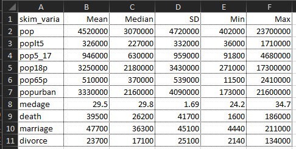
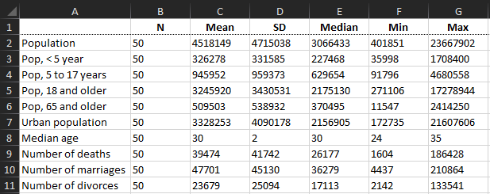
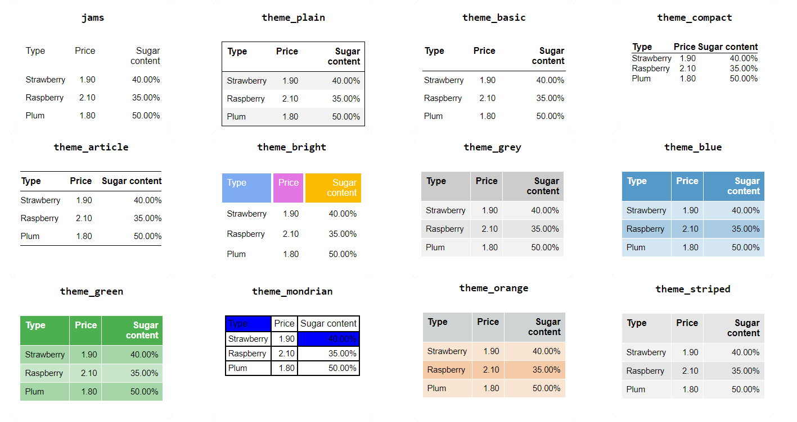

```{r setup, include = FALSE}
 
# Load packages
library(knitr)
library(tidyverse)
library(hrbrthemes)
library(fontawesome)
library(here)
library(xaringanExtra)

here::i_am("Presentations/04-descriptive-analysis.Rmd")

options(htmltools.dir.version = FALSE)
opts_chunk$set(
  fig.align = "center",
  fig.height = 4,
  dpi = 300,
  cache = T
  )

xaringanExtra::use_panelset()
xaringanExtra::use_webcam()
xaringanExtra::use_clipboard()
htmltools::tagList(
  xaringanExtra::use_clipboard(
    success_text = "<i class=\"fa fa-check\" style=\"color: #90BE6D\"></i>",
    error_text = "<i class=\"fa fa-times-circle\" style=\"color: #F94144\"></i>"
  ),
  rmarkdown::html_dependency_font_awesome()
)

xaringanExtra::use_logo(
  image_url = here("Presentations",
                   "img",
                   "lightbulb.png"),
  exclude_class = c("inverse", 
                    "hide_logo"),
  width = "50px"
)

htmltools::tagList(
  xaringanExtra::use_clipboard(
    button_text = "<i class=\"fa fa-clipboard\"></i>",
    success_text = "<i class=\"fa fa-check\" style=\"color: #90BE6D\"></i>",
    error_text = "<i class=\"fa fa-times-circle\" style=\"color: #F94144\"></i>"
  ),
  rmarkdown::html_dependency_font_awesome()
)
```

# Table of contents

.vlarge[
1. [Quick summary statistics](#exploring)
2. [Descriptive statistics tables](#desc_tables)
3. [Exporting descriptive statistics tables](#exporting)
3. [Formatting tables](#beautifying)
3. [Aggregating observations](#aggregating)
3. [Running regressions](#regressing)
3. [Exporting regression tables](#reg_tables)
]


???

Good morning, for those of you who don't know me, my name is Luiza Andrade and I am a Data Coordinator with the DIME Analytics team. 

I'm here to talk to you about creating tables in R. Although in terms of data analysis this is very similar to data visualization, in the sense that what we are doing is trying to display information about the data in the most concise and informative manner, the tools and packages required to implement the two are very different. Which is why we separated them into two sessions.

I will tell you exactly what are we going to do for the next hour and a half in a little bit, but first, let me ask you all something: what software do you usually export your tables to?

The objection of this session is to show you have to do 4 things:
- print quick statistics to explore your data
- export summary statistics tables in the most reproducible way possible
- run simple regressions
- export regression tables

I think most of you here know me already and have heard my spiel before, but since that's what I do, let's take a look at what I mean by reproducible

---

# Workflows for outputs

## .red[Not reproducible]

Anything that requires
`r fa("paste", fill = "#ac142a")` Copy-pasting
`r fa("paint-brush", fill = "#ac142a")` Manual formatting after exported

--

## .green[Reproducible]

`r fa("r-project", fill = "#046307")` R Markdown: dynamic document containing code and text that is exported directly from R into PDF, HTML, Word, Power Point and other formats 
`r fa("file-alt", fill= "#046307")` LaTeX: typesetting system used for scientific publications that automatically reloads tables and figures every time the document is rendered 

???

What is NOT reproducible? Anything that requires manual steps to update results in your final document after you update the data or the exact specification. This includes the terrible practice of printing results in the console and pasting them into Word, but also the much less terrible practice of exporting results to Excel and then manually formatting them and copying into Word.

Can someone tell me why these are not ideal practices?

The two best options to combine with R in terms of reproducibility are Markdown and LaTeX. Markdown is R's dyamic document framework and it's amazingly well developed. Most R advanced R users actually use Markdown to display their results instead of exporting tables and figures. I'm going to show you what that looks like, but this is a slightly more advanced topic that will not be covered on this course.

LaTeX, on the other hand, is widely used among non-R users, and there are plenty of packages to export tables to it in Stata as well.

But that's enough of me talking. Let's get you all to run some code

---

# Setting the stage

Load the data that we will use today: Stata's `census` dataset
```{r}
  # Load data
   census <-
    read_rds(here("DataWork",
                  "DataSets", 
                  "Final", 
                  "census.RDS"))
```

???

So first thing, as usual, is make sure you are setting your folder paths so R knows where to find files and where to export them too.

If you have already downloaded the DataWork folder from OSF, all you need to do now is edit this line of code to match your computer. I'll do it on mine in case you don't remember the exact steps.

Then we will load the packages for today: tidyverse, as usual, and two new packages: skimr and huxtable, which we will learn about soon.

Finally, let's load some data. This dataset is probably already familiar to most of you: it's Stata's built-in 1980 census data at state level.

Double-check that you can see this dataset in your environment pane. Now, can someone tell me something about this dataset and how to get a little bit of information about it?

---

# Taking a peek at the data

```{r}
glimpse(census)
```

---

# Setting the stage


Load the packages that we will use today
```{r, eval = F}
  # Install new packages
  install.packages("skimr")
  install.packages("lfe")
  install.packages("huxtable")
```

```{r, warning = FALSE}
  # Load packages
  library(tidyverse)
  library(skimr)
  library(lfe)
  library(huxtable)
```

---

class: inverse, center, middle
name: exploring

# Quick summary statistics

<html><div style='float:left'></div><hr color='#D38C28' size=1px width=1100px></html>

---

# Exploring a dataset

.command[
## `summary(x, digits)`
Equivalent to Stata's `codebook`. Its arguments are:

 * **x:** the object you want to summarize, usually a vector or data frame
 * *digits:* the number of decimal digits to be displayed
]

--

.exercise[

### Exercise `r fa("keyboard")`
Use the `summary()` function to describe the `census` data frame.
]


---

# Exploring a dataset

```{r, echo = FALSE}
include_app("https://luizaandrade.shinyapps.io/learnr/")
```

---

# Summarizing continuous variables

.large[
- `summary()` can also be used with a single variable.
- When used with continuous variables, it works similarly to `summarize` in Stata.
- When used with categorical variables, it works similarly to `tabulate`.
]

---

# Summarizing continuous variables

.exercise[

### Exercise `r fa("keyboard")`
Use the `summary()` function to display summary statistics for a continuous variable in the  `census` data frame.
]

```{r, echo = FALSE}
include_app("https://luizaandrade.shinyapps.io/learnr/")
```


---

# Summarizing categorical variables

.command[
## `table()`
Equivalent to `tabulate` in Stata, creates a frequency table. Its main arguments are vectors to be tabulated.
]

--

.exercise[
### Exercise `r fa("keyboard")`
Use the `table()` function to display frequency tables for:

1. The variable `region` in the `census` data frame
2. The variables `region` and `state` in the `census` data frame, simultaneously
]

---

# Summarizing categorical variables

## One way tabulation

```{r, echo = FALSE}
include_app("https://luizaandrade.shinyapps.io/learnr/")
```


---

# Summarizing continuous variables

## Two way tabulation

```{r, echo = FALSE}
include_app("https://luizaandrade.shinyapps.io/learnr/")
```


???

Note that the output of `table` having a single variable as argument is the same as that of `summary`. However, `table` can also do two-way tabulations

---


class: inverse, center, middle
name: desc_tables

# Descriptives tables

<html><div style='float:left'></div><hr color='#D38C28' size=1px width=1100px></html>

---

# Descriptives tables

## What if you want to...
- ...export the summary statistics to another software?
- ...customize which statistics to display?
- ...format the table?

--

## Well, then you will need to go beyond base R
- There are many packages that can be used both for displaying and exporting summary statistics
- Today we will show you a combination of two packages: `skimr` and `huxtable`
- We chose this combination because together, they can perform all the tasks we are interested in

---

# Exploring datasets with *skimr*

.large[
- The `skimr` package features are very similar to those of the functions `summary`.
- It is used to present summary statistics for a dataset.
- Like `summary`, the statistics presented vary with the class of each variable.
- `skimr`'s main function is called `skim()`, and its syntax is also very similar to `summary`.
]

---

# Exploring datasets with *skimr*


```{r, eval = FALSE}
skim(census)
```

---


# Exploring datasets with *skimr*


.small[
```{r, echo = F, skimr_include_summary = FALSE}
skim(census)
```
]

---

# Exploring datasets with *skimr*

.large[
The main advantage of `skimr` is that it is designed to fit well with the `tidyverse` syntax and within a data pipeline.

So, for example, if you only want to summarize a few variables, you can write the following:

```{r, eval = F}
census %>%
    skim(pop,
         popurban,
         medage,
         death,
         marriage,
         divorce)
```
]

---

# Exploring datasets with *skimr*

.small[
```{r, eval = T, echo = F, skimr_include_summary = FALSE}
census %>%
    skim(pop,
         popurban,
         medage,
         death,
         marriage,
         divorce)
```
]

---

# Customizing *skimr*

You can also create your own _skimr function list (sfl)_ for each class of variables.

```{r, eval = F}
summary_stats <-
  skim_with(numeric = sfl(Mean = mean, # Variable name = statistic
                          Median = median,
                          SD = sd,
                          Min = min,
                          Max = max),
            append = FALSE) # Remove all default statistics

census %>%
    summary_stats()
```

Here are a few functions that can be used within `sfl()`:
- Center: `mean()`, `median()`
- Spread: `sd()`, `IQR()`, `mad()`
- Range: `min()`, `max()`, `quantile()`
- Position: `first()`, `last()`, `nth()`,
- Count: `n()`, `n_distinct()`
- Logical: `any()`, `all()`

---

# Customizing *skimr*

.small[
```{r, eval = T, echo = F, skimr_include_summary = FALSE}
summary_stats <-
  skim_with(numeric = sfl(Mean = mean, # Variable name = statistic
                          Median = median,
                          SD = sd,
                          Min = min,
                          Max = max),
            append = FALSE) # Remove all default statistics

census %>%
  summary_stats()
```
]

---

# Customizing *skimr*

.small[
```{r}
census %>%
  summary_stats() %>%
  yank("numeric") %>% # keep only numeric variables on the table
  select(-n_missing, -complete_rate) # remove default statistics
```
]

---

class: inverse, center, middle
name: exporting

# Exporting tables

<html><div style='float:left'></div><hr color='#D38C28' size=1px width=1100px></html>

---

# Exporting tables

To export the tables to a different software, we will need a different package, `huxtable`. The easiest way to save tables is through this family of commands:

.command[
**quick_latex(..., file)**<br>
**quick_pdf(..., file)**<br>
**quick_html(..., file)**<br>
**quick_docx(..., file)**<br>
**quick_pptx(..., file)**<br>
**quick_xlsx(..., file)**<br>
**quick_rtf(..., file)**<br>
- **...**: the huxtable objects or data frames to be exported
- *file*: the file path to where the table should be saved, including the file extension
]

---

# Exporting tables

The code below exports the table we just created to Excel and LaTeX
```{r}
# Store table so it can be exported twice
summary_stats_table <-
  census %>%
  summary_stats() %>%
  yank("numeric") %>% # keep only numeric variables on the table
  select(-n_missing, -complete_rate) # remove daulft statistics

# Export to Excel
quick_xlsx(summary_stats_table,
           file = here("DataWork",
                       "Output",
                       "Raw",
                       "summary-stats.xlsx"))

# Export to LaTeX
quick_latex(summary_stats_table,
           file = here("DataWork",
                       "Output",
                       "Raw",
                       "summary-stats.tex"))

```

---

class: inverse, center, middle
name: beautifying

# Formatting tables

<html><div style='float:left'></div><hr color='#D38C28' size=1px width=1100px></html>

---

# Beautifying tables

`huxtable` also allows you to edit your table as a data frame in R, and set the formatting so it can be exported with the same layout to multiple software. The code below shows how to do edit `summary_stats_table`

.small[
```{r, message=FALSE, eval = F }

# Extract variable labels from data frame
census_dictionary <-  #<<
  data.frame("Variable" = attributes(census)$var.labels, #<<
             "name" = names(census)) #<<

```
]

---

# Beautifying tables

`huxtable` also allows you to edit your table as a data frame in R, and set the formatting so it can be exported with the same layout to multiple software. The code below shows how to do edit `summary_stats_table`

.small[
```{r, message=FALSE, eval = F }

# Extract variable labels from data frame
census_dictionary <-
  data.frame("Variable" = attributes(census)$var.labels,
             "name" = names(census))

summary_stats_table <- #<<
   summary_stats_table %>% #<<
   rename(name = skim_variable) %>% # Rename var with var names so we can merge the datasets  #<<
   left_join(census_dictionary) %>% # Merge to variable labels #<<
   select(-name) %>% # Keep only variable labels instead of names #<<
   as_hux # Convert it into a huxtable object #<<

```
]

---

# Beautifying tables

`huxtable` also allows you to edit your table as a data frame in R, and set the formatting so it can be exported with the same layout to multiple software. The code below shows how to do edit `summary_stats_table`

.small[
```{r, message = FALSE, eval = F}

# Extract variable labels from data frame
census_dictionary <-
  data.frame("Variable" = attributes(census)$var.labels,
             "name" = names(census))

summary_stats_table <-
   summary_stats_table %>%
   rename(name = skim_variable) %>% # Rename var with var names so we can merge the datasets
   left_join(census_dictionary) %>% # Merge to variable labels
   select(-name) %>% # Keep only variable labels instead of names
   as_hux # Convert it into a huxtable object


summary_stats_table <- #<<
   summary_stats_table %>%  #<<
   relocate(Variable) %>%  # Make variable labels the first column #<<
   set_header_rows(1, TRUE) %>% # Use stats name as table header #<<
   set_header_cols("Variable", TRUE)  %>%  # Use variable name as row header #<<
   set_number_format("\"%9.0f\"" ) %>% # Don't round large numbers #<<
   theme_basic() # Set a theme for quick formatting #<<

```
]

---

# Beautifying tables

`huxtable` also allows you to edit your table as a data frame in R, and set the formatting so it can be exported with the same layout to multiple software. The code below shows how to do edit `summary_stats_table`

---

# Beautifying tables

.small[
```{r, message = FALSE, eval = F}

# Extract variable labels from data frame
census_dictionary <-
  data.frame("Variable" = attributes(census)$var.labels,
             "name" = names(census))

summary_stats_table <-
   summary_stats_table %>%
   rename(name = skim_variable) %>% # Rename var with var names so we can merge the datasets
   left_join(census_dictionary) %>% # Merge to variable labels
   select(-name) %>% # Keep only variable labels instead of names
   as_hux # Convert it into a huxtable object


summary_stats_table <-
   summary_stats_table %>%
   relocate(Variable) %>%  # Make variable labels the first column
   set_header_rows(1, TRUE) %>% # Use stats name as table header
   set_header_cols("Variable", TRUE)  %>%  # Use variable name as row header
   set_number_format("\"%9.0f\"" ) %>% # Don't round large numbers
   theme_basic() # Set a theme for quick formatting

# Now export it #<<
quick_xlsx(summary_stats_table, #<<
           file = file.path(rawOutput, "summary-stats-basic.xlsx")) #<<

quick_latex(summary_stats_table, #<<
           file = here("DataWork",  #<<
                       "Output",  #<<
                       "Raw",  #<<
                       "summary-stats-basic.tex")) #<<

```
]
---

# Before



---

# After



---

# Other themes to play with

{width=90%}

---

class: inverse, center, middle
name: aggregating

# Aggregating observations


<html><div style='float:left'></div><hr color='#D38C28' size=1px width=1100px></html>

---

# Aggregating observations

- If you want to show aggregated statistics, the function `summarise` is a powerful tool.
- It is similar to `skim` in that it calculates a series of statistics for a data frame.
- However, it does not have pre-defined statistics, so it requires more manual input.
- On the other hand, its output is a regular data frame, so it is also useful to create constructed data sets.
- Its Stata equivalent would be `collapse`

--

.command[
## `summarise(.data, ...,)`

- **data**: the data frame to be summarized
- **...**: Name-value pairs of summary functions. The name will be the name of the variable in the result.
]

--

The "name-value" pairs mentioned under `...` look like this: `new_variable = stat(existing_variable)`, where `stat` takes the same functions as `sfl`

---

# Aggregating observations

```{r}
  region_stats <-
    census %>%
    group_by(region) %>%
    summarise(`Number of States` = n_distinct(state),
              `Total Population` = sum(pop))
```

```{r, echo = FALSE, message = FALSE, warning = F}
  census %>%
  group_by(region) %>%
  summarise(`Number of States` = n_distinct(state),
            `Total Population` = sum(pop)) %>%
  kable
```

---

# Aggregating observations

.exercise[
### Exercise `r fa("keyboard")`
Recreate the `region_stats` data set,  now including the average and the standard deviation of the population.
]


```{r, echo = FALSE}
include_app("https://luizaandrade.shinyapps.io/learnr/")
```

---

# Aggregating observations

```{r, message = F}
  region_stats <-
    census %>%
    group_by(region) %>%
    summarise(`Number of States` = n_distinct(state),
              `Total Population` = sum(pop),
              `Average Population` = mean(pop),
              `SD of Population` = sd(pop))
```

```{r, echo = FALSE, message = F}
  region_stats%>%
  kable
```

---

# Aggregating observations

.exercise[
### Exercise `r fa("keyboard")`
Use `huxtable` to format and export the object `region_stats`.
]

---

# Aggregating observations

```{r}
  region_stats_table <-
    region_stats %>%
    rename(Region = region) %>%
    as_hux %>%
    set_header_cols("Region", TRUE)  %>%
    theme_bright()

  quick_xlsx(region_stats_table,
           file = here("DataWork",
                       "Output",
                       "Raw",
                       "region-stats.xlsx"))

  quick_latex(region_stats_table,
             file = here("DataWork",
                       "Output",
                       "Raw",
                       "region-stats.tex"))

```

---

class: inverse, center, middle
name: regressing

# Ok, can we run some regressions now?!

<html><div style='float:left'></div><hr color='#D38C28' size=1px width=1100px></html>

---

# Running regressions

The base R command for linear regressions is called `lm`

.command[
## lm(formula, data, subset, weights, ...)

- **formula:**	an object of class "formula" containing a symbolic description of the model
- **data:** a data frame containing the variables indicated in the formula
- *subset:* an optional vector specifying a subset of observations to be used in the regression
- *weights:* an optional vector of weights to be used in the regression
]

Formulas can take three specifications:
- `y ~ x1 + x2` regresses variable `y` on covariates `x1` and `x2`
- `y ~ x1:x2` regresses variable `y` on the interaction of covariates `x1` and `x2`
- `y ~ x1*x2` is equivalent to `y ~ x1 + x2 + x1:x2`

---

# Running regressions

.exercise[
### Exercise `r fa("keyboard")`
Using the `census` data, run a regression of the number of divorces on population, urban population and number of marriages.
]

.can-edit[
```{r, eval = F}
  lm(y ~ x1 + x2,
     data)
```
]

---

# Running regressions

.exercise[
### Exercise `r fa("keyboard")`
Using the `census` data, run a regression of the number of divorces on population, urban population and number of marriages.
]


```{r, echo = FALSE}
include_app("https://luizaandrade.shinyapps.io/learnr/")
```


---

# Running regressions


- The output of regression commands is a list of relevant information.
- By default, it prints only a small portion of this information.
- The best way to visualize results is to store this list in an object and then access its contents using the function `summary`


---

# Running regressions

.small[
```{r}
reg1 <-
  lm(divorce ~ pop + popurban + marriage,
     census)

summary(reg1)
```
]

---

# Running regressions

The `lfe` command `felm` allows for more flexibility in model specification

.command[
## felm(formula, data, subset, weights, ...)

- **formula:**	an object of class "formula" containing a symbolic description of the model
- **data:** a data frame containing the variables indicated in the formula
- *subset:* an optional vector specifying a subset of observations to be used in the regression
- *weights:* an optional vector of weights to be used in the regression
]

Formulas for `felm` are more complex, and take the following format:
`y ~ x1 + x2 | fe1 + fe2 | (Q|W ~ iv3+iv4) | clu1 + clu2`
- `y ~ x1 + x2` takes all the same formulas as `lm`
- `fe1 + fe2` list the variables to be included as fixed effects
- `(Q|W ~ iv3 + iv4)` uses instruments `iv3` and `iv4` for variables `Q` and `W`
- ` clu1 + clu2` indicates that standard errors should be clustered using variables `clu1` and `clu2`

---

# Running regressions

.exercise[
### Exercise `r fa("keyboard")`
Using the `census` data, run a regression of the number of divorces on population, urban population and number of marriages controlling for region fixed effects.
]

.can-edit[
```{r, eval = F}
  felm(y ~ x1 + x2 | fe1 + fe2 | 0 | 0,
     data)
```
]

---

# Running regressions


.exercise[
### Exercise `r fa("keyboard")`
Using the `census` data, run a regression of divorce on population, urban population and number of marriages controlling for region fixed effects.
]

```{r, echo = FALSE}
include_app("https://luizaandrade.shinyapps.io/learnr/")
```

---

# Running regressions

.small[
```{r}
reg2 <-
  felm(divorce ~ pop + popurban + marriage | region | 0 | 0,
     census)

summary(reg2)
```
]

---

# Some notes on regressions

.large[
- Whenever a factor is included in the list of covariates, it is treated as a categorical variable, i.e., as if you had written `i.x` in Stata.
- Whenever a boolean is included in the list of covariates, it is treated as a dummy variable, where `TRUE` is `1` and `FALSE` is `0`.
- `felm` also allows for bootstrapping, but this is beyong the scope of this session.
]

---

class: inverse, center, middle
name: reg_tables

# Exporting regression tables

<html><div style='float:left'></div><hr color='#D38C28' size=1px width=1100px></html>

---

# Exporting regression tables

`huxtable` also has a quick wrapper for regression tables

.command[
## huxreg(...)
- **...**: Models, or a single list of models. Names will be used as column headings.
- *number_format:* Format for numbering. See number_format() for details.
- *stars:* Levels for p value stars.
- *bold_signif:* Where p values are below this number, cells will be displayed in bold.
- *note:* Footnote for bottom cell, which spans all columns.
- *statistics:* A vector of summary statistics to display.
- *coefs:* A vector of coefficients to display. To change display names, name the coef vector: c("Displayed title" = "coefficient_name", ...)
]

---

# Exporting regression tables

.small[
```{r}
huxreg(reg1, reg2)
```
]

By now, you should know how to export this to Excel and LaTeX.

---

# Formatting regression tables

.small[
```{r}
huxreg(reg1, reg2,
       coefs = c("Population" = "pop", # Show variable labels instead of names
                 "Urban population"  = "popurban",
                 "Number of marriages" = "marriage"),
       statistics = c("N. obs." = "nobs")) %>%
       add_rows(c("Region FE", "No", "Yes"),
                after = 7)
```
]

---


# References and recommendations


  * Econometrics with R
  https://www.econometrics-with-r.org/index.html
  
  * Skimr documentation:
   https://qiushi.rbind.io/post/introduction-to-skimr/

  * Introduction to `huxtable`:
  https://cran.r-project.org/web/packages/huxtable/vignettes/huxtable.html

  * Using `huxtable` for regression tables:
  https://cran.r-project.org/web/packages/huxtable/vignettes/huxreg.html

  * Johns Hopkins Exploratory Data Analysis at Coursera:
  https://www.coursera.org/learn/exploratory-data-analysis

  * Udacity's Data Analysis with R:
  https://www.udacity.com/course/data-analysis-with-r--ud651


## Since we talked about LaTeX so much...

  * DIME LaTeX templates and trainings:
  https://github.com/worldbank/DIME-LaTeX-Templates

  * All you need to know about LaTeX:
  https://en.wikibooks.org/wiki/LaTeX

---

class: inverse, center, middle

# Thank you!
