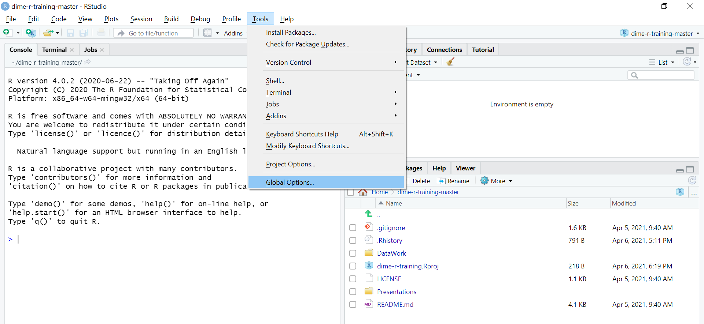
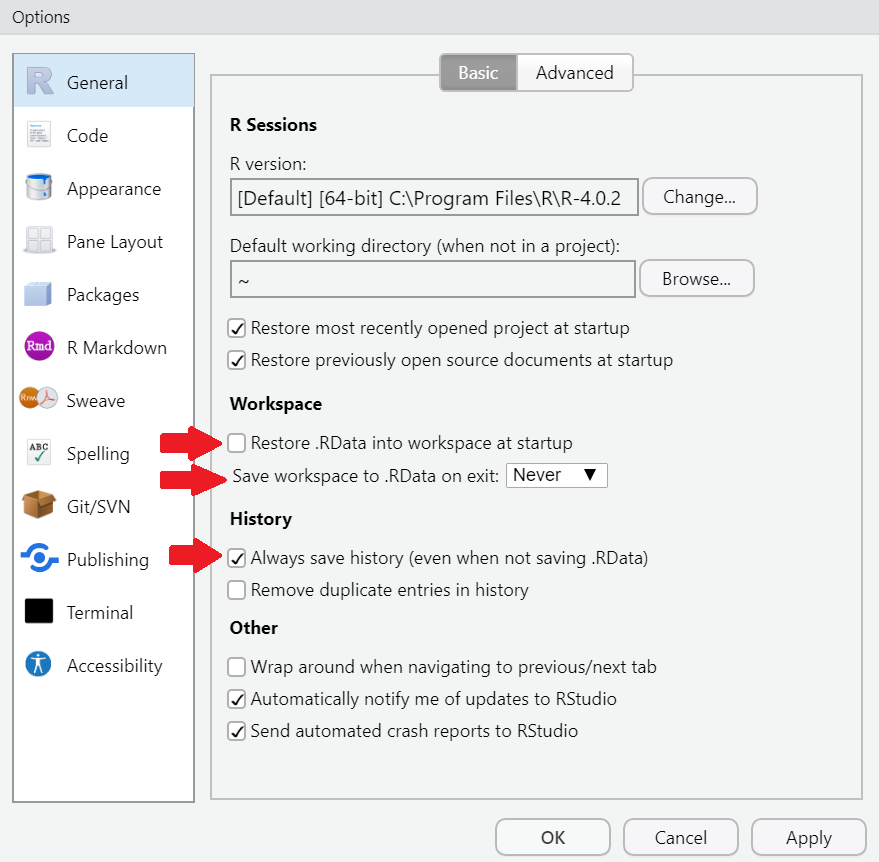
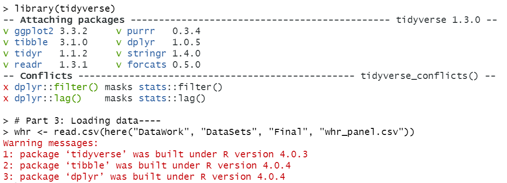

```{r setup, include=FALSE}

# Load packages
library(knitr)
library(tidyverse)
library(hrbrthemes)
library(fontawesome)
library(xaringanExtra)
library(here)

here::i_am("Presentations/06-R-programming-practices.Rmd")

options(htmltools.dir.version = FALSE)
opts_chunk$set(
  fig.align = "center",
  fig.height = 4,
  dpi = 300,
  cache = T
  )

xaringanExtra::use_panelset()
xaringanExtra::use_webcam()
xaringanExtra::use_clipboard()
htmltools::tagList(
  xaringanExtra::use_clipboard(
    success_text = "<i class=\"fa fa-check\" style=\"color: #90BE6D\"></i>",
    error_text = "<i class=\"fa fa-times-circle\" style=\"color: #F94144\"></i>"
  ),
  rmarkdown::html_dependency_font_awesome()
)

xaringanExtra::use_logo(
  image_url = here("Presentations",
                   "img",
                   "lightbulb.png"),
  exclude_class = c("inverse", 
                    "hide_logo"),
  width = "50px"
)
```

```{css, echo = F, eval = T}
@media print {
  .has-continuation {
    display: block !important;
  }
}

```

```{r, echo = FALSE, include=FALSE, eval = TRUE}
whr <- read_csv(here("DataWork", "DataSets", "Final", "whr_panel.csv"))
```

# Table of contents

1. [Introduction](#introduction)
2. [Initial settings](#initial-settings)
3. [File paths](#file-paths)
4. [Exploring a dataset](#exploring-a-dataset)
5. [Commenting](#commenting)
6. [Creating a document outline in RStudio](#creating-a-document-outline-in-rstudio)
7. [Using packages](#using-packages)
8. [Functions inception](#functions-inception)
9. [Looping](#looping)
10. [Custom functions](#custom-functions)
11. [Indentation](#indentation)
12. [Appendix](#appendix)

---

class: inverse, center, middle
name: introduction

# Introduction

<html><div style='float:left'></div><hr color='#D38C28' size=1px width=1100px></html>

---

# Introduction

## What is this session about?

* In the previous sessions, you learned how to work with R

* You are probably eager to programming in R by now

* Before you start, we recommend learning how to write R code that will be __reproducible, efficient, intelligible and easy to navigate__

* Indeed, that's what this session is about!

---

# Introduction

## What this session is about

* We will cover common coding practices in R so that you can make __the most efficient use__ for it

* We will also discuss some styling conventions to make your code __readable and reproducible__

* This will give you a solid foundation to write code in R and hopefully you'll be able to skip some painful steps of the "getting-your-hands-dirty" learning approach

---

class: inverse, center, middle
name: initial-settings

# Initial settings

<html><div style='float:left'></div><hr color='#D38C28' size=1px width=1100px></html>

---

# Initial settings

* Let's start by opening RStudio or by closing and opening it again

* Notice two things:

1. Your environment is *probably* empty (it's OK if it's not)

```{r echo = FALSE, out.width = "60%"}
knitr::include_graphics("img/empty_environment.png")
```

---

# Initial settings

2- Go to the `Console` panel and use the up and down keys to navigate through previously executed commands. They are saved by default in a file named `.Rhistory` that you might have noticed

```{r, echo = FALSE, out.width ="70%"}
knitr::include_graphics("img/rhistory.png")
```

* We'd usually want these two things -- an __empty environment__ and the __history of commands__ executed in previous sessions -- to be present every time we open a new RStudio session

---

# Initial settings

Have you ever seen these lines of code before?

```{r echo = FALSE, out.width = "40%"}
knitr::include_graphics("img/stataheader.jpg")
```

---

# Initial settings

## R Initial settings

* We __don't need to set the memory or the maximum number of variables__ in R

* The equivalent of `set more off` is the default

* The equivalent of `clear all` is not a default setting, but we'll change that in exercise 1

* In any case, remember that you can see all the objects in your computer's memory at any point in the `Environment` panel

```{r echo = FALSE, out.width = "40%"}
knitr::include_graphics("img/environment_2vars_2021.png")
```

---

# Initial settings

## Exercise 1: you'll never have to use  the equivalent of `clear all`

1. Go to `Tools` > `Global Options...`

2. In the `General` tab, make sure the following options are set:

  + Un-check *Restore .RData into workspace at startup*
  + For *Save workspace to .RData on exit*, select *Never*
  + Make sure *Always save history (even when not saving .RData)* is checked
  
3. Now restart RStudio

---

# Initial settings

```{r echo = FALSE, out.width = "90%"}

```

---

# Initial settings

```{r echo = FALSE, out.width = "48%"}

```

---

class: inverse, center, middle
name: file-paths

# File paths

<html><div style='float:left'></div><hr color='#D38C28' size=1px width=1100px></html>

---

# File paths

* What about working directories? We usually do something like this every time we start a new script in Stata:

```{r echo = FALSE, out.width = "35%"}
knitr::include_graphics("img/stata_cd.png")
```

* The direct equivalent to `cd` in R is this command:

```{r, eval=FALSE}
setwd("your/path")
```

* However, we recommend not using it unless it's absolutely necessary (never, if possible)

---

# File paths

* Instead, you should use RStudio projects and the `here` library

* __Important:__ We won't get into the specifics of directory organization here, but we'll assume that all the files you use for a specific project (data, scripts, and outputs) reside in the same project directory. We'll call this the __working directory__

## RStudio Projects

* RStudio projects let you "bind" your project files to a root directory, regardless of the path to it

* This is crucial because it allows smooth interoperability between different computers where the exact path to the project root directory differs

* Additionally, each RStudio project you work on keeps their own history of commands!

---

# File paths

## RStudio projects

### Exercise 2: Create a new RStudio project

Follow these instructions:

1. On RStudio, select `File` > `New Project...`

2. Select `New Directory` > `New Project`

3. Assign the name: `dime-r-training-project` to the project

---

# File paths

## RStudio projects

```{r echo = FALSE, out.width = "80%"}
knitr::include_graphics("img/dime-r-training-project.png")
```

---

# File paths

## The `here` library

* `here` locates files relative to your project root

* It uses the root project directory to build paths to files easily

* Similar to RStudio projects, it allows for interoperability between different computers where the absolute path to the same file is not the same

---

# File paths

## Usage of `here`

1- At the beginning of your script, include the following:

```{r, eval=FALSE}
here::i_am("path")
```

  + `"path"` should be the relative path of your current script, with respect of your project root directory
  + For example: if your script is in `C:/WBG/project-root-name/scripts/analysis/my-script.R`:
  
```{r, eval=FALSE}
here::i_am("scripts/analysis/my-script.R")
```

  + Don't forget to include the file name and extension

---

# File paths

## Usage of `here`

2- Load the `here` library:

```{r, eval=FALSE}
library(here)
```

3- Now you'll be able to use `here()` to point the location of every file relative to your project root

  + For example, to load a `csv` file located in: `C:/WBG/project-root-name/data/raw/data-file.csv`, you should use:
  
```{r, eval=FALSE}
df <- read.csv(here("data", "raw", "data-file.csv"))
```

This is going to be clearer with the next exercise.

---

# File paths

### Exercise 3: Combining `here` and RStudio projects

1. Go to the OSF page of the course: https://osf.io/86g3b/

2. Download the file in: `R for Stata Users - April 2021` > `Data` > `DataWork.zip`

3. Unzip the file in your RStudio project root folder

  + This is the folder where the file `dime-r-training-project.Rproj` sits
  + If you didn't change the default directory when creating the RStudio project, it will be in your `Documents` folder in Windows or in your Home directory in Mac or Linux
  
4. On RStudio, go to `File` > `New File` > `R Script`

---

# File paths

### Exercise 3: Combining `here` and RStudio projects

5- Save this empty new script in `DataWork` > `Code` as `exercises.R`

6- Include `here::i_am()` at the beginning of this script:

```{r, eval=FALSE}
here::i_am("DataWork/Code/exercises.R")
```

7- Now let's test if that worked. Load the `here` library read the `csv` file `DataWork/DataSets/Final/whr_panel.csv` using the function `here()`:

```{r, eval=FALSE}
library(here)
whr <- read.csv(here("DataWork", "DataSets", "Final", "whr_panel.csv))
```

---

# File paths

## RStudio projects and `here`

If you did the exercise correctly, you should see the `whr` data frame listed in the Environment panel

```{r echo = FALSE, out.width = "80%"}
knitr::include_graphics("img/environment_2021.png")
```

---

class: inverse, center, middle
name: commenting

# Commenting

<html><div style='float:left'></div><hr color='#D38C28' size=1px width=1100px></html>

---

# Commenting

* To comment a line, write `#` as its first character

```{r, eval=FALSE}
# This is a comment
print("But this part is not")
```

* You can also add `#` halfway through a line to comment whatever comes after it

```{r, eval=FALSE}
print("This part is not a comment") # And this is a comment
```

* In Stata, you can use `/*` and `*/` to comment in the middle of a line's code. That is not possible in R: everything that comes after `#` will always be a comment

* To comment a selection of lines, press `Ctrl` + `Shift` + `C`

---

# Commenting

### Exercise 4: Commenting

1. In your script panel, select all the lines of your script

2. Use the keyboard shortcut to comment these lines.
  + Shortcut: `Ctrl` + `Shift` + `C`

3. Use the keyboard shortcut to comment these lines again. What happened?

---

class: inverse, center, middle
name: creating-a-document-outline-in-rstudio

# Creating a document outline in RStudio

<html><div style='float:left'></div><hr color='#D38C28' size=1px width=1100px></html>

---

# Creating a document outline in RStudio

* RStudio also allows you to __create an interactive index__ for your scripts

* To add a section to your code, create a commented line with the title of your section and add at least 4 trailing dashes (`----`), pound signs (`####`) or equal signs (`====`) after it

---

# Creating a document outline in RStudio

### Exercise 5: Headers

1. In your script, add a header before the line where you used `here::i_am()` with the text: `# Part 1: Setting the project root----` (omit the quotes)

2. Add the following header before `library(here)`: `# Part 2: Loading libraries----`

3. Add this header before `read.csv(...)`: `Part 3: Loading data----`

  + Remember: you create a section header by adding at least 4 trailing dashes (`-`), pound (`#`) or equal (`=`) signs in a comment line

4. Note that once you create a section header, an arrow appears right next to the row number. Click on the arrows to see what happens.

---

# Creating a document outline in RStudio

* The outline can be accessed by clicking on the button on the top right corner of the script window. You can use it to jump from one section to another

* You can also use the keyboard shortcuts `Alt + L` (`Cmd + Option + L` on Mac) and `Alt + Shift + L` to collapse and expand sections

```{r echo = FALSE, out.width = "65%"}
knitr::include_graphics("img/document-outline.png")
```

---

class: inverse, center, middle
name: using-packages

# Using packages

<html><div style='float:left'></div><hr color='#D38C28' size=1px width=1100px></html>

---

# Using packages

## Packages

* Since there is a lot of people developing for R, it can have many different functionalities.

* To make it simpler, these functionalities are bundled into packages.

* A package is just __a unit of shareable code__.

---

# Using packages

## Packages

* It may contain new functions, but also more complex functionalities, such as a Graphic User Interface (GUI) or settings for parallel processing (similar to Stata MP).

* They can be shared through R's official repository - CRAN (13,000+ packages reviewed and tested).

* There are many other online sources such as GitHub, but it's important to be careful, as these probably haven't gone through a review process as rigorous as those in CRAN.

---

# Using packages

## Packages

* To install and use packages you can either do it with the user interface or by the command prompt.

```{r, eval = F}
# Installing a package
install.packages("tidyverse",
                 dependencies = TRUE)
# the dependencies argument also installs all other packages
# that it may depend upon to run
```

* You only have to install a package once, but you have to __load it every new session__.

---

# Using packages

### Exercise 8

Add:

```{r, eval = F}
  library(tidyverse)
```

to Part 2 in your script and run it

---

# Using packages

## Warnings vs errors

What if this happens?

```{r echo = FALSE, out.width = "70%"}

```

---

# Using packages

## Warnings vs errors

R has two types of error messages, `warnings` and actual `errors`:

  * `Errors` - break your code, usually preventing it from running.
  * `Warnings` - usually mean that nothing went wrong yet, but you should be careful.

RStudio's default is to print warning messages, but not to stop the code at the lines where they occur. You can configure R to stop at warnings if you want.

---

class: inverse, center, middle
name: functions-inception

# Functions inception

<html><div style='float:left'></div><hr color='#D38C28' size=1px width=1100px></html>

---

# Functions inception

* In R, you can __write one function inside another__

* In fact, you have already done this several times in this course

* Here's an example:

---

# Functions inception

```{r, eval=FALSE}
# Print the summary of the logarithm of the happiness score

## The long way:
log_score <- log(whr$happiness_score)
summary(log_score)

# The shortcut
summary(log(whr$happiness_score))
```

```{r echo=FALSE}
knitr::include_app("https://rrmaximiliano.shinyapps.io/learnr-app/")
```

---

# Functions inception

* This is a simple example of __metaprogramming__ (that's the real name of this technique) and may seem trivial, but it's not

* For starters, you can't do it in Stata!

---

# Functions inception

```{r echo = FALSE, out.width = "50%"}
knitr::include_graphics("img/statalog.png")
```
---

# Functions inception  
  
* This is a __very powerful technique__, as you will soon see

* It's __also a common source of error__, as you can only use one function inside the other if the output of the inner function is the same as the input of the outer function

* It can also get quite tricky to follow what a line of code with multiple functions inceptions is doing

* And that is why we use pipes: `%>%`

---

# Functions inception  

```{r, eval = F}
  # 1: Doing it the long way -----------------------------
  # Create a vector with the log of the happiness score
  log_score <- log(whr$happy_score)

  # Get descriptive statistics for the log vector
  mean(log_score)

  # 2: Shortcut to get to the same place -----------------
  mean(log(whr$happy_score))

  # 3: Now with pipes ------------------------------------
  whr$happy_score %>%
    log() %>%
    mean()
```

In a few words, `x %>% f()` is the same as `f(x)`

---

# Functions inception  
  
Now that you know piping exists in R, you should know that it can __drastically improve code readability__. And from now on you can also laugh if you see this in some tidyverse nerd laptop sticker or t-shirt:

```{r echo = FALSE, out.width = "50%"}
knitr::include_graphics("img/pipe.jpg")
```

---

class: inverse, center, middle
name: looping

# Looping

<html><div style='float:left'></div><hr color='#D38C28' size=1px width=1100px></html>

---

# Looping

* One thing that usually gives people away as Stata users writing R code are loops

* In Stata, we use `for` loops quite a lot

* The equivalent to that in R would be to write a `for` loop like this

```{r, eval = F}
    # A for loop in R
    for (number in 1:5) {
        print(number)
    }
```

---

# Looping

```{r}
    # A for loop in R
    for (number in 1:5) {
        print(number)
    }
```

---

# Looping

* R, however, has a whole function family that allows users to loop through an object __in a more efficient way__, without using explicit loops

* They're called `apply` and there are many of them, with different use cases

* If you look for the `apply` help file, you can see all of them

* For the purpose of this training, we will only use two of them, `sapply` and `apply`

---

# Looping

#### `sapply(X, FUN, ...)`: applies a function to all elements of a vector or list and returns the result in a vector. Its arguments are:

* **X:** a data frame, matrix or vector the function will be applied to

* **FUN:** the function you want to apply

* **...:** possible function arguments

---

# Looping

```{r}
    # A for loop in R
    for (number in c(1.2,2.5)) {
      print(round(number))
    }

    # A much more elegant loop in R
    sapply(c(1.2,2.5), round)
```

---

# Looping

A more general version is the `apply` function.

#### `apply(X, MARGIN, FUN, ...)`: applies a function to all columns or rows of matrix. Its arguments are

* **X:** a data frame (or matrix) the function will be applied to

* **MARGIN:** 1 to apply the function to all rows or 2 to apply the function to all columns

* **FUN:** the function you want to apply

* **... :** possible function arguments

---

# Looping


```{r, eval = T}
    # Create a matrix
    matrix <- matrix(c(1, 24, 9, 6, 9, 4, 2, 74, 2),
                       nrow = 3)

    # Look at the matrix
    matrix
```

---

# Looping

```{r, eval = T}
    # Row means
    apply(matrix, 1, mean)

    # Column means
    apply(matrix, 2, mean)
```

---

class: inverse, center, middle
name: custom-functions

# Custom functions

<html><div style='float:left'></div><hr color='#D38C28' size=1px width=1100px></html>

---

# Custom functions

* As we have said several times, __R is super flexible__

* One example of that is that it's __super easy and quick to create custom functions__

* Here's how:

---

# Custom functions

```{r}
  square <- function(x) {
    
    y <- x ^ 2
    
    return(y)
    
  }

  square(2)
```  

---

# Custom functions

### Exercise 9: Create a function 

1. Create a function that calculates the z-score of a vector.
  
  + Recall the outline of functions in R:
  
```{r eval=F}
function_name <- function(input) {
  
  output <- operation(input)
  
  return(output)

}
```

  + Hints:
    * The command to obtain the mean of a vector is `mean(x)`
    * The command to get the SD of a vector is `sd(x)`
    * R is vectorized: you can operate vectors and number directly and the result will be a vector

---

# Custom functions

```{r}
  zscore <- function(x) {
    
    mean <- mean(x, na.rm = T)
    sd   <- sd(x, na.rm = T)
    z    <- (x - mean)/sd
    
    return(z)
    
  }

  summary(zscore(whr$happiness_score))
  
```

---

class: inverse, center, middle
name: indentation

# Indentation

<html><div style='float:left'></div><hr color='#D38C28' size=1px width=1100px></html>

---

# Indentation

```{r, eval = F}
# Here's some code
annualHappy_reg <- aggregate(happy_score ~ year + region, data = whr, FUN = mean)
plot <- ggplot(annualHappy_reg,aes(y = happy_score,x = year, color = region, group = region))
+ geom_line() + geom_point()
print(plot)
```

```{r, eval = F}
# Here's the same code
annualHappy_reg <-
  aggregate(happiness_score ~ year + region,
            data = whr,
            FUN = mean)

plot <-
  ggplot(annualHappy_reg,
         aes(y = happiness_score,
             x = year,
             color = region,
             group = region)) +
  geom_line() +
  geom_point()

print(plot)
```

---

# Indentation

```{r, eval = T, echo = F, out.width = "60%"}
annualHappy_reg <-
  aggregate(happiness_score ~ year + region,
            data = whr,
            FUN = mean)

plot <-
  ggplot(annualHappy_reg,
         aes(y = happiness_score,
             x = year,
             color = region,
             group = region)) +
  geom_line() +
  geom_point()

print(plot)
```

---

# Indentation

## Why indent?

* Even though R understands what unindented code says, it can be __quite difficult for a human being to read it__

* On the other hand, __white space does not have a special meaning for R__, so it will understand code that is more readable for a human being

---

# Indentation

## Why indent?

* Indentation in R looks different than in Stata:

 - To indent a whole line, you can select that line and press `Tab`
 - To unindent a whole line, you can select that line and press `Shift + Tab`
 - However, this will not always work for different parts of a code in the same line

* In R, we typically don't introduce white space manually

* It's rather introduced by RStudio for us

---

# Indentation

### Exercise 8: Indentation in R
To see an example of how indenting works in RStudio, go back to our first example with `sapply`:

```{r, eval = F}
# A much more elegant loop in R
sapply(c(1.2,2.5), round)
```

1. Add a line between the two arguments of the function (the vector of numbers and the `round` function)

2. Now add a line between the numbers in the vector.

---

# Indentation

Note that RStudio formats the different arguments of the function differently:

```{r, eval = F}
# A much more elegant loop in R
sapply(c(1.2,
         2.5),
       round)
```

---

class: inverse, center, middle

# Thank you!

---

class: inverse, center, middle
name: appendix

# Appendix

---

# Appendix - Initial settings

## `.Rhistory` and `.RData`

* `.Rhistory` automatically stores the commands entered in the console

* `.RData` stores the objects in your environment only if you save your workspace, and loads them again in the next RStudio session

* Both files are relative to the working directory where your RStudio session started

---

# Appendix - Assignment 1

## Assignment 1

Create a function that

  1. Takes as argument a vector of packages names
  
  2. Loops through the packages listed in the input vector
  
  3. Install the packages
  
  4. Loads the packages

---

# Appendix - If statements

## If statements

* Installing packages can be time-consuming, especially as the number of packages you're using grows, and each package only needs to be installed once

* We often use locals in Stata to create section switches to install packages

* In R, the equivalent to that would be to create a new object as a section switch

### Exercise 9: Creating an if statement

Create a dummy scalar object called PACKAGES.

- TIP: Section switches can also be Boolean objects.

---

# Appendix - If statements

* Now we need to create an if statement using this switch

* If statements in R look like this:

```{r, eval = F}

    # Turn switch on
    PACKAGES <- 1

    # Install packages
    if (PACKAGES == 1) {
      install.packages(packages,
                       dependencies = TRUE)
    }

```

---

# Appendix - If statements

## If statements

Possible variations would include

```{r, eval = F}
    # Turn switch on
    PACKAGES <- TRUE

    # Using a Boolean object
    if (PACKAGES == TRUE) {
      install.packages(packages, dep = TRUE)
    }

    # Which is the same as
    if (PACKAGES) {
      install.packages(packages, dep = TRUE)
    }

```

---

# Appendix - Assignment 2

Create a function that

1. Takes as argument a vector of packages names

2. Loops through the packages listed in the input vector

3. Tests if a package is already installed

4. Only installs packages that are not yet installed

5. Loads the packages

- TIP: to test if a package is already installed, use the following code:
```{r, eval = F}
    # Test if object x is contained in
    # the vector of installed packages
    x %in% installed.packages()
```

---

# Appendix - File paths best practices

## File paths best practices

* We at DIME Analytics recommend always using **explicit** and **dynamic** file paths

* **Explicit** means you're explicitly stating where the file will be saved -- instead of setting the working directory, for example

* **Dynamic** means that you don't need to adjust every file path in the script when you change from one machine to another -- they're updated based on a single line of code to be changed  

---

# Appendix - File paths best practices

## File paths

* Explicit and dynamic file path:

```{r, eval = F}
  # Define dynamic file path
  finalData <- "C:/Users/luiza/Documents/GitHub/
                dime-r-training/
                DataWork/DataSets/Final"

  # Load data set
  whr <- read.csv(file.path(finalData,"whr_panel.csv"),
                  header = TRUE)

```

---

# Appendix - Using packages

## Using packages

Once a package is loaded, you can use its features and functions. Here's a list of some useful and cool packages:

* `Rcmdr` - easy to use GUI
* `swirl` - an interactive learning environment for R and statistics.
* `ggplot2` - beautiful and versatile graphics (the syntax is a pain, though)
* `stargazer` - awesome latex regression and summary statistics tables
* `foreign` - reads `.dta` and other formats from inferior statistical software
* `zoo` - time series and panel data manipulation useful functions
* `data.table` - some functions to deal with huge data sets
* `sp` and `rgeos` - spatial analysis
* `multiwayvcov` and `sandwich` - clustered and robust standard errors
* `RODBC`, `RMySQL`, `RPostgresSQL`, `RSQLite` - For relational databases and using SQL in R.

---

# Appendix - Resources

## Resources

* A discussion of folder structure and data managament can be found here: https://dimewiki.worldbank.org/wiki/DataWork_Folder

* For a broader discussion of data management, go to https://dimewiki.worldbank.org/wiki/Data_Management

---

# Appendix - Git

## Git

Git is a version-control system for tracking changes in code and other text files. It is a great resource to include in your work flow.

We didn't cover it here because of time constraints, but below are some useful links, and DIME Analytics provides trainings on Git and GitHub, so keep an eye out for them.

* **DIME Analytics git page:** https://worldbank.github.io/dimeanalytics/git/

* **A Quick Introduction to Version Control with Git and GitHub:** https://journals.plos.org/ploscompbiol/article?id=10.1371/journal.pcbi.1004668

---

# Appendix - R projects

## R projects

If you have used R before, you may have heard of RStudio Projects. It's RStudio's suggested tool for workflow management. DIME Analytics has found that it is not the best fit for our needs, because

1. In DIME, we mainly use Stata, and we prefer to keep a similar structure in R (Stata 15 also has a projects feature, but it is not yet widely adopted)

2. We need to keep our code and data in separate folders, as we store code in GitHub and data in DropBox

However, if you want to learn more about it, we recommend starting here:
https://r4ds.had.co.nz/workflow-projects.html
