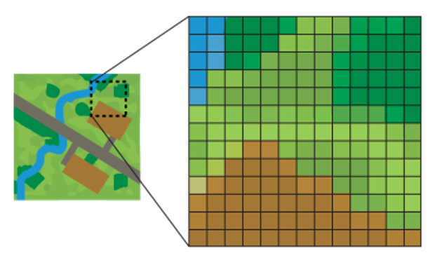
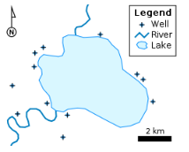
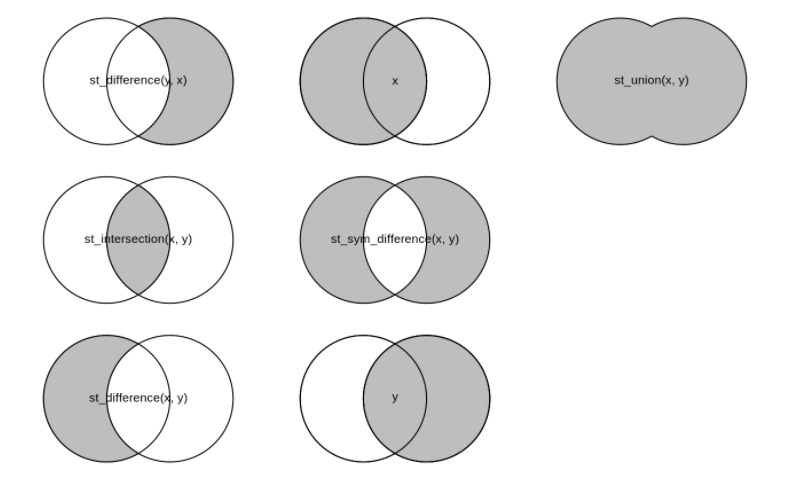

```{r setup, include=FALSE}
options(htmltools.dir.version = FALSE)
library(knitr)
opts_chunk$set(
  fig.align="center",  
  fig.height=4, #fig.width=6,
  # out.width="748px", #out.length="520.75px",
  dpi=300, #fig.path='Figs/',
  cache=T#, echo=F, warning=F, message=F
  )

library(hrbrthemes)
library(fontawesome)
library(xaringanExtra)
xaringanExtra::use_panelset()
xaringanExtra::use_editable()
xaringanExtra::use_clipboard()
xaringanExtra::use_logo(
  image_url = "img/lightbulb.png",
  exclude_class = c("inverse", "hide_logo"),
  width = "50px"
)

htmltools::tagList(
  xaringanExtra::use_clipboard(
    button_text = "<i class=\"fa fa-clipboard\"></i>",
    success_text = "<i class=\"fa fa-check\" style=\"color: #90BE6D\"></i>",
    error_text = "<i class=\"fa fa-times-circle\" style=\"color: #F94144\"></i>"
  ),
  rmarkdown::html_dependency_font_awesome()
)
```

# Table of contents

.vlarge[
1. Loading and exploring spatial data
2. Spatial data structure
3. Simple features
4. Visualizing spatial data
5. Why projections matters
6. Basic spatial operations
]


---

class: inverse, center, middle
name: setting

# Setting the stage

<html><div style='float:left'></div><hr color='#D38C28' size=1px width=1100px></html>

---

# Setting the stage

Install new packages
```{r, eval = F}
install.packages(c("sf",
                   "rworldmap",
                   "ggmap",
                   "wesanderson"),
                 dependencies = TRUE)
```


And load them
```{r, eval = TRUE, message = FALSE, warning = FALSE}
library(here)
library(tidyverse)
library(sf)
library(rworldmap)
library(ggmap)
library(wesanderson)
```

---

# Setting the stage

Datasets we will use today
```{r, message = FALSE}
# Load data
whr_panel   <- read_rds(here("DataWork",
                             "DataSets",
                             "Final",
                             "whr_panel.RDS"))

wb_projects <- read_csv(here("DataWork",
                             "DataSets",
                             "Final",
                             "wb_projects.csv"))
```

---

class: inverse, center, middle
name: setting

# Introduction

<html><div style='float:left'></div><hr color='#D38C28' size=1px width=1100px></html>

---

# Introduction

There are two main types of spatial data: vector and raster data. 

--

- **Raster:** spatially-referenced grids where each cell has one value.

--

- **Vectors or shapefiles:** spatial-referenced objects consisting of points, lines and polygons. These shapes are attached to a dataframe, where each row corresponds to a different spatial element. 

--

.pull-left[
```{r, out.width = "400px", echo = FALSE}

```
]

.pull-right[
```{r, out.width = "300px", echo = FALSE}

```
]

---

# Introduction

- This session could be a whole course on its own, but we only have an hour and half.
- To narrow our subject, we will focus on only one type of spatial data, shapefiles. 
- This is the most common type of spatial data that non-GIS experts will encounter in their work.
- We will focus mostly on how to visualize spatial data, although we will also cover some simple geometry operations.
- We will use the `sf` package, which is the tidyverse-compatible package for geospatial data in R.
- If you want to know more about geospatial data in R, we recommend the book [https://geocompr.robinlovelace.net/](Geocomputation with R), by Robin Lovelace, Jakub Nowosad, and Jannes Muenchow.

---

# Loading a shapefile with sf

The first thing we will do in this session is to recreate this data set:

```{r}
worldmap <- 
  st_read(here("DataWork",
               "DataSets",
               "Final",
               "worldmap.shp"))
```

```{r, eval = F}
plot(worldmap)
```

---

# Exploring the data

```{r, warning = FALSE, echo = F}
plot(worldmap)
```

---

class: inverse, center, middle
name: setting

# Creating a polygon shapefile

<html><div style='float:left'></div><hr color='#D38C28' size=1px width=1100px></html>

---

# Loading spatial data

Load a built-in map using the `rworldmap` package

```{r}
worldmap <- getMap(resolution="low")
```

Look at the data structure
```{r, eval = F}
View(worldmap)
```

This object is a list with three main components:
- Data
- Polygons
- Projection

---

# Spatial data structure: the data

- The data portion of a shapefile is a data frame like any other in R.
- To access it, we need to refer to the data element in our list by typing `objectname@data`.

--

.exercise[

### Exercise `r fa("keyboard")`
Explore the dataset in `worldmap` using the functions `head()` and `names()`.
]

--

.can-edit[
```{r, eval = F}
names()
```
]

---

# Spatial data structure: the data

- The data portion of a shapefile is a data frame like any other in R.
- To access it, we need to refer to the data element in our list by typing `objectname@data`.

.exercise[

### Exercise `r fa("keyboard")`
Explore the dataset in `worldmap` using the functions `head()` and `names()`.
]

```{r}
names(worldmap@data)
```

---

# Spatial data structure: the data

.small[
```{r}
head(worldmap@data)
```
]

---

# Spatial data structure: the data


We can treat the data in a geospatial object just like any other data frame

.exercise[

### Exercise `r fa("keyboard")`
Use the command `select()` from tidyverse's `dplyr` package to keep only the following variables in the `worldmap` data: `ADMIN, REGION, continent, POP_EST, GDP_MD_EST`.
]


```{r}
worldmap@data <-
  worldmap@data %>%
  select(ADMIN, REGION, continent, POP_EST, GDP_MD_EST)
```

---

# Spatial data structure: the data


We can treat the data in a geospatial object just like any other data frame

.exercise[

### Exercise `r fa("keyboard")`
Explore the `worldmap` data using `summary()`.
]

--
.can-edit[
```{r, eval = F}
summary()
```
]

---

# Spatial data structure: the data


We can treat the data in a geospatial object just like any other data frame

.exercise[

### Exercise `r fa("keyboard")`
Explore the `worldmap` data using `summary()`.
]

.small[
```{r}
summary(worldmap@data)
```
]

---

# Spatial data structure: polygons

```{r, warning=FALSE}
plot(worldmap)
```

---

# Spatial data structure: projection


```{r}
worldmap@proj4string
```

--

.center[


[Click here to see why Josh and CJ are confused](https://www.youtube.com/watch?v=vVX-PrBRtTY)
] 

---

# Spatial data structure: projection

__Coordinate reference systems__ map pairs of numbers to a location.

* __Geographic Coordinate Systems__ live on a sphere; here, the units are in decimal degrees (latitude = angle from equator; longitude = angle from prime meridian)

    + Using the WGS84 coordinate system the World Bank MC building is located at 38.89 degrees latitude and -77.04 degrees longitude.

--

* __Projected Coordinate Systems__ project the earth onto a flat surface (units here are typically in meters from some reference point). 

    + Using to the World Mercator projection, the World Bank is located 4680364.64 meters north and -8576320.73 meters east.
    
```{r fig.align="center", echo=F}
knitr::include_graphics("img/coordinate_systems.jpg", dpi = 220)
```

---

# Spatial data structure: projection

Projecting the earth onto a flat surface distorts [distorts](http://geoawesomeness.com/5-tools-will-let-master-map-projections/) the earth in some way (shape, area, distance or direction). 

.center[

]

--

> Projections are also the main source of error when plotting spatial data: if two spatial objects have different reference systems, plotting them together will result in quite weird maps

---

class: inverse, center, middle
name: projecting

# Projecting spatial data in sf

<html><div style='float:left'></div><hr color='#D38C28' size=1px width=1100px></html>

---

# Creating an sf object

The `sf` package deals with spatial data in a special way: it allows as to treat it as a regular data frame, while maintaining its spatial component.

--
.command[
 ## st_as_sf(x)
 Transforms objects into `sf` objects
 - **...:** the object to be transformed
]

--
.exercise[

### Exercise `r fa("keyboard")`
Turn the `worldmap` object into an `sf` object.
]

.can-edit[
```{r, eval = F}
st_as_sf()
```
]

---

# Creating an sf object

The `sf` package deals with spatial data in a special way: it allows as to treat it as a regular data frame, while maintaining its spatial component.

.command[
 ## st_as_sf(x)
 Transforms objects into `sf` objects
 - **...:** the object to be transformed
]

.exercise[

### Exercise `r fa("keyboard")`
Turn the `worldmap` object into an `sf` object.
]

```{r}
worldmap <- 
  st_as_sf(worldmap)
```

---

# Creating an sf object

```{r}
class(worldmap)

summary(worldmap)
```

---

# Creating an sf object

```{r}
plot(worldmap)
```

---

# Projections in sf

Here are two useful `sf` commands:

.command[
 ## st_crs(x)
 Displays the current projection of an `sf` object
]

.command[
 ## st_transform(x, crs)
 Projects object **x** using projection **crs**
]

---

# Projections in sf

.exercise[
### Exercise `r fa("keyboard")`
Create two objects derived from `worldmap`, but with different projections:
- Use the Mollweid projection (`crs` = `"+proj=moll"`) to create `worldmap_moll`
- Use the Mercator projection (`crs` = `"EPSG:3857"`) to create `worldmap_mercator`
]

--

.can-edit[
```{r, eval = F}
worldmap_moll <-
worldmap_mercator <-
```
]

---

# Projections in sf

.exercise[
### Exercise `r fa("keyboard")`
Create two objects derived from `worldmap`, but with different projections:
- Use the Mollweid projection (`crs` = `"+proj=moll"`) to create `worldmap_moll`
- Use the Mercator projection (`crs` = `"EPSG:3857"`) to create `worldmap_mercator`
]


```{r}
worldmap_moll <-
  worldmap %>%
  st_transform("+proj=moll")

worldmap_mercator <-
  worldmap %>%
  st_transform("EPSG:3857")
```

---

# Projections in sf

```{r, eval = F}
worldmap_moll %>% 
  select(REGION) %>%
  plot()

worldmap_mercator %>% 
  select(REGION) %>%
  filter(REGION != "Antarctica") %>%
  plot()

```

--

> Why did I use `select` above?

---

# Projections in sf

```{r, echo = F}
worldmap_moll <-
  worldmap %>%
  st_transform("+proj=moll")

worldmap_mercator <-
  worldmap %>%
  st_transform("EPSG:3857")

worldmap_moll %>% 
  select(REGION) %>%
  plot()

```

---

# Projections in sf

```{r, echo = F}
worldmap_mercator %>% 
  select(REGION) %>%
  filter(REGION != "Antarctica") %>%
  plot()

```

---

class: inverse, center, middle
name: projecting

# Visualizing polygons

<html><div style='float:left'></div><hr color='#D38C28' size=1px width=1100px></html>

---

# Combining non-spatial and spatial data

- To create the `worldmap` shapefile that you have in your final data folder, we combined the data in `whr_panel` and the polygon in `worldmap`. Given what we have seen, this is as simple as joining two data sets

--

We need to make a few adjustment to the data so the join works:
.small[
```{r}
worldmap <-
  worldmap %>%
  mutate(country = as.character(ADMIN),
         country = str_replace_all(country, "United States of America", "United States"),
         country = str_replace_all(country, "Northern Cyprus", "North Cyprus"),
         country = str_replace_all(country, "Hong Kong S.A.R.", "Hong Kong"),
         country = str_replace_all(country, "Republic of Serbia", "Serbia"),
         country = str_replace_all(country, "Somaliland", "Somaliland Region"),
         country = str_replace_all(country, "West Bank", "Palestinian Territories"),
         country = str_replace_all(country, "Democratic Republic of the Congo", "Congo (Kinshasa)"),
         country = str_replace_all(country, "Republic of the Congo", "Congo (Brazzaville)"),
         country = str_replace_all(country, "United Republic of Tanzania", "Tanzania"))

whr_panel <-
  whr_panel %>% 
  filter(year == 2015)
```
]

Then we can join them:
.small[
```{r}
worldmap <-
  worldmap %>%
  left_join(whr_panel)
```
]

---

# Visualizing polygons

- `ggplot` has a special geometry for `sf`: `geom_sf`
- `geom_sf` takes into account the spatial features to maintain proportions 

```{r, eval = F}
ggplot(worldmap) +
  geom_sf()
```

---

# Visualizing polygons

```{r, echo = F}
ggplot(worldmap) +
  geom_sf()
```

---

# Visualizing polygons

.exercise[

### Exercise `r fa("keyboard")`
Use the `fill` aesthetics inside `geom_sf` to show the happiness score in the map.
]

.can-edit[
```{r,eval = F}
ggplot(worldmap) +
  geom_sf()
```
]

---

# Visualizing polygons

.exercise[

### Exercise `r fa("keyboard")`
Use the `fill` aesthetics inside `geom_sf` to show the happiness score in the map.
]

```{r, eval = F}
ggplot(worldmap) +
  geom_sf(aes(fill = happiness_score))
```

---

# Visualizing polygons

```{r, echo = F}
ggplot(worldmap) +
  geom_sf(aes(fill = happiness_score))
```

---

# Visualizing polygons

.exercise[

### Exercise `r fa("keyboard")`
Use the `fill` aesthetics inside `geom_sf` to show the happiness score in the map.
]

```{r, eval = F}
ggplot(worldmap %>%
         filter(REGION != "Antarctica")) + #<<
  geom_sf(aes(fill = happiness_score)) +
  labs(fill = "Happiness Score") + #<<
  scale_fill_gradient(low = "blue", #<<
                        high = "yellow") + #<<
  theme_void() + #<<
  theme(legend.position = "top") #<<
```

---

# Visualizing polygons

```{r, echo = F}
ggplot(worldmap %>%
         filter(REGION != "Antarctica")) +
  geom_sf(aes(fill = happiness_score)) +
  labs(fill="Happiness Score") +
  scale_fill_gradient(low = "blue",
                        high = "yellow") +
  theme_void() +
  theme(legend.position = "top")
```

---

class: inverse, center, middle
name: projecting

# Visualizing points

<html><div style='float:left'></div><hr color='#D38C28' size=1px width=1100px></html>

---

# Visualizing points

When you have GPS coordinates, using `ggplot` to map them is very easy: use `geom_points` and link `x` to the longitude variable and `y` to the latitude variable.


.exercise[

### Exercise `r fa("keyboard")`
Create a scatter plot of the projects in the `wb_projects` dataset.
]

.can-edit[
```{r,eval = F}
ggplot() +
   geom_point(aes(x = ,
                  y = ))
```
]

---

# Visualizing points

When you have GPS coordinates, using `ggplot` to map them is very easy: use `geom_points` and link `x` to the longitude variable and `y` to the latitude variable.


.exercise[

### Exercise `r fa("keyboard")`
Create a scatter plot of the projects in the `wb_projects` dataset.
]

```{r, eval=F}
ggplot() +
   geom_point(data = wb_projects,
              aes(x = longitude,
                  y = latitude)
```

---

# Visualizing points

```{r, echo = F}
ggplot() +
   geom_point(data = wb_projects,
              aes(x = longitude,
                  y = latitude))
```

---

# Visualizing points

```{r, eval=F}
ggplot() +
   geom_point(data = wb_projects,
              aes(x=longitude,
                  y=latitude),
              size = .1) + # Smaller dots #<< 
  coord_quickmap() + # Correct distortion #<<
  theme_void() # Clean background #<<
```

---

# Visualizing points

```{r, echo=F}
ggplot() +
   geom_point(data = wb_projects,
              aes(x=longitude,
                  y=latitude),
              size = .1) + # Smaller dots #<< 
  coord_quickmap() + # Correct distortion #<<
  theme_void() # Clean background #<<
```

---

# Adding a basemap

The package `ggmap` allows us to layers as a basemap. The code is the same as `ggplot`, except here we start the code with `ggmap()` instead of `gplot()`.


Here is how we can retrieve basemaps:
```{r, message=FALSE, warning = F}
# Create an object with Africa only
africa <-
  worldmap %>%
  filter(REGION == "Africa")
  
# Calculate which part of the world we want images for
# (this is called a bounding box)
africa_box <- 
  st_bbox(africa) 

# Save the basemap
africa_basemap <- 
  get_stamenmap(as.vector(africa_box),
                zoom = 3, # The higher the zoom, the more details you get
                maptype = "watercolor")
```

---

# Adding a basemap


```{r}
ggmap(africa_basemap)
```

---

# Customizing basemaps

`r fa("map-marked-alt",  fill = "#D38C28")` You can also use other image sources than Stamen Maps with the `get_map` function:
- Google Maps (`"google"`), OpenStreetMap (`"osm"`), Stamen Maps (`"stamen"`)

--

`r fa("layer-group",  fill = "#D38C28")` Here are a few other map types you can use with `get_stamenmap`:
- `"terrain"`, `"terrain-background"`, `"terrain-labels"`, `"terrain-lines"`, `"toner"`,
  `"toner-2010"`, `"toner-2011"`, `"toner-background"`, `"toner-hybrid"`,
  `"toner-labels"`, `"toner-lines"`, `"toner-lite"`, `"watercolor"`)

--

`r fa("paint-brush",  fill = "#D38C28")` Finally, you can use the options `color` and `alpha` to change from black and white to color and increase transparency 
of the basemap.

---

# Adding layers on top of a basemap

```{r, eval = F}
ggmap(africa_basemap) + 
   geom_point(data = wb_projects,
              aes(x=longitude,
                  y=latitude),
              size = .1) +
  theme_void()
```

> Note that with `ggmap` we don't need the option `coord_quickmap`

---

# Adding layers on top of a basemap

```{r, echo = F}
ggmap(africa_basemap) + 
   geom_point(data = wb_projects,
              aes(x=longitude,
                  y=latitude),
              size = .1) +
  theme_void()
```

---

# Combining our two maps

Now, instead of a basemap, let's layer these points on top of our hapiness score map.

```{r, eval = F}
ggplot() +
  geom_sf(data = africa,
          aes(fill = happiness_score)) +
  geom_point(data = wb_projects,
              aes(x = longitude,
                  y = latitude),
              size = .1) +
  labs(fill="Happiness\nScore") +
  scale_fill_gradient(low = "blue",
                        high = "yellow") +
  theme_void()

```

---

# Combining our two maps

```{r, echo = F}
ggplot() +
  geom_sf(data = africa,
          aes(fill = happiness_score)) +
  geom_point(data = wb_projects,
              aes(x = longitude,
                  y = latitude),
              size = .1) +
  labs(fill="Happiness\nScore") +
  scale_fill_gradient(low = "blue",
                        high = "yellow") +
  theme_void() 

```

---

class: inverse, center, middle
name: setting

# Why projections matter

<html><div style='float:left'></div><hr color='#D38C28' size=1px width=1100px></html>

---

# Why projections matter

```{r, eval = F}
# Use a different projection for our Africa map
africa_moll <-
  st_transform(africa,
             "+proj=moll")

# And create the same graph from the last slide
ggplot() +
  geom_sf(data = africa_moll,
          aes(fill = happiness_score)) +
   geom_point(data = wb_projects,
              aes(x=longitude,
                  y=latitude)) +
  labs(fill="Happiness\nScore") +
  scale_fill_gradient(low = "blue",
                        high = "yellow") +
  theme_void() 

```

---

# Why projections matter

```{r, echo = F}
# Use a different projection for our Africa map
africa_moll <-
  st_transform(africa,
             "+proj=moll")

# And create the same graph from the last slide
ggplot() +
  geom_sf(data = africa_moll,
          aes(fill = happiness_score)) +
   geom_point(data = wb_projects,
              aes(x=longitude,
                  y=latitude)) +
  labs(fill="Happiness\nScore") +
  scale_fill_gradient(low = "blue",
                        high = "yellow") +
  theme_void() 

```

---

# Transforming GPS data into a shapefile

- As we saw earlier, shapefiles can contain points, polygons or lines.
- So far, we have only use the `wb_projects` coordinates as if they were numbers like any others.
- To be able to change the projection of `wb_projects`, we need to convert it into a spatial object.

--

.command[
 ## st_as_sf(x, coords, crs)
 Transforms objects into `sf` objects
 - **...:** the object to be transformed
 - coords: a vector with the names of the variables in the data that indicate longitude and latitude, in this order
 - crs: the coordinate reference system of the points in the data
]

---

# Transforming GPS data into a shapefile

.exercise[

### Exercise `r fa("keyboard")`
Turn the `wb_projects` object into an `sf` object.
]

--

.can-edit[
```{r, eval = F}
st_as_sf(x, 
        coords = c("longitude_variable", "latitude_variable"), 
        crs = 4326) # Shortcut to WGS84, the coordinate reference system used by most GPS

```
]

---

# Transforming GPS data into a shapefile

.exercise[

### Exercise `r fa("keyboard")`
Turn the `wb_projects` object into an `sf` object.
]


```{r}
wb_projects <-
  st_as_sf(wb_projects, 
        coords = c("longitude", "latitude"), 
        crs = 4326)

```


---

# Matching projections

.exercise[

### Exercise `r fa("keyboard")`
Change the projection of the `wb_projects` object to Mollweid.
> Tip: use the CRS shortcut `"+proj=moll"`
]

--

.can-edit[
```{r, eval = F}
wb_projects_moll <-
```
]

---

# Matching projections

.exercise[

### Exercise `r fa("keyboard")`
Change the projection of the `wb_projects` object to Mollweid.
> Tip: use the CRS shortcut `"+proj=moll"`

]

```{r}
wb_projects_moll <-
  st_transform(wb_projects,
               "+proj=moll")
```

---

# Combining plots with the same projection

```{r, eval = F}
ggplot() +
  geom_sf(data = africa_moll,
          aes(fill = happiness_score)) +
  geom_sf(data = wb_projects_moll) +
  labs(fill="Happiness Score and WB Projects") +
  scale_fill_gradient(low = "blue",
                        high = "yellow") +
  theme_void()

```

---

# Combining plots with the same projection

```{r, echo = F}
ggplot() +
  geom_sf(data = africa_moll,
          aes(fill = happiness_score)) +
  geom_sf(data = wb_projects_moll) +
  labs(fill="Happiness Score and WB Projects") +
  scale_fill_gradient(low = "blue",
                        high = "yellow") +
  theme_void()

```

---

class: inverse, center, middle
name: setting

# Basic geometry operations

<html><div style='float:left'></div><hr color='#D38C28' size=1px width=1100px></html>

---

# Basic geometry operations

Here are some of the most common shapefile operations and their corresponding `sf` commands:

.center[

]

---

# Final challenge

.exercise[

### Exercise `r fa("keyboard")`
Create a map of the World Bank projects in Mozambique
]

--

Here's some pseudo code:
.can-edit[
```{r, eval = F}
# 1 Create a polygon of Mozambique by subsetting the worldmap sf
# 2 Make sure the Moz polygon and the wb_projects shapefile have the same projection
# 3 Create a shapefile containing only Moz projects using one of the sf functions in the previous image
# 4 Create a map with the resulting data and customize as you like

```
]

---

# Final challenge

```{r, include = F}

moz <-
  africa %>%
  filter(country == "Mozambique")

moz_projects <-
  st_intersection(wb_projects, 
                  moz)
moz_projects <-
  moz_projects %>%
  mutate(sector =
  ifelse(str_detect(ad_sector_names, "Transport"), "Transport",
         ifelse(str_detect(ad_sector_names, "Agriculture"), "Agriculture",
                "Other")))

moz_box <-
  st_bbox(moz)

basemap <- 
 get_stamenmap(as.vector(moz_box),
                zoom = 6, # The higher the zoom, the more details you get
                maptype = "terrain-background")

map <- 
  ggmap(basemap) + 
  geom_sf(data = moz, 
          inherit.aes = FALSE,
          fill = "white", 
          alpha = .6) +
  geom_sf(data = moz_projects,
          aes(color = sector), 
          inherit.aes = FALSE,
          size = 1) +
  labs(color = "Project sector") +
  theme_void() + 
  scale_color_manual(values = wes_palette("GrandBudapest1", 3))
```

```{r, echo = F}
plot(map)
```

---

# Useful Resources

* [Rspatial](http://rspatial.org/) provides tutorials for many topics in GIS. 

* [Nick Eubank Tutorials](http://www.nickeubank.com/gis-in-r/) -- another great set of tutorials. 

* [This](https://gist.github.com/sboysel/fc661f26ef51eae6377b) provides useful links to a bunch of other resources.

* [Visualizing geospatial data](https://serialmentor.com/dataviz/geospatial-data.html)

* [Geocomputation with R](https://geocompr.robinlovelace.net/)

---
class: inverse, center, middle

# Thank you!

---
exclude: true

```{R, pdfs, include = F, eval = F}
pagedown::chrome_print("05-spatial-data.html", output = "05-spatial-data.pdf")

# Or
source("https://git.io/xaringan2pdf")
xaringan_to_pdf("05-spatial-data.html")
```
