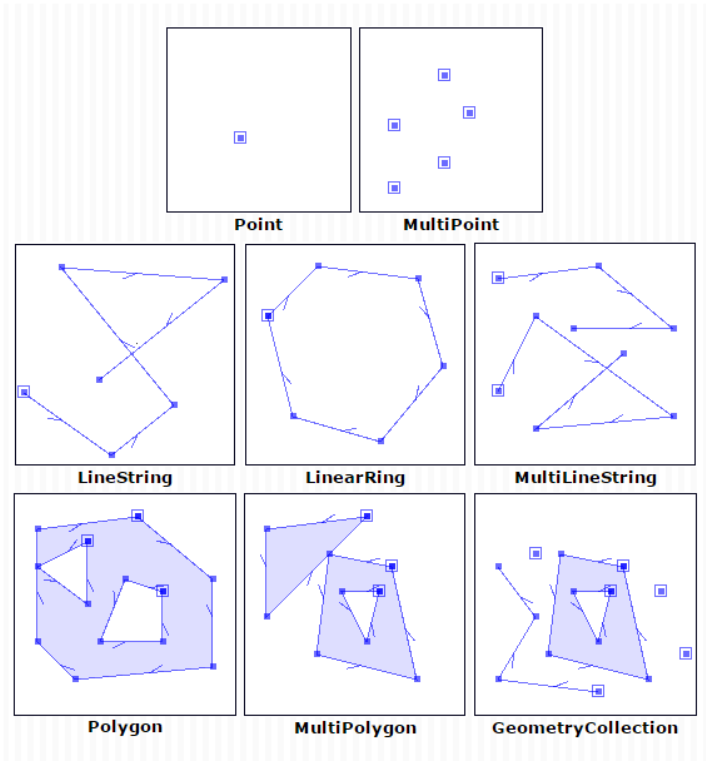
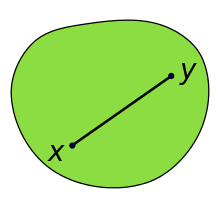
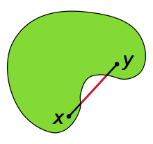
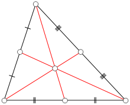
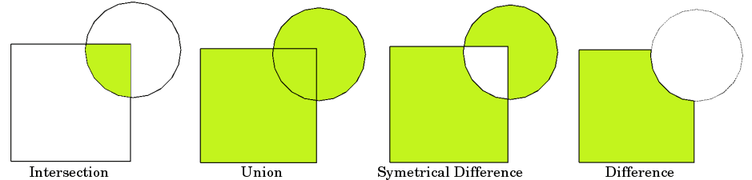

```{r setup, include=FALSE}
options(htmltools.dir.version = FALSE)
library(knitr)
opts_chunk$set(
  fig.align="center",  
  fig.height=4, #fig.width=6,
  # out.width="748px", #out.length="520.75px",
  dpi=300, #fig.path='Figs/',
  cache=T#, echo=F, warning=F, message=F
)

library(hrbrthemes)
library(fontawesome)
library(xaringanExtra)
library(countdown)

xaringanExtra::use_panelset()
xaringanExtra::use_editable()
xaringanExtra::use_clipboard()
xaringanExtra::use_logo(
  image_url = "img/lightbulb.png",
  exclude_class = c("inverse", "hide_logo"),
  width = "50px"
)

htmltools::tagList(
  xaringanExtra::use_clipboard(
    button_text = "<i class=\"fa fa-clipboard\"></i>",
    success_text = "<i class=\"fa fa-check\" style=\"color: #90BE6D\"></i>",
    error_text = "<i class=\"fa fa-times-circle\" style=\"color: #F94144\"></i>"
  ),
  rmarkdown::html_dependency_font_awesome()
)
```

# Table of contents

.vlarge[
1. Loading and exploring spatial data
2. Spatial data structure
3. Simple features
4. Visualizing spatial data
5. Why projections matters
6. Basic spatial operations
]


---

class: inverse, center, middle
name: setting

# Setting the stage

<html><div style='float:left'></div><hr color='#D38C28' size=1px width=1100px></html>

---

# Setting the stage

Install new packages
```{r, eval = F}
install.packages(c("sf",
                   "leaflet",
                   "ggmap"),
                 dependencies = TRUE)
```


And load them
```{r, eval = TRUE, message = FALSE, warning = FALSE}
library(here)
library(tidyverse)
library(sf)
library(leaflet)
library(ggmap)
```

---

# Introduction

- This session could be a whole course on its own, but we only have an hour and half.
- To narrow our subject, we will focus on only one type of spatial data, vector data (typical file formats include shapefiles and geojsons). 
- This is the most common type of spatial data that non-GIS experts will encounter in their work.
- We will focus mostly on how to visualize spatial data, although we will also cover some simple geometry operations.
- We will use the `sf` package, which is the tidyverse-compatible package for geospatial data in R.
- For visualizing, we'll rely on `ggplot2` for static maps and `leaflet` for interactive maps
- If you want to know more about geospatial data in R, we recommend the book [https://geocompr.robinlovelace.net/](Geocomputation with R), by Robin Lovelace, Jakub Nowosad, and Jannes Muenchow.

---

# Setup

The main package we'll rely on is the `sf` (simple features) package. With `sf`, spatial data is structured similarly to a __dataframe__; however, each row is associated with a __geometry__. Geometries can be one of the below types.

.center[

]

---

# Load and explore polygon

The first thing we will do in this session is to recreate this data set:

```{r}
nga_sf <- 
  st_read(here("DataWork",
               "DataSets",
               "Final",
               "gadm_nga_2.geojson"))
```

---

# Exploring the data

Look at first few observations

```{r, eval = T}
head(nga_sf)
```

---

# Exploring the data

Number of rows

```{r, eval = T}
nrow(nga_sf)
```

---

# Exploring the data

Check coordinate reference system

```{r, eval = T}
st_crs(nga_sf)
```

---

# Exploring the data

Plot the data. To plot using `ggplot2`, we use the `geom_sf` geometry.

```{r, eval = T, out.width = "60%"}
ggplot() +
  geom_sf(data = nga_sf)
```

---

# Attributes of data

We want the area of each location, but we don't have a variable for area

```{r, eval = T}
names(nga_sf)
```

---

# Attributes of data

Determine area. Note the CRS is spherical (WGS84), but `st_area` gives area in meters squared. R uses s2 geomety for this.

```{r, eval = T}
st_area(nga_sf) 
```

---

# Operations similar to dataframes

Create new dataset that is just lagos

```{r, eval = T}
lagos_sf <- nga_sf %>% 
  filter(NAME_1 == "Lagos")
```

---

# Operations similar to dataframes

Plot the dataframe

```{r, eval = T, out.width = "65%"}
ggplot() +
  geom_sf(data = lagos_sf)
```

---

# Load and explore polyline

.exercise[

**Exercise 1:** Load the roads data `osm_lagos_roads.geojson` and name the object `roads_sf`

]

`r countdown(minutes = 1, seconds = 0, left = 0, font_size = "2em")`

--

.solution[
**Solution**: 
```{r}
roads_sf <- 
  st_read(here("DataWork",
               "DataSets",
               "Final",
               "osm_lagos_roads.geojson"))
```
]


---

# Load and explore polyline

.exercise[

**Exercise 2:** Look at first few observations

]

`r countdown(minutes = 0, seconds = 20, left = 0, font_size = "2em")`

--

.solution[
**Solution**: 
```{r}
head(roads_sf)
```
]


---

# Load and explore polyline

.exercise[

**Exercise 1:** Check the coordinate reference system

]

`r countdown(minutes = 0, seconds = 30, left = 0, font_size = "2em")`

--

.solution[
**Solution**: 
```{r}
st_crs(roads_sf)
```
]


---

# Load and explore polyline

.exercise[

**Exercise 1:** Map the polyline

]

`r countdown(minutes = 0, seconds = 30, left = 0, font_size = "2em")`

--

.solution[
**Solution**: 
```{r, out.width = "50%"}
ggplot() +
  geom_sf(data = roads_sf)
```
]


---

# Load and explore polyline

.exercise[

**Exercise 1:** Determine length of each line (hint: function similar to `st_area`)

]

`r countdown(minutes = 0, seconds = 30, left = 0, font_size = "2em")`

--

.solution[
**Solution**: 
```{r}
st_length(roads_sf)
```
]

---

# Load and explore point data

We'll load a dataset of the location of schools in Lagos

```{r}
schools_df <- 
  read_csv(here("DataWork",
                "DataSets",
                "Final",
                "osm_lagos_schools.csv"))
```

---

# Explore data

```{r}
head(schools_df)
```

---

# Explore data

```{r}
names(schools_df)
```

---

# Convert to spatial object

We define the (1) coordinates (longitude and latitude) and (2) CRS. __Note:__ We must determine the CRS from the data metadata. This dataset comes from OpenStreetMaps, which uses WGS:4326.

__Bad things will happen if we assign the wrong CRS. VERY BAD, TERRIBLE, HORRIBLE THINGS.__ 

```{r}
schools_sf <- st_as_sf(schools_df, 
                       coords = c("longitude", "latitude"),
                       crs = 4326)
```

---

# Convert to spatial object

```{r}
head(schools_sf$geometry)
```

---

# Map points object: Using sf

```{r, out.width = "50%"}
ggplot() +
  geom_sf(data = schools_sf)
```

---

# Map points object: Using dataframe

```{r, out.width = "50%"}
ggplot() +
  geom_point(data = schools_df,
             aes(x = longitude,
                 y = latitude))
```

---

# Map points objects

.exercise[

**Question:** Why do the maps look different? Map using `sf` looks a bit squished!

]

`r countdown(minutes = 0, seconds = 30, left = 0, font_size = "2em")`

--

.solution[
**Solution**: 

* Units are in decimal degrees. 
* The length (eg, meters) between degrees of longitude shrinks as we go towards the equator. 
* `geom_point` thinks 1 degree distance is the same for latitudes and longitudes (dumb!). 
* `geom_sf` is smart and knows that we are in `WGS:4326` (spherical CRS), and adjust map show distances are more accurate (smart!).

]

---

# Make better static map

Lets make a better static map.

```{r, out.width = "50%"}
lagos_sf <- lagos_sf %>%
  mutate(area_m = lagos_sf %>% st_area() %>% as.numeric(),
         area_km = area_m / 1000^2)

ggplot() +
  geom_sf(data = lagos_sf,
          aes(fill = area_km)) +
  labs(fill = "Area") +
  scale_fill_distiller(palette = "Blues") + 
  theme_void()
```

---

# Make better static map

Lets add another spatial layer

```{r, out.width = "40%"}
ggplot() +
  geom_sf(data = lagos_sf,
          aes(fill = area_km)) +
  geom_sf(data = schools_sf,
          aes(color = "Schools")) +
  labs(fill = "Area",
       color = NULL) +
  scale_fill_distiller(palette = "Blues") + 
  scale_color_manual(values = "black") +
  theme_void()
```

---

# Interactive map

We use the `leaflet` package to make interactive maps. Leaflet is a JavaScript library, but the `leaflet` R package allows making interactive maps using R. Use of leaflet somewhat mimics how we use ggplot.

* Start with `leaflet()` (instead of `ggplot()`)
* Add spatial layers, defining type of layer (similar to geometries)

```{r l1, out.height = "50%", out.width = "80%"}
leaflet() %>%
  addTiles() # Basemap
```

---

# Interactive map

We use the `leaflet` package to make interactive maps. Leaflet is a JavaScript library, but the `leaflet` R package allows making interactive maps using R. Use of leaflet somewhat mimics how we use ggplot.

* Start with `leaflet()` (instead of `ggplot()`)
* Add spatial layers, defining type of layer (similar to geometries)

```{r l2, out.height = "50%", out.width = "80%"}
leaflet() %>%
  addTiles() %>%
  addPolygons(data = lagos_sf)
```

---

# Interactive map

Add a pop-up

```{r l3, out.height = "50%", out.width = "80%"}
leaflet() %>%
  addTiles() %>%
  addPolygons(data = lagos_sf,
              popup = ~NAME_2)
```

--- 

# Interactive map

Add more than one layer

```{r l4, out.height = "50%", out.width = "80%"}
leaflet() %>%
  addTiles() %>%
  addPolygons(data = lagos_sf,
              popup = ~NAME_2) %>%
  addCircles(data = schools_sf,
             popup = ~name,
             color = "black") 
```

---


# Map points objects

.exercise[

**Exercise:** Create a leaflet map with roads. (__Hint:__ Use `addPolylines()`)

`r countdown(minutes = 0, seconds = 30, left = 0, font_size = "2em")`

]


--

.solution[

**Solution**: 

```{r, eval = F}
leaflet() %>%
addTiles() %>%
addPolylines(data = roads_sf)
```

]

---

# Interactive map

We can spent lots of time going over what we can done with leaflet (adding colors, adding legends, etc) - but that would take up too much time. [This resource](https://rstudio.github.io/leaflet/articles/colors.html) provides helpful tutorials.

--- 

# Spatial operations applied on single dataset

Blank slide

--- 

# Transform CRS

We want to compute the length of roads in Lagos using the roads dataset. The roads dataset is currently in a geographic CRS (WGS84), where the units are in decimal degrees. We'll tranform the CRS to a projected CRS that is suitable for Nigeria ([EPSG:32632](https://epsg.io/32632)), and where the units will be in meters.

```{r}
schools_utm_sf <- st_transform(schools_sf, 32632)

schools_sf$geometry %>% head() %>% print()

schools_utm_sf$geometry %>% head() %>% print()
```

--- 

# Buffer

We have the points of schools. Now we create a 1km buffer around schools.

```{r, out.width = "50%"}
schools_1km_sf <- schools_sf %>%
  st_buffer(dist = 1000) # Units are in meters. Thanks s2!

ggplot() +
  geom_sf(data = schools_1km_sf)
```

--- 

# Dissolve by an attribute

Below we have the second administrative regions of Nigeria. Using this dataset, let's create a new object at the first administrative region level.

```{r, out.width = "50%"}
nga1_sf <- nga_sf %>%
  group_by(NAME_1) %>%
  summarise(geometry = st_union(geometry)) %>%
  ungroup()

ggplot() +
  geom_sf(data = nga1_sf)
```

--- 

# Convex hull

__Simple definition:__ Get the outer-most coordinates of a shape and connect-the-dots.

__Formal definition:__ A convex hull of a shape the smallest "convex set" that contains it. (A [convex set](https://en.wikipedia.org/wiki/Convex_set) is where a straight line can be drawn anywhere in the space and the space fully contains the line).

.center[
{ width=40% }
{ width=40% }
]

__Source:__ [Wikipedia](https://en.wikipedia.org/wiki/Convex_set)

--- 

# Convex hull

In the below example, we create a conex hull around schools; creating a polygon that includes all schools.

__Incorrect attempt__

```{r}
schools_chull1_sf <- schools_sf %>%
  st_convex_hull()

nrow(schools_chull1_sf)
```

--- 

# Convex hull

__Correct__

```{r l6, out.height = "50%"}
schools_chull2_sf <- schools_sf %>%
  summarise(geometry = st_combine(geometry)) %>%
  st_convex_hull()

schools_chull2_sf %>% nrow() %>% print()

leaflet() %>%
  addTiles() %>%
  addPolygons(data = schools_chull2_sf) %>%
  addCircles(data = schools_sf, color = "red") 
```

--- 

# Determine centroid

Sometimes we want to represent a polygon or polyline as a single point. For this, we can compute the centroid (ie, geographic center) of a polygon/polyline.

.center[
{ width=40% }
]

__Source:__ [Wikipedia](https://en.wikipedia.org/wiki/Centroid)

--- 

# Determine centroid

```{r}
nga_center_sf <- nga_sf %>%
st_centroid()

ggplot() +
geom_sf(data = nga_center_sf)
```

--- 

# Map points objects

.exercise[

**Exercise:** Create a roads object where (1) roads are buffered by 10 meters and (2) road types are dissolved (using `highway` variable), so the dataset contains one row per road type

`r countdown(minutes = 2, seconds = 0, left = 0, font_size = "2em")`

]

--

.solution[
**Solution**: 
```{r}
rd_type_buff_sf <- roads_sf %>%
st_buffer(dist = 10) %>%
group_by(highway) %>%
summarise(geometry = st_combine(geometry)) %>%
ungroup()

nrow(rd_type_buff_sf)
```
]

--- 

# Remove geometry

__Incorrect approach__

```{r}
lagos_sf %>% 
  select(-geometry)
```

--- 

# Remove geometry

__Correct__

```{r}
lagos_sf %>% 
  st_drop_geometry()
```

--- 

# Spatial operations: using multiple datasets

Blank slide

--- 

# Distances

For this example, we'll compute the distance between each school to a motorway.

```{r}
motor_sf <- roads_sf %>%
  filter(highway == "motorway")

# Matrix: distance of each school to each motorway
dist_mat <- st_distance(schools_sf, motor_sf)

# Take minimun distance for each school
dist_mat %>% apply(1, min) %>% head()
```

--- 

# Intersects

For this example we'll determine which of Lagos's second administrative divisions intersects with a motorway.

```{r}
# Sparse matrix
st_intersects(lagos_sf, motor_sf)
```

--- 

# Intersects

```{r}
# Matrix
st_intersects(lagos_sf, motor_sf, sparse = F)
```

--- 

# Intersects

Take `max` (`FALSE` corresponds to 0 and `TRUE` corresponds to 1). So taking max will yeild if unit intersects with _any_ motorway

```{r}
# Matrix
st_intersects(lagos_sf, motor_sf, sparse = F) %>% apply(1, max)
```

--- 

# Intersection

We have roads for all of Lagos. Here, we want to create new roads object that __only includes__ roads in the Eti-Osa unit.

```{r}
etis_sf <- lagos_sf %>%
  filter(NAME_2 == "Eti-Osa")

roads_etis_sf <- st_intersection(roads_sf, etis_sf)

ggplot() +
  geom_sf(data = roads_etis_sf)
```

--- 

# Difference

We have roads for all of Lagos. Here, we want to create new roads object that __excludes__ roads in the Eti-Osa unit.

```{r}
roads_notetis_sf <- st_difference(roads_sf, etis_sf)

ggplot() +
  geom_sf(data = etis_sf, fill = NA, color = "red") +
  geom_sf(data = roads_notetis_sf) 
```

--- 

# Overlay

Intersections and differencing are __overlay__ functions

.center[
{ width=40% }
]

--- 

# Spatial join

We have a dataset of schools. The school dataframe contains information such as the school name, but not on the administrative region it's in. To add data on the administrative region that the school is in, we'll perform a spatial join.

Check the variable names. No names of second administrative divison :(
```{r}
names(schools_sf)
```

--- 

# Spatial join

Use `st_join` to add attributes from `lagos_sf` to `schools_sf`.

```{r}
schools_lagos_sf <- st_join(schools_sf, lagos_sf)

names(schools_lagos_sf)
```

--- 

# Spatial join

.exercise[

**Exercise:** Make static map using of Lagos administrative areas, where each administrative area polygon displays the number of schools.

`r countdown(minutes = 5, seconds = 0, left = 0, font_size = "2em")`

]


--

.solution[
**Solution**: 
```{r}
## Dataframe of number of schools per NAME_2
n_school_df <- schools_lagos_sf %>%
  st_drop_geometry() %>%
  group_by(NAME_2) %>%
  summarise(n_school = n()) %>%
  ungroup()

## Merge info with lagos_sf
lagos_sch_sf <- lagos_sf %>% 
  left_join(n_school_df, by = "NAME_2")

## Map
ggplot() +
  geom_sf(data = lagos_sch_sf,
          aes(fill = n_school))
```

]

# OTHER

.center[
{ width=40% }
]

