```{r setup, include = FALSE}

# Load packages
library(knitr)
library(hrbrthemes)
library(fontawesome)
library(here)
library(xaringanExtra)

here::i_am("Presentations/01-intro-to-R.Rmd")

options(htmltools.dir.version = FALSE)
opts_chunk$set(
  fig.align = "center",
  fig.height = 4,
  dpi = 300,
  cache = T
  )

xaringanExtra::use_panelset()
xaringanExtra::use_webcam()
xaringanExtra::use_clipboard()
htmltools::tagList(
  xaringanExtra::use_clipboard(
    success_text = "<i class=\"fa fa-check\" style=\"color: #90BE6D\"></i>",
    error_text = "<i class=\"fa fa-times-circle\" style=\"color: #F94144\"></i>"
  ),
  rmarkdown::html_dependency_font_awesome()
)

xaringanExtra::use_logo(
  image_url = here("Presentations",
                   "img",
                   "lightbulb.png"),
  exclude_class = c("inverse", 
                    "hide_logo"),
  width = "50px"
)
```

```{css, echo = F, eval = T}
@media print {
  .has-continuation {
    display: block !important;
  }
}

.remark-slide-content {
    font-size: 30px;
}
```

# Preamble

- Make sure you have the packages `tinytex`, `stargazer`, and `huxtable` installed

```{r, eval=FALSE}
# Packages we used for other sessions, install only if needed
install.packages("dplyr")
install.packages("huxtable")

# New packages
install.packages("tinytex")
install.packages("stargazer")

# No need to load the packages for now
```

---

# Preamble <font size="5">(`r fa("clock")` 5 min)</font>

- Use `tinytex` to install LaTeX
- If you're using a WB computer:

1. Download this file: https://osf.io/sehzg
1. Run `tinytex:::install_prebuilt("location/to/file.zip")` (notice the triple colon)

- If you're not:

1. Run `tinytex::install_tinytex()`

---

# Preamble

This will take a while. Leave it running

```{r echo = FALSE, out.width = "80%"}
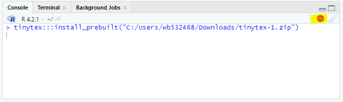
```

---

# Preamble

- LaTeX can be unpredictable in WB computers. It's possible that this didn't work
- Don't worry for now, just follow the approppriate instructions we'll specify in the exercises

---

# Introduction

- This is an **introduction** to R Markdown
- We'll show:
  1. How to write and knit (output) R Markdown documents
  2. How to format text and R code in R Markdown documents
  3. How to include regression tables in R Markdown documents

---

# Table of contents

1. [Dynamic documents](#dynamic-documents)
2. [Knitting](#knitting)
3. [Markdown](#markdown)
4. [R code](#r-code)
5. [R plots](#r-plots)
6. [Inline code](#r-inline-code)
7. [Regression outputs](#regression-outputs)
8. [Annex](#annex)

---

class: inverse, center, middle
name: dynamic-documents

# Dynamic documents

<html><div style='float:left'></div><hr color='#D38C28' size=1px width=1100px></html>

---

# Dynamic documents and R Markdown

- Dynamic documents are documents that include both text and code outputs
- They are generated by a script and are updated automatically every time the script runs
- R Markdown is a type of dynamic document

---

# Dynamic documents

- Code and documentation is produced together

```{r echo = FALSE, out.width = "100%"}
knitr::include_graphics("img/dynamic-docs-in-R.png")
```

---

# Why use dynamic documents?

- Increased research transparency. Documents are fully reproducible
- No more copying and pasting outputs from R to a document editor
- Nice option for simple documents that don't require a lot of formatting
- Can include code snippets

---

class: inverse, center, middle
name: knitting

# Knitting R Markdown documents

<html><div style='float:left'></div><hr color='#D38C28' size=1px width=1100px></html>

---

# Knitting R Markdown documents

- R markdown combines text, R code, and rendered outputs
- The text follows Markdown's syntax
- The code and outputs follow R's syntax
- Knitting an R Markdown document is rendering the text and code portions into a single output
- The output can be a PDF, Word, or HTML document

---

# Knitting R Markdown documents

.exercise[
## Exercise 1: Knit an R Markdown document <font size="5">(`r fa("clock")` 2 min, leave it running)</font>

1. Go to the course repository: https://osf.io/86g3b/
2. In the files panel, download `R for Stata Users - 2023 March` > `scripts` > `r-markdown-template.Rmd`
3. Open this file in RStudio
  + If the installation of tinytex didn't work, change line 2 to: `output: html_document`
4. Click on `Knit`. If RStudio asks you to update some packages, select `Yes`
]

---

# Knitting R Markdown documents

Note that this might take a while

```{r echo = FALSE, out.width = "70%"}
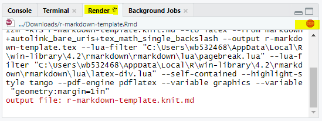
```

We'll continue with markdown syntax while it finishes

---

class: inverse, center, middle
name: markdown

# Markdown

<html><div style='float:left'></div><hr color='#D38C28' size=1px width=1100px></html>

---

# Markdown

- The text part of R Markdown follows the syntax of Markdown
- Markdown is a "light" markup language. It's similar to Latex or HTML, but simpler
- Markdown was designed to be easily readable while allowing to format text and document sections

---

# Markdown - Headers

- Headers in markdown are preceded by pound (`#`) symbols
- Additional pound symbols denote a lower level in the headers hierarchy

```{r echo = FALSE, out.width = "100%"}
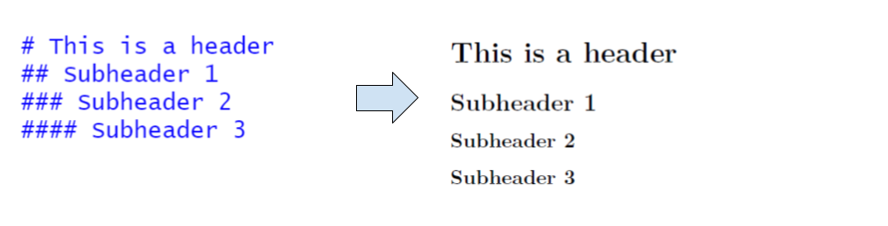
```

---

# Markdown - Paragraphs

- Text not preceded by special symbols are regular paragraphs.

```{r echo = FALSE, out.width = "70%"}
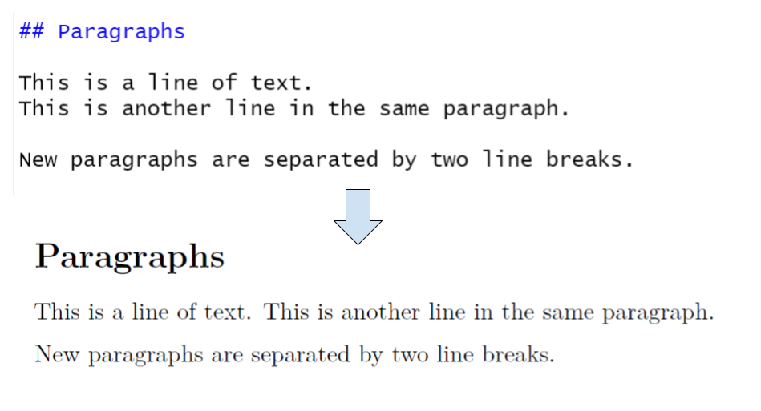
```

---

# Markdown - Text emphasis

- Emphasized text is enclosed by special symbols.

```{r echo = FALSE, out.width = "70%"}
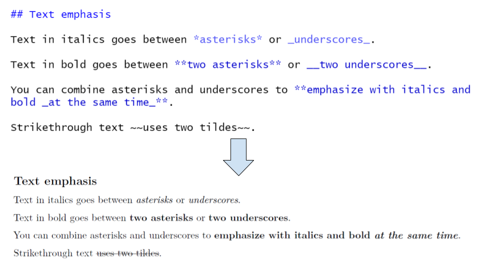
```

---

# Markdown - Lists

- Markdown allows us to use both ordered and unordered lists.

```{r echo = FALSE, out.width = "60%"}
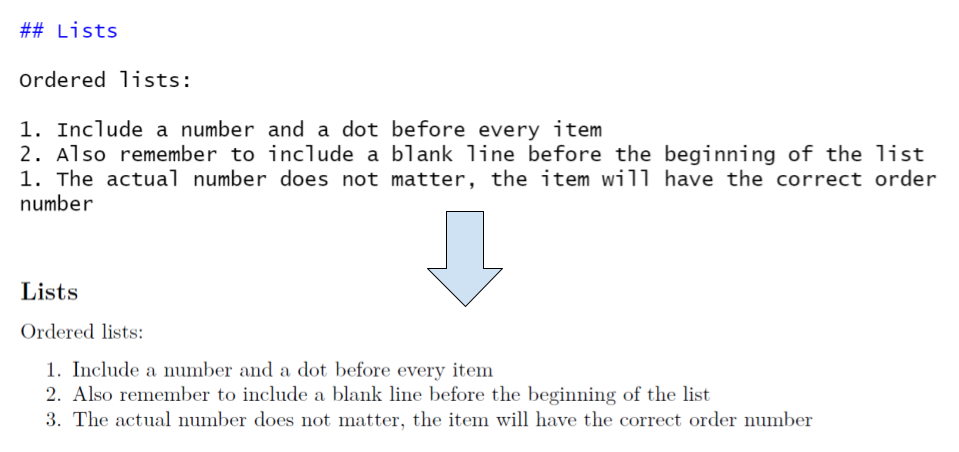
```

---

# Markdown - Lists

- Markdown allows us to use both ordered and unordered lists.

```{r echo = FALSE, out.width = "70%"}
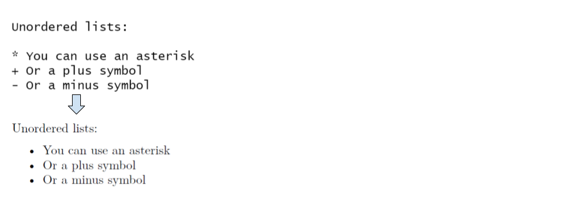
```

---

# Markdown - Links

- We can also include links as text in Markdown.

```{r echo = FALSE, out.width = "60%"}
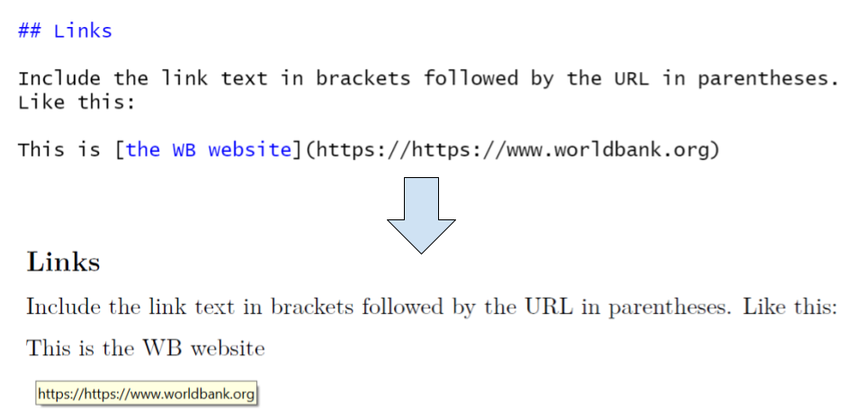
```

---

# Markdown - Tables

- Lastly, we can include tables in Markdown text.

```{r echo = FALSE, out.width = "65%"}
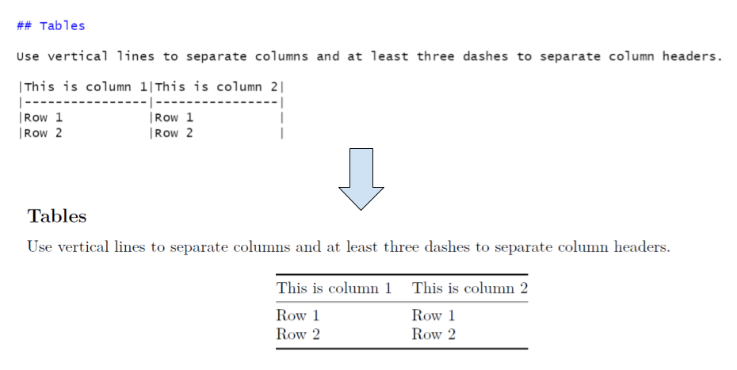
```

---

# Markdown - Tables

- Lastly, we can include tables in Markdown text.

```{r echo = FALSE, out.width = "65%"}
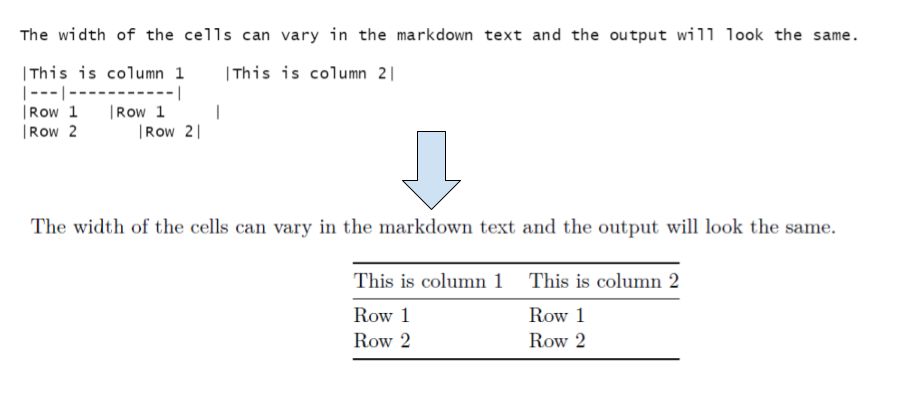
```

---

# Exercise 1 results

- If exercise 1 worked, you'll now see this PDF file (or HTML) in the folder where you saved `r-markdown-template.Rmd`

```{r echo = FALSE, out.width = "50%"}
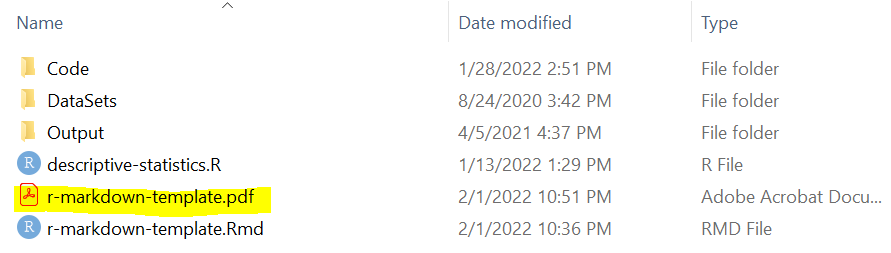
```

- If it's still running, let it run until it finishes
- If it failed, try again after changing `output: html_document` in line 2

---

class: inverse, center, middle
name: r-code

# R Code

<html><div style='float:left'></div><hr color='#D38C28' size=1px width=1100px></html>

---

# Including R code

- R code in R Markdown goes inside **fenced code blocks**, as the one below

````
```{r}`r ''`
# Your R code goes here
```
````

---

# Including R code

- To add new block, you can type the fences directly, go to `Insert` > `R` in the script panel of RStudio, or type `CTRL` + `ALT` + `i`

```{r echo = FALSE, out.width = "80%"}
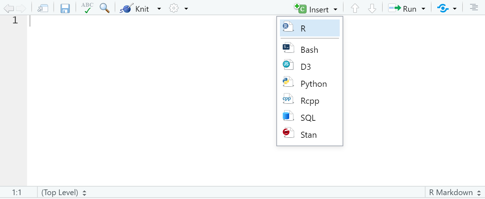
```

---

# Including R code

.exercise[
## Exercise 2: Include the summary of a variable <font size="5">(`r fa("clock")` 2 min)</font>

1. Create a header named `R Code` at the bottom of `r-markdown-template.Rmd`
2. Create a new fenced code block where you load the dataset `mtcars`
  + `mtcars` is a built-in dataset. Load it with: `data(mtcars)`
3. Inside the same block, get the summary of the variable `mpg` with `summary(mtcars$mpg)`
4. Knit. You'll have to close the PDF document if you have it opened
]

---

# Including R code

````
## R Code

```{r}`r ''`
data(mtcars)
summary(mtcars$mpg)
```
````

---

# Including R code

```{r echo = FALSE, out.width = "80%"}
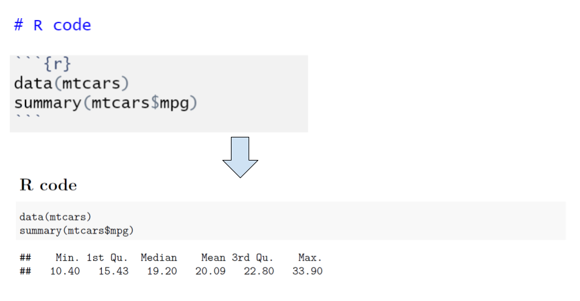
```

---

# Including R code

- Note that the output echoes both the code and the output
- What if we wanted to include the output but not the code?
- We use the argument `echo = FALSE` in the fenced code block for that
- Code block arguments are separated by commas inside the curly brackets, as in: `{r, echo = FALSE}`

---

# Including R code

.exercise[
## Exercise 3: Omit the code when knitting R code <font size="5">(`r fa("clock")` 1 min)</font>

1. Add the option `echo = FALSE` to the fenced code block created in exercise 2
2. Knit the document and see how it's different now
]

---

# Including R code

````
```{r, echo = FALSE}`r ''`
data(mtcars)
summary(mtcars$mpg)
```
````

---

# Including R code

```{r echo = FALSE, out.width = "80%"}
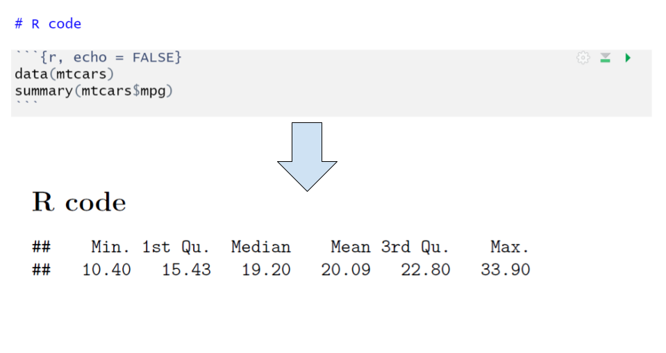
```

---

# Including R code

- To include only R code but not the output, we use the option `eval = FALSE`

````
```{r, eval = FALSE}`r ''`
data(mtcars)
summary(mtcars$mpg)
```
````

---

# Including R code

```{r echo = FALSE, out.width = "80%"}
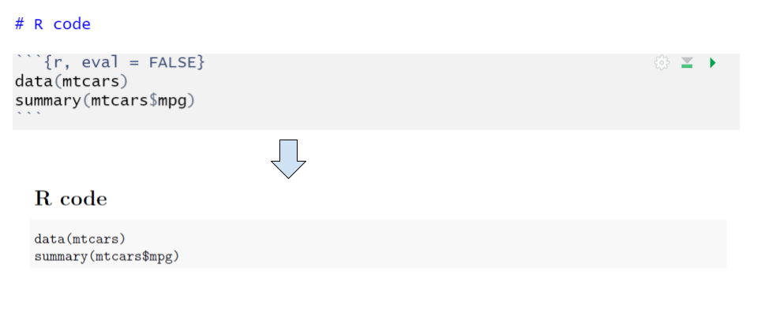
```

---

class: inverse, center, middle
name: r-plots

# R Plots

<html><div style='float:left'></div><hr color='#D38C28' size=1px width=1100px></html>

---

# Including R plots

- Adding R plots is similar to adding R code
- Include the code producing the plot in a fenced block
- The block option `echo = FALSE` is useful when we only want to include the plot but not the code producing it

---

# Including R plots

.exercise[
## Exercise 4: Include an R plot in your document <font size="5">(`r fa("clock")` 2 min)</font>

1. Create a header named `R Plots`
2. Create a new fenced code block with the option `echo = FALSE`
3. Add the following code inside the new block:

```{r, eval = FALSE}
plot(mtcars$wt,
     mtcars$mpg,
     main = "Plot example",
     xlab = "Car weight",
     ylab = "Miles per gallon")
```
]

---

# Including R plots

````
# R plots

```{r, echo = FALSE}`r ''`
plot(mtcars$wt,
     mtcars$mpg,
     main = "Plot example",
     xlab = "Car weight",
     ylab = "Miles per gallon")
```
````

---

# Including R plots

```{r echo = FALSE, out.width = "60%"}
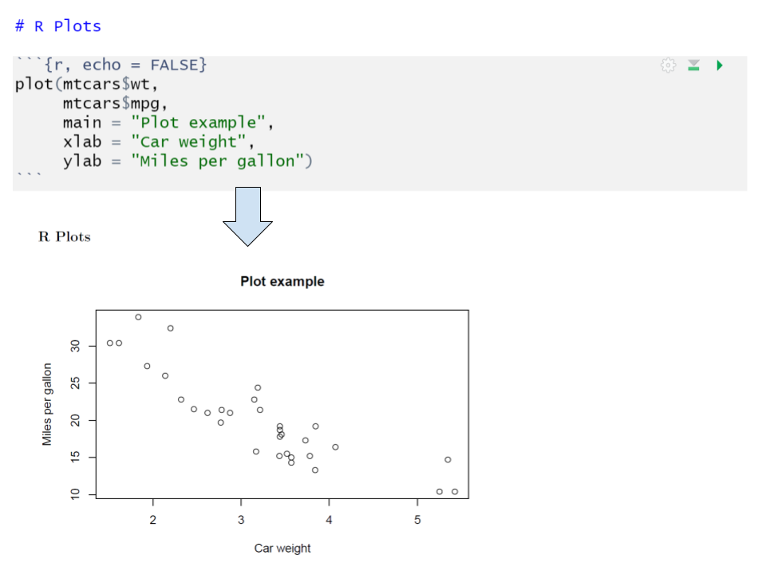
```

---

class: inverse, center, middle
name: r-inline-code

# Inline code

<html><div style='float:left'></div><hr color='#D38C28' size=1px width=1100px></html>

---

# Including code inline

- Inline code  is enclosed by backtick followed by an r (``r`) and a single backtick
- For example:

~~~
The mean of mpg is `r knitr::inline_expr("mean(mtcars$mpg)")`.
~~~

- Will be rendered as:

````
The mean of mpg is `r mean(mtcars$mpg)`.
````

---

# Including code inline

.exercise[
## Exercise 5 <font size="5">(`r fa("clock")` 2 min)</font>

1. Create a new header named `Inline code` in `markdown-template.Rmd`
2. Add an unordered list with the following text and include inline R code to render the corresponding numbers in each case
  + The number of elements in mtcars is: (use function `nrow(mtcars)`)
  + The mean of weight is: (use function `mean(mtcars$wt)`)
  + The standard deviation is: (use function `sd(mtcars$wt)`)
]

---

# Including code inline

~~~
# Inline code

- The number of elements in mtcars is `r knitr::inline_expr("nrow(mtcars)")`
- The mean of weight is `r knitr::inline_expr("mean(mtcars$wt)")`
- The standard deviation is `r knitr::inline_expr("sd(mtcars$wt)")`
~~~

---

# Including code inline

```{r echo = FALSE, out.width = "80%"}
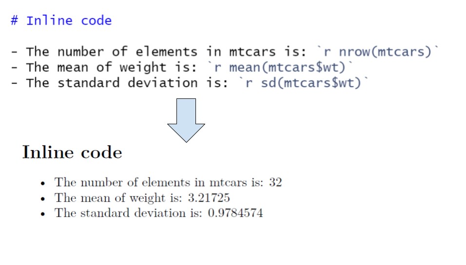
```

---

# Including code inline

You can use the function `round()` to control the number of decimals displayed.

~~~
# Inline code

- The number of elements in mtcars is `r knitr::inline_expr("nrow(mtcars)")`
- The mean of weight is `r knitr::inline_expr("round(mean(mtcars$wt), 1)")`
- The standard deviation is `r knitr::inline_expr("round(sd(mtcars$wt), 2)")`
~~~

---

# Including code inline

You can use the function `round()` to control the number of decimals displayed.

```{r echo = FALSE, out.width = "80%"}
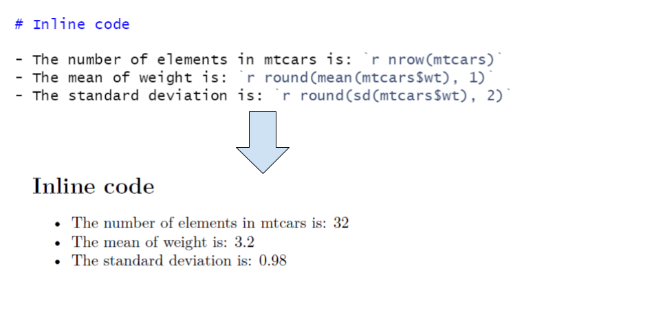
```

---

# Including code inline

You can also combine R inline code with the markdown syntax for tables to produce statistics tables.

~~~
# Inline code in tables

|Column: weight| Value                       |
|--------------|-----------------------------|
|N             |`r knitr::inline_expr("nrow(mtcars)")`             |
|Mean          |`r knitr::inline_expr("round(mean(mtcars$wt), 1)")`|
|SD            |`r knitr::inline_expr("round(sd(mtcars$wt), 2)")`  |
~~~

---

# Including code inline

You can also combine R inline code with the markdown syntax for tables to produce statistics tables.

```{r echo = FALSE, out.width = "55%"}
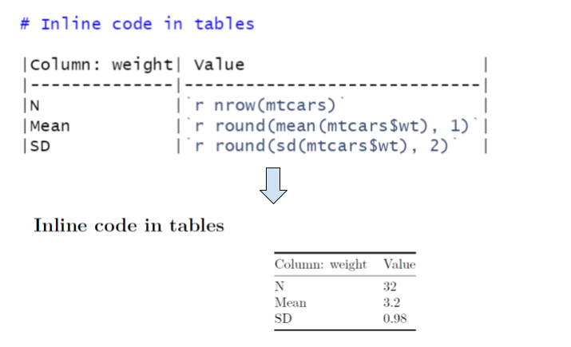
```

---

class: inverse, center, middle
name: regression-outputs

# Including regression outputs

<html><div style='float:left'></div><hr color='#D38C28' size=1px width=1100px></html>

---

# Including regression outputs

- In a previous session, we saw that we can produce regression tables in LaTeX
- We can use code producing LaTeX outputs along with the code block option `results = "asis"` to display them in the knitted document

---

# Including regression outputs - Stargazer

- First, we'll start with the function `stargazer()` from the package `stargazer`
- The first argument of `stargazer()` is a regression result
- We also include the arguments `echo = FALSE` and `message = FALSE` in the code block to omit printing the code and messages that appear when loading stargazer
- In `stargazer()` we include `header = FALSE` to omit printing stargazer metadata

**Important:** When using external packages in RMarkdown, you need to have them loaded in a code block regardless of if they're already loaded in your current session. Libraries have to load again for each knit.

---

# Including regression outputs - Stargazer

````
```{r, echo = FALSE, message = FALSE, results = "asis"}`r ''`
# Loading stargazer
library(stargazer)

# Creating a simple regression
model <- lm(mpg ~ cyl + hp, data = mtcars)

# Printing it with stargazer
stargazer(model, header = FALSE) # add: type = "html" if knitting to HTML
```
````

---

# Including regression outputs - Stargazer

```{r echo = FALSE, out.width = "95%"}
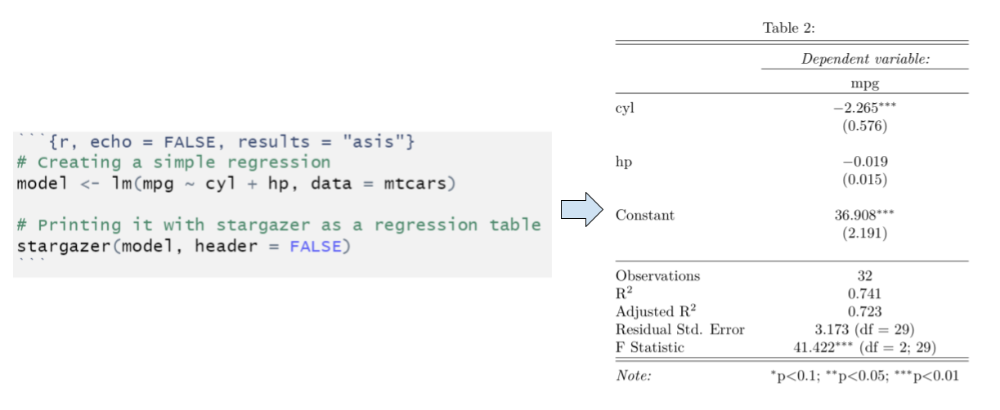
```

---

# Including regression outputs - Stargazer

.exercise[
## Exercise 6 <font size="5">(`r fa("clock")` 3 min)</font>

1. Create a new header named `Regressions - Stargazer` in `r-markdown-template.Rmd`
1. Add a new code block with the arguments `echo = FALSE` and `results = "asis"`
1. Load stargazer in the code block
1. Add a regression of the variable `mpg` on `wt` and `hp`
1. Use stargazer's arguments `header = FALSE`, `title = "your_title"` and `omit = c("Constant")` to customize your table
  + If your output is HTML instead of PDF, include the argument `type = "html"` in `stargazer()`
]

---

# Including regression outputs - Stargazer

````
# Regressions - Stargazer

```{r, echo = FALSE, message = FALSE, results = "asis"}`r ''`
library(stargazer)
model <- lm(mpg ~ wt + hp, data = mtcars)
stargazer(model,
          header = FALSE,
          title = "Best table ever",
          omit = c("Constant"))
```
````

---

# Including regression outputs - Stargazer

```{r echo = FALSE, out.width = "55%"}
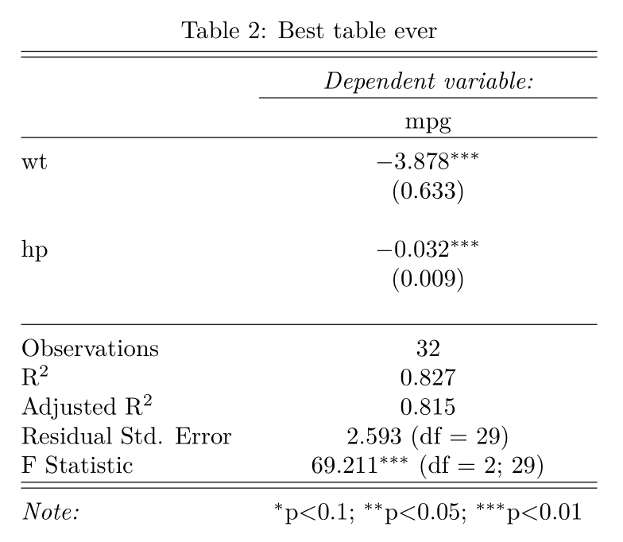
```

---

# Including regression outputs - Huxtable

- Remember `huxtable`? we can also use it to include regression tables in R Markdown
- The advantage of using `huxtable` compared to `stargazer` is that we don't have to define the type of output we're generating with R Markdown. `huxtable` automatically detects it and will transform the output as needed in the resulting document
- `huxtable` has an important disadvantage, though: it requires to install external libraries in your local LaTeX installation

---

# Including regression outputs - Huxtable

- Conveniently, the library `huxtable` has a function that handles that installation for us (needed only if you're knitting to PDF)

```{r, eval = FALSE}
# Only if you're knitting to PDF:
huxtable::install_latex_dependencies()
```

- Once this finishes, we can use `huxtable` with R Markdown

---

# Including regression outputs - Huxtable

- For regressions, we use the function `huxreg()` as in the example below
- Note that the option `results = "asis"` is not used with `huxtable`

````
```{r, echo = FALSE, warning = FALSE}`r ''`
library(huxtable)
model <- lm(mpg ~ wt + hp, data = mtcars)
huxreg(model)
```
````

---

# Including regression outputs - Huxtable

- For regressions, we use the function `huxreg()` as in the example below
- Note that the option `results = "asis"` is not used with `huxtable`

```{r echo = FALSE, out.width = "75%"}
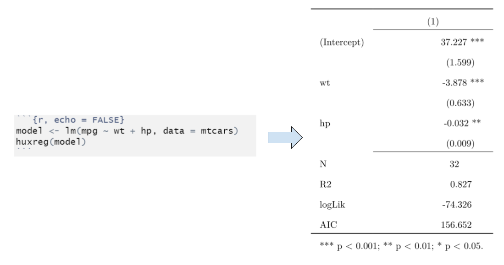
```

---

# Including regression outputs - Huxtable

.exercise[
## Exercise 7: Now with Huxtable <font size="5">(`r fa("clock")` 2 min)</font>

1. Create a new header named `Regressions - Huxtable` in `r-markdown-template.Rmd`
1. Add a new code block with the argument `echo = FALSE`
1. Load huxtable in the code block
1. Add a regression table of the variable `mpg` on `wt` and `hp` using `huxreg()`
1. Use huxreg's argument `omit_coefs = c("(Intercept)")` to customize your table
]

---

# Including regression outputs - Huxtable

````
# Regressions - Huxtable

```{r, echo = FALSE, warning = FALSE}`r ''`
library(huxtable)
model <- lm(mpg ~ wt + hp, data = mtcars)
huxreg(model,
       omit_coefs = c("(Intercept)"))
```
````

---

# Including regression outputs - Huxtable

```{r echo = FALSE, out.width = "45%"}
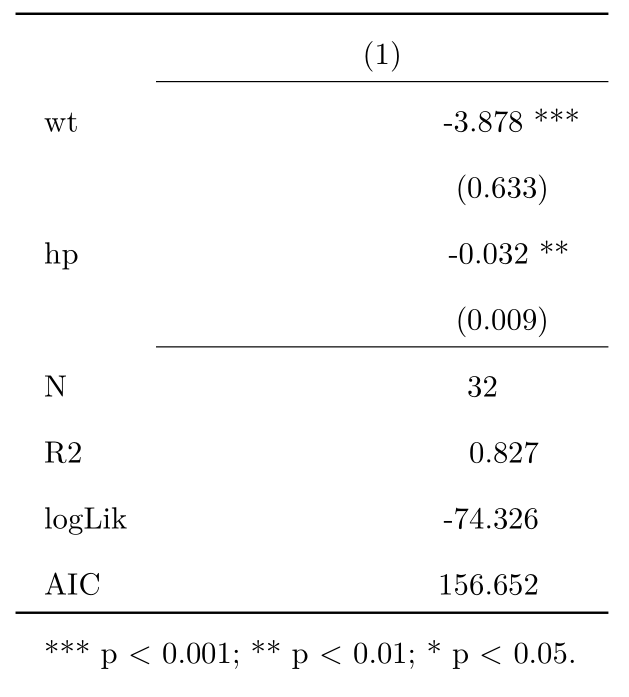
```

---

# Including regression outputs - Huxtable

- If you want to include a title in your regression, use the command `set_caption()` with the result of `huxreg()` as argument

````
```{r, echo = FALSE, warning = FALSE}`r ''`
library(huxtable)
library(dplyr)
model <- lm(mpg ~ wt + hp, data = mtcars)
table <- huxreg(model,
       omit_coefs = c("(Intercept)"))
table %>% set_caption("Another nice table")
```
````

---

# Including regression outputs - Huxtable

```{r echo = FALSE, out.width = "45%"}
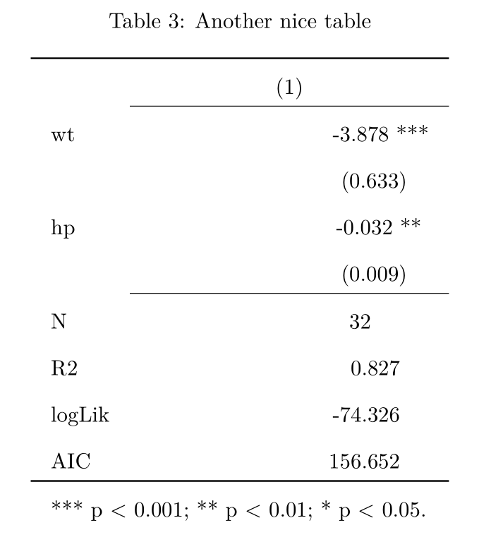
```

---

class: inverse, center, middle

# Thank you!

---

class: inverse, center, middle
name: annex

# Annex

<html><div style='float:left'></div><hr color='#D38C28' size=1px width=1100px></html>

---

# Annex - Opening a new R Markdown in R Studio

- Go to `File` > `New File` > `R Markdown`
- You can register the author name and the document title. This can be changed later if needed
- You can also define the default output format (HTML, PDF, Word). This can also be changed later
- Selecting `OK` will generate a template with document sections and code blocks that you can modify
- Selecting `Create Empty Document` will ignore the author, title, and output format registered and will result in a completely blank R Markdown document

---

# Annex - Author, title, and output type

- The section enclosed in `---` at the beginning of the document can contain the author, title, and default output format
- You can add the author and document title with `author: NAME` and `title: TITLE`
- You can also change the default output format. Some options are:
  + `output: html_document`
  + `output: pdf_document`
  + `output: word_document`
  + `output: beamer_presentation`

---

# Annex - Naming R code blocks

- You can name R code blocks if you add the name after the `r` in the initial brackets
- The example below has the name `my-r-code`

````
```{r my-r-code}`r ''`
summary(mtcars$mpg)
```
````

---

# Annex - Naming R code blocks

- This is very convenient to debug code blocks by clicking on `Output` under the `R Markdown` tab of the console, in case your file has an error


```{r echo = FALSE, out.width = "75%"}
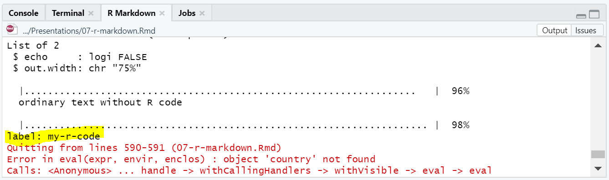
```

---

# Annex - Including images

- The Markdown syntax to include images is: ``
- For example:

````

````

- Renders:


---

# Annex - Including a LaTeX preamble in a PDF doc

- If you want to further customize a PDF document in R Markdown and you're familiar with LaTeX, you can include a LaTeX preamble that will be executed when you knit your document
- To enable this feature, replace `output: pdf_document` with the following code in the section enclosed by the three dashes (`---`) at the beginning of your document

```
output:
  pdf_document:
    includes:
      in_header: "preamble.tex"
```

---

# Annex - Looking ahead

- [Markdown guide](https://www.markdownguide.org/)
- [R Markdown: The Definitive Guide](https://bookdown.org/yihui/rmarkdown/basics.html)
- [An introduction to Stata Markdown](https://osf.io/nam2d/)
- [Stargazer official manual](https://cran.r-project.org/web/packages/stargazer/stargazer.pdf)
- [Introduction to Huxtable](https://cran.r-project.org/web/packages/huxtable/vignettes/huxtable.html)

---
exclude: true

```{R, pdfs, include = F, eval = F}
pagedown::chrome_print("07-r-markdown.html", output = "07-r-markdown.pdf")

```