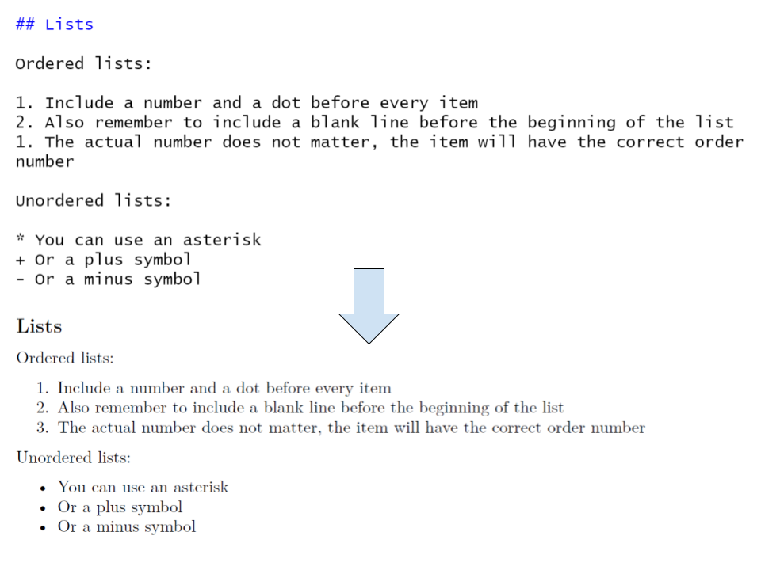

```{r setup, include = FALSE}

# Load packages
library(knitr)
library(hrbrthemes)
library(fontawesome)
library(here)
library(xaringanExtra)

here::i_am("Presentations/01-intro-to-R.Rmd")

options(htmltools.dir.version = FALSE)
opts_chunk$set(
  fig.align = "center",
  fig.height = 4,
  dpi = 300,
  cache = T
  )

xaringanExtra::use_panelset()
xaringanExtra::use_webcam()
xaringanExtra::use_clipboard()
htmltools::tagList(
  xaringanExtra::use_clipboard(
    success_text = "<i class=\"fa fa-check\" style=\"color: #90BE6D\"></i>",
    error_text = "<i class=\"fa fa-times-circle\" style=\"color: #F94144\"></i>"
  ),
  rmarkdown::html_dependency_font_awesome()
)

xaringanExtra::use_logo(
  image_url = here("Presentations",
                   "img",
                   "lightbulb.png"),
  exclude_class = c("inverse", 
                    "hide_logo"),
  width = "50px"
)
```

```{css, echo = F, eval = T}
@media print {
  .has-continuation {
    display: block !important;
  }
}

.remark-slide-content {
    font-size: 30px;
}
```

# Introduction

- This is an **introduction** to R Markdown
- We'll show:
  1. How to write and knit (output) R Markdown documents
  2. How to format text and R code in R Markdown documents

---

# Table of contents

1. [Dynamic documents](#dynamic-documents)
2. [Knitting](#knitting)
3. [Markdown](#markdown)
4. [R code](#r-code)
5. [R plots](#r-plots)
6. [Inline code](#r-inline-code)
7. [Annex](#annex)

---

class: inverse, center, middle
name: dynamic-documents

# Dynamic documents

<html><div style='float:left'></div><hr color='#D38C28' size=1px width=1100px></html>

---

# Dynamic documents and R Markdown

- Dynamic documents are documents that include both text and code outputs
- They are generated by a script and are updated automatically every time the script runs
- R Markdown is a type of dynamic document

---

# Dynamic documents

- Code and documentation is produced together

```{r echo = FALSE, out.width = "100%"}
knitr::include_graphics("img/dynamic-docs-in-R.png")
```

---

# Why use dynamic documents?

- Increased research transparency. Documents are fully reproducible
- No more copying and pasting outputs from R to a document editor
- Nice option for simple documents that don't require a lot of formatting
- Can include code snippets

---

class: inverse, center, middle
name: knitting

# Knitting R Markdown documents

<html><div style='float:left'></div><hr color='#D38C28' size=1px width=1100px></html>

---

# Knitting R Markdown documents

- R markdown combines text, R code, and rendered outputs
- The text follows Markdown's syntax
- The code and outputs follow R's syntax
- Knitting an R Markdown document is rendering the text and code portions into a single output
- The output can be a PDF, Word, or HTML document

---

# Knitting R Markdown documents

## Exercise 1

1. Go to [our R trainings repository](https://osf.io/86g3b/)
2. In the files panel, download `Introduction to R Markdown...` > `r-markdown-template.Rmd`
3. Open this file in RStudio
4. Click on `Knit`. If RStudio asks you to update some packages, select `Yes`

---

# Knitting R Markdown documents

- Knitting a file to PDF means that RStudio created a PDF file from an R Markdown file
- You'll now see this PDF file in the folder where you saved `markdown-template.Rmd`

```{r echo = FALSE, out.width = "80%"}
knitr::include_graphics("img/r-markdown/rendered-docs.png")
```

---

class: inverse, center, middle
name: markdown

# Markdown

<html><div style='float:left'></div><hr color='#D38C28' size=1px width=1100px></html>

---

# Markdown

- The text part of R Markdown follows the syntax of Markdown
- Markdown is a "light" markup language. It's similar to Latex or HTML, but simpler
- Markdown was designed to be easily readable while allowing to format text and document sections

---

# Markdown - Headers

- Headers in markdown are preceded by pound (`#`) symbols
- Additional pound symbols denote a lower level in the headers hierarchy

```{r echo = FALSE, out.width = "100%"}
knitr::include_graphics("img/r-markdown/markdown-headers.png")
```

---

# Markdown - Paragraphs

- Text not preceded by special symbols conform regular paragraphs.

```{r echo = FALSE, out.width = "70%"}
knitr::include_graphics("img/r-markdown/markdown-paragraphs.png")
```

---

# Markdown - Text emphasis

- Emphasized text is enclosed by special symbols.

```{r echo = FALSE, out.width = "70%"}
knitr::include_graphics("img/r-markdown/markdown-text-emphasis.png")
```

---

# Markdown - Lists

- Markdown allows us to use both ordered and unordered lists.

```{r echo = FALSE, out.width = "60%"}

```

---

# Markdown - Links

- Lastly, we can also include links as text in Markdown.

```{r echo = FALSE, out.width = "60%"}
knitr::include_graphics("img/r-markdown/markdown-links.png")
```

---

class: inverse, center, middle
name: r-code

# R Code

<html><div style='float:left'></div><hr color='#D38C28' size=1px width=1100px></html>

---

# Including R code

- R code in R Markdown goes inside **fenced code blocks**, as the one below

````
```{r}`r ''`
# Your R code goes here
```
````

---

# Including R code

- To add new block, you can type the fences directly, go to `Insert` > `R` in the script panel of RStudio, or type `CTRL` + `ALT` + `i`

```{r echo = FALSE, out.width = "80%"}
knitr::include_graphics("img/r-markdown/insert-new-r-fenced-block.png")
```

---

# Including R code

## Exercise 2

Include the summary of a variable in the document.

1. Create a header named `R Code` at the bottom of `markdown-template.Rmd`
2. Create a new fenced code block where you load the sample dataset `mtcars`
  + `mtcars` is a built-in dataset
  + load it with: `data(mtcars)`
3. Inside the same block, get the summary of the variable `mpg` with `summary(mtcars$mpg)`
4. Knit and check how this is rendered in the resulting file. Note that you'll have to close the PDF document to knit it again

---

# Including R code

```{r echo = FALSE, out.width = "80%"}
knitr::include_graphics("img/r-markdown/r-markdown-r-code.png")
```

---

# Including R code

- Note that the output echoes both the code and the output
- What if we wanted to include the output but not the code?
- We use the argument `echo = FALSE` in the fenced code block for that
- Code block arguments are separated by commas inside the curly brackets, as in:

````
```{r, echo = FALSE}`r ''`
data(mtcars)
summary(mtcars$mpg)
```
````

---

# Including R code

## Exercise 3

Omit the code when knitting R code.

1. Add the option `echo = FALSE` to the fenced code block created in exercise 2
2. Knit the document and check the difference

---

# Including R code

```{r echo = FALSE, out.width = "80%"}
knitr::include_graphics("img/r-markdown/r-markdown-r-code-echo-F.png")
```

---

# Including R code

- To include R code but not the output, we can use the option `eval = FALSE`

````
```{r, eval = FALSE}`r ''`
data(mtcars)
summary(mtcars$mpg)
```
````

---

# Including R code

```{r echo = FALSE, out.width = "80%"}
knitr::include_graphics("img/r-markdown/r-markdown-r-code-eval-F.png")
```

---

class: inverse, center, middle
name: r-plots

# R Plots

<html><div style='float:left'></div><hr color='#D38C28' size=1px width=1100px></html>

---

# Including R plots

- Adding R plots is similar to adding R code
- Include the code producing the plot in a fenced block
- The block option `echo = FALSE` is useful when we only want to include the plot but not the code producing it

---

# Including R plots

## Exercise 4

Include an R plot in your document.

1. Create a new header named `R Plots` at the bottom of `markdown-template.Rmd`
2. Create a new fenced code block with the option `echo` set to `FALSE`
3. Add the following code inside the new block:

```{r, eval = FALSE}
plot(mtcars$wt,
     mtcars$mpg,
     main = "Plot example",
     xlab = "Car weight",
     ylab = "Miles per gallon")
```

---

# Including R plots

```{r echo = FALSE, out.width = "60%"}
knitr::include_graphics("img/r-markdown/r-markdown-r-plots.png")
```

---

class: inverse, center, middle
name: r-inline-code

# Inline code

<html><div style='float:left'></div><hr color='#D38C28' size=1px width=1100px></html>

---

# Including code inline

- Inline code  is enclosed by backtick followed by an r (``r`) and a single backtick (```)
- For example:

~~~
The mean of mpg is `r knitr::inline_expr("mean(mtcars$mpg)")`.
~~~

- Will be rendered as:

````
The mean of mpg is `r mean(mtcars$mpg)`.
````

---

# Including code inline

## Exercise 5

1. Create a new header named `Inline code` at the bottom of `markdown-template.Rmd`
2. Add an unordered list with the items:
  + The number of elements in mtcars is:
  + The mean of weight is:
  + The standard deviation is:
3. Use the functions `nrow()`, `mean()`, and `sd()` in the corresponding list items so that the correct values are rendered. Remember you can select the weight variable like this: `mtcars$wt`

---

# Including code inline

```{r echo = FALSE, out.width = "80%"}
knitr::include_graphics("img/r-markdown/r-markdown-inline-code.png")
```

---

class: inverse, center, middle

# Thank you!

---

class: inverse, center, middle
name: annex

# Annex

<html><div style='float:left'></div><hr color='#D38C28' size=1px width=1100px></html>

---

# Annex - Opening a new R Markdown in R Studio

- Go to `File` > `New File` > `R Markdown`
- You can register the author name and the document title. This can be changed later if needed
- You can also define the default output format (HTML, PDF, Word). This can also be changed later
- Selecting `OK` will generate a template with document sections and code blocks that you can modify
- Selecting `Create Empty Document` will ignore the author, title, and output format registered and will result in a completely blank R Markdown document

---

# Annex - Author, title, and output type

- The section enclosed in `---` at the beginning of the document can contain the author, title, and default output format
- You can add the author and document title with `author: NAME` and `title: TITLE`
- You can also change the default output format. Some options are:
  + `output: html_document`
  + `output: pdf_document`
  + `output: word_document`
  + `output: beamer_presentation`

---

# Annex - Including images

- The Markdown syntax to include images is: ``
- For example:

````

````

- Renders:


---

# Annex - Looking ahead

- [Markdown guide](https://www.markdownguide.org/)
- [R Markdown: The Definitive Guide](https://bookdown.org/yihui/rmarkdown/basics.html)
- [An introduction to Stata Markdown](https://osf.io/nam2d/)